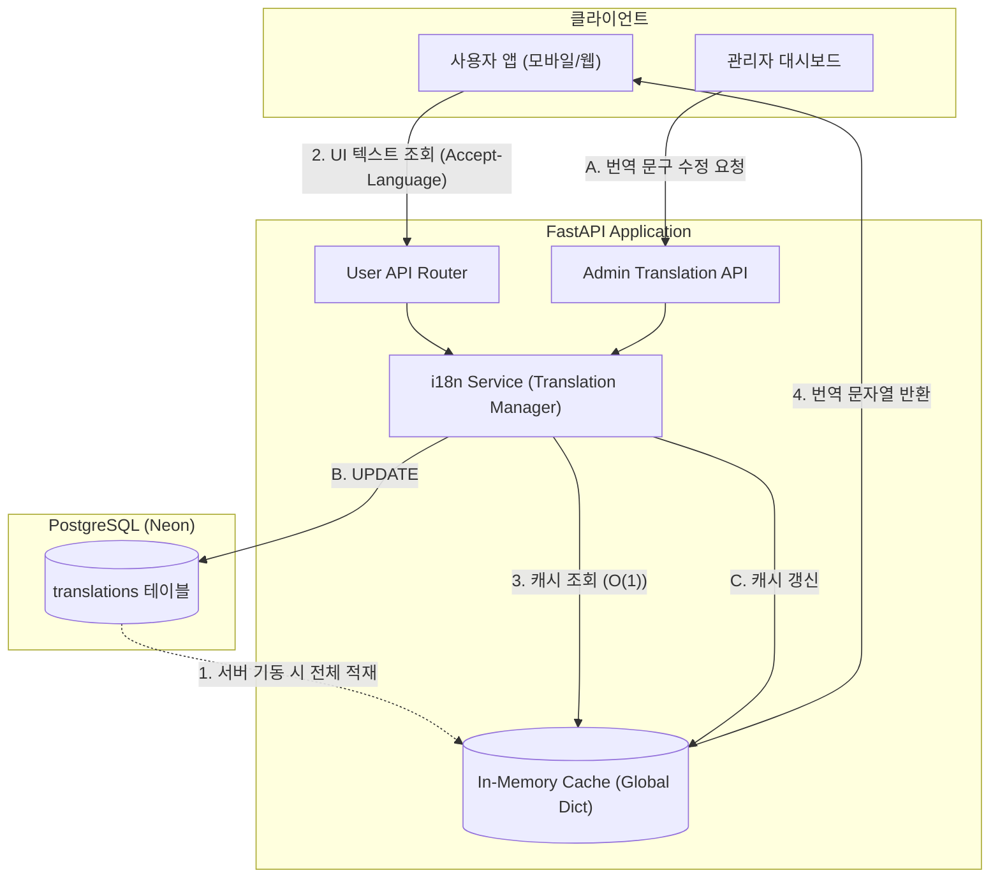
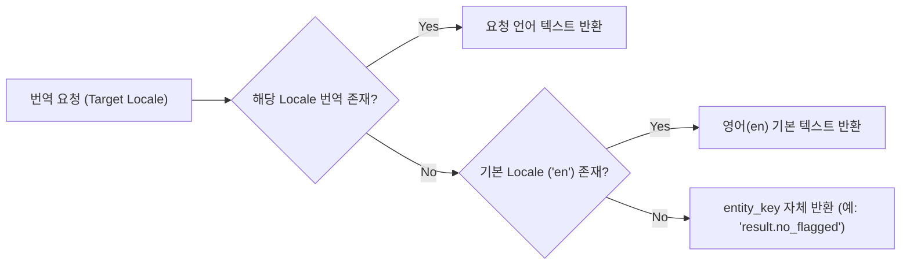

화장품 성분 분석 서비스인 PickSafe를 설계하면서 방한 외국인 관광객과 글로벌 사용자를 위한 다국어(i18n) 지원은 초기 기획 단계부터 중요한 요구사항 중 하나였습니다. 하지만 '모든 텍스트를 다국어로 제공하겠다'는 막연한 목표는 데이터 모델링과 운영 리소스 측면에서 금세 현실적인 벽에 부딪혔습니다.

스캔을 통해 끊임없이 생성되는 동적 데이터(성분명, 제품명)와 정적 UI 텍스트를 어떻게 구분하여 처리할 것인지, 유료 번역 API 비용과 오번역 리스크를 어떻게 제어할 것인지 고민하며 도출한 아키텍처와 구현 과정을 기록으로 남깁니다.

---

## 🎯 마주한 고민과 문제 배경

다국어 아키텍처를 구상하면서 마주한 핵심 질문은 **"도대체 어디까지 번역할 것인가?"**였습니다.

1. **동적 콘텐츠 번역의 비용과 신뢰성 문제**
   - 사용자가 화장품 라벨을 OCR로 스캔할 때마다 새로운 성분 텍스트와 제품명이 유입됩니다. 이를 외부 번역 API(Google Translate, DeepL 등)로 실시간 번역하면 비용이 지속적으로 발생합니다.
   - 더 심각한 문제는 **안전 데이터의 오번역 리스크**였습니다. 화장품 성분과 주의 문구는 피부 알레르기나 민감 반응과 직결되는데, 범용 기계 번역기가 화학 성분명을 잘못 번역하면 사용자에게 위험을 초래할 수 있습니다.

2. **정적 리소스 관리의 운영 병목**
   - 일반적인 프론트엔드 i18n 라이브러리(i18next 등)는 번역 텍스트를 JSON 정적 파일로 번들링합니다.
   - 하지만 UI 안내 문구나 법적 면책 조항, 버튼 라벨 등은 운영 과정에서 빈번하게 수정됩니다. 번역 파일의 오탈자 하나를 고치기 위해 매번 코드를 수정하고 배포 파이프라인을 태우는 방식은 운영 효율을 크게 떨어뜨립니다.

3. **데이터 표준성 재발견**
   - 화장품 성분명은 무작정 번역할 대상이 아니었습니다. 전 세계 화장품 성분은 국제 표준 명명법인 **INCI(International Nomenclature of Cosmetic Ingredients)** 체계를 따르며, 이는 라틴어/영어 기반의 표준 표기입니다. 한국 식약처 공공 데이터 역시 한글 성분명과 함께 영문 INCI명을 표준으로 관리하고 있습니다.
   - 즉, 성분 데이터 자체는 이미 언어 중립적인 국제 표준을 갖고 있으므로 무리하게 다국어 번역을 시도할 이유가 없었습니다.

---

## ⚖️ 기술적 대안 비교 및 선택 이유

정적/동적 다국어 처리 방식을 결정하기 위해 세 가지 대안을 비교 검토했습니다.

| 비교 항목 | 대안 A: 전체 자동 번역 API 연동 | 대안 B: 정적 JSON 파일 + 로컬 빌드 | 대안 C: 정적/동적 분리 + DB 기반 인메모리 캐싱 (선택) |
| :--- | :--- | :--- | :--- |
| **적용 범위** | UI 문구 + 동적 성분 데이터 전량 번역 | UI 문구(JSON) 번역, 성분 미번역 | UI 문구(DB 관리), 성분(한글/INCI 영문 표준 노출) |
| **운영 비용** | 높음 (API 호출 종량제 비용) | 없음 | 없음 (무료 DB 티어 내 수용 가능) |
| **데이터 정확도** | 낮음 (성분명 기계 번역 오류 위험) | 높음 (정적 검증) | 높음 (표준 규격 기반 원문 유지) |
| **운영 유연성** | 실시간 처리 가능하나 수정 통제 어려움 | 낮음 (문구 수정 시마다 재배포 필요) | **높음 (어드민에서 즉시 수정 및 반영)** |
| **확장성** | 언어 확장 빠름 | 언어 추가 시 빌드 번들 크기 증가 | **스키마 변경 없이 `locale` 행만 추가** |

### 최종 결정: 대안 C 채택

1. **동적 콘텐츠(성분/제품)**: 별도 기계 번역 없이 **식약처 고시 한글 명칭과 INCI 영문 표준 명칭**을 그대로 노출합니다. 성분 매칭에 실패한 미확인 텍스트는 원칙에 따라 "확인 불가"로 명확히 표기합니다.
2. **정적 콘텐츠(UI 문구)**: 데이터베이스의 단일 `translations` 테이블에 적재하고, 백엔드 애플리케이션 시작 시 메모리에 로드하여 조회 성능(In-Memory Cache)을 확보합니다.
3. **어드민 중심 운영**: UI 번역 문구의 추가 및 수정은 어드민 UI에서 처리하며, 수정 즉시 인메모리 캐시를 갱신(Cache Invalidation)하여 배포 없이 실시간으로 반영합니다.

---

## 🏗️ 시스템 아키텍처 및 흐름

정적 다국어 데이터는 서버 기동 시점에 DB에서 전체 적재되어 메모리 딕셔너리로 관리됩니다. 일반 사용자의 번역 조회 요청은 DB I/O 없이 인메모리 캐시에서 즉시 반환되며, 어드민의 번역 수정 요청 시에만 DB 쓰기와 캐시 갱신이 일어납니다.



### 폴백 체인 (Fallback Strategy)

사용자가 요청한 언어의 번역이 누락되었을 때의 폴백(대체) 흐름은 다음과 같이 견고하게 정의했습니다.



> **엔지니어링 팁**: 번역이 완전히 누락되었을 때 빈 문자열(`""`)이나 `null`을 반환하면 UI가 깨지거나 오류를 인지하기 어렵습니다. `entity_key` 자체를 화면에 노출하도록 설계하여, 테스트 과정이나 실운영 중 누락된 번역 키를 시각적으로 즉시 식별할 수 있게 했습니다.

---

## 💻 핵심 구현 및 트러블슈팅

### 1. 통합 다국어 테이블 DDL 설계

향후 동적 콘텐츠(성분 설명 등)의 다국어 번역이 도입되더라도 스키마 변경 없이 그대로 재사용할 수 있도록 `entity_type`과 `entity_key` 복합 구조로 설계했습니다.

```sql
CREATE TABLE translations (
    id          UUID PRIMARY KEY DEFAULT gen_random_uuid(),
    entity_type VARCHAR(20) NOT NULL, -- 'ui_string', 향후 'ingredient', 'product' 확장
    entity_key  VARCHAR(255) NOT NULL, -- 'result.no_flagged' 또는 해당 엔티티 ID
    locale      VARCHAR(10) NOT NULL,  -- 'ko', 'en', 'zh-CN', 'ja', 'zh-TW', 'pt'
    text        TEXT NOT NULL,
    updated_at  TIMESTAMP WITH TIME ZONE DEFAULT CURRENT_TIMESTAMP,
    CONSTRAINT uq_translations_entity_locale UNIQUE (entity_type, entity_key, locale)
);

CREATE INDEX idx_translations_lookup ON translations (entity_type, locale);
```

### 2. 인메모리 캐시 및 폴백 매니저 구현

```python
from typing import Dict, Tuple, Optional
import logging

logger = logging.getLogger(__name__)

class TranslationManager:
    def __init__(self):
        # Cache Key: (entity_type, entity_key, locale) -> Value: text
        self._cache: Dict[Tuple[str, str, str], str] = {}
        self._default_locale = "en"

    def load_cache(self, records: list):
        """서버 기동 또는 어드민 수정 시 캐시 전체/부분 갱신"""
        new_cache = {}
        for r in records:
            new_cache[(r.entity_type, r.entity_key, r.locale)] = r.text
        self._cache = new_cache
        logger.info(f"Loaded {len(self._cache)} translations into memory.")

    def set_translation(self, entity_type: str, entity_key: str, locale: str, text: str):
        """단일 번역 갱신"""
        self._cache[(entity_type, entity_key, locale)] = text

    def get(self, entity_key: str, locale: str, entity_type: str = "ui_string") -> str:
        """
        폴백 체인 적용 번역 조회:
        1. 요청 locale 조회
        2. 기본 locale (en) 조회
        3. 실패 시 entity_key 반환
        """
        # 1. Target locale 조회
        if (entity_type, entity_key, locale) in self._cache:
            return self._cache[(entity_type, entity_key, locale)]

        # 2. Default locale (en) 폴백
        if (entity_type, entity_key, self._default_locale) in self._cache:
            return self._cache[(entity_type, entity_key, self._default_locale)]

        # 3. 누락 식별을 위한 entity_key 원본 반환
        logger.warning(f"Translation missing for [{entity_type}] key='{entity_key}', locale='{locale}'")
        return entity_key

# 싱글톤 인스턴스
translation_manager = TranslationManager()
```

### 3. 트러블슈팅: 어드민 다국어 입력 시 누락 확인의 어려움

초기 어드민 번역 목록 API는 데이터베이스 레코드를 단순 리스트 형태로 내려주었습니다. 그러다 보니 새로운 UI 키가 추가되었을 때, 특정 언어(예: `zh-CN`, `pt`)의 번역이 누락되었는지를 직관적으로 파악하기 어려웠습니다.

이를 해결하기 위해 어드민 조회 엔드포인트에서 `ko`를 기준 컬럼(Pivot)으로 두고, 등록된 언어별 번역 상태를 매트릭스 형태로 재가공하여 반환하도록 개선했습니다.

```python
@router.get("/admin/translations/matrix")
async def get_translation_matrix(
    entity_type: str = "ui_string",
    db: AsyncSession = Depends(get_db_session)
):
    """어드민 화면에서 누락된 셀(빈 값)을 직관적으로 대조할 수 있도록 피벗 데이터 제공"""
    stmt = select(Translation).where(Translation.entity_type == entity_type)
    result = await db.execute(stmt)
    records = result.scalars().all()

    matrix: Dict[str, Dict[str, Optional[str]]] = {}
    
    for r in records:
        if r.entity_key not in matrix:
            matrix[r.entity_key] = {"key": r.entity_key}
        matrix[r.entity_key][r.locale] = r.text

    # 지원 언어 목록: ['ko', 'en', 'zh-CN', 'ja', 'zh-TW', 'pt']
    return list(matrix.values())
```

어드민 프론트엔드에서는 이 데이터를 기반으로 표를 구성하여, 빈 셀이 발생하면 즉시 강조 표시되도록 구성했습니다.

---

## 💡 돌아보며 배운 점 (회고)

1. **도메인 표준의 이해가 불필요한 엔지니어링 비용을 줄인다**
   처음에는 OCR 인식 결과로 들어오는 모든 동적 텍스트를 다국어로 번역해야 한다는 강박이 있었습니다. 하지만 화장품 도메인에서 성분명은 이미 'INCI'라는 국제 표준이 존재한다는 본질을 확인한 후, 수천 건의 동적 번역 API 호출과 오번역 리스크를 완전히 덜어낼 수 있었습니다.

2. **유연한 스키마 설계의 가치**
   비록 1차 MVP에서는 정적 UI 문자열(`ui_string`)만 다루도록 범위를 좁혔지만, `translations` 테이블을 `(entity_type, entity_key, locale)` 복합 구조로 추상화해 둔 덕분에, 향후 제품 상세 설명이나 맞춤 가이드 같은 동적 엔티티 번역이 필요해지더라도 아키텍처나 DB 구조 변경 없이 매끄럽게 확장할 수 있는 기반을 마련했습니다.

3. **향후 보완 과제**
   현재는 단일 인스턴스 메모리 캐시 구조이므로, 향후 백엔드 컨테이너가 수평 확장(Scale-out)될 경우 어드민에서 번역을 수정했을 때 인스턴스 간 캐시 동기화(Redis Pub/Sub 또는 Webhook) 메커니즘을 추가로 검토할 계획입니다.