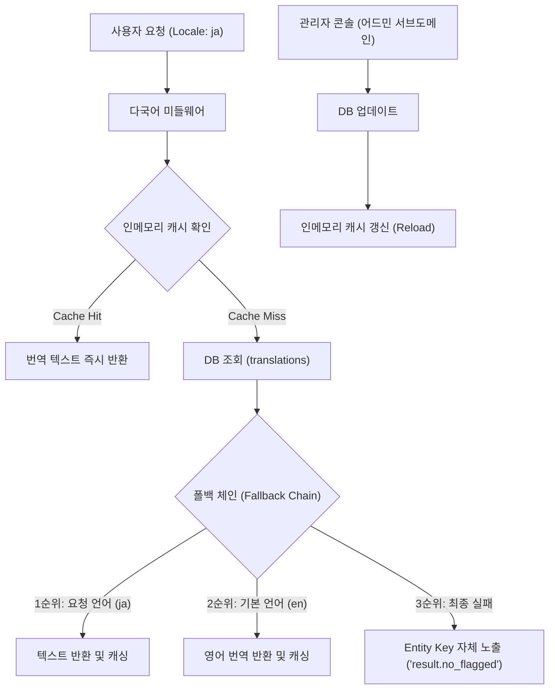

화장품 성분 분석 서비스인 **PickSafe**의 글로벌 유입을 준비하면서, 다국어(i18n) 지원은 더 이상 미룰 수 없는 과제였습니다. 특히 한국을 방문하는 다국적 관광객이나 해외 사용자들의 성분 분석 요청에 대응하기 위해서는 정교한 다국어 전략이 필요했습니다.

처음에는 단순하게 "모든 텍스트를 다국어 API를 통해 실시간 번역하여 보여주면 되지 않을까?"라는 직관적인 생각으로 접근했습니다. 하지만 아키텍처를 설계하고 구체적인 운영 비용과 리소스를 계산해 보니, 이 방식은 제한된 인프라 환경에서 지속 가능하지 않다는 결론에 도달했습니다. 

비용을 최소화하면서도 번역의 정확도와 운영의 편리함을 모두 챙기기 위해 고민했던 설계 과정과 기술적 의사결정을 담담히 기록해 봅니다.

---

## 🎯 마주한 고민과 문제 배경

다국어 지원을 설계할 때 가장 먼저 맞닥뜨린 문제는 **"어디까지 번역할 것인가"**였습니다. 서비스 내 콘텐츠는 크게 두 가지로 나뉩니다.

1. **정적 콘텐츠**: 버튼, 라벨, 안내 문구, 면책 조항 등 UI를 구성하는 고정된 텍스트.
2. **동적 콘텐츠**: 화장품 성분명, 제품명, OCR 스캔 결과 설명 등 사용자의 입력이나 외부 API에 의해 가변적으로 생성되는 텍스트.

이 중 동적 콘텐츠, 특히 **화장품 성분명**을 매번 실시간으로 외부 번역 API를 호출해 다국어로 제공하려 할 때 다음과 같은 치명적인 병목과 리스크가 예상되었습니다.

* **비용적 한계**: 사용자가 이미지를 스캔할 때마다 수십 개의 성분명을 실시간으로 기계 번역하면, 고스란히 API 호출 비용 부담으로 이어집니다.
* **오번역으로 인한 신뢰도 타격**: 화장품 성분은 화학 물질명이나 식약처 고시 명칭 등 전문 용어가 많습니다. 일반적인 번역 API는 이를 오역할 가능성이 높으며, 이는 알레르기나 유해 성분을 피해 가려는 사용자에게 잘못된 안전 정보를 제공하는 치명적인 결과(안전성 가이드라인 위반)를 초래할 수 있습니다.
* **데이터베이스 및 서버 부하**: 매 요청마다 다국어 조회를 위해 데이터베이스에 무거운 조인(Join) 쿼리를 날리거나 외부 API를 대기(Await)하는 것은, 무료 티어(Neon Serverless DB) 환경에서 커넥션 병목과 응답 지연을 유발하는 원인이 됩니다.

---

## ⚖️ 기술적 대안 비교 및 선택 이유

문제를 해결하기 위해 세 가지 대안을 두고 장단점을 비교했습니다.

### 대안 1: 파일 기반 다국어 관리 (JSON / YAML)
가장 전통적인 방식으로, 각 언어별로 JSON 파일을 두고 프론트엔드나 백엔드 애플리케이션 빌드 시점에 로드하는 방식입니다.

* **장점**: DB 조회 비용이 없고, 메모리에서 즉시 조회하므로 성능이 매우 빠릅니다.
* **단점**: 오타 수정이나 간단한 문구 변경 시에도 코드를 수정하고 다시 배포(CI/CD)해야 합니다. 운영 효율성이 극도로 떨어집니다.

### 대안 2: 실시간 외부 번역 API 의존 방식
사용자가 요청할 때마다 번역되지 않은 텍스트를 감지하여 외부 번역 API를 호출하고 결과를 반환하는 방식입니다.

* **장점**: 데이터베이스 설계가 단순해지고, 초기 번역 데이터 구축 공수가 거의 없습니다.
* **단점**: 실시간 번역 API 비용이 누적되며, 전문 의학/화학 용어 번역의 신뢰성이 낮습니다. 네트워크 레이턴시가 추가되어 사용자 경험이 저하됩니다.

### 대안 3: 하이브리드 방식 (정적 콘텐츠 DB 관리 + 동적 콘텐츠 원문 노출) (선택)
UI 텍스트와 같은 정적 콘텐츠만 DB로 관리하고 서버 기동 시 인메모리에 캐싱합니다. 반면, 동적 콘텐츠(성분명)는 번역하지 않고 국제 표준인 **INCI(국제 화장품 성분명) 영문 표기**와 식약처 고시 원문을 그대로 노출하는 방식입니다.

* **장점**: 
  * 화장품 성분명(INCI)은 이미 국제 표준이므로 언어 장벽이 낮아 별도 번역이 필요 없습니다. 덕분에 오번역 리스크와 번역 API 비용이 원천 차단됩니다.
  * 정적 콘텐츠는 DB 기반 어드민 콘솔을 통해 개발자의 코드 배포 없이 즉시 수정할 수 있습니다.
  * 서버 메모리에 번역 데이터를 캐싱하여 DB 부하를 제로에 가깝게 유지할 수 있습니다.
* **단점**: 다국어 번역을 지원하지 않는 동적 콘텐츠 영역에 대해 사용자 경험이 일부 제한될 수 있습니다. (이 부분은 향후 사용자 유입 지표를 모니터링한 뒤 점진적으로 자동 번역 도입 여부를 재논의하기로 결정했습니다.)

---

## 🏗️ 시스템 아키텍처 및 흐름

이 하이브리드 다국어 처리 흐름과 어드민을 통한 캐시 갱신 구조를 도식화하면 다음과 같습니다.



---

## 💻 핵심 구현 및 트러블슈팅

### 1. 데이터베이스 스키마 설계
향후 동적 콘텐츠 번역으로 확장할 가능성을 열어두되, 현재는 UI 정적 문자열 관리에 최적화된 테이블 구조를 정의했습니다.

```sql
CREATE TABLE translations (
    id          UUID PRIMARY KEY DEFAULT gen_random_uuid(),
    entity_type VARCHAR(20) NOT NULL, -- 'ui_string' (현재 사용) / 'ingredient', 'product' (향후 확장용)
    entity_key  VARCHAR(255) NOT NULL, -- 예: 'result.no_flagged'
    locale      VARCHAR(10) NOT NULL,  -- 'ko', 'en', 'ja', 'zh-CN', 'pt' 등
    text        TEXT NOT NULL,
    updated_at  TIMESTAMP DEFAULT CURRENT_TIMESTAMP,
    CONSTRAINT uq_translations UNIQUE (entity_type, entity_key, locale)
);

CREATE INDEX idx_translations_search ON translations (entity_type, locale);
```

### 2. 인메모리 캐싱 및 폴백(Fallback) 구현
매 요청마다 DB에 쿼리를 날려 Neon DB의 커넥션 풀을 낭비하는 문제를 방지하기 위해, 서버가 기동할 때 데이터를 딕셔너리 형태로 메모리에 로드하고 이를 조회하는 구조를 적용했습니다.

만약 번역이 누락된 키가 있다면 화면에 빈 문자열이 나와 에러처럼 보이지 않도록, **요청 언어 ➡️ 기본 언어(en) ➡️ 키(Key) 자체 노출** 순으로 이어지는 폴백 체인을 설계했습니다.

```python
# i18n_manager.py
import logging
from typing import Dict, Optional

logger = logging.getLogger(__name__)

class TranslationManager:
    def __init__(self):
        # 구조: {locale: {entity_key: text}}
        self._cache: Dict[str, Dict[str, str]] = {}
        self.default_locale = "en"

    def load_translations_from_db(self, db_session) -> None:
        """서버 기동 시 또는 어드민에서 갱신 요청 시 DB에서 전체 데이터를 메모리에 캐싱"""
        try:
            # 설정된 DB 마스터 정보 및 쿼리는 환경변수 설정을 통해 안전하게 격리
            query = "SELECT entity_key, locale, text FROM translations WHERE entity_type = 'ui_string'"
            result = db_session.execute(query).fetchall()
            
            temp_cache: Dict[str, Dict[str, str]] = {}
            for row in result:
                key, locale, text = row
                if locale not in temp_cache:
                    temp_cache[locale] = {}
                temp_cache[locale][key] = text
                
            self._cache = temp_cache
            logger.info("다국어 캐시 로드 완료.")
        except Exception as e:
            logger.error(f"다국어 캐시 로드 중 오류 발생: {e}")

    def get(self, key: str, locale: str) -> str:
        """폴백 체인이 적용된 다국어 텍스트 조회"""
        # 1. 요청한 locale에서 검색
        if locale in self._cache and key in self._cache[locale]:
            return self._cache[locale][key]
        
        # 2. 기본 언어(en)에서 검색
        if self.default_locale in self._cache and key in self._cache[self.default_locale]:
            logger.warning(f"번역 누락으로 폴백 적용: Key='{key}', Target Locale='{locale}' -> '{self.default_locale}'")
            return self._cache[self.default_locale][key]
        
        # 3. 최종 실패 시 키 자체를 반환 (화면에서 즉각적인 누락 인지 가능하도록 유도)
        logger.error(f"다국어 키를 찾을 수 없음: Key='{key}'")
        return key

# 전역 싱글톤 인스턴스 사용
i18n = TranslationManager()
```

### 3. 트러블슈팅: "어디가 번역 안 됐지?" 대조의 어려움
어드민 페이지를 개발한 직후, 언어별로 데이터를 행 단위로 따로 보여주다 보니 특정 UI 키의 일본어나 포르투갈어 번역이 누락되었는지를 직관적으로 파악하기가 어려웠습니다. 

이 문제를 해결하기 위해, 어드민 조회 API 쿼리를 피벗(Pivot) 형태로 가공하여 **한국어 원문을 고정 컬럼으로 두고 나머지 언어를 우측으로 배치하는 대조 화면**을 구현했습니다.

```python
# /admin/translations 엔드포인트 중 일부 가공 로직
def get_translation_matrix(db_session):
    # 모든 고유 키 조회
    keys_query = "SELECT DISTINCT entity_key FROM translations WHERE entity_type = 'ui_string'"
    keys = [r[0] for r in db_session.execute(keys_query).fetchall()]
    
    matrix = []
    for key in keys:
        # 각 언어별 텍스트를 한 행으로 묶어서 반환
        row_data = {
            "entity_key": key,
            "ko": i18n.get(key, "ko"),
            "en": i18n.get(key, "en"),
            "ja": i18n.get(key, "ja"),
            "zh_CN": i18n.get(key, "zh-CN"),
            "pt": i18n.get(key, "pt")
        }
        matrix.append(row_data)
    return matrix
```
이 피벗 뷰 덕분에 어드민 화면에서 빈 셀(Cell)만 찾으면 어떤 번역이 누락되었는지 한눈에 파악할 수 있게 되었고, 번역 데이터 정합성을 유지하는 데 큰 도움이 되었습니다.

---

## 💡 돌아보며 배운 점 (회고)

이번 다국어 지원 설계 과정을 거치며 얻은 엔지니어링적 교훈은 크게 두 가지입니다.

### 1. 완벽한 자동화보다 중요한 것은 '영역의 분리'
모든 것을 자동화하고 실시간으로 변환하려는 욕심은 때로 독이 됩니다. 특히 전문 도메인(화장품 성분 정보)의 경우, 무리한 실시간 번역보다 **국제 표준 표준명(INCI)을 원문 그대로 제공하는 것**이 비용을 아끼면서도 정보의 정확성을 보장하는 더 현실적이고 안전한 선택이었습니다. 기술의 화려함보다 비즈니스의 본질과 데이터의 특성을 먼저 고려해야 함을 다시금 배웠습니다.

### 2. 폴백(Fallback) 설계의 중요성
시스템은 언제나 불완전할 수 있습니다. 번역 데이터가 누락되었을 때 빈 화면을 보여주거나 에러를 뿜는 대신, 단계별 폴백을 거쳐 최종적으로 `result.no_flagged`와 같은 키 값을 화면에 그대로 노출하도록 설계한 것은 훌륭한 선택이었습니다. 개발 및 테스트 단계에서 누락된 번역 키를 화면을 통해 즉시 인지하고 빠르게 보완할 수 있었기 때문입니다. 에러를 우아하게 감추는 것도 중요하지만, 때로는 개발자가 문제를 직관적으로 인지할 수 있도록 '드러내는 설계'가 더 유용하다는 것을 실감했습니다.

현재 설계해 둔 `translations` 테이블의 `entity_type` 구조 덕분에, 향후 서비스가 더 성장하여 성분 정보 자체의 다국어 번역이 강력하게 요구되는 시점이 오더라도 스키마 변경 없이 유연하게 확장할 수 있을 것입니다. 단순하면서도 단단한 아키텍처가 주는 안정감을 바탕으로 다음 단계의 최적화를 준비해 나가고자 합니다.