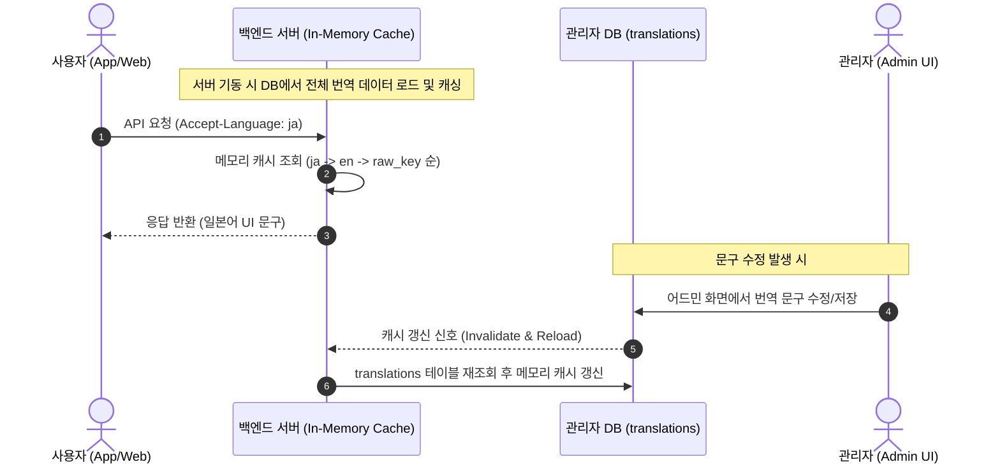

화장품 성분 분석 및 안전성 확인 서비스 PickSafe를 개발하며 서비스 초기 아키텍처를 잡을 때, 가장 오랫동안 "미해결 과제"로 남아있던 영역이 바로 다국어(i18n) 지원 방식이었습니다.

방한 외국인 관광객이나 해외 사용자의 유입을 고려하면 다국어 지원은 필수적인 기능이었지만, 무턱대고 외부 번역 API를 도입하자니 비용 문제와 데이터 정확성 문제가 발목을 잡았습니다. 개발 과정에서 마주했던 기술적 병목과, 이를 정적·동적 콘텐츠 분리 및 DB 기반 캐싱 전략으로 해결한 과정을 정리합니다.

---

## 🎯 마주한 고민과 문제 배경

초기 다국어 지원을 검토할 때 가장 먼저 떠올린 방식은 단순했습니다. 정적 UI 문구는 JSON 파일로 관리하고, 성분명이나 제품 설명 같은 동적 데이터는 요청이 들어올 때마다 외부 번역 API(Google Translate, DeepL 등)를 호출하여 실시간으로 번역해 노출하는 구조였습니다.

그러나 이 구조를 실제 도메인에 적용하려고 검토하는 과정에서 심각한 한계점들이 드러났습니다.

1. **안전성 문제 (오번역 리스크)**
   화장품 성분의 알레르기 유발 가능성이나 주의사항 문구는 사용자 피부 건강에 직결됩니다. 외부 머신러닝 번역 모델이 화학 성분명이나 식약처 고시 주의문구를 자의적으로 오번역할 경우, 서비스 신뢰도에 치명적인 타격을 줄 수 있었습니다.
2. **인프라 비용 및 API Rate Limit 병목**
   사용자가 제품 스캔이나 검색을 수행할 때마다 수십 개에 달하는 성분명을 매번 외부 API로 번역하면, 비동기 연산 오버헤드와 외부 API의 요청 제한(Rate Limit)에 걸릴 확률이 높았습니다. 제한된 서버 리소스 자원 내에서 운영하기엔 예산과 성능 부담이 컸습니다.
3. **운영 유지보수성 저하**
   UI 안내 문구나 면책 조항 같은 정적 텍스트를 정적 JSON 파일 형태로 프론트엔드/백엔드 코드베이스에 둘 경우, 단순 오탈자 수정이나 문구 교체조차 앱 배포 파이프라인을 다시 돌려야 하는 문제가 있었습니다.

---

## ⚖️ 기술적 대안 비교 및 선택 이유

문제를 해결하기 위해 다국어 처리 접근 방식을 세 가지 대안으로 나눈 뒤 Trade-off를 분석했습니다.

| 대안 | 장점 | 단점 | 선택 여부 |
|---|---|---|---|
| **A. 전면 외부 번역 API 활용** | 모든 동적/정적 텍스트를 실시간 번역 가능 | 비용 기하급수적 증가, 화학/안전 전문용어 오번역 위험, API 지연 시간 증가 | ❌ 폐기 |
| **B. 정적 JSON 파일 분리** | 구현이 매우 단순함, DB 조회가 필요 없어 빠름 | 코드 재배포 없이 문구 수정 불가능, 향후 동적 데이터 번역 확장성 없음 | ❌ 폐기 |
| **C. 정적/동적 데이터 분리 + 도메인 표준 활용 + DB 통합 관리** | 오번역 리스크 제로, DB 캐싱으로 조회 성능 극대화, 어드민에서 즉시 수정 가능 | 초기 DB 스키마 설계 및 캐시 무효화 로직 구현 필요 | ✅ **최종 선택** |

### 정적 콘텐츠 vs 동적 콘텐츠의 정의 재설립

고민 끝에 "모든 것을 번역해야 한다"는 고정관념을 버렸습니다. 화장품 도메인의 특성을 활용해 데이터를 두 종류로 명확히 나눴습니다.

* **동적 콘텐츠 (성분명, 제품명, 분석 스캔 결과):**
  화장품 성분명(INCI: International Nomenclature Cosmetic Ingredient)은 이미 국제 표준에 따라 영문/라틴어로 표기되며, 한국 식약처 고시 역시 이 표준을 기반으로 합니다. 즉, **성분명 자체가 언어 중립적인 국제 표준**이므로, 1차 MVP에서는 무리하게 동적 번역 API를 붙이지 않고 식약처 원문(한글)과 INCI 원문(영문)을 그대로 노출하기로 결정했습니다.
* **정적 콘텐츠 (UI 버튼, 라벨, 안내/면책 문구):**
  집합이 유한한 정적 UI 텍스트는 단일 DB 테이블에 모아 관리하고, 어드민 화면에서 직접 수정할 수 있도록 설계했습니다.

---

## 🏗️ 시스템 아키텍처 및 흐름

정적 콘텐츠 다국어 처리는 매 요청마다 DB 조회를 발생시키지 않도록 **서버 기동 시 인메모리(In-Memory) 캐싱** 구조를 취했습니다. 어드민에서 다국어 문구를 수정할 경우에만 캐시 무효화(Invalidation) 신호를 발생시킵니다.



---

## 💻 핵심 구현 및 트러블슈팅

### 1. Unified Translation 스키마 설계

향후 동적 콘텐츠(성분 상세 설명 등) 번역 확장성까지 고려하여, 하나의 스키마로 정적/동적 데이터를 모두 수용할 수 있는 엔티티 구조를 설계했습니다.

```sql
CREATE TABLE translations (
    id          UUID PRIMARY KEY DEFAULT gen_random_uuid(),
    entity_type VARCHAR(20) NOT NULL, -- 'ui_string' (현재), 'ingredient' (향후 확장용)
    entity_key  VARCHAR(255) NOT NULL, -- 'result.no_flagged' 또는 성분 식별키
    locale      VARCHAR(10) NOT NULL,  -- 'ko', 'en', 'ja', 'zh-CN', 'pt' 등
    text        TEXT NOT NULL,
    updated_at  TIMESTAMP WITH TIME ZONE DEFAULT CURRENT_TIMESTAMP,
    
    CONSTRAINT uq_translations UNIQUE (entity_type, entity_key, locale)
);

CREATE INDEX idx_translations_lookup ON translations(entity_type, locale);
```

### 2. 메모리 캐싱 및 안전한 폴백(Fallback) 체인

데이터베이스 연결 커넥션 수가 제한된 무료/초기 인프라 환경에서 매 HTTP 요청마다 번역 테이블을 `JOIN`하거나 조회하는 것은 심각한 성능 병목을 야기합니다.

이를 해결하기 위해 애플리케이션 시작 시 메모리에 파이썬 `dict` 형태로 온전히 띄워두고, 조회 실패 시 애플리케이션이 멈추지 않도록 **3단계 폴백 체인**을 구현했습니다.

```python
# translation_service.py (개념 축약 코드)

class TranslationService:
    def __init__(self):
        # 메모리 캐시 구조: { (entity_type, entity_key, locale): text }
        self._cache: dict[tuple[str, str, str], str] = {}

    def load_cache(self, db_session):
        """DB에서 전체 번역 데이터를 읽어 메모리에 적재"""
        records = db_session.query(TranslationModel).all()
        new_cache = {}
        for r in records:
            new_cache[(r.entity_type, r.entity_key, r.locale)] = r.text
        self._cache = new_cache

    def get_text(self, entity_key: str, locale: str, entity_type: str = "ui_string") -> str:
        """
        [폴백 체인 순서]
        1. 요청받은 locale 조회
        2. 없을 경우 기본 글로벌 언어('en') 조회
        3. 'en'조차 없을 경우 entity_key 문자열 자체를 반환하여 화면 누락 즉시 인지
        """
        # 1차: 요청 locale
        if (entity_type, entity_key, locale) in self._cache:
            return self._cache[(entity_type, entity_key, locale)]
        
        # 2차: Fallback 'en'
        if (entity_type, entity_key, "en") in self._cache:
            return self._cache[(entity_type, entity_key, "en")]
        
        # 3차: key 값 자체 반환 (빈 문자열 감춤 방지)
        return entity_key
```

### 🛠️ 트러블슈팅: "빈 문자열로 숨어버리는 번역 누락" 문제

초기 테스트 과정에서 번역 데이터가 없는 언어 요청이 들어왔을 때 `""`(빈 문자열)이나 `None`을 반환하도록 설정했더니, UI 레이아웃이 깨지거나 버튼 글자가 비어있는 채로 보여 QA 단계에서 번역 누락을 발견하기가 매우 어려웠습니다.

이를 해결하기 위해 폴백 체인의 최후 보루로 **`entity_key` 문자열 원본(예: `result.no_flagged`)을 그대로 화면에 노출**하도록 변경했습니다. 덕분에 어드민이나 테스터가 화면을 보자마자 "아, 이 키의 번역이 누락되었구나"를 직관적으로 파악하고 어드민에서 해당 키를 즉시 채워 넣을 수 있게 되었습니다.

---

## 💡 돌아보며 배운 점

### 1. 도메인 지식에 기반한 의사결정의 힘
모든 데이터를 다국어로 번역해야 한다는 기술적 강박에서 벗어나, 화장품 성분명(INCI)이 가진 **"국제 표준성"**을 파악한 것이 아키텍처 단순화의 핵심이었습니다. 불필요한 외부 번역 API 연동을 제거함으로써 API 통신 지연시간을 없애고 운영 비용을 대폭 절감할 수 있었습니다.

### 2. 과도한 엔지니어링 경계
초기에는 Redis 같은 전용 인메모리 데이터베이스 도입을 검토했으나, 현재 서비스 규모와 정적 UI 데이터의 유한한 크기(수백~수천 건 수준)를 고려했을 때 서버 프로세스 내 메모리 캐시만으로도 충분히 트래픽을 처리할 수 있었습니다. 무조건적인 최신 기술 도입보다 현재 인프라 제약 조건 내에서 최적의 단순함을 찾는 것이 중요하다는 점을 다시 한번 배웠습니다.

### 3. 향후 과제
현재 정적 UI 텍스트는 성공적으로 정착되었으나, 향후 유입 사용자 데이터(언어권별 비중)를 모니터링하면서 특정 언어권 유입이 유의미하게 높아질 경우, 식약처 안전성 문구에 한해 검증된 전문 번역 데이터셋을 단계적으로 DB에 확장 적재하는 작업을 검토할 예정입니다.