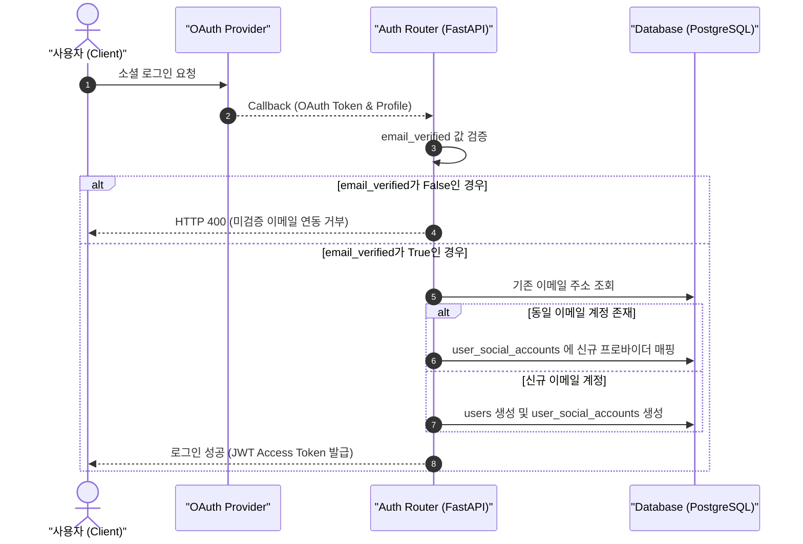
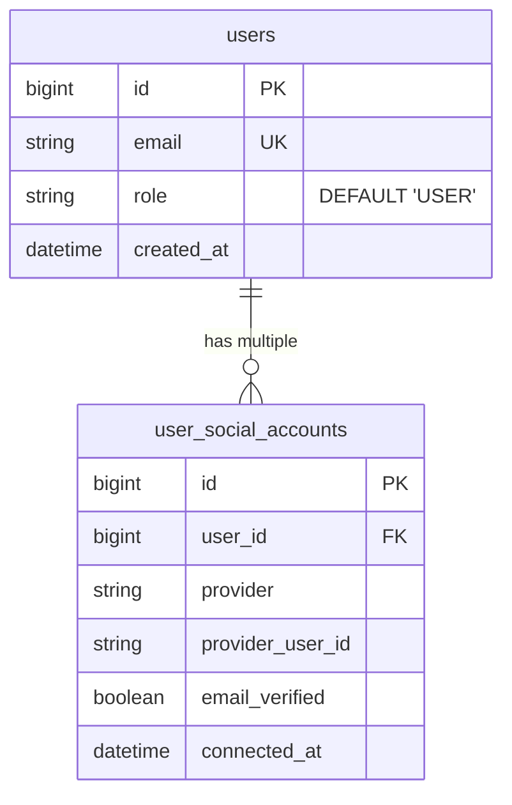

화장품 성분 분석 서비스 PickSafe를 개발하면서 초기 아키텍처 설계 당시 고려하지 못했던 데이터 모델의 한계와 개발 환경상의 병목을 마주했습니다.

단순하게 단일 테이블 구조로 소셜 로그인을 처리하던 초기 구현은 서비스 기능이 확장됨에 따라 계정 덮어씌움 현상과 보안 허점을 드러냈고, 외부에 의존하는 이메일 발송 서비스는 로컬 디버깅 속도를 저하시켰습니다. 더불어 초기 다크 네이비 테마 UI가 서비스의 본질인 '성분 체크' 및 친근한 로고 브랜드와 조화롭지 못하다는 사용자 피드백을 수용하여, 데이터 베이스 구조부터 UI 디자인 시스템까지 전면적인 개선 작업을 진행했습니다.

이 글은 이러한 문제를 정의하고 해결해 나간 과정에서의 기술적 고민과 트러블슈팅 기록입니다.

---

## 🎯 마주한 고민과 문제 배경

### 1. 1:1 매핑 모델에 갇힌 소셜 로그인
초기 PickSafe의 사용자 모델은 `users` 테이블 단 하나에 소셜 프로바이더 정보(`provider`, `provider_user_id`)를 직접 기재하는 형태였습니다.

```sql
-- 기존 구조: 단일 계정당 1개의 소셜 프로바이더만 저장 가능
CREATE TABLE users (
    id SERIAL PRIMARY KEY,
    email VARCHAR NOT NULL UNIQUE,
    provider VARCHAR,
    provider_user_id VARCHAR
);
```

이 방식은 구현이 빠르다는 장점이 있었으나, 동일한 이메일 주소로 구글 로그인 후 페이스북 로그인을 시도할 때 심각한 데이터 정합성 이슈를 일으켰습니다.
- 기존 소셜 연동 정보가 나중에 로그인한 프로바이더 정보로 덮어씌워지는 문제
- 프로바이더가 제공하는 이메일의 실제 소유권(`email_verified`) 검증 없이 이메일 값만으로 계정을 매핑할 경우, 타인 계정을 무단 점유할 수 있는 보안 위협

### 2. 로컬 개발 환경에서의 외부 API 샌드박스 제약
회원가입 및 비밀번호 재설정을 위해 연동한 Resend API는 샌드박스 환경에서 등록된 관리자 이메일 외에는 실제 메일 발송을 거부(403 Forbidden)했습니다. 로컬 개발 환경에서 가짜 계정으로 가입 흐름을 테스트할 때마다 메인 로직이 차단되었고, 매번 테스트 이메일을 수동으로 샌드박스 목록에 등록하는 것은 DX(개발자 경험)를 극심하게 떨어뜨렸습니다.

### 3. 브랜드 아이덴티티와 겉도는 UI 테마
초기 UI는 어둡고 묵직한 다크 네이비 톤을 채택하고 있었습니다. 그러나 화장품 성분을 분석하고 안심 정보를 제공하는 서비스 특성상, 어두운 톤은 정보 전달력을 저해하고 로고 이미지(`picksafe_log.png`)가 지닌 부드럽고 친근한 분위기와 충돌했습니다.

---

## ⚖️ 기술적 대안 비교 및 선택 이유

### 1. OAuth 계정 구조 확장 대안

| 구분 | 대안 A: 기존 `users` 테이블에 컬럼 추가 | 대안 B: `user_social_accounts` 테이블 분리 (선택) |
| :--- | :--- | :--- |
| **구조** | `google_id`, `facebook_id` 등 프로바이더별 컬럼 추가 | `users` (1) : `user_social_accounts` (N) 매핑 테이블 분리 |
| **장점** | 쿼리가 단순하고 조인 비용이 없음 | 프로바이더 확장이 자유롭고 계정 다중 연동 유연성 확보 |
| **단점** | 연동 프로바이더가 늘어날 때마다 DB 스키마 변경 필요 | 테이블 조인 필요 |
| **선택 이유** | 확장성이 떨어지고 계정 분리 정책 구현에 한계가 있어 **대안 B**를 선택했습니다. 보안 검증(`email_verified`) 상태도 계정별로 정밀하게 추적할 수 있는 이점이 있었습니다. |

### 2. 개발용 이메일 발송 처리 대안

| 구분 | 대안 A: 로컬 Mock SMTP 서버 구축 | 대안 B: 애플리케이션 레벨 개발용 폴백(Fallback) 로그 출력 (선택) |
| :--- | :--- | :--- |
| **구조** | MailHog 등 별도 컨테이너/프로세스 실행 | `ENV=dev` 환경 및 API 실패 시 콘솔에 인증 URL 직접 출력 |
| **장점** | 실제 메일 수신함 UI까지 디버깅 가능 | 별도 인프라 구축 없이 가볍고 빠른 테스트 가능 |
| **단점** | 로컬 실행 환경 의존성 증가 | 실제 메일 템플릿 렌더링 확인은 별도 필요 |
| **선택 이유** | 인프라 복잡도를 올리지 않으면서 빠르게 인증 링크를 터미널에서 확인하기 위해 **대안 B**를 선택했습니다. |

---

## 🏗️ 시스템 아키텍처 및 흐름

### OAuth 인증 및 이메일 보안 검증 흐름

사용자가 소셜 로그인을 시도할 때 프로바이더의 `email_verified` 여부를 검증하고, 신뢰할 수 있는 이메일인 경우에만 다중 계정 매핑(1:N)을 수행하는 흐름입니다.



### 개편된 엔티티 관계도 (ERD Topology)

`users` 테이블과 소셜 계정 테이블을 1:N 관계로 분리하고 관리자 권한을 명시하기 위한 `role` 컬럼을 반영한 구조입니다.



---

## 💻 핵심 구현 및 트러블슈팅

### 1. SQLAlchemy 모델 분리 및 안전한 자가 진단 DDL
기존 DB와의 하위 호환성을 유지하면서 `role` 컬럼 추가 및 외래키 연동을 처리하기 위해 SQLAlchemy 모델을 수정하고 애플리케이션 시작 시점에 DDL 자가 진단을 수행하도록 조치했습니다.

```python
# web/backend/app/models/user.py
from sqlalchemy import Column, Integer, String, Boolean, ForeignKey, DateTime, func
from sqlalchemy.orm import relationship
from app.database import Base

class User(Base):
    __tablename__ = "users"

    id = Column(Integer, primary_key=True, index=True)
    email = Column(String, unique=True, nullable=False, index=True)
    role = Column(String, default="USER", nullable=False)
    created_at = Column(DateTime(timezone=True), server_default=func.now())

    # 1:N 관계 정의
    social_accounts = relationship("UserSocialAccount", back_populates="user", cascade="all, delete-orphan")

class UserSocialAccount(Base):
    __tablename__ = "user_social_accounts"

    id = Column(Integer, primary_key=True, index=True)
    user_id = Column(Integer, ForeignKey("users.id", ondelete="CASCADE"), nullable=False)
    provider = Column(String, nullable=False)  # google, facebook 등
    provider_user_id = Column(String, nullable=False)
    email_verified = Column(Boolean, default=False, nullable=False)
    connected_at = Column(DateTime(timezone=True), server_default=func.now())

    user = relationship("User", back_populates="social_accounts")
```

기존 운영 중인 DB 환경에서 `role` 컬럼 부재로 발생할 수 있는 SQL 에러를 방지하기 위해 `main.py` 구동 시점에 안전한 마이그레이션 쿼리를 수행했습니다.

```python
# web/backend/app/main.py
from sqlalchemy import text
from app.database import engine

def run_self_diagnosis_migrations():
    """서버 구동 시 필수 컬럼 및 스키마 자가 진단"""
    with engine.begin() as conn:
        conn.execute(text("""
            ALTER TABLE users 
            ADD COLUMN IF NOT EXISTS role VARCHAR DEFAULT 'USER' NOT NULL;
        """))

@app.on_event("startup")
def startup_event():
    run_self_diagnosis_migrations()
```

### 2. OAuth 검증 및 다중 계정 안전 매핑 로직
OAuth 응답 내 `email_verified` 속성을 필터링하고, 타인 계정 점유를 차단하면서 기존 사용자에게 새로운 프로바이더를 연동하는 로직을 라우터에 구현했습니다.

```python
# web/backend/app/routers/auth.py
@router.get("/callback/{provider}")
async def oauth_callback(
    provider: str, 
    code: str, 
    db: Session = Depends(get_db)
):
    oauth_user_info = await get_oauth_user_info(provider, code)
    
    email = oauth_user_info.get("email")
    provider_user_id = oauth_user_info.get("id")
    email_verified = oauth_user_info.get("email_verified", False)

    # 보안 검증: 미인증 이메일의 자동 연동 차단
    if not email_verified:
        raise HTTPException(
            status_code=400, 
            detail="이메일 소유권이 검증되지 않은 소셜 계정은 연동할 수 없습니다."
        )

    # 1. 기존 유저 조회
    user = db.query(User).filter(User.email == email).first()
    
    if not user:
        user = User(email=email, role="USER")
        db.add(user)
        db.flush()  # user.id 확보

    # 2. 소셜 계정 연동 여부 확인 및 1:N 저장
    social_account = db.query(UserSocialAccount).filter(
        UserSocialAccount.provider == provider,
        UserSocialAccount.provider_user_id == provider_user_id
    ).first()

    if not social_account:
        social_account = UserSocialAccount(
            user_id=user.id,
            provider=provider,
            provider_user_id=provider_user_id,
            email_verified=email_verified
        )
        db.add(social_account)
        db.commit()

    return create_access_token_response(user)
```

### 3. 개발 모드 이메일 발송 폴백(Fallback) 처리
외부 API 호출 실패 시 개발 환경에서 인증 흐름이 중단되지 않도록 예외를 캡처하고 로그로 출력하는 폴백 처리를 추가했습니다.

```python
# web/backend/app/services/email_service.py
import logging
from app.config import settings

logger = logging.getLogger("uvicorn")

async def send_verification_email(to_email: str, auth_link: str):
    try:
        # 실제 Resend API 호출 logic
        response = await call_resend_api(to_email, auth_link, api_key=settings.RESEND_API_KEY)
        return response
    except Exception as e:
        # 개발 환경(ENV=dev)인 경우 API 실패 시 콘솔 출력으로 폴백
        if settings.ENV == "dev":
            logger.warning("[이메일 발송 개발용 폴백] API 호출 실패 또는 샌드박스 제약 발생.")
            logger.info(f"======== [DEV AUTH LINK FOR {to_email}] ========")
            logger.info(f"Link: {auth_link}")
            logger.info("==================================================")
            return {"status": "fallback_success"}
        
        # 운영 환경인 경우 예외 재전파
        raise e
```

### 4. 파스텔 톤 UI 리뉴얼 및 인터랙션 처리
기존 다크 네이비 테마를 완전히 지우고, 브랜드 로고(`picksafe_log.png`)의 민트 그린(#5ABFAD), 파스텔 핑크(#F4A5B0), 크림색(#FFF8F0)을 CSS 변수로 전역 추상화했습니다.

```css
/* web/frontend/static/css/styles.css */
:root {
  /* 파스텔 톤 메인 컬러 시스템 */
  --primary-mint: #5ABFAD;
  --primary-pink: #F4A5B0;
  --bg-cream: #FFF8F0;
  --text-dark: #2C3E50;
  --border-soft: #EAE2D6;
  
  --font-family-main: 'Nunito', 'Noto Sans KR', sans-serif;
}

body {
  background-color: var(--bg-cream);
  color: var(--text-dark);
  font-family: var(--font-family-main);
  margin: 0;
  padding: 0;
}

/* 로고 호버 인터랙션 효과 */
.logo-container .brand-logo {
  width: 140px;
  height: auto;
  content: url('/static/images/picksafe_log.png');
  transition: transform 0.2s ease-in-out;
}

.logo-container .brand-logo:hover {
  content: url('/static/images/picksafe_log_on.png'); /* 윙크하는 로고로 전환 */
  transform: scale(1.03);
}
```

---

## 💡 돌아보며 배운 점 (회고)

이번 개편 과정은 단순 기능 추가를 넘어, 초기 설계 단계에서의 채무(Tech Debt)를 정돈하는 계기가 되었습니다.

1. **데이터 모델의 정규화와 확장성**: 초기 빠른 개발을 이유로 `users` 테이블 하나에 소셜 로그인 정보까지 밀어 넣었던 구조는 서비스가 조금만 확장되어도 금방 한계에 부딪혔습니다. 테이블을 1:N으로 분리하면서 다중 소셜 계정 연동뿐만 아니라 추후 소셜 계정 해제 기능까지 손쉽게 확장할 수 있는 기초를 마련했습니다.
2. **보안 검증의 중요성**: 소셜 프로바이더가 넘겨주는 `email_verified` 플래그 하나를 간과하는 것만으로도 계정 무단 점유라는 치명적인 보안 구멍이 생긴다는 점을 재확인했습니다. 편의성과 보안성 사이에서 신뢰할 수 있는 이메일만 매핑하도록 엄격히 제한한 결정은 옳은 선택이었습니다.
3. **개발자 경험(DX) 향상**: 개발용 폴백 로직 하나로 로컬 디버깅 속도가 크게 향상되었습니다. 외부 서비스 의존성이 높은 기능일수록 테스트 환경을 위한 대체 경로를 마련해 두는 것이 생산성에 큰 영향을 미친다는 것을 배웠습니다.
4. **일관성 있는 브랜드 디자인 언어**: 서비스의 톤앤매너는 기능만큼이나 사용자 경험에 중요한 축을 차지합니다. 무겁고 어두웠던 기존 테마를 로고 아이덴티티에 맞는 파스텔 톤으로 재구성하면서 PickSafe가 전달하고자 하는 친근하고 안심할 수 있는 이미지에 훨씬 가까워졌습니다.

단순히 동작하는 코드를 작성하는 것보다, 변화에 유연하고 안전하게 대응할 수 있는 아키텍처를 고민하고 구현해 나가는 과정의 가치를 다시금 되새기게 된 개발 기록이었습니다.