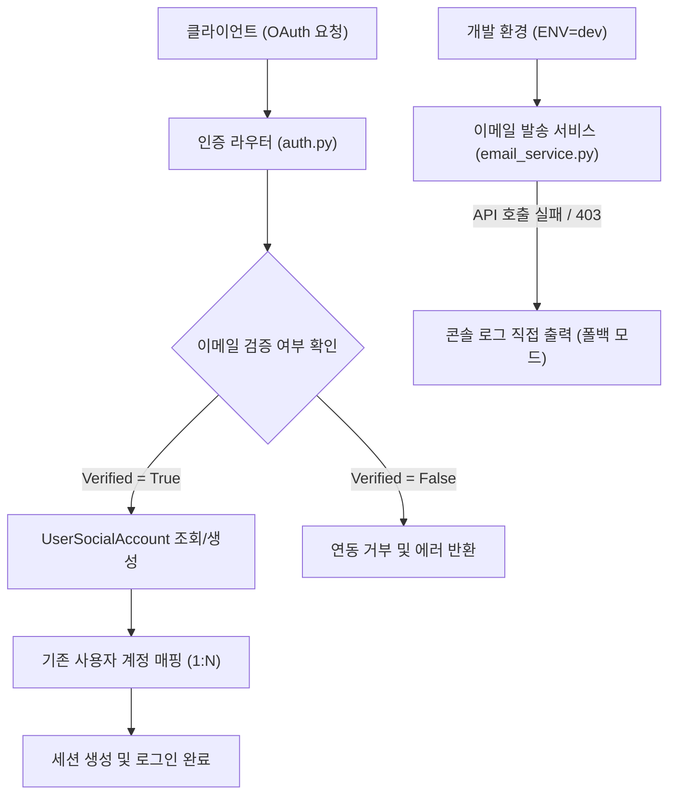

화장품 성분 분석 서비스인 PickSafe를 운영하면서 마주한 데이터 구조적 한계와 사용자 경험 상의 병목을 해결하기 위해 진행했던 개편 작업의 기록입니다. 제한된 리소스 환경 속에서 인증 시스템의 정합성을 높이고, 서비스 정체성에 맞추어 UI/UX를 전면 정비한 과정을 담담하게 풀어내고자 합니다.

---

## 🎯 마주한 고민과 문제 배경

초기 단계의 PickSafe는 구현의 단순함을 위해 `users` 테이블이 단 하나의 소셜 로그인 계정 정보만 직접 수용하도록 설계되었습니다. 하지만 실제 사용 환경을 점검하는 과정에서 구조적인 한계가 드러났습니다.

1. **소셜 계정 충돌 및 데이터 유실 문제**  
   동일한 이메일 주소를 사용하는 사용자가 구글과 페이스북 등 서로 다른 프로바이더로 번갈아 로그인할 경우, 기존 계정 정보가 덮어씌워지거나 매핑이 꼬이는 현상이 발생했습니다. 한 명의 유저가 여러 소셜 프로바이더를 유연하게 연동할 수 있는 구조적 전환이 시급했습니다.

2. **로컬 개발 환경의 외부 API 제약**  
   이메일 인증을 처리하는 외부 API(Resend 등)의 샌드박스 정책으로 인해, 로컬 테스트 환경(`ENV=dev`)에서 등록되지 않은 주소로 메일을 발송할 때마다 403 에러가 발생하며 가입 및 인증 흐름 자체가 중단되는 병목이 있었습니다.

3. **서비스 아이덴티티와 불일치하던 UI/UX**  
   기존의 어두운 다크 네이비 기반 테마는 아기자기하고 친근한 성분 분석 서비스라는 PickSafe의 정체성과 괴리가 있었습니다. 로고가 가진 시각적 언어와 사용자 인터페이스를 일치시키는 작업이 필요했습니다.

---

## ⚖️ 기술적 대안 비교 및 선택 이유

### 1. OAuth 계정 연동 구조 (1:1 vs 1:N 매핑 테이블)
*   **대안 A (기존 구조 유지 및 이메일 병합):** 하나의 `users` 테이블 내에서 프로바이더 필드 값을 업데이트하는 방식. 구현은 단순하지만 여러 소셜 계정을 동시에 연동할 수 없고 데이터 덮어씌움 문제가 해결되지 않음.
*   **대안 B (`UserSocialAccount` 1:N 분리 모델):** 사용자 테이블과 소셜 인증 정보를 분리하여 하나의 계정에 여러 프로바이더를 매핑할 수 있는 구조. 
*   **선택:** **대안 B**를 선택했습니다. 확장성 측면에서 올바른 방향이며, 동일 이메일 주소를 가진 계정의 무분별한 탈취를 막기 위해 `email_verified` 검증 로직을 결합하여 보안성을 강화했습니다.

### 2. 개발 환경 이메일 폴백 처리
*   **대안 A (mock 서버 구축):** 로컬에 별도의 SMTP 목 서버를 띄우는 방식. 환경 설정이 복잡해지고 불필요한 인프라 오버헤드가 발생함.
*   **대안 B (조건부 콘솔 폴백 모드):** 개발 모드에서 외부 API 호출 실패 시 에러를 우회하고 인증 링크를 터미널 로그로 직접 출력하는 방식.
*   **선택:** **대안 B**를 채택했습니다. 최소한의 코드로 로컬 디버깅 속도를 극대화할 수 있었습니다.

---

## 🏗️ 시스템 아키텍처 및 흐름

이번 개편에서 구현된 소셜 인증 및 다중 연동 데이터 흐름의 추상화된 구조는 다음과 같습니다.



---

## 💻 핵심 구현 및 트러블슈팅

### 1. 1:N 소셜 계정 분리 및 자가 진단 마이그레이션
기존 단일 소셜 컬럼 구조를 들어내고, `user_social_accounts` 테이블을 신설하여 외래키 관계로 연결했습니다. 또한 운영 편의성을 위해 서버 기동 시점(`main.py`)에 필수 컬럼(`role` 등) 유무를 검사하고, 누락된 경우 서버단에서 안전하게 마이그레이션 DDL을 수행하도록 방어 로직을 작성했습니다.

```python
# 서버 기동 시 자가 진단 및 마이그레이션 DDL 예시 (추상화됨)
def ensure_database_schema(engine):
    with engine.begin() as conn:
        conn.execute(text("""
            ALTER TABLE users 
            ADD COLUMN IF NOT EXISTS role VARCHAR(50) DEFAULT 'user';
        """))
```

### 2. 동일 이메일 매핑 시 보안 검증 로직
소셜 로그인 과정에서 이미 가입된 이메일이 존재할 경우, 무조건적인 계정 통합은 보안상 위험이 따릅니다. 프로바이더로부터 전달받은 `email_verified` 플래그가 참인 경우에만 기존 계정에 새로운 소셜 연동 정보를 추가(`UserSocialAccount` 레코드 생성)하도록 제어했습니다.

### 3. 파스텔 톤 디자인 시스템 적용
로고 이미지 파일(`picksafe_log.png`)에서 추출한 핵심 컬러 코드를 CSS 커스텀 변수로 정의하고, 전반적인 UI 템플릿과 스타일시트를 개편했습니다.

*   **주요 컬러 팔레트:** 민트 그린, 파스텔 핑크, 크림색 계열의 CSS 변수(`--primary-mint`, `--accent-pink`, `--bg-cream`) 적용
*   **타이포그래피 및 인터랙션:** 둥근 형태의 `Nunito` 폰트를 기본 서체로 지정하고, 상단 로고에 마우스 오버 시 윙크하는 이미지(`picksafe_log_on.png`)로 자연스럽게 전환되도록 프론트엔드 인터랙션을 보완했습니다.

---

## 💡 돌아보며 배운 점

이번 개편은 단순히 기능을 추가하는 것을 넘어, 서비스가 성장함에 따라 마주하는 데이터 정합성 문제를 근본적으로 해결하는 과정이었습니다. 

처음부터 완벽한 설계를 하지 못해 발생하는 레거시를 마주하기도 했지만, 서비스의 성격(친근하고 부드러운 성분 분석)과 인프라의 현실(로컬 개발 환경의 제약)을 타협점 없이 조율하는 법을 배웠습니다. 앞으로도 작은 기능 하나를 추가하더라도 데이터의 무결성과 사용자의 실제 경험을 최우선으로 고려하는 엔지니어링 원칙을 지켜나갈 것입니다.