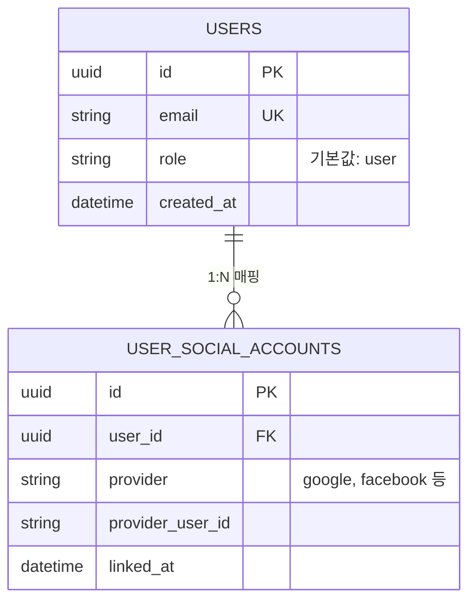
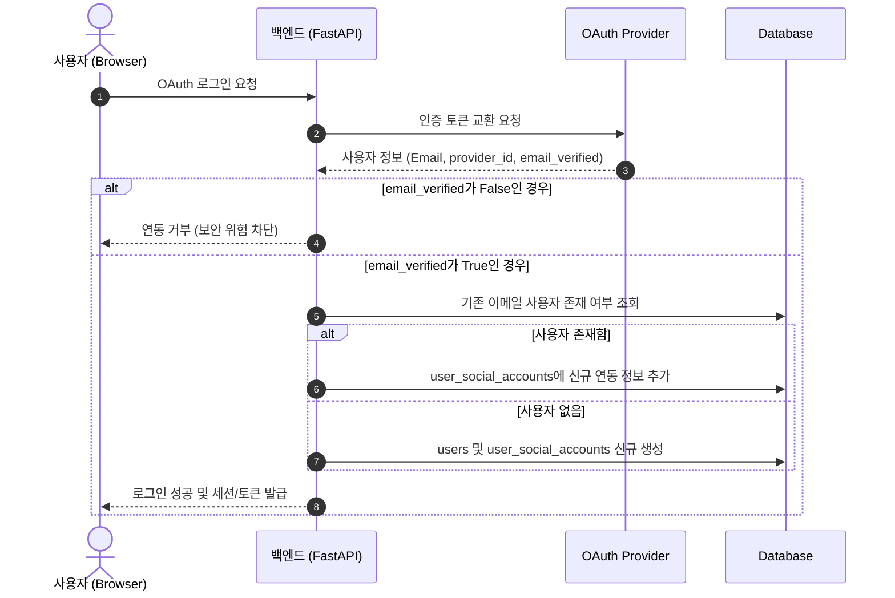

화장품 성분 분석 서비스 PickSafe의 초기 아키텍처를 설계할 당시, 회원가입과 로그인 절차를 단순화하기 위해 사용자 테이블(`users`) 내에 OAuth 소셜 제공자 정보를 직접 포함하도록 구성했습니다. 그러나 초기 구현을 기반으로 운영 테스트를 진행하면서 단일 소셜 계정 구조가 가진 한계와 데이터 무결성 위험을 확인했습니다.

동일한 이메일 주소를 사용하는 사용자가 구글과 페이스북 등 다른 프로바이더로 각각 로그인할 때 기존 계정 정보가 덮어씌워지거나 데이터가 유실되는 현상이 대표적이었습니다. 이러한 문제를 구조적으로 해결하기 위해 1:N 소셜 계정 연동 아키텍처로 개편을 진행했으며, 로컬 개발 환경에서의 DX(개발자 경험) 및 UI/UX 통일성을 함께 다듬었습니다.

---

## 🎯 마주한 고민과 문제 배경

### 1. 단일 소셜 로그인 구조의 데이터 유실 문제
초기 스키마는 `users` 테이블이 소셜 제공자(Provider) 식별자를 직접 가지고 있었습니다. 이로 인해 한 사용자가 동일한 이메일로 구글 로그인을 사용하다가 이후 페이스북 로그인을 시도할 경우, 기존 연동 정보가 오버라이드되거나 새로운 계정이 중복 생성되는 버그가 발생했습니다. 계정 식별의 기본 단위와 인증 제공자 식별 단위를 명확히 분리해야 할 필요성을 절감했습니다.

### 2. 계정 무단 점유(Account Takeover) 위험
동일 이메일 기반의 계정 자동 연동을 구현할 때, 인증되지 않은 소셜 프로바이더 이메일을 무조건 신뢰할 경우 보안 허점이 발생할 수 있었습니다. 검증되지 않은 이메일 정보를 그대로 기존 계정과 바인딩할 경우 타인의 계정에 무단으로 접근할 수 있는 여지가 있었습니다.

### 3. 외부 이메일 API 연동으로 인한 개발 병목
인증 및 가입 흐름을 테스트할 때 외부 이메일 발송 서비스(Resend API)의 샌드박스 제한으로 인해 등록된 개발자 메일 이외의 주소로는 테스트 메일이 발송되지 않는 제약이 있었습니다. 이로 인해 회원가입 후 이메일 인증 링크 디버깅 시 매번 외부 서비스 설정을 변경해야 하는 번거로움이 존재했습니다.

### 4. 브랜드 정체성과 UI 테마의 불일치
초기 어두운 네이비 기반의 다크 모드 UI는 파스텔 톤의 아기자기한 서비스 로고 및 화장품 성분 분석이라는 서비스 성격과 다소 동떨어져 있었습니다. 시각적 경험을 로고의 디자인 언어와 통일시킬 필요가 있었습니다.

---

## ⚖️ 기술적 대안 비교 및 선택 이유

### 계정 연동 구조 개선: 1:1 종속 방식 vs 1:N 외래키 분리 방식
* **대안 A (기존 1:1 종속 방식 유지):** 이메일별로 무조건 별도 사용자로 분리 저장.
  * *장점:* DB 스키마가 단순함.
  * *단점:* 사용자 입장에서 동일한 이메일임에도 구글 로그인 계정과 페이스북 로그인 계정이 따로 놀게 되어 스크랩/분석 이력이 파편화됨.
* **대안 B (1:N 외래키 테이블 분리 및 `email_verified` 검증):** `users`와 `user_social_accounts`를 분리하고, 신뢰된 이메일에 한해 동일 계정으로 매핑. (선택)
  * *장점:* 사용자는 단일 계정 내에 여러 소셜 수단을 자유롭게 연동 가능.
  * *단점:* OAuth 처리 시 이메일 검증 여부 체크 및 DB 트랜잭션 복잡도 증가.

계정의 소유권을 명확히 하면서도 사용자 편의성을 확보하기 위해 **대안 B**를 채택했습니다.

### 개발 모드 이메일 테스트 처리: Mocking vs 콘솔 폴백(Fallback)
* **대안 A (테스트 코드 전용 Mock 객체 사용):**
  * *장점:* 외부 API 호출을 완벽하게 차단.
  * *단점:* 실제 브라우저 기반의 E2E 회원가입 및 이메일 링크 클릭 흐름을 수동 디버깅하기 어려움.
* **대안 B (개발 모드 시 오류를 포착하여 터미널 콘솔 로그 출력):** (선택)
  * *장점:* 개발 환경(`ENV=dev`)에서 외부 API 제한(403 등) 발생 시 에러를 예외 처리하고 터미널 로그에 직접 인증 URL을 출력하여, 디버깅 속도를 비약적으로 향상시킴.

---

## 🏗️ 시스템 아키텍처 및 흐름

### 1. 개편된 소셜 계정 데이터 모델 (ERD)



### 2. OAuth 로그인 및 이메일 검증/연동 흐름



---

## 💻 핵심 구현 및 트러블슈팅

### 1. 스키마 분리 및 자가 진단 마이그레이션

`users` 테이블에서 소셜 식별 컬럼을 제거하고 `user_social_accounts` 모델을 구축했습니다. 서버 기동 시 기존 환경과의 호환성을 보장하고 `role` 컬럼 미존재로 인한 SQL 에러를 방지하기 위해 마이그레이션 DDL을 안전하게 실행하도록 구성했습니다.

```python
# web/backend/app/models/user.py
from sqlalchemy import Column, String, DateTime, ForeignKey, Boolean
from sqlalchemy.orm import relationship
from app.db.base_class import Base

class User(Base):
    __tablename__ = "users"

    id = Column(String, primary_key=True, index=True)
    email = Column(String, unique=True, index=True, nullable=False)
    role = Column(String, default="user", nullable=False)
    
    # 1:N 관계 정의
    social_accounts = relationship("UserSocialAccount", back_populates="user", cascade="all, delete-orphan")

class UserSocialAccount(Base):
    __tablename__ = "user_social_accounts"

    id = Column(String, primary_primary=True, index=True)
    user_id = Column(String, ForeignKey("users.id", ondelete="CASCADE"), nullable=False)
    provider = Column(String, nullable=False)  # google, facebook 등
    provider_user_id = Column(String, nullable=False)

    user = relationship("User", back_populates="social_accounts")
```

서버 구동 시 마이그레이션을 자동 보완하는 방어적 로직:

```python
# web/backend/app/main.py (앱 시작 로직 일부)
@app.on_event("startup")
async def check_database_schema():
    async with db_engine.begin() as conn:
        # role 컬럼 부재시 실행되는 자가 진단 DDL
        await conn.execute(
            text("ALTER TABLE users ADD COLUMN IF NOT EXISTS role VARCHAR DEFAULT 'user' NOT NULL;")
        )
```

### 2. OAuth 보안 필터링 및 동일 이메일 매핑

프로바이더로부터 전달받은 `email_verified` 값이 `True`인지 먼저 검증한 뒤, 이미 등록된 이메일 사용자가 있다면 소셜 계정 테이블만 추가 연결하도록 로직을 작성했습니다.

```python
# web/backend/app/routers/auth.py
@router.post("/oauth/callback")
async def oauth_callback(payload: OAuthPayload, db: AsyncSession = Depends(get_db)):
    # 1. 프로바이더 이메일 검증 여부 확인
    if not payload.is_email_verified:
        raise HTTPException(
            status_code=400, 
            detail="검증되지 않은 소셜 이메일 계정은 연동할 수 없습니다."
        )

    # 2. 기존 사용자 존재 여부 확인
    existing_user = await get_user_by_email(db, email=payload.email)
    
    if existing_user:
        # 기존 계정이 있다면 1:N 연동 추가
        await link_social_account(
            db, 
            user_id=existing_user.id, 
            provider=payload.provider, 
            provider_user_id=payload.provider_user_id
        )
        user = existing_user
    else:
        # 신규 계정 생성 및 연동
        user = await create_user_with_social(db, payload)

    return create_access_token_response(user)
```

### 3. 개발 모드 이메일 발송 폴백(Fallback) 모드

로컬 개발 환경에서 Resend API의 403 Forbidden(등록된 테스트 주소 미치합) 오류 발생 시, 전체 가입 흐름이 중단되지 않고 로컬 콘솔에서 바로 링크를 복사해 테스트할 수 있도록 이메일 서비스 영역을 개선했습니다.

```python
# web/backend/app/services/email_service.py
import logging
from app.core.config import SETTINGS

logger = logging.getLogger(__name__)

async def send_verification_email(email: str, verify_url: str):
    try:
        # 외부 API 호출 시도
        response = await resend_client.send_email({
            "from": SETTINGS.EMAIL_FROM,
            "to": email,
            "subject": "[PickSafe] 이메일 인증을 완료해주세요",
            "html": f"<a href='{verify_url}'>인증하기</a>"
        })
        return response
    except Exception as e:
        # 개발 환경일 경우 에러를 삼키고 터미널 로그로 링크 출력
        if SETTINGS.ENV == "dev":
            logger.warning("[이메일 발송 개발용 폴백] 외부 API 실패. 디버깅용 링크를 출력합니다.")
            logger.info(f">>> [TEST EMAIL LINK FOR {email}]: {verify_url}")
            return None
        # 운영 환경에서는 예외를 다시 던짐
        raise e
```

### 4. 파스텔 톤 디자인 언어 개편

기존 다크 테마에서 벗어나, 서비스 로고(`picksafe_log.png`)의 민트 그린(#5ABFAD), 파스텔 핑크(#F4A5B0), 크림(#FFF8F0) 색상을 상징하는 CSS 커스텀 변수를 정립하고 적용했습니다.

```css
/* web/frontend/static/css/styles.css */
:root {
  --primary-mint: #5ABFAD;
  --secondary-pink: #F4A5B0;
  --bg-cream: #FFF8F0;
  --text-main: #2C3E50;
  --font-family-base: 'Nunito', -apple-system, BlinkMacSystemFont, sans-serif;
}

body {
  background-color: var(--bg-cream);
  color: var(--text-main);
  font-family: var(--font-family-base);
}

/* 헤더 로고 호버 인터랙션 */
.header-logo {
  width: 140px;
  height: auto;
  content: url('/static/images/picksafe_log.png');
  transition: transform 0.2s ease-in-out;
}

.header-logo:hover {
  content: url('/static/images/picksafe_log_on.png');
  transform: scale(1.03);
}
```

---

## 💡 돌아보며 배운 점 (회고)

### 1. 보안과 DX 사이의 균형 잡기
소셜 로그인 연동 시 단순 편의성만 고려해 이메일을 무조건 매핑하면 보안 문제가 생길 수 있음을 확인했습니다. `email_verified` 검증 로직을 추가함으로써 데이터 무결성과 계정 보안을 확보할 수 있었습니다. 또한, 개발 모드에서의 이메일 폴백 시스템 구축은 외부 의존성이 있는 기능을 로컬에서 테스트할 때의 생산성을 크게 높여주었습니다.

### 2. 마이그레이션의 방어적 설계
운영 중인 서비스 스키마를 변경할 때는 데이터 모델 분리뿐만 아니라 기동 시점의 방어적 DDL 처리(`IF NOT EXISTS`) 등 신중한 대응이 필요함을 느꼈습니다. 향후 데이터베이스 변경 사항이 누적되면 Alembic과 같은 전문 마이그레이션 도구를 도입하여 체계적으로 버전을 관리할 계획입니다.

### 3. 일관된 브랜드 경험의 중요성
기술적인 백엔드 구조 개편과 더불어, 사용자가 접하는 프론트엔드의 CSS 변수 구조화 및 UI 톤앤매너 리뉴얼을 병행하면서 서비스의 정체성이 훨씬 명확해졌습니다. 단순 기능 구현에 그치지 않고 서비스 특성에 적합한 사용자 경험을 제공하는 종합적인 관점의 중요성을 다시 한번 상기했습니다.