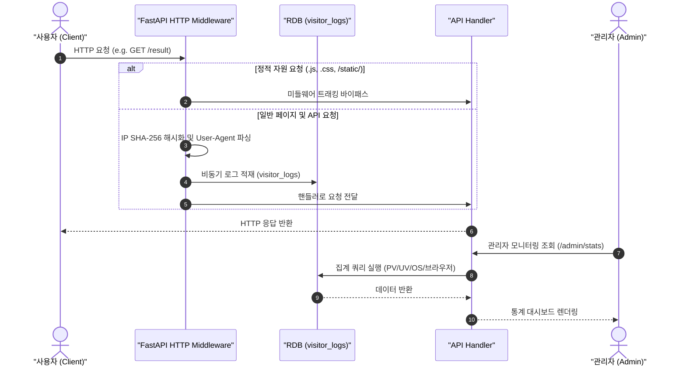

화장품 성분 분석 서비스인 PickSafe를 개발하며 서비스 운영에 필요한 유입 경로 추적, 사용자 활동 분석, 시스템 에러 로그 모니터링 체계를 구축하는 과정에서 기술적 고민을 했습니다.

서비스 초기 단계부터 무거운 외부 분석 스크립트를 탑재하는 것은 오프라인 동작을 지향하는 서비스 특성과 맞지 않았고, 사용자 프라이버시 보호 측면에서도 부담이 있었습니다. 이에 FastAPI 미들웨어를 활용해 가볍고 안전하게 사용자 활동 데이터를 수집하고 관리자용 대시보드를 구축하기까지의 의사결정 과정과 구현 내용을 정리했습니다.

---

## 🎯 마주한 고민과 문제 배경

서비스 내에서 사용자가 어떤 페이지를 주로 방문하는지, 검색 흐름상에서 오류가 발생하는 시점이 언제인지를 파악하는 것은 서비스 개선을 위해 필수적이었습니다. 그러나 기존의 일반적인 방식을 그대로 적용하기에는 몇 가지 명확한 한계와 제약사항이 존재했습니다.

1. **외부 클라이언트 스크립트 도입의 부담**
   - 구글 애널리틱스(GA) 등 외부 분석 SDK를 도입할 경우 클라이언트 번들 크기가 증가하고, 서드파티 쿠키 문제나 스크립트 블로킹으로 인한 데이터 누락이 생길 수 있었습니다.
   - PWA 환경에서 네트워크가 불안정할 때 외부 서버로의 추적 요청이 실패하는 현상을 최소화하고자 했습니다.

2. **개인정보보호 및 데이터 소유권**
   - 화장품 성분 검색 데이터와 사용자의 IP 원문을 외부에 그대로 전송하지 않고, 서비스 내부에서 직접 비식별화(해시 처리)하여 안전하게 관리할 필요가 있었습니다.

3. **제한된 인프라 리소스 내에서의 무중단 적재**
   - 대규모 로그 모니터링 전용 파이프라인(ELK Stack 등)을 구동하기에는 메모리 및 데이터베이스 커넥션 리소스가 제한적이었습니다.
   - 따라서 백엔드 메인 서비스의 응답 속도를 저해하지 않으면서 최소한의 오버헤드로 데이터를 수집하는 구조가 필요했습니다.

---

## ⚖️ 기술적 대안 비교 및 선택 이유

방문자 및 시스템 로그 수집을 위해 세 가지 방안을 비교 검토했습니다.

| 항목 | 대안 A: 외부 SaaS (GA4 / Amplitude) | 대안 B: 무거운 모니터링 스택 (ELK / Prometheus) | 대안 C: FastAPI 미들웨어 + DB 적재 (최종 선택) |
| :--- | :--- | :--- | :--- |
| **추가 인프라 비용** | 없음 (기본 플랜 기준) | 높음 (별도 서버/메모리 필요) | **없음 (기존 RDB 활용)** |
| **개인정보 제어** | 외부 서버 전송으로 제어 불가 | 완전 제어 가능 | **완전 제어 가능 (IP 해시화)** |
| **클라이언트 오버헤드** | 외부 JS 라이브러리 로딩 필요 | 없음 | **없음 (서버 사이드 추적)** |
| **시스템 복잡도** | 낮음 | 매우 높음 | **보통 (자체 쿼리 및 미들웨어 설계)** |

### 선택 이유
초기 운영 단계에서는 시스템 구조를 단순하게 유지하는 것이 최우선이었습니다. 따라서 **대안 C**를 선택하여 백엔드 레벨에서 요청 흐름을 감지하고, 비동기 처리를 통해 메인 비즈니스 로직에 영향을 주지 않는 경량화된 방식을 채택했습니다.

---

## 🏗️ 시스템 아키텍처 및 흐름

요청이 유입될 때 static 자원(.js, .css 등)을 필터링하고, 유효한 정적/동적 요청만 IP 비식별화 및 User-Agent 파싱을 거쳐 비동기적으로 데이터베이스에 적재하는 아키텍처입니다.



---

## 💻 핵심 구현 및 트러블슈팅

### 1. 데이터베이스 스키마 설계 (`visitor_logs`)
방문자 활동 로그를 정밀하게 기록하면서도, 개인정보 유출 위험을 원천 차단하기 위해 단방향 해시 키 기반으로 컬럼을 설계했습니다.

```sql
CREATE TABLE visitor_logs (
    id VARCHAR(36) PRIMARY KEY,
    ip_hash VARCHAR(64) NOT NULL,       -- 개인정보 보호를 위한 IP 단방향 해시값
    session_id VARCHAR(100) NOT NULL,   -- 브라우저 세션 식별자
    user_id VARCHAR(36) REFERENCES users(id) ON DELETE SET NULL,
    path VARCHAR(255) NOT NULL,         -- 방문 경로
    method VARCHAR(10) NOT NULL,        -- HTTP Method
    user_agent TEXT,
    browser VARCHAR(50),                -- 파싱된 브라우저명
    os VARCHAR(50),                     -- 파싱된 운영체제명
    locale VARCHAR(10),                 -- 사용자 언어 설정
    referer TEXT,
    created_at TIMESTAMP DEFAULT CURRENT_TIMESTAMP
);

-- 시계열 조회 속도 향상을 위한 인덱스 생성
CREATE INDEX idx_visitor_logs_created_at ON visitor_logs(created_at);
```

### 2. FastAPI 미들웨어 비동기 추적 구현
요청 응답 시간을 지연시키지 않도록 정적 자원 요청은 즉시 제외하고, 수집된 정보는 단방향 해시 처리 후 DB에 기입하도록 구현했습니다.

```python
import hashlib
from fastapi import Request, Response
from starlette.middleware.base import BaseHTTPMiddleware
from user_agents import parse

class VisitorAnalyticsMiddleware(BaseHTTPMiddleware):
    async def dispatch(self, request: Request, call_next) -> Response:
        path = request.url.path
        
        # 정적 자원 및 헬스체크 경로는 트래킹에서 제외
        if path.startswith("/static/") or path.endswith((".css", ".js", ".ico", ".png")):
            return await call_next(request)

        # 사용자 IP 해시화 (개인정보 비식별화)
        raw_ip = request.client.host if request.client else "unknown"
        ip_hash = hashlib.sha256(raw_ip.encode('utf-8')).hexdigest()

        # User-Agent 파싱
        ua_string = request.headers.get("user-agent", "")
        user_agent_parsed = parse(ua_string)

        browser = user_agent_parsed.browser.family
        os_name = user_agent_parsed.os.family
        session_id = request.cookies.get("session_id", "anonymous")

        # 본 요청 처리
        response = await call_next(request)

        # 비동기 로그 수집 실행 (응답 지연 방지)
        try:
            await self.log_visitor_activity(
                ip_hash=ip_hash,
                session_id=session_id,
                path=path,
                method=request.method,
                user_agent=ua_string,
                browser=browser,
                os=os_name,
                locale=request.headers.get("accept-language", "")[:10]
            )
        except Exception as e:
            # 로깅 실패가 서비스 주 요청 처리 실패로 이어지지 않도록 예외 처리
            print(f"[Logging Exception] Failed to record log: {e}")

        return response
```

### 💬 트러블슈팅: DB Connection 병목 현상 해결

**문제 상황**
최초 미들웨어 적용 후 검증을 진행하던 중, 페이지 전환 시 미세한 응답 지연이 발생하는 현상을 발견했습니다. 원인을 분석해보니 미들웨어 내에서 DB 로그를 동기적으로 작성하는 과정에서 DB 커넥션 풀을 미리 점유하여, 정작 본래 비즈니스 로직(성분 조회 쿼리 등)이 커넥션을 획득하기 위해 대기하는 병목이 원인이었습니다.

**해결 방법**
- **비동기 DB 세션 분리**: 로깅 전용 DB 작성 작업을 메인 트랜잭션과 완전히 분리했습니다.
- **예외 격리**: 로그 적재 실패가 발생하더라도 사용자에게는 성공 응답이 정상 반환되도록 Try-Catch 블록으로 격리하여 서비스 안정성을 확보했습니다.

---

## 💡 돌아보며 배운 점

1. **외부 의존성 절감과 프라이버시 확보**
   외부 분석 도구에 의존하지 않고 자체 미들웨어를 구축함으로써 클라이언트 단에서의 무거운 JS 수집 스크립트 로딩을 제거할 수 있었습니다. 또한, 사용자 IP를 SHA-256으로 해시화하여 관리함으로써 개인정보 유출 리스크를 원천적으로 방지하는 안전한 통계 시스템을 완성했습니다.

2. **비즈니스 로직과 부가 기능의 철저한 분리**
   모니터링과 통계 수집은 서비스 운영에 유용하지만, 메인 기능의 퍼포먼스를 침범해서는 안 된다는 엔지니어링 원칙을 다시금 체득했습니다. 미들웨어 단계에서의 예외 처리 격리와 비동기 처리가 시스템 전체의 안정을 가져다주었습니다.

3. **향후 보완점**
   현재는 단일 DB의 `visitor_logs` 테이블에 직접 로그를 적재하고 있습니다. 추후 유입량이 더욱 늘어난다면 DB 쓰기 트래픽 부하를 줄이기 위해 메모리 기반 버퍼에 로그를 일시 저장한 후 주기적으로 Bulk Insert 처리하는 Batch 파이프라인으로 구조를 개선해 볼 수 있을 것입니다.