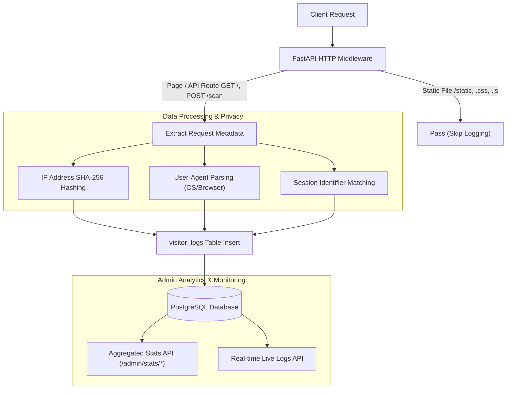

화장품 성분 분석 서비스인 PickSafe를 개발하며 서비스의 유입 경로, 사용자 반응, 그리고 내부 시스템의 예외 상황을 감지하기 위한 분석 모니터링 환경이 필요해졌습니다. 서비스의 핵심 가치인 '개인정보 보호'와 '오프라인 PWA 지원'이라는 방향성을 해치지 않으면서도, 필요한 트래픽 지표와 시스템 상태를 파악하기 위해 미들웨어 기반 자체 로깅 및 분석 시스템을 설계하게 되었습니다.

이 글에서는 외부 서드파티 스크립트에 의존하지 않고, FastAPI 미들웨어와 자체 데이터베이스를 활용하여 방문자 분석 및 모니터링 시스템을 구축한 과정과 고민을 기록합니다.

---

## 🎯 마주한 고민과 문제 배경

초기에는 Google Analytics(GA4)나 Sentry 같은 검증된 외부 솔루션 도입을 검토했습니다. 하지만 개발 진행 과정에서 다음과 같은 명확한 문제점과 제약 사항이 드러났습니다.

1. **개인정보 보호 및 사용자 신뢰성:** 화장품 성분 분석 서비스 특성상 민감할 수 있는 사용자의 검색 패턴이나 피부 고민 정보가 외부 서드파티 트래커로 전송되는 것에 대한 부담이 있었습니다.
2. **PWA 오프라인 특성 및 클라이언트 성능:** 외부 분석 스크립트가 늘어날수록 번들 사이즈가 증가하고, 초기 로딩 속도에 악영향을 주었습니다. 특히 PWA의 네트워크 불안정 상황에서 스크립트 로딩 실패가 서비스 동작에 영향을 주면 안 되었습니다.
3. **어드민 내부와의 파편화된 경험:** 서비스 동작 에러(예: Gemini API 호출 실패, DB 커넥션 타임아웃)와 유저의 유입 경로 통계를 통합된 단일 어드민 대시보드에서 직관적으로 확인하고 싶었습니다.

결국 외부 트래커를 제거하고, 백엔드 요청 단계에서 트래픽과 로그를 직접 수집하여 저장하는 **"자급자족형 분석 아키텍처"**로 방향을 전환했습니다.

---

## ⚖️ 기술적 대안 비교 및 선택 이유

자체 분석 시스템을 도입하기 위해 수집 방식에 대한 대안을 비교 분석했습니다.

| 비교 항목 | 외부 SaaS (GA4, Sentry 등) | 비동기 로그 큐 + ELK 스택 | FastAPI 미들웨어 + DB 적재 (선택) |
| :--- | :--- | :--- | :--- |
| **도입 및 운영 난이도** | 낮음 (스크립트 삽입) | 매우 높음 (별도 인프라 구축 필요) | 보통 (기존 DB 및 웹 서빙 활용) |
| **클라이언트 성능 영향** | JS 번들 및 네트워크 자원 소모 | 없음 | 없음 |
| **개인정보 보호** | 외부 데이터 제공 위험 존재 | 완전 자체 소유 | 완전 자체 소유 (IP 해시 처리) |
| **시스템 복잡도** | 없음 | 파이프라인 관리 비용 높음 | 데이터베이스 Write 부하 고려 필요 |

### 최종 선택 이유

현재 서비스 규모에서는 ELK 스택이나 별도의 로그 인프라(Kafka, Logstash 등)를 운용하는 것이 과도한 오버헤드라고 판단했습니다. 

대신 **FastAPI의 HTTP 미들웨어**에서 페이지 뷰 요청을 채포하여 **단방향 해시(SHA-256) 처리된 IP**와 접속 정보를 데이터베이스(`visitor_logs`)에 비동기로 적재하는 방식을 선택했습니다. 이를 통해 사용자 프라이버시를 완벽히 보호하면서도, 시스템 인프라 구조를 단순하게 유지할 수 있었습니다.

---

## 🏗️ 시스템 아키텍처 및 흐름

클라이언트 요청이 들어왔을 때 정적 자원 요청을 필터링하고, 수집된 데이터를 가공하여 데이터베이스에 저장 및 어드민 대시보드로 전달하는 전체 흐름입니다.



---

## 💻 핵심 구현 및 트러블슈팅

### 1. 데이터베이스 스키마 설계 (`visitor_logs`)

수집되는 데이터는 방문자 분석(PV, UV, 접속 기기 등)을 원활하게 aggregate할 수 있는 구조로 작성했습니다.

```sql
CREATE TABLE visitor_logs (
    id VARCHAR(36) PRIMARY KEY,
    ip_hash VARCHAR(64) NOT NULL,       -- IP 단방향 해시 (식별용)
    session_id VARCHAR(100) NOT NULL,   -- 세션 브라우저 식별자
    user_id VARCHAR(36) REFERENCES users(id) ON DELETE SET NULL,
    path VARCHAR(255) NOT NULL,         -- 방문 경로
    method VARCHAR(10) NOT NULL,        -- HTTP Method
    user_agent TEXT,                    -- User-Agent 원문
    browser VARCHAR(50),                -- 파싱된 브라우저
    os VARCHAR(50),                     -- 파싱된 운영체제
    locale VARCHAR(10),                 -- 유저 접속 언어
    referer TEXT,                       -- 유입 경로
    created_at TIMESTAMP DEFAULT CURRENT_TIMESTAMP
);

-- 기간별 집계 성능 강화를 위한 인덱스 생성
CREATE INDEX idx_visitor_logs_created_at ON visitor_logs(created_at);
```

### 2. FastAPI 미들웨어 및 필터링 구현

미들웨어 구현 중 마주친 첫 번째 문제는 **정적 파일(`.css`, `.js`, 이미지 등) 요청까지 모두 DB에 기록되어 데이터베이스 부하와 인덱스 크기가 급증**하는 현상이었습니다.

이를 해결하기 위해 정적 자원 경로 패턴을 사전 필터링하고, 사용자 IP는 `SETTINGS.SECRET_KEY` 기반의 소금을 더해 해싱 처리하는 로직을 추가했습니다.

```python
import hashlib
from fastapi import Request
from starlette.middleware.base import BaseHTTPMiddleware
from user_agents import parse

class VisitorAnalyticsMiddleware(BaseHTTPMiddleware):
    # 트래킹에서 제외할 확장자 및 경로
    EXCLUDED_EXTENSIONS = ('.css', '.js', '.png', '.jpg', '.ico', '.svg', '.woff2')
    EXCLUDED_PATHS = ('/static/', '/favicon.ico', '/docs', '/openapi.json')

    async def dispatch(self, request: Request, call_next):
        path = request.url.path

        # 정적 파일 및 지정된 경로는 로깅 제외
        if path.startswith(self.EXCLUDED_PATHS) or path.endswith(self.EXCLUDED_EXTENSIONS):
            return await call_next(request)

        # 1. IP 해시화 (개인정보 보호)
        client_ip = request.client.host if request.client else "127.0.0.1"
        salt = getattr(SETTINGS, "IP_SALT", "default_salt")
        ip_hash = hashlib.sha256(f"{client_ip}{salt}".encode('utf-8')).hexdigest()

        # 2. User-Agent 파싱
        ua_string = request.headers.get("user-agent", "")
        user_agent_parsed = parse(ua_string)
        
        browser = user_agent_parsed.browser.family
        os_name = user_agent_parsed.os.family

        # 3. 요청 처리
        response = await call_next(request)

        # 4. 비동기 로그 저장 (응답에 영향을 주지 않도록 백그라운드 처리 권장)
        # 어드민 접속 계정인 경우 통계 집계에서 제외할 수 있도록 조건 처리
        if not request.session.get("is_admin", False):
            await self._save_visitor_log(
                ip_hash=ip_hash,
                session_id=request.cookies.get("session_id", "anonymous"),
                user_id=getattr(request.state, "user_id", None),
                path=path,
                method=request.method,
                user_agent=ua_string,
                browser=browser,
                os=os_name,
                locale=request.headers.get("accept-language", "")[:5],
                referer=request.headers.get("referer")
            )

        return response
```

### 3. 트러블슈팅: DB Write 지연이 HTTP 응답에 미치는 영향

미들웨어 내부에서 DB Insert 작업을 동기적으로 기다리다 보니, 트래픽이 몰릴 때 메인 API 응답 속도(Latency)가 수십 ms 이상 밀리는 현상이 관찰되었습니다. 

* **원인:** 로깅 작업이 비즈니스 로직 처리 타임라인에 차단(Blocking) 요소로 작용함.
* **해결:** 데이터베이스 적재 로직을 FastAPI의 `BackgroundTasks` 또는 비동기 세션으로 분리하여, **HTTP 응답 반환을 로그 DB 저장 완료 시점과 격리**시켰습니다. 분석 데이터 저장이 약간 늦어지더라도 유저 경험을 우선시하도록 구조를 개선했습니다.

---

## 💡 돌아보며 배운 점

외부 대시보드나 화려한 SaaS 툴을 쓰는 것이 항상 정답은 아니라는 점을 배웠습니다. 서비스의 목적과 제약 조건에 맞춰 직접 설계한 미들웨어 기반 트래킹 시스템은 다음과 같은 명확한 이점을 가져다주었습니다.

1. **완벽한 데이터 주권과 프라이버시:** 외부 데이터 유출 우려 없이 완벽하게 개인정보가 보호된 형태(IP Hash)로 유저 동향을 수집할 수 있게 되었습니다.
2. **어드민 내 단일화된 모니터링:** 별도 관리자 도구로 이동할 필요 없이 어드민 내부 대시보드에서 접속자 통계(PV/UV)와 외부 API(Gemini) 실패 로그를 한눈에 파악할 수 있어 운영 효율이 대폭 증가했습니다.
3. **트레이드 오프(Trade-off)의 경험:** 데이터베이스 적재 부하라는 단점이 존재했지만, 정적 파일 경로 제외 및 비동기 처리를 통해 서버 자원 사용량을 타협 가능한 수준으로 안정화할 수 있었습니다.

향후 서비스의 트래픽 규모가 훨씬 커진다면, 데이터베이스 direct insert 방식 대신 Redis 큐에 임시 수집 후 배치(Batch)로 저장하는 구조나 DB 파티셔닝 전략을 도입하여 한 단계 더 확장해볼 수 있을 것입니다. 현 단계에서는 서비스가 추구하는 보안성과 경량화 가치를 지켜낸 뜻깊은 엔지니어링 작업이었습니다.