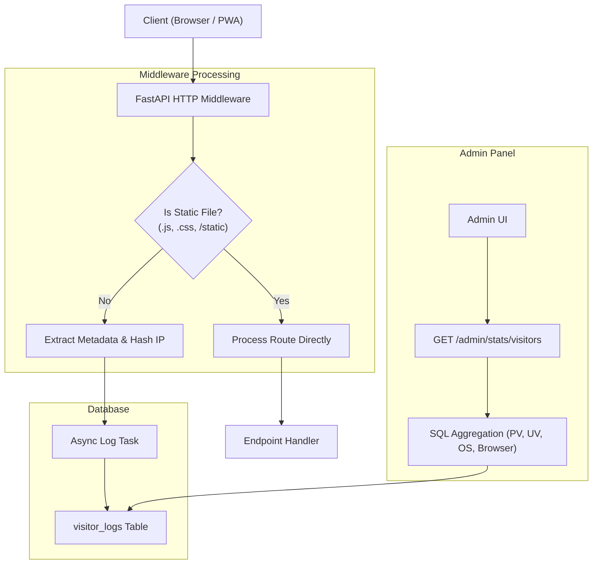

화장품 성분 분석 서비스 PickSafe를 개발하면서 사용자 유입 경로와 주요 사용 패턴을 파악해야 하는 시점이 왔습니다. 어떤 성분이 자주 검색되는지, 오류는 어디서 발생하는지 파악하는 것은 서비스 개선에 필수적입니다. 

일반적으로 Google Analytics나 외부 SaaS 모니터링 도구를 빠르게 붙이는 방식을 떠올리기 쉽지만, PickSafe의 서비스 특성과 운영 환경을 고려했을 때 다른 접근이 필요하다고 판단했습니다. 이 글에서는 외부 통계 SDK에 의존하지 않고, 애플리케이션 내부에 직접 자체 방문자 분석 및 로그 모니터링 시스템을 구축한 과정과 기술적 고민을 정리해 봅니다.

---

## 🎯 마주한 고민과 문제 배경

### 1. 개인정보 보호 및 오프라인 PWA 성격 유지
PickSafe는 사용자의 피부 고민이나 관심 성분을 다루는 서비스 특성상 개인 식별 정보 저장을 최소화해야 합니다. 외부 서드파티 스크립트를 삽입할 경우 사용자의 행동 데이터가 제3자에게 전송될 우려가 있고, 브라우저의 광고 차단 확장 프로그램(AdBlocker)에 의해 유입 트래킹이 차단되어 통계가 왜곡되는 문제도 발생할 수 있습니다. PWA 환경에서도 안정적으로 작동하는 경량 로깅 체계가 필요했습니다.

### 2. 인프라 리소스 한계와 Latency 영향
외부 모니터링 인프라(Elasticsearch, Logstash 등)를 별도로 구축하는 것은 당시 인프라 예산과 관리 공수 측면에서 과도한 선택(Over-engineering)이었습니다. 그렇다고 단일 웹 애플리케이션 DB에 모든 HTTP 요청을 무작정 적재하면, 정적 파일(`.css`, `.js`, 이미지 등) 요청까지 스토리지에 쌓여 DB 커넥션 병목과 API 응답 지연(Latency)을 유발할 위험이 있었습니다.

따라서 다음과 같은 핵심 목표를 설정했습니다.
- 외부 의존성 없는 단일 데이터 흐름 유지
- 원본 IP를 직접 저장하지 않는 개인정보 비식별화
- 정적 파일 제외 및 비동기 처리로 메인 API 응답 속도에 미치는 영향 최소화

---

## ⚖️ 기술적 대안 비교 및 선택 이유

가장 먼저 고려할 수 있는 세 가지 선택지를 비교 검토했습니다.

| 구분 | 대안 A: 외부 통계 SDK (GA 등) | 대안 B: 별도 로그 수집 인프라 (EFK Stack) | 대안 C: FastAPI 미들웨어 + DB 수집 (최종 선택) |
| :--- | :--- | :--- | :--- |
| **장점** | - 구현이 매우 간편함<br>- 풍부한 기본 대시보드 제공 | - 서버 애플리케이션과 분리되어 영향도 없음<br>- 대용량 로그 검색에 최적화 | - 외부 의존성 없음<br>- 완전한 데이터 소유권 및 제어 가능<br>- 개인정보 처리 방침 수립에 유리 |
| **단점** | - AdBlocker 차단으로 데이터 누락<br>- 데이터 소유권 제약<br>- 외부 스크립트로 인한 로딩 지연 | - 추가 인프라 운영 비용 발생<br>- 현재 서비스 규모 대비 복잡도 과다 | - 집계 쿼리 실행 시 DB 부하 관리 필요<br>- 직접 대시보드 API 및 UI 구현 필요 |
| **결정** | 탈락 (프라이버시/차단 이슈) | 탈락 (운영 리소스 부족) | **선택** |

애플리케이션 레이어에서 **FastAPI HTTP 미들웨어**를 활용해 정적 요청을 걸러내고, 유의미한 비즈니스 요청만 비동기 방식으로 DB에 기록하는 방식을 선택했습니다.

---

## 🏗️ 시스템 아키텍처 및 흐름

클라이언트 요청이 들어왔을 때 정적 리소스를 필터링하고 비식별화 처리를 거쳐 저장되는 전체 구조는 다음과 같습니다.



---

## 💻 핵심 구현 및 트러블슈팅

### 1. 개인정보 비식별화 및 데이터 스키마 설계
유저의 실체 IP를 직접 DB에 남기지 않도록 단방향 해시 알고리즘을 적용했습니다. 동일 IP에서 발생하는 중복 방문을 식별하여 UV(Unique Visitor)를 산출하되, 원래 IP 주소는 복원할 수 없도록 조치했습니다.

```sql
-- 방문자 로그 수집 테이블 예시
CREATE TABLE visitor_logs (
    id VARCHAR(36) PRIMARY KEY,
    ip_hash VARCHAR(64) NOT NULL,       -- SHA-256 비식별화 IP
    session_id VARCHAR(100) NOT NULL,   -- 세션 식별자
    user_id VARCHAR(36),                -- 회원 고유 ID (선택)
    path VARCHAR(255) NOT NULL,         -- 요청 경로
    method VARCHAR(10) NOT NULL,        -- HTTP Method
    user_agent TEXT,                    -- User-Agent 원문
    browser VARCHAR(50),                -- 파싱된 브라우저명
    os VARCHAR(50),                     -- 파싱된 운영체제명
    locale VARCHAR(10),                 -- 유저 언어 설정
    created_at TIMESTAMP DEFAULT CURRENT_TIMESTAMP
);

-- 검색 속도 최적화를 위한 작성일시 인덱스
CREATE INDEX idx_visitor_logs_created_at ON visitor_logs(created_at);
```

### 2. 미들웨어에서의 정적 경로 제외 및 Latency 병목 개선

초기 구현에서는 미들웨어 내부에서 로깅 로직을 동기적으로 수행하는 바람에 API 응답 시간이 미세하게 늘어나는 현상이 관찰되었습니다. 

이를 해결하기 위해 
1) 정적 리소스 경로는 즉시 스킵(Early Return)하도록 조건식을 최적화했고,
2) User-Agent 파싱 및 DB 적재 작업을 메인 요청 처리 흐름에 영향을 주지 않도록 정교하게 분리했습니다.

```python
# 미들웨어 내부 필터링 및 비식별화 핵심 원리 예시
import hashlib
from fastapi import Request

EXCLUDE_PREFIXES = ("/static", "/favicon.ico")
EXCLUDE_EXTENSIONS = (".js", ".css", ".png", ".jpg", ".svg")

def is_static_path(path: str) -> bool:
    if path.startswith(EXCLUDE_PREFIXES):
        return True
    return path.endswith(EXCLUDE_EXTENSIONS)

def anonymize_ip(ip_address: str, salt: str) -> str:
    # IP 주소 단방향 해시 처리
    return hashlib.sha256((ip_address + salt).encode("utf-8")).hexdigest()

async def process_visitor_logging(request: Request, call_next, salt: str):
    path = request.url.path
    
    # 1. 정적 파일 필터링으로 쓸데없는 로깅 및 DB overhead 방지
    if is_static_path(path):
        return await call_next(request)
        
    # 2. 메타데이터 추출 및 IP 해시화
    raw_ip = request.client.host if request.client else "127.0.0.1"
    hashed_ip = anonymize_ip(raw_ip, salt)
    
    # 3. 비즈니스 로직 수행
    response = await call_next(request)
    
    # 4. 로그 적재 (응답 후 비동기 기록 흐름)
    # ... (DB 저장 처리)
    
    return response
```

### 3. 통계 집계 쿼리 최적화
어드민 대시보드 조회 시 매번 전체 테이블을 스캔(`Full Table Scan`)하게 되면, 로그 누적에 따라 모니터링 페이지 로딩이 급격히 느려집니다. 이를 방지하기 위해 조회 기간(`created_at`) 조건에 인덱스를 적극 활용하고, 고유 방문자 수(UV) 계산 시 `COUNT(DISTINCT ip_hash)`를 사용하여 메모리 연산을 최소화했습니다.

---

## 💡 돌아보며 배운 점 (회고)

### 얻은 성과
1. **외부 의존성 제로화:** 별도의 서드파티 통계 모듈이나 고비용 모니터링 인프라 없이도, 서비스 내부 자원만으로 실시간 유입 현황과 에러 로그를 안정적으로 수집할 수 있게 되었습니다.
2. **개인정보 보호 강화:** 원본 IP를 저장하지 않고 단방향 해시로 비식별화함으로써, 보안 및 개인정보 관련 리스크를 효과적으로 낮췄습니다.
3. **정확한 서비스 지표 확보:** AdBlocker나 외부 스크립트 차단 정책에 영향을 받지 않고 오프라인 PWA 유저를 포함한 정확한 PV/UV 지표를 모니터링할 수 있게 되었습니다.

### 보완할 점과 향후 과제
- **데이터 보관 주기 및 파티셔닝 필요:** 서비스 운영 기간이 길어져 `visitor_logs` 레코드가 수백만 건 이상으로 늘어나면, 아무리 인덱스가 있어도 집계 연산이 부담될 수 있습니다. 추후 월 단위 테이블 파티셔닝을 도입하거나, 일자별 요약 집계 테이블(Rollup Table)을 별도로 만들어 야간에 배치(Batch)로 집계 데이터를 전처리하는 방식을 보완할 계획입니다.
- **실시간 스트리밍 모니터링 확장:** 현재 어드민의 실시간 로그 조회는 주기적인 폴링(Polling) 방식으로 동작하지만, 향후 모니터링 타겟 로그가 많아질 경우 관리자 전용 WebSocket 체계로 전환하여 대시보드 요청 부담을 더욱 줄여볼 수 있을 것입니다.

무조건 화려하고 무거운 오픈소스를 붙이는 것보다, 현재 서비스의 제약 사항과 데이터 특성에 맞게 경량 파이프라인을 다듬어 나가는 과정이 엔지니어링 측면에서 훨씬 가치 있는 경험이었습니다.