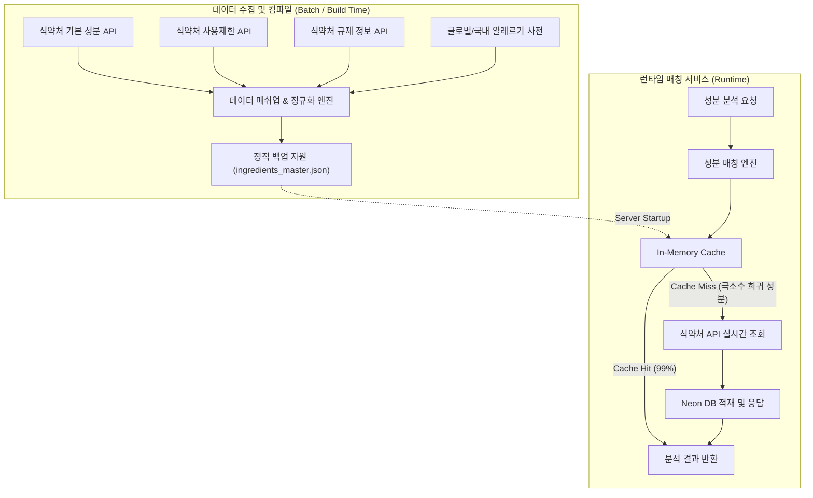

화장품 성분 분석 서비스 PickSafe를 개발하며 서비스 초기 단계에 직면했던 데이터 정밀도 문제와 인프라 리소스 한계를 해결했던 기술적 의사결정을 기록합니다. 

단순히 외부 API를 호출하거나 DB에서 조회하는 일방적인 방식에서 벗어나, 데이터 결합도를 높이고 DB 네트워크 트래픽을 방어하기 위해 적용한 **"식약처 3대 API 매쉬업 및 로컬 퍼스트(Local-First) 캐싱 아키텍처"**에 대한 회고입니다.

---

## 🎯 마주한 고민과 문제 배경

PickSafe의 핵심 기능은 사용자가 입력하거나 스캔한 화장품 성분 목록을 분석하여 안전성 정보와 규제 사항을 보여주는 것입니다. 개발 초기, 두 가지 명확한 문제에 직면했습니다.

### 1. 단일 데이터 원천의 정보 부족
식약처의 기본 성분 정보 API(`원료성분정보`)만으로는 성분의 공식 표준 명칭만 식별할 수 있을 뿐, 해당 성분의 **배합 한도(restriction)**나 **국가별/제도별 규제 세부사항(regulation)**을 알 수 없었습니다. 사용자에게 실질적인 유해성 경고나 배합 한도 주의 메시지를 전달하기 위해서는 서로 분산된 식약처 데이터를 하나로 엮는 작업이 필수적이었습니다.

### 2. 인프라 리소스 한계와 DB 네트워크 병목
초기 인프라 운영 환경으로 채택한 Serverless Postgres(Neon DB)의 무상 티어는 Compute Hours와 네트워크 전송량(Network Transfer)에 명확한 제한이 존재했습니다. 
성분 검색이나 스캔 요청이 발생할 때마다 매번 원격 DB로 쿼리를 날리거나, 수천 건에 달하는 성분 마스터 데이터를 원격 DB에 직접 Bulk Insert/Select 하는 구조는 금방 네트워크 용량 한계에 도달할 위험이 컸습니다. 인프라 비용 단계를 무작정 올리기보다 아키텍처 수준에서 DB 호출 빈도를 극적으로 줄일 방안이 필요했습니다.

---

## ⚖️ 기술적 대안 비교 및 선택 이유

문제를 해결하기 위해 세 가지 아키텍처 대안을 놓고 고민했습니다.

| 항목 | 대안 A: 원격 DB 중심 실시간 쿼리 | 대안 B: 실시간 외부 API 프록시 | 선택: 로컬 퍼스트 정적 캐시 + 매쉬업 시딩 |
| :--- | :--- | :--- | :--- |
| **처리 방식** | 모든 성분 데이터를 DB에 적재 후 SQL 조회 | 요청 시마다 식약처 API를 실시간 호출 | 빌드/배치 시점에 3대 API를 정적 파일로 컴파일 후 메모리 선조회 |
| **장점** | SQL 기반의 복잡한 조건 검색 유연함 | DB 저장 공간 절약 및 항상 최신 데이터 유지 | **DB 네트워크 전송량 99% 이상 절감**, DB 장애 시도 가동 가능 |
| **단점** | DB 네트워크 쿼터 소진 및 커넥션 부하 | 외부 API Latency 및 Rate Limit에 종속됨 | 정적 데이터 업데이트를 위한 배치 재조합 필요 |
| **결정** | 탈락 (인프라 한계) | 탈락 (응답 속도 및 안정성 저해) | **최종 채택** |

### 정적 JSON 백업과 메모리 캐싱의 선택
결과적으로 **"로컬 퍼스트 정적 캐싱"** 전략을 채택했습니다. 
식약처의 3대 API 데이터(성분 기본 정보, 사용 제한 원료 정보, 규제 정보)를 수집하여 빌드 및 데이터 생성 단계에서 사전 조인(Join)을 거친 후, 이를 애플리케이션 내 정적 JSON 파일(`ingredients_master.json`) 형태로 컴파일하도록 구성했습니다.

서버가 가동될 때 이 파일은 메모리에 캐싱되며, 성분 매칭 엔진은 1차적으로 원격 DB가 아닌 메모리 캐시를 대조합니다. 이 구조를 통해 원격 DB 호출 횟수를 실질적으로 0에 가깝게 줄일 수 있었습니다.

---

## 🏗️ 시스템 아키텍처 및 흐름

수립한 아키텍처의 핵심 데이터 흐름은 다음과 같습니다. 데이터 수집 단계에서 식약처 3대 API와 글로벌 향료 알레르기 표준 사전을 하이브리드로 결합한 뒤 정적 자원화하고, 조회 시에는 로컬 캐시를 최우선으로 탐색합니다.



---

## 💻 핵심 구현 및 트러블슈팅

### 1. 데이터 파이프라인 매쉬업 및 알레르기 표준 결합
배치 작업 시 3개 API의 데이터를 병합하면서 단순 이름 대조뿐만 아니라 배합 한도 세부 조건(`restriction_info`), 규제 설명(`regulation_info`)을 매핑했습니다. 또한 EU CosIng 및 국내 고시 규격을 기반으로 한 표준 알레르기 성분 목록을 대조하여 알레르기 유발 유무 플래그를 자동으로 부여했습니다.

### 2. 로컬 퍼스트 매칭 및 Fallback 처리
실제 백엔드 매칭 로직에서는 DB 트랜잭션을 최소화하기 위해 메모리에 상주하는 사전 구조를 우선 탐색하도록 구현했습니다. 

아래 코드는 개인 인프라 환경에 맞춰 핵심 원리를 단순화하여 재구성한 예시 코드입니다.

```python
# app/services/ingredient_matcher.py (개념적 축약 코드)

import json
from typing import Dict, Any, Optional

class LocalFirstIngredientMatcher:
    def __init__(self, static_json_path: str):
        # 서버 기동 시 정적 JSON 자원을 메모리에 로드
        self._memory_cache: Dict[str, Dict[str, Any]] = self._load_static_dictionary(static_json_path)

    def _load_static_dictionary(self, path: str) -> Dict[str, Dict[str, Any]]:
        try:
            with open(path, "r", encoding="utf-8") as f:
                data = json.load(f)
                # 빠르게 키 탐색이 가능하도록 정규화된 성분명을 Key로 인덱싱
                return {item["name_normalized"]: item for item in data}
        except FileNotFoundError:
            return {}

    async def match_ingredient(self, raw_name: str) -> Dict[str, Any]:
        normalized_key = raw_name.strip().replace(" ", "").lower()

        # 1. In-Memory 정적 캐시 최우선 조회 (DB/네트워크 비용 0)
        if normalized_key in self._memory_cache:
            matched_data = self._memory_cache[normalized_key]
            return {
                "status": "matched",
                "source": "local_cache",
                "data": matched_data
            }

        # 2. 캐시 미스 시 실시간 외부 API Fallback (희귀 신규 성분 처리)
        fallback_result = await self._fetch_from_external_api(raw_name)
        if fallback_result:
            # 외부 API에서 가져온 경우에만 DB 적재 등 후속 처리 수행
            await self._save_to_db_async(fallback_result)
            return {
                "status": "matched",
                "source": "external_api",
                "data": fallback_result
            }

        # 3. 데이터가 존재하지 않는 경우 가짜(Mock) 데이터를 임의 생성하지 않음
        return {
            "status": "unmatched",
            "source": None,
            "data": None
        }

    async def _fetch_from_external_api(self, raw_name: str) -> Optional[Dict[str, Any]]:
        # 외부 API 호출 추상화 메서드
        pass

    async def _save_to_db_async(self, data: Dict[str, Any]) -> None:
        # DB 저장 추상화 메서드
        pass
```

### 3. Mock 데이터 전면 배제 원칙
분석 서비스의 데이터 신뢰성을 지키기 위해, API 응답이 없거나 매칭에 실패한 성분에 대해 임의의 임시/가짜(Mock) 데이터를 채워 넣는 방식을 전면 배제했습니다. 매칭되지 않는 성분은 솔직하게 `unmatched` 상태로 리턴하고 UI 상에서 식별 불가로 명확히 가시화하도록 설계하여 신뢰도를 유지했습니다.

---

## 💡 돌아보며 배운 점

### 1. 무료/제한적 인프라 환경에서의 설계 훈련
제한된 인프라 리소스(Neon DB 전송량 한계)는 처음에 기술적 제약으로 다가왔지만, 결과적으로 더 효율적인 캐싱 아키텍처를 고민하게 만든 계기가 되었습니다. **"모든 데이터를 굳이 DB에 올려서 읽어야 하는가?"**라는 근본적인 질문을 던짐으로써, 읽기 중심의 정적 마스터 데이터는 정적 파일과 메모리 캐싱이 훨씬 뛰어난 성능과 안정성을 제공한다는 점을 재확인했습니다.

### 2. 데이터 가공 단계(Build/Batch)의 중요성
런타임에 복잡한 식약처 3대 API를 조인하고 계산하는 것은 서비스 응답 시간을 느리게 만드는 원인이 됩니다. 데이터 빌드 타임에 미리 정규화하고 통합된 사전으로 컴파일해 두는 로컬 퍼스트 전략 덕분에, 런타임 매칭 속도를 대폭 끌어올릴 수 있었습니다. 또한 DB가 잠시 네트워크 장애로 오프라인 상태가 되어도 서비스의 핵심 기능인 성분 분석은 상시 정상 가동되는 부수적인 내구성(Resilience)도 얻었습니다.

### 추후 개선 과제
현재 구조는 서비스 가동 시 정적 JSON을 통째로 메모리에 로드하는 방식입니다. 향후 성분 마스터 데이터가 수십만 건 단위로 계속 확장된다면 메모리 점유율을 효율적으로 유지하기 위해 로컬 SQLite 엠베디드 DB 도입이나 Bloom Filter를 활용한 캐시 미스 사전 검증 구조를 검토할 수 있을 것입니다. 

주어진 리소스 제약 안에서 서비스의 본질(안정적이고 빠른 데이터 제공)을 지켜낸 가치 있는 아키텍처 개선 경험이었습니다.