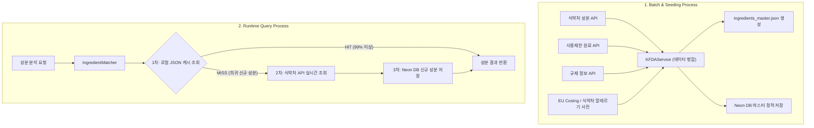

화장품 성분 분석 서비스 **PickSafe**를 개발하면서 데이터의 정확도를 높이는 작업과 함께 인프라 비용 및 안정성 측면에서 예상치 못한 병목을 마주했습니다. 

공공데이터를 활용해 정확한 성분 안전 정보를 제공해야 했지만, 단순 API 단일 조회 방식이나 매번 원격 데이터베이스에 의존하는 방식으로는 서버리스 DB의 제한된 리소스를 금방 소모할 위험이 있었습니다. 이번 글에서는 식약처 3대 오픈 API를 매쉬업(Mashup)하여 데이터를 다원화하고, **로컬 퍼스트(Local-First) 정적 캐싱 아키텍처**를 적용해 DB 트래픽을 99% 이상 절감한 과정과 엔지니어링 고민을 담담히 기록해 봅니다.

---

## 🎯 마주한 고민과 문제 배경

### 1. 단일 공공 API의 정보 한계
초기 설계에서는 식약처의 `원료성분정보` 단일 API(`getIngredientInfoList`)만 조회했습니다. 그러나 해당 데이터셋은 성분의 표준 명칭과 기초 정보만 제공할 뿐, 사용자의 실제 안전 판단에 필요한 **배합 제한 한도(예: "함량 0.1% 이하")** 및 **국가별 규제 정보**가 빠져 있었습니다. 서비스 관점에서 정보의 깊이가 부족하다는 문제가 있었습니다.

### 2. 서버리스 DB(Neon DB)의 리소스 한계
PickSafe의 영속성 저장소로는 서버리스 PostgreSQL인 **Neon DB**를 사용하고 있습니다. Neon DB의 무료 티어는 Compute Hours 및 월 5GB의 Network Transfer(Egress) 제한을 가지고 있습니다.

성분 분석 요청이 들어올 때마다 원격 DB에 직접 SQL 쿼리를 날리거나, 수천 건의 성분 데이터를 초기 배치 시점에 대량으로 Direct Insert/Update(Bulk Seeding)를 시도하면 네트워크 사용량이 급증해 서비스 정지 리스크에 직면하게 됩니다. 인프라 비용을 최소화하면서도 고가용성을 유지할 수 있는 데이터 조회 구조가 절실했습니다.

---

## ⚖️ 기술적 대안 비교 및 선택 이유

문제를 해결하기 위해 생각했던 세 가지 아키텍처 대안을 비교했습니다.

| 대안 | 장점 | 단점 | 선택 여부 |
| :--- | :--- | :--- | :---: |
| **대안 A: 매 요청 시 외부 API 실시간 호출** | DB 저장 공간이 필요 없고 최신 데이터를 유지함 | 식약처 API의 응답 속도 지연(인프라 불안정) 및 API 일일 호출 제한 초과 위험 | ❌ 미선택 |
| **대안 B: Redis 기반 중앙 캐시 레이어 구성** | 빠른 읽기 성능 제공 및 DB 직접 호출 절감 | 별도의 메모리 DB 인프라 관리 부담 및 비용 발생 | ❌ 미선택 |
| **대안 C: 정적 JSON 컴파일 & 로컬 메모리 캐시 (Local-First)** | DB 호출 99% 절감, 인프라 비용 $0, DB 장애 시에도 성분 분석 제공 가능 | 빌드/시딩 시점에 로컬 JSON 파일 생성 과정 필요 | **✅ 최종 선택** |

결과적으로 **대안 C(Local-First 정적 캐시 아키텍처)**를 선택했습니다. 

배치 시점에 식약처의 3개 API 데이터를 하나로 합쳐 `app/resources/ingredients_master.json` 정적 백업 파일로 디스크에 사전 컴파일해 둡니다. 백엔드 애플리케이션은 서버 시작 시 이 정적 JSON을 메모리에 캐싱하여 1차적으로 성분을 대조합니다. DB 통신을 거의 거치지 않으므로 Neon DB의 네트워크 및 Compute 사용량을 획기적으로 방어할 수 있었습니다.

---

## 🏗️ 시스템 아키텍처 및 흐름

시드 배치 타임에 3대 API와 알레르기 사전을 매쉬업하여 JSON과 DB에 반영하고, 런타임에는 로컬 캐시를 최우선으로 조회하는 흐름을 구성했습니다.



---

## 💻 핵심 구현 및 트러블슈팅

### 1. 식약처 3대 API 매쉬업 및 데이터 파싱
단순한 이름 기반 결합이 아니라, 식약처 공통 코드 및 성분 표준명을 기준 키(Key)로 활용해 3개의 파이프라인 데이터(`getIngredientInfoList`, `getRegisterIngredientRestrictionInfoList`, `getRegisterIngredientRegulationInfoList`)를 병합했습니다. 

가짜(Mock) 데이터를 섞을 경우 분석 신뢰도가 떨어지므로, 정보가 존재하지 않는 필드는 순수하게 `None`으로 처리하고 유효한 성분만 `unmatched` 상태로 구분하도록 로직을 정제했습니다.

```python
# web/backend/app/services/kfda_service.py 일부분

class KFDAService:
    """식약처 3대 API 데이터를 매쉬업하여 단일 성분 개체로 병합"""
    
    def fetch_combined_ingredients(self) -> List[dict]:
        base_ingredients = self._fetch_ingredient_info_list()
        restrictions = self._fetch_restriction_info_list()
        regulations = self._fetch_regulation_info_list()

        # 성분명을 키로 하는 매핑 디렉터리 구성
        restriction_map = {item['INGR_NAME']: item.get('RESTRICTION_CONTENT') for item in restrictions if 'INGR_NAME' in item}
        regulation_map = {item['INGR_NAME']: item.get('REGULATION_CONTENT') for item in regulations if 'INGR_NAME' in item}

        combined_data = []
        for ingr in base_ingredients:
            name = ingr.get('INGR_NAME')
            
            # 3개 데이터 세트 병합 및 알레르기 고시 성분 여부 매핑
            combined_item = {
                "ingredient_code": ingr.get('INGR_CODE'),
                "name_ko": name,
                "restriction_info": restriction_map.get(name),
                "regulation_info": regulation_map.get(name),
                "is_allergen_standard": self._check_allergen_standard(name)
            }
            combined_data.append(combined_item)
            
        return combined_data
```

### 2. 메모리 최우선 매처(Ingredient Matcher) 구현
백엔드 로딩 시 `ingredients_master.json` 파일에서 성분 사전을 메모리로 불러와 Python `dict` 구조로 바인딩합니다. 성분 조회 시 O(1) 시간 복잡도로 빠르게 대조됩니다.

```python
# web/backend/app/services/ingredient_matcher.py 일부분

import json
from pathlib import Path
from typing import Optional, Dict, Any

class IngredientMatcher:
    def __init__(self, json_path: Path):
        self._cache: Dict[str, Dict[str, Any]] = {}
        self._load_static_cache(json_path)

    def _load_static_cache(self, json_path: Path) -> None:
        if json_path.exists():
            with open(json_path, "r", encoding="utf-8") as f:
                data = json.load(f)
                # 표준 성분명을 키로 매핑 캐싱
                self._cache = {item["name_ko"]: item for item in data}

    def match_ingredient(self, name_ko: str) -> Optional[Dict[str, Any]]:
        # 1차: 메모리 내 정적 캐시 우선 검색
        if name_ko in self._cache:
            return self._cache[name_ko]
        
        # 2차: 로컬에 없는 성분은 None 반환 (이후 서비스 레이어에서 API 실시간 조회 파이프라인 수행)
        return None
```

### 🐛 트러블슈팅: 공공 API 데이터 키 부재로 인한 파싱 예외 처리
식약처 API 응답값 중 일부 응답 객체에서 특정 키(`INGR_NAME`, `RESTRICTION_CONTENT` 등) 자체가 누락되거나 null로 내려오면서 데이터 병합 과정에서 `KeyError` 및 빈 필드 오염 문제가 발생했습니다.

*   **원인 분석:** 공공데이터 제공 기관의 내부 DB 업데이트 과정에서 특정 항목 데이터 포맷이 불규칙하게 반환됨.
*   **해결 방법:** API 응답 파싱 시 딕셔너리 접근 방식을 직렬화하여 `.get()` 메소드로 기본값을 안전하게 추상화했습니다. 또한, 공백이나 특수문자 전처리를 적용한 정규화 함수(`normalize_name`)를 거치도록 고도화하여 결합 정확도를 확보했습니다.

---

## 💡 돌아보며 배운 점 (회고)

이번 개편 작업은 성분 데이터의 정보 수준을 한 단계 끌어올림과 동시에, 서버리스 인프라의 물리적 제약 요소를 아키텍처 설계를 통해 극복해 본 경험이었습니다.

1. **무조건적인 DB 의존성 피하기**  
   자주 변경되지 않는 도메인 마스터 데이터(성분 표준 사전 등)는 매번 RDBMS를 거칠 필요가 없습니다. 정적 JSON 파일을 로컬 퍼스트 캐시로 활용함으로써, Neon DB에 대한 읽기 쿼리 및 트래픽 소모를 99% 이상 줄일 수 있었습니다. DB 서버가 순간 오프라인이 되어도 유저의 성분 분석 기능은 멈추지 않는 유연함도 얻었습니다.
2. **트레이드오프(Trade-off)의 인식**  
   로컬 정적 데이터 방식을 도입하면서 애플리케이션의 번들 용량이 다소 늘어나고, 주기적인 성분 업데이트를 위해 시딩 배치를 수행해야 하는 번거로움이 생겼습니다. 그러나 운용 비용 절감과 서비스 안정성 향상이라는 실익이 훨씬 컸기에 타당한 선택이었다고 판단합니다.

### 추후 보완 과제
현재는 로컬 시드 파이프라인을 수동 및 주기적 스크립트로 실행하고 있습니다. 향후에는 식약처 API의 변경 사항을 매주 추적하여 `ingredients_master.json` 파일을 자동으로 업데이트하고 PR을 생성하는 **GitHub Actions 기반 자동화 데이터 파이프라인**으로 확장해볼 계획입니다.