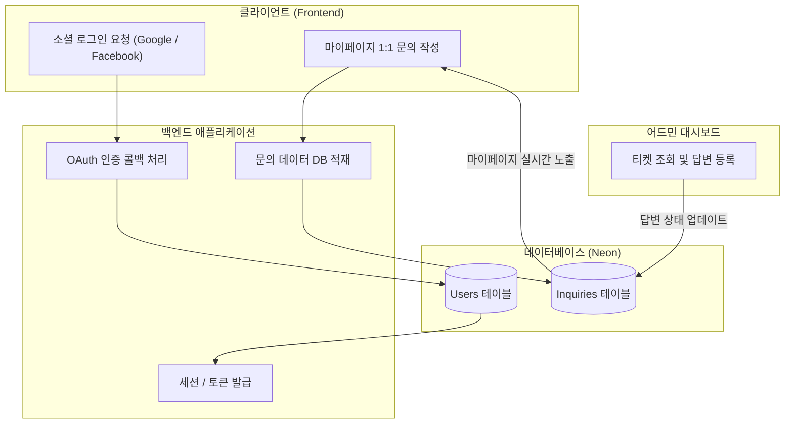

## 🎯 마주한 고민과 문제 배경

화장품 성분 분석 서비스 PickSafe를 개발하고 초기 운영 환경을 구성하면서, 제한된 리소스 환경 속에서 시스템의 복잡도를 높이는 불필요한 인프라 요소들을 마주하게 되었습니다. 

특히 초기 검증 단계에서 가장 큰 마찰을 일으킨 부분은 **이메일 인증 및 발송 인프라**였습니다. 
1. **외부 API 제약**: 이메일 전송을 위해 외부 서드파티 서비스를 연동하는 과정에서 샌드박스 환경의 한계, 도메인 소유권 인증 등의 부가적인 설정 공수가 발생했습니다. 가벼운 MVP 구조에서 이러한 외부 의존성은 사소하지만 운영을 번거롭게 만드는 요인이었습니다.
2. **비회원 문의의 구조적 한계**: 비회원 상태에서 접수되는 문의는 추후 답변을 전달할 신뢰성 있는 채널(이메일 등)이 확보되지 않으면 피드백 품질이 떨어질 수밖에 없고, 잘못된 연락처 입력 시 대응이 불가능하다는 문제가 있었습니다.

결과적으로 "정말 지금 이 인프라와 기능이 필수적인가?"라는 질문을 던지게 되었고, 핵심 기능에 집중하기 위해 과감한 구조 개편을 결정했습니다.

---

## ⚖️ 기술적 대안 비교 및 선택 이유

인프라의 복잡도를 낮추고 유지보수 비용을 최소화하기 위해 몇 가지 대안을 검토하고 트레이드오프를 분석했습니다.

| 비교 항목 | 기존 방식 (이메일 및 범용 가입) | 검토된 대안 | 최종 선택 방식 |
| :--- | :--- | :--- | :--- |
| **인증 방식** | 자체 이메일 가입 + 비밀번호 + 이메일 인증 | 다양한 소셜 로그인 연동 | **Google/Facebook 소셜 로그인 단일화** |
| **문의/응대** | 문의 접수 시 이메일 발송 및 외부 메일함 회신 | 슬웹훅 연동 또는 실시간 채팅 솔루션 | **DB 기반 1:1 티켓형 문의 시스템 (인앱 관리)** |
| **인프라 비용/관리** | 메일 서버 설정, 도메인 인증, API 할당량 관리 필요 | 외부 SaaS 유료 플랜 구독 | **추가 비용 제로 (DB 내에서 데이터 완결)** |

### 1. 소셜 로그인 단일화
자체 회원가입 로직과 비밀번호 찾기, 이메일 인증 토큰 검증 플로우는 구현 및 관리 측면에서 지속적인 유지보수 비용을 발생시킵니다. 인증 책임을 외부 인증 제공자(Google, Facebook)에 위임함으로써 보안 리스크를 줄이고, 사용자의 가입 진입 장벽을 낮추기로 했습니다.

### 2. 인앱 1:1 티켓형 문의 시스템
외부 이메일 발송 서비스에 의존하는 대신, 데이터베이스 내에 문의(`inquiries`) 테이블을 두고 사용자가 마이페이지에서 직접 내역을 확인하는 구조를 택했습니다. 
- 관리자는 어드민 대시보드에서 직접 답변을 등록합니다.
- 사용자는 별도의 메일함을 확인할 필요 없이 서비스 내에서 대화식으로 추가 질문을 주고받을 수 있습니다.
- 인프라 비용이 전혀 발생하지 않으며, 데이터가 서비스 내에 온전히 머물러 무중단 운영 측면에서 가장 안정적인 대안이 되었습니다.

---

## 🏗️ 시스템 아키텍처 및 흐름

개편된 인증 및 1:1 문의 처리의 데이터 흐름은 외부 메일 서버를 거치지 않고 내부 데이터베이스 내에서 완결되도록 설계되었습니다.



---

## 💻 핵심 구현 및 트러블슈팅

이번 개편의 핵심은 **불필요한 레거시 코드와 인프라 의존성을 안전하게 도려내는 것**이었습니다.

### 1. 이메일 서비스 모듈 제거 및 라우터 정리
기존에 구현되어 있던 이메일 발송 관련 로직과 템플릿을 정리했습니다.

```python
# web/backend/app/services/email_service.py
# [제거됨] 외부 메일 전송 API 호출 및 템플릿 렌더링 로직
# 더 이상 외부 메일 서비스 클라이언트를 초기화하지 않습니다.
```

인증 라우터(`auth.py`)에서도 이메일 가입 관련 엔드포인트를 제거하고, 소셜 로그인 콜백 및 세션 관리 로직만 남겨 가독성과 유지보수성을 높였습니다. 비회원 문의 경로 역시 차단하여, 마이페이지 접근 시 로그인 상태를 강제하도록 가드(Guard)를 적용했습니다.

### 2. 1:1 티켓형 문의 API 구조
마이페이지와 어드민 간의 효율적인 상태 관리를 위해, 문의 데이터를 단일 티켓 형태로 묶어 관리하도록 백엔드 엔드포인트를 정비했습니다.

```python
# web/backend/app/routers/mypage.py (개념적 예시)
@router.get("/inquiries")
def get_user_inquiries(current_user: User = Depends(get_current_active_user), db: Session = Depends(get_db)):
    """로그인된 사용자의 1:1 문의 티켓 목록 조회"""
    inquiries = db.query(Inquiry).filter(Inquiry.user_id == current_user.id).all()
    return {"status": "success", "data": inquiries}
```

관리자 역시 별도의 메일 발송 프로그램 없이 어드민 대시보드에서 동일한 데이터 모델에 접근하여 답변 상태를 `PENDING`에서 `ANSWERED`로 갱신하도록 구현하여, CS 처리 과정을 서비스 내로 완전히 통합했습니다.

---

## 💡 돌아보며 배운 점 (회고)

이번 개편을 통해 얻은 가장 큰 교훈은 **"초기 단계일수록 불필요한 외부 의존성을 과감히 제거해야 한다"**는 점이었습니다.

- **인프라 단순화의 가치**: 굳이 필수가 아닌 기능(이메일 발송, 비회원 접수 등)을 걷어냄으로써, 배포 및 운영 과정에서 발생할 수 있는 잠재적 실패 지점(Single Point of Failure)을 사전에 차단할 수 있었습니다.
- **경험의 일원화**: 고객과의 소통 채널을 외부 메일이 아닌 서비스 내 마이페이지(1:1 티켓)로 일원화함으로써, 개발뿐만 아니라 실제 운영 관점에서도 데이터 누락 없이 깔끔하게 CS를 추적할 수 있는 기반을 마련했습니다.

앞으로도 서비스의 규모와 실제 운영 피드백에 맞춰, 아키텍처의 복잡도를 낮추면서도 본질적인 가치에 집중하는 방향으로 시스템을 다듬어 나갈 계획입니다.