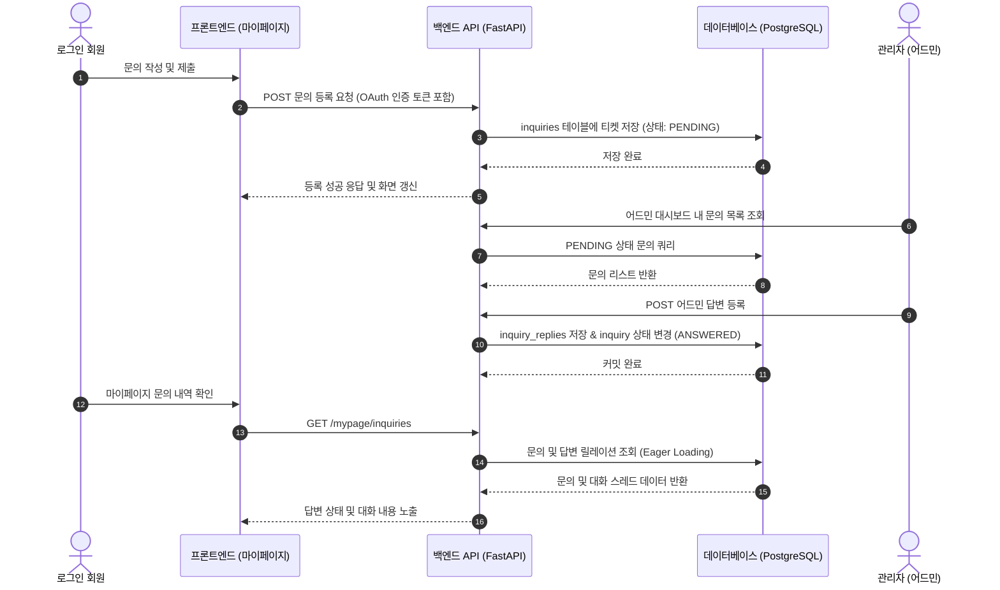

화장품 성분 분석 서비스 PickSafe를 개발하며 초기 MVP 단계에서 가장 큰 걸림돌 중 하나는 **외부 이메일 발송 인프라 구축과 운영 마찰**이었습니다. 

자체 회원가입 프로세스에서 필수적인 이메일 인증 메일 발송과, 서비스 문의 접수 및 답변 전달 과정에서 발생하는 이메일 연동 이슈는 개발 리소스 대비 불필요한 운영 복잡도를 증가시켰습니다. 이를 해결하기 위해 이메일 인프라 의존성을 완전히 제거하고, 소셜 로그인 단일화 및 DB 기반 1:1 대화식 문의 시스템으로 아키텍처를 개편한 과정과 기술적 고민을 정리했습니다.

---

## 🎯 마주한 고민과 문제 배경

초기 PickSafe 서비스는 일반적인 서비스들과 동일하게 자체 이메일/비밀번호 가입(`auth/signup`) 및 이메일 인증(`auth/verify-email`) 방식을 제공하는 방향으로 설계되었습니다. 그러나 제한된 인프라 리소스 환경에서 이를 실제로 구현하고 검증하는 과정에서 몇 가지 명확한 한계에 부딪혔습니다.

1. **이메일 발송 인프라의 마찰 (Sandbox 및 도메인 소유권 제약)**
   - 외부 이메일 API 서비스(Resend 등)를 연동하는 과정에서 발송 도메인 인증, API 샌드박스 한계, 메일 도달률 저하 등의 문제가 발생했습니다.
   - 메일 발송 로직(`email_service.py`)의 비동기 처리 실패 시 유저 회원가입 흐름 전체가 차단되는 결함 유발 가능성이 존재했습니다.

2. **비회원 문의 접수의 신뢰성 부족 및 스팸 위험**
   - 비회원(게스트) 문의 작성 기능은 문의자의 이메일 주소 유효성을 보장하기 어렵습니다.
   - 잘못된 이메일 주소로 인한 답변 전송 실패, 비회원 대상의 무차별 스팸성 데이터 유입 시 DB 제어 및 사용자 식별이 불가능한 한계가 드러났습니다.

3. **운영 복잡도 증가**
   - 문의 접수 시 관리자에게 이메일을 발송하고, 관리자가 이메일로 답변을 보낸 뒤 이를 다시 DB에 동기화하는 구조는 외부 네트워크 상태에 지나치게 의존적이었습니다.

이러한 문제를 해결하기 위해 **"외부 메일 발송 인프라를 완전히 삭제하고, 서비스 내부 DB 기반의 수명주기를 가지도록 시스템을 단순화한다"**는 방향으로 결정을 내렸습니다.

---

## ⚖️ 기술적 대안 비교 및 선택 이유

서비스 내부 문의 시스템과 인증 체계를 개편하기 위해 아래 3가지 대안을 비교 검토했습니다.

| 비교 항목 | 대안 1: 외부 메일 API 유지 및 도메인 연동 | 대안 2: 외부 챗봇/문의 위젯 도입 | 대안 3: OAuth 단일화 + DB 기반 1:1 티켓 시스템 (최종 선택) |
| :--- | :--- | :--- | :--- |
| **운영 비용** | 도메인 및 API 요금제 관리 필요 | 외부 솔루션 요금제 제약 | **추가 인프라 비용 0원** (기존 DB 활용) |
| **인프라 의존성** | 외부 SMTP/Mail API 헬스체크 필수 | 외부 JS SDK 및 서드파티 스크립트 의존 | **내부 RDBMS(PostgreSQL) 및 API로 완결** |
| **유저 식별성** | 비회원 및 이메일 인증 미완료 유저 혼재 | 서비스 회원 데이터와의 식별 결합 복잡 | **OAuth(Google, Facebook) 검증 유저로 단일화** |
| **운영 안정성** | 발송 실패/스팸함 이동 등의 트러블슈팅 필요 | 외부 서비스 장애 시 문의 유실 | **트랜잭션 기반으로 답변 누적 및 무중단 제공** |

### 최종 선택 이유

대안 3을 선택함으로써 얻는 이점이 분명했습니다.
* **OAuth 단일화:** 이메일/비밀번호 저장 및 별도 이메일 인증 절차를 폐기하고, Google 및 Facebook OAuth를 통한 신뢰성 높은 유저 정보만 활용하도록 변경했습니다.
* **인프라 종속성 제거:** `email_service.py` 연동 코드를 완전히 비활성화/삭제하여 메일 발송 실패로 인한 예외 처리를 고려할 필요가 없어졌습니다.
* **1:1 대화식 문의(티켓형) 관리:** 회원 마이페이지 내에서 문의 작성 내용과 어드민 답변 상태를 1:1 대화 쓰레드 형태로 관리하도록 데이터베이스 릴레이션을 재설계했습니다.

---

## 🏗️ 시스템 아키텍처 및 흐름

개편된 1:1 문의 및 어드민 연동 시스템의 데이터 흐름은 다음과 같습니다. 외부 이메일 인프라를 경유하지 않고, 내부 데이터베이스 트랜잭션을 통해 문의 및 답변이 즉시 처리됩니다.



---

## 💻 핵심 구현 및 트러블슈팅

### 1. 사용하지 않는 이메일 가입 및 발송 로직 정리

기존 이메일 회원가입 라우트와 HTML 템플릿(`signup.html`)을 전면 비활성화하고, OAuth 인증 기반으로 단일화했습니다.

```python
# web/backend/app/routers/auth.py (개편 후 구조)
from fastapi import APIRouter, Depends, HTTPException, status
from sqlalchemy.orm import Session

router = APIRouter(prefix="/auth", tags=["Auth"])

# 기존 /signup 및 /verify-email 엔드포인트 전면 제거
# OAuth 인증 후 콜백 처리 엔드포인트만 유지

@router.get("/callback/google")
async def google_callback(code: str, db: Session = Depends(get_db)):
    # OAuth 인가 코드를 통한 유저 검증 및 세션/토큰 처리
    user = await process_oauth_login(provider="google", code=code, db=db)
    return create_access_token_response(user)
```

### 2. 1:1 대화식 문의 데이터 모델 설계

문의(`Inquiry`)와 어드민 답변(`InquiryReply`)을 1:N 관계 구조로 설계하여 대화 스레드 형태로 확장할 수 있게 구성했습니다.

```python
# web/backend/app/models/inquiry.py
from sqlalchemy import Column, String, Text, ForeignKey, DateTime, Enum
from sqlalchemy.orm import relationship
from datetime import datetime
import enum

class InquiryStatus(str, enum.Enum):
    PENDING = "PENDING"
    ANSWERED = "ANSWERED"

class Inquiry(Base):
    __tablename__ = "inquiries"

    id = Column(String(36), primary_key=True, default=generate_uuid)
    user_id = Column(String(36), ForeignKey("users.id"), nullable=False)
    title = Column(String(200), nullable=False)
    content = Column(Text, nullable=False)
    status = Column(Enum(InquiryStatus), default=InquiryStatus.PENDING, nullable=False)
    created_at = Column(DateTime, default=datetime.utcnow)

    replies = relationship("InquiryReply", back_populates="inquiry", cascade="all, delete-orphan")

class InquiryReply(Base):
    __tablename__ = "inquiry_replies"

    id = Column(String(36), primary_key=True, default=generate_uuid)
    inquiry_id = Column(String(36), ForeignKey("inquiries.id"), nullable=False)
    admin_id = Column(String(36), ForeignKey("users.id"), nullable=False)
    content = Column(Text, nullable=False)
    created_at = Column(DateTime, default=datetime.utcnow)

    inquiry = relationship("Inquiry", back_populates="replies")
```

### 3. 트러블슈팅: N+1 쿼리 문제 및 비회원 접근 제어

#### [문제상황]
1. 마이페이지에서 회원 문의 내역을 조회할 때, 각 문의 건별로 답변(`InquiryReply`) 목록을 조회하면서 N+1 데이터베이스 조회 병목이 발생할 가능성이 존재했습니다.
2. 비회원이 직접 API 엔드포인트로 문의 작성을 시도할 경우 예외 처리 구멍이 존재했습니다.

#### [해결 방법]
SQLAlchemy의 `selectinload`를 활용하여 문의 데이터와 답변 데이터를 단 2회의 쿼리로 결합 조회하도록 최적화하였으며, `get_current_user` 의존성을 통해 로그인되지 않은 비회원 접근을 API 레벨에서 차단했습니다.

```python
# web/backend/app/routers/mypage.py
from fastapi import APIRouter, Depends, status
from sqlalchemy.orm import Session, selectinload

router = APIRouter(prefix="/mypage", tags=["MyPage"])

@router.get("/inquiries")
def get_my_inquiries(
    current_user: User = Depends(get_current_active_user), # 비회원 접근 차단
    db: Session = Depends(get_db)
):
    # selectinload를 통한 N+1 쿼리 방지
    inquiries = (
        db.query(Inquiry)
        .filter(Inquiry.user_id == current_user.id)
        .options(selectinload(Inquiry.replies))
        .order_by(Inquiry.created_at.desc())
        .all()
    )
    return inquiries
```

---

## 💡 돌아보며 배운 점 (회고)

이번 개편을 통해 초기 서비스 아키텍처 설계 시 **무조건적인 외부 서비스 도입이 정답이 아님**을 다시 한번 확인했습니다.

1. **외부 인프라 의존성 최소화의 이점**
   - 이메일 발송 모듈을 완전히 덜어냄으로써 테스트 환경 및 프로덕션 배포 시 고려해야 할 시크릿 키 관리, 외부 API 장애 대처, 도메인 인증 절차 등의 연동 비용을 크게 줄일 수 있었습니다.

2. **인프라 제약 속에서의 아키텍처 단순화**
   - 무료 티어/초기 리소스 제약 조건을 변명이 아닌 아키텍처 단순화의 기회로 삼았습니다. 
   - OAuth 단일화와 DB 기반 문의 티켓 시스템 구현은 외부 메일망을 거치는 것보다 더 유효하고 신뢰성 높은 유저 피드백 수집 창구가 되었습니다.

3. **향후 보완 과제**
   - 현재는 유저가 직접 마이페이지에 들어와야 답변 여부를 확인할 수 있는 폴링 형태에 가깝습니다. 
   - 추후 웹 푸시(Web Push) 알림이나 실시간 상태 변경 인디케이터 방식을 도입하여 유저 경험을 보완할 계획입니다.

불필요한 인프라 복잡성을 덜어내고 단단한 내부 데이터 흐름을 갖추는 것이 서비스 초기 운영 안정성을 확보하는 가장 담백하고 본질적인 접근법임을 배웠습니다.