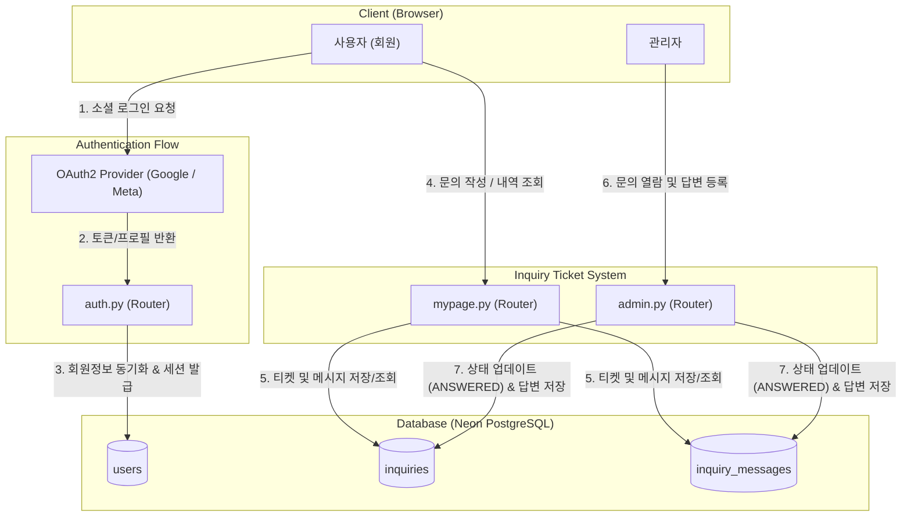
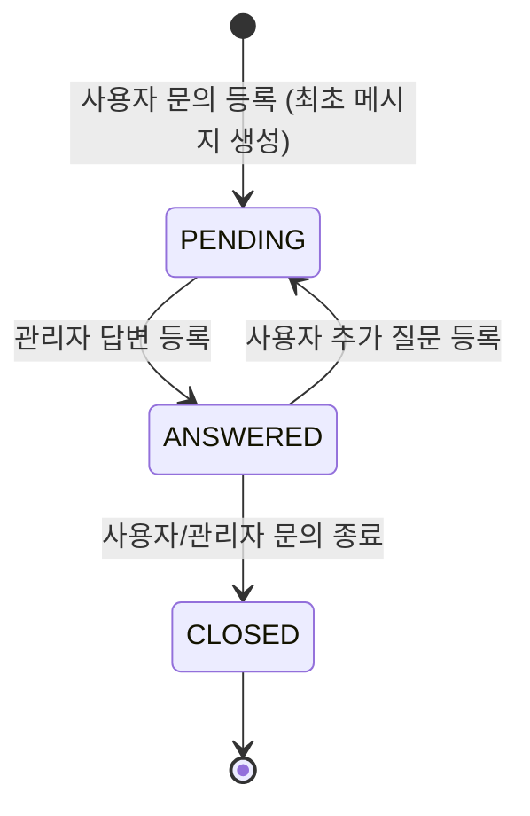

## 🎯 마주한 고민과 문제 배경

PickSafe 서비스를 구축하고 초기 검증을 진행하면서 가장 많은 운영 마찰이 발생한 지점은 예상외로 성분 분석 로직이 아닌 **이메일 발송 인프라**였습니다.

초기 기획에서는 일반적인 웹 서비스의 관례를 따라 자체 이메일 회원가입(`auth/signup`)과 가입 인증 메일 발송(`auth/verify-email`), 그리고 고객 문의 접수 시 관리자 및 사용자에게 메일을 발송하는 구조(`email_service.py`)를 채택했습니다. 메일 발송 엔진으로는 Resend API를 연동해 두었습니다.

그러나 무료 클라우드 인프라(Render, Neon) 환경에서 프로토타입을 배포하고 테스트하는 과정에서 다음과 같은 현실적인 문제들이 드러났습니다.

1. **외부 메일 발송 인프라의 마찰과 제약**
   Resend와 같은 이메일 전송 서비스는 샌드박스 환경에서 발신 도메인 제한이 엄격하며, 실제 수신자에게 안정적으로 메일을 전달하려면 도메인 구매 및 DNS 레코드(SPF, DKIM, DMARC) 설정이 필수적이었습니다. 개발 및 검증 단계에서 메일 전송 실패나 스팸함 분류로 인해 회원가입 인증 흐름이 끊기는 현상이 빈번하게 발생했습니다.
2. **비회원 문의의 피드백 단절**
   비회원(게스트)이 문의를 남길 경우 이메일 외에는 답변을 전달할 신뢰성 있는 수단이 없었습니다. 이메일 발송 인프라가 불안정한 상태에서 비회원 문의를 수집하는 것은 답변 유실로 이어져 오히려 서비스 신뢰도를 떨어뜨렸습니다.
3. **불필요한 유지보수 포인트 증가**
   이메일 템플릿 렌더링, 토큰 만료 처리, SMTP/API 호출 재시도 로직 등 핵심 도메인(화장품 성분 분석)과 무관한 부가 인프라 코드가 백엔드 복잡도를 높이고 있었습니다.

MVP 단계에서 불필요한 외부 의존성을 걷어내고, 서비스 운영 안정성을 확보하기 위한 아키텍처 단순화 작업이 필요했습니다.

---

## ⚖️ 기술적 대안 비교 및 선택 이유

문제를 해결하기 위해 검토한 대안과 각각의 장단점은 다음과 같았습니다.

| 비교 항목 | 대안 1: 커스텀 도메인 구입 및 외부 메일 인프라 고도화 | 대안 2: 자체 SMTP 서버 구축 및 운영 | 대안 3: 이메일 전송 전면 제거, 소셜 로그인 단일화 & DB 티켓 시스템 (선택) |
| :--- | :--- | :--- | :--- |
| **인프라 비용** | 도메인 유지비 및 API 티어 비용 발생 | VPS 및 고정 IP 비용 발생 | **추가 비용 없음 ($0)** |
| **운영 복잡도** | DNS 레코드 관리, 수신 실패 모니터링 필요 | IP 평판 관리, 스팸 차단 우회 등 운영 부담 극심 | **매우 낮음 (RDBMS 트랜잭션으로 완결)** |
| **인증 신뢰성** | 가입 인증 메일 지연/유실 가능성 상존 | 메일 서버 다운타임에 종속 | **OAuth2 제공자(Google, Meta)에 위임하여 높은 신뢰성 확보** |
| **문의/답변 전달력**| 사용자 메일함 필터링에 영향 받음 | 사용자 메일함 필터링에 영향 받음 | **로그인 후 마이페이지 내에서 즉시 확인 가능** |

### 최종 결정
**대안 3**을 선택했습니다.
* **인증 단순화**: 이메일 가입 폼과 토큰 검증 로직을 전면 제거하고, **Google 및 Facebook 소셜 로그인(OAuth2)**으로 인증 체계를 단일화했습니다. 이를 통해 가입 인증 메일 발송 단계 자체가 불필요해졌습니다.
* **문의 시스템 개편**: 외부 메일 발송에 의존하던 고객 지원 방식을 데이터베이스 기반의 **1:1 대화식 티켓 시스템**으로 전환했습니다. 회원이 마이페이지에서 문의를 남기면, 관리자가 어드민 대시보드에서 직접 답변을 달고 이를 서비스 내에서 즉각 조회하는 구조입니다.
* **게스트 접근 제한**: 비회원 문의는 MVP 범위에서 제외하고, 로그인한 사용자만 문의를 작성할 수 있도록 강제하여 피드백 루프를 확실히 보장했습니다.

---

## 🏗️ 시스템 아키텍처 및 흐름

개편 후 전체 시스템에서 이메일 발송 계층이 완전히 제거되었으며, 모든 인증과 고객 응대 흐름이 데이터베이스 트랜잭션 내부로 편입되었습니다.



### 문의-답변 상태 전이 흐름



---

## 💻 핵심 구현 및 트러블슈팅

### 1. 1:1 대화식 티켓 데이터 모델링
문의와 답변이 단발성으로 끝나지 않고 대화 형태로 이어질 수 있도록, 문의의 메타 정보를 담는 `Inquiry` 모델과 실제 주고받은 메시지를 담는 `InquiryMessage` 모델로 분리했습니다.

```python
# web/backend/app/models/inquiry.py
import enum
from datetime import datetime
from sqlalchemy import Column, Integer, String, Text, ForeignKey, DateTime, Enum
from sqlalchemy.orm import relationship
from app.database import Base

class InquiryStatus(str, enum.Enum):
    PENDING = "PENDING"        # 답변 대기
    ANSWERED = "ANSWERED"      # 답변 완료
    CLOSED = "CLOSED"          # 문의 종료

class Inquiry(Base):
    __tablename__ = "inquiries"

    id = Column(Integer, primary_key=True, index=True)
    user_id = Column(Integer, ForeignKey("users.id", ondelete="CASCADE"), nullable=False)
    title = Column(String(200), nullable=False)
    status = Column(Enum(InquiryStatus), default=InquiryStatus.PENDING, nullable=False)
    created_at = Column(DateTime, default=datetime.utcnow, nullable=False)
    updated_at = Column(DateTime, default=datetime.utcnow, onupdate=datetime.utcnow, nullable=False)

    # Relationships
    user = relationship("User", back_populates="inquiries")
    messages = relationship("InquiryMessage", back_populates="inquiry", cascade="all, delete-orphan", order_by="InquiryMessage.created_at")

class InquiryMessage(Base):
    __tablename__ = "inquiry_messages"

    id = Column(Integer, primary_key=True, index=True)
    inquiry_id = Column(Integer, ForeignKey("inquiries.id", ondelete="CASCADE"), nullable=False)
    sender_id = Column(Integer, ForeignKey("users.id"), nullable=False) # 작성자 (회원 또는 관리자)
    is_admin = Column(Boolean, default=False, nullable=False)
    content = Column(Text, nullable=False)
    created_at = Column(DateTime, default=datetime.utcnow, nullable=False)

    inquiry = relationship("Inquiry", back_populates="messages")
    sender = relationship("User")
```

### 2. 게스트 차단 및 티켓 생성 라우터 구현
로그인 세션이 확인된 사용자만 문의를 등록할 수 있도록 의존성을 주입하고, 티켓 생성과 첫 메시지 저장을 단일 트랜잭션으로 처리했습니다.

```python
# web/backend/app/routers/mypage.py
from fastapi import APIRouter, Depends, HTTPException, status
from sqlalchemy.orm import Session
from app.database import get_db
from app.dependencies import get_current_user
from app.models.user import User
from app.models.inquiry import Inquiry, InquiryMessage, InquiryStatus
from pydantic import BaseModel

router = APIRouter(prefix="/mypage/inquiries", tags=["MyPage - Inquiries"])

class CreateInquiryRequest(BaseModel):
    title: str
    content: str

@router.post("", status_code=status.HTTP_201_CREATED)
def create_inquiry(
    payload: CreateInquiryRequest,
    current_user: User = Depends(get_current_user), # 비회원 접근 시 401 Unauthorized 반환
    db: Session = Depends(get_db)
):
    # 1. Inquiry 티켓 헤더 생성
    inquiry = Inquiry(
        user_id=current_user.id,
        title=payload.title,
        status=InquiryStatus.PENDING
    )
    db.add(inquiry)
    db.flush() # inquiry.id 확보

    # 2. 최초 문의 메시지 등록
    first_message = InquiryMessage(
        inquiry_id=inquiry.id,
        sender_id=current_user.id,
        is_admin=False,
        content=payload.content
    )
    db.add(first_message)
    db.commit()
    db.refresh(inquiry)

    return {"message": "문의가 성공적으로 등록되었습니다.", "inquiry_id": inquiry.id}
```

### 3. 트러블슈팅: N+1 쿼리 문제 및 답변 상태 전이 누락 방지
* **문제점**: 마이페이지에서 문의 목록을 렌더링할 때 각 문의에 달린 최근 메시지와 작성자 정보를 템플릿에서 순회하며 참조하자, 문의 개수($N$)만큼 추가 쿼리가 발생하는 N+1 문제가 발생했습니다. 또한 관리자가 답변을 달았을 때 상위 티켓의 `status`를 `ANSWERED`로 바꾸지 않아 사용자가 답변 완료 여부를 알 수 없는 버그가 있었습니다.
* **해결**:
  1. 조회 쿼리에 `joinedload` 및 `selectinload`를 적용하여 단일/이중 쿼리로 관계 데이터를 선제적으로 가져오도록 수정했습니다.
  2. 관리자 답변 등록 엔드포인트(`admin.py`)에서 메시지 추가와 상태 전이(`InquiryStatus.ANSWERED`) 및 `updated_at` 갱신을 하나의 원자적 트랜잭션으로 묶어 상태 불일치를 해결했습니다.

```python
# web/backend/app/routers/admin.py
@router.post("/inquiries/{inquiry_id}/reply")
def reply_inquiry(
    inquiry_id: int,
    content: str,
    admin_user: User = Depends(get_current_admin_user),
    db: Session = Depends(get_db)
):
    inquiry = db.query(Inquiry).filter(Inquiry.id == inquiry_id).first()
    if not inquiry:
        raise HTTPException(status_code=404, detail="문의를 찾을 수 없습니다.")

    # 답변 메시지 추가
    reply_message = InquiryMessage(
        inquiry_id=inquiry.id,
        sender_id=admin_user.id,
        is_admin=True,
        content=content
    )
    db.add(reply_message)

    # 부모 티켓 상태 갱신
    inquiry.status = InquiryStatus.ANSWERED
    db.commit()

    return {"message": "답변이 등록되었습니다."}
```

---

## 💡 돌아보며 배운 점 (회고)

이번 개편을 진행하며 다음과 같은 점들을 배울 수 있었습니다.

1. **외부 의존성을 제거하는 것이 최고의 장애 예방책이다**
   서비스 초기 단계에서 관성적으로 도입했던 이메일 발송 기능을 걷어내자, 발송 실패 모니터링, 재시도 큐 관리, 도메인 인증 유지보수 등 부차적인 작업들이 한 번에 정리되었습니다. 인프라가 단순해질수록 운영 신뢰도는 오히려 상승했습니다.
2. **도메인 모델의 본질에 집중한 인터페이스 설계**
   이메일 전송 대신 DB 기반의 1:1 티켓 모델을 도입함으로써, 사용자는 본인이 작성한 질문과 과거의 히스토리를 언제든 마이페이지에서 맥락과 함께 다시 확인할 수 있게 되었습니다. 이는 외부 메일함으로 흩어지던 정보를 서비스 내부로 응집시키는 UX 측면의 이점도 가져왔습니다.
3. **추후 개선 과제**
   현재 구조는 사용자가 마이페이지에 들어와야만 답변 상태를 확인할 수 있는 Pull 방식입니다. 향후 실사용자 트래픽이 증가하고 피드백 루프의 실시간성이 중요해진다면, 이메일 인프라를 복구하기보다는 **SSE(Server-Sent Events)를 활용한 인앱 알림 배지**나 브라우저 Web Push 알림을 도입하여 가볍고 실시간성 있는 알림 체계를 보완해 나갈 계획입니다.