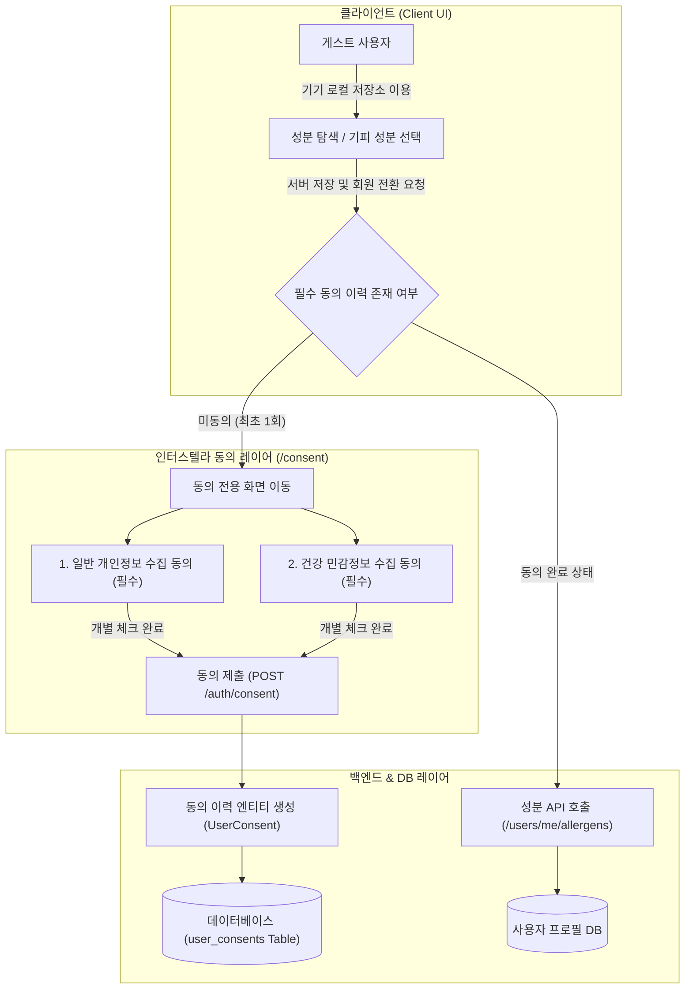

화장품 성분 분석 서비스인 PickSafe를 개발하며 서비스 초기 아키텍처를 세울 때, 가장 가볍게 넘어가기 쉬우면서도 실제 서비스 운영 시 가장 치명적인 문제를 일으킬 수 있는 영역이 바로 **‘개인정보 및 민감정보 수집 동의’** 부분이었습니다.

화장품 성분 데이터 자체는 일반적인 공공 데이터에 해당하지만, "특정 사용자가 알레르기 반응을 일으키거나 기피하는 성분"을 지정하는 순간, 이 데이터는 개인정보보호법상 **건강 관련 민감정보**의 성격을 갖게 됩니다. 이를 소홀히 다루면 법적 리스크를 피할 수 없지만, 그렇다고 서비스 진입 시점부터 수많은 동의 팝업을 띄우는 것은 사용성을 크게 저해합니다.

이번 글에서는 법적 규제 준수와 비회원/신규 사용자의 UX 마찰을 최소화하기 위해 동의 체계를 어떻게 재설계하고 백엔드 아키텍처에 녹여냈는지 그 고민과 과정을 정리했습니다.

---

## 🎯 마주한 고민과 문제 배경

초기 구현에서는 단순하게 회원가입 시 전체 동의 체크박스 하나만 제공하는 형태로 접근했습니다. 하지만 개인정보 관련 규제를 면밀히 검토하고 서비스 확장성을 고민하면서 다음과 같은 구조적 한계에 부딪혔습니다.

1. **건강 민감정보의 별도 동의 규정 위반 가능성**
   - 일반 서비스 이용약관과 '알레르기/기피 성분 등 건강 관련 정보' 수집 동의는 개별 체크박스로 분리되어 사용자의 명시적 동의를 각각 받아야 합니다. 하나로 묶어 처리하는 방식은 법무 및 보안 관점에서 적합하지 않았습니다.
2. **비회원(게스트) 진입 장벽 (UX Friction)**
   - 앱 탐색 단계에서부터 약관 동의를 요구하면 신규 이탈률이 급증합니다. 비회원은 서버에 데이터를 저장하지 않고 기기 내부 저장소만 이용하므로, 서버 측 동의 수집 대상이 아닙니다.
3. **약관 개정에 따른 버전 추적 불가**
   - 단순히 `is_agreed: True` 형태의 boolean 값만 DB에 저장할 경우, 향후 약관이 개정되었을 때 사용자가 '어떤 버전의 약관'에 '언제' 동의했는지 법적 증적을 남기기 어렵습니다.

이 문제를 해결하기 위해 **"게스트에게는 완전 무마찰 UX를 제공하고, 서버에 민감 데이터가 저장되는 최후의 시점에 명시적 2단계 동의를 수집·증적화한다"**는 방향을 설정했습니다.

---

## ⚖️ 기술적 대안 비교 및 선택 이유

동의 체계를 구현하는 방식을 두고 세 가지 대안을 비교 검토했습니다.

| 구분 | 대안 A: 진입 시 일괄 동의 (Upfront Wall) | 대안 B: 기능 진입 시 개별 동의 (Contextual Consent) | 대안 C: 지연 동의 + 동의 이력 전용 테이블 (최종 선택) |
| :--- | :--- | :--- | :--- |
| **처리 방식** | 서비스 최초 진입 시 모든 약관 동의 강제 | 성분 설정 기능 진입 시 마다 팝업으로 동의 요청 | 게스트 상태 유지 후, 서버 데이터 저장 시점에 개별 체크박스 분리 및 버전별 이력 적재 |
| **UX 영향** | 진입 장벽이 매우 높아 이탈률 증가 | 자주 팝업이 떠 사용자 경험 연속성 저해 | 게스트 마찰 0%, 필요 시점에만 담백하게 동의 유도 |
| **규제 준수** | 동의 항목 미분리 시 법적 리스크 | 동의 상태 관리가 파편화됨 | 2단계 개별 체크박스 및 버전별 감사 로그(Audit Log) 완벽 제공 |
| **구현 공수** | 낮음 | 중간 | 높음 (동의 이력 DB 모델링 및 마이그레이션 필요) |

최종적으로 **대안 C**를 선택했습니다. 초기 개발 공수는 다소 늘어나지만, 데이터 법률 준수 증적을 확실히 남기면서도 사용자가 서비스를 처음 접할 때 느끼는 피로도를 최소화할 수 있기 때문입니다.

---

## 🏗️ 시스템 아키텍처 및 흐름

게스트 사용자가 서비스를 이용하다가 정식 회원으로 전환되거나 온보딩을 통해 기피 성분을 저장할 때, 동의 프로세스가 어떻게 작동하는지 정리한 흐름입니다.



*   **포인트:** 비회원 상태에서는 서버와 데이터 통신 없이 로컬 상태만 유지하다가, `POST /auth/consent` 또는 `POST /auth/guest-convert` 시점에 동의 이력과 성분 데이터를 단일 트랜잭션으로 안전하게 저장합니다.

---

## 💻 핵심 구현 및 트러블슈팅

### 1. 동의 이력 추적을 위한 데이터 모델 설계

동의 시점, 동의한 약관의 고유 버전, 동의 유형(일반 약관 vs 건강 민감정보)을 명확히 기록할 수 있도록 DB 구조를 엔티티로 분리했습니다.

```python
# db/models.py (이해를 돕기 위해 축약된 구조 예시)
from sqlalchemy import Column, Integer, String, DateTime, ForeignKey, Enum
import enum
from datetime import datetime

class ConsentType(str, enum.Enum):
    PRIVACY_POLICY = "privacy_policy"
    SENSITIVE_HEALTH_DATA = "sensitive_health_data"

class UserConsent(Base):
    __tablename__ = "user_consents"

    id = Column(Integer, primary_key=True, index=True)
    user_id = Column(Integer, ForeignKey("users.id", ondelete="CASCADE"), nullable=False)
    consent_type = Column(String(50), nullable=False)  # privacy_policy | sensitive_health_data
    terms_version = Column(String(20), nullable=False) # 예: '2026-07-08'
    agreed_at = Column(DateTime, default=datetime.utcnow, nullable=False)
```

### 2. 다국어 약관 마크다운 동적 바인딩 및 독립 체크박스 제어

약관 내용이 변경될 때마다 HTML을 직접 수정하는 불편함을 줄이고자, 약관 본문은 마크다운 파일(`docs/consent/privacy_policy_{locale}.md`)로 분리했습니다. 서버는 요청자의 Locale에 맞는 마크다운을 읽어 HTML 접이식(Collapsible) UI로 변환하여 렌더링합니다.

프론트엔드에서는 2개의 동의 항목이 모두 체크되었는지 엄격하게 검증합니다.

```javascript
// consent_checker.js (일부 로직 추상화)
function validateConsentForm() {
    const isPrivacyAgreed = document.getElementById('chk-privacy').checked;
    const isHealthAgreed = document.getElementById('chk-health').checked;
    const submitBtn = document.getElementById('btn-submit');

    // 두 필수 항목이 모두 체크되어야만 진행 버튼 활성화
    submitBtn.disabled = !(isPrivacyAgreed && isHealthAgreed);
}
```

### 3. 게스트 데이터 전환 시 트랜잭션 원자성 확보 (Troubleshooting)

**문제상황:** 게스트 사용자가 로그인 후 정식 회원이 될 때, 로컬에 저장되어 있던 '기피 성분 목록'과 '약관 동의 이력'을 서버로 일괄 이관하는 과정에서 네트워크 튐 현상이나 서버 예외가 발생하면, 동의 이력만 남고 성분 데이터는 누락되거나 그 반대의 불일치 현상이 발생할 위험이 있었습니다.

**해결책:** 백엔드 전환 로직에서 DB 트랜잭션 블록을 하나로 묶어 **원자성(Atomicity)**을 보장했습니다. 동의 이력 적재와 성분 데이터 마이그레이션 중 하나라도 실패할 경우 전체 롤백되도록 처리했습니다.

```python
# routers/auth.py (트랜잭션 처리 개념 예시)
@router.post("/auth/guest-convert")
async def convert_guest_to_member(
    payload: GuestConvertRequest,
    db: Session = Depends(get_db),
    current_user: User = Depends(get_current_user)
):
    try:
        with db.begin_nested(): # Savepoint 생성
            # 1. 필수 동의 이력 2종 개별 적재
            for consent_item in payload.consents:
                consent_record = UserConsent(
                    user_id=current_user.id,
                    consent_type=consent_item.type,
                    terms_version=consent_item.version
                )
                db.add(consent_record)
            
            # 2. 로컬에서 수집된 기피 성분 데이터 이관
            update_user_allergens(db, current_user.id, payload.allergens)
            
        db.commit()
    except Exception as e:
        db.rollback()
        raise HTTPException(status_code=500, detail="회원 전환 및 데이터 이관 실패")
    
    return {"status": "success"}
```

---

## 💡 돌아보며 배운 점 (회고)

서비스 개발 초기에는 "약관 동의 화면 정도는 빠르게 만들고 넘어가자"는 생각을 하기 쉽습니다. 하지만 건강 정보와 관련된 서비스를 다루다 보니, 작은 규제 조건 하나가 서비스 전체 아키텍처와 DB 설계에 큰 영향을 미친다는 것을 깨달았습니다.

이번 개편 작업을 통해 얻은 핵심 배운 점은 다음과 같습니다.

1. **규제와 UX는 대립 관계가 아니다**
   - 무조건적인 동의 팝업은 UX를 망치지만, **"데이터가 서버로 전달되는 명확한 맥락(Context)"**에서 동의를 구하고 비회원 구간을 완전히 열어두는 방식을 취하면 규제 준수와 UX 만족도를 동시에 잡을 수 있음을 확인했습니다.
2. **법적 증적 데이터는 변경 불가능(Immutable)하게 관리해야 한다**
   - 단순 사용자 테이블의 Column으로 동의 여부를 관리했다면 약관 개정 시 과거 동의 시점을 증명하지 못했을 것입니다. 독립된 이력 테이블(`user_consents`)을 두어 약관 버전별 로그를 쌓도록 설계한 결정은 향후 서비스 운영 측면에서 매우 단단한 기반이 되었습니다.
3. **작은 서비스일수록 트랜잭션 경계를 명확히 해야 한다**
   - 클라이언트 상태(로컬 저장소)에서 서버 상태(DB)로 전환되는 지점에서의 예외 처리를 꼼꼼히 다루면서, 원자적 트랜잭션 관리의 중요성을 다시 한번 상기할 수 있었습니다.

앞으로도 기능을 빠르게 개발하는 것에 그치지 않고, 데이터의 성격에 맞는 보안과 데이터 모델링 규범을 담백하고 정교하게 채워 나가는 엔지니어링을 지향하고자 합니다.