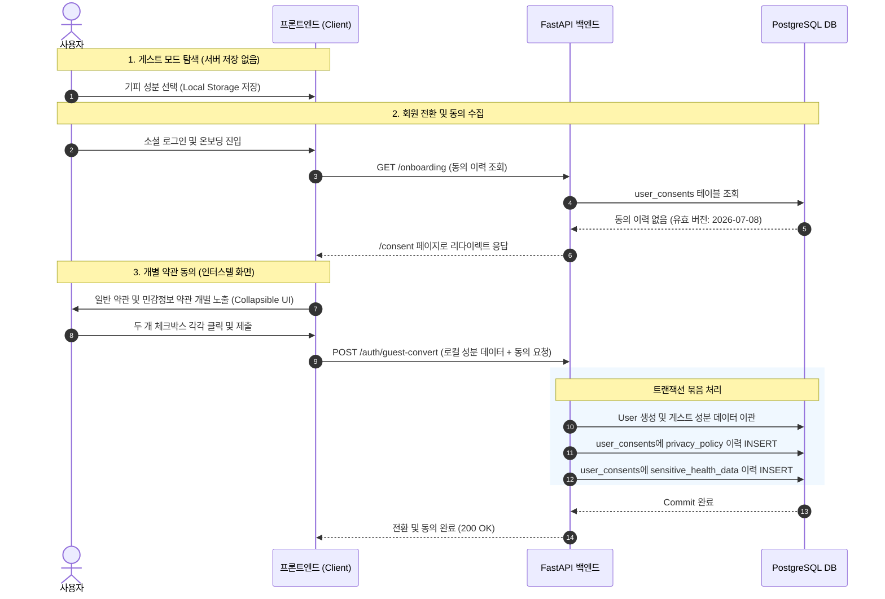

화장품 성분 분석 및 추천 서비스인 PickSafe를 개발하면서, 사용자의 체질, 알레르기, 기피 성분 데이터를 다루는 과정에서 법적/기술무결성 측면의 중요한 과제에 직면했습니다.

한국의 개인정보보호법상 사용자의 알레르기 정보나 피부 질환 관련 기피 성분 설정은 **'건강에 관한 정보'**로서 일반 개인정보와 분리하여 처리해야 하는 **민감정보**로 분류됩니다. 서비스 초기에는 일반 회원가입 시 약관 동의 하나로 통합 처리하려 했으나, 법적 증적의 유효성과 운영 안정성 측면에서 명확한 한계가 드러났습니다.

이번 글에서는 민감정보 처리 요건을 충족하기 위해 데이터베이스 스키마를 신설하고, 비회원(게스트) 사용자 경험의 마찰을 없애면서도 법적 동의 이력을 정교하게 추적 관리하도록 유저 흐름을 재설계한 과정을 담담하게 정리해 봅니다.

---

## 🎯 마주한 고민과 문제 배경

### 1. 일반 개인정보와 민감정보 동의의 법적 분리 필요성
개인정보보호법 제23조에 따르면 민감정보를 처리하기 위해서는 다른 개인정보의 처리에 대한 동의와 **별도로 동의를 받아야 합니다.** 

초기 구상에서는 하나의 체크박스로 이용약관과 개인정보 처리방침을 묶어 동의받는 방식이었습니다. 그러나 기피 성분 설정 기능이 강화됨에 따라, 사용자가 입력하는 알레르기 성분 데이터가 법적으로 민감정보로 해석될 여지가 매우 높았습니다. 따라서 "일반 개인정보 수집 동의"와 "건강 관련 민감정보 수집 동의"를 명확히 분리된 체크박스로 제공하고, 각 동의의 시점과 약관 버전을 개별적으로 DB에 기록해야 하는 과제가 생겼습니다.

### 2. 게스트 사용자 진입 장벽과 동의 시점의 괴리
서비스 진입 단계에서부터 과도한 동의 절차와 팝업을 노출하면 비회원 사용자의 이탈률이 급격히 높아집니다. 

게스트 모드로 화장품 성분을 조회하거나 탐색하는 단계에서는 서버에 어떠한 개인 식별 데이터도 저장하지 않으므로 동의를 강제할 필요가 없습니다. 하지만 게스트 사용자가 소셜 로그인으로 전환하거나, 본인의 기피 성분 프로필을 서버에 저장하려는 순간에는 반드시 유효한 동의 이력이 수집되어야 했습니다.

---

## ⚖️ 기술적 대안 비교 및 선택 이유

문제를 해결하기 위해 크게 두 가지 아키텍처 접근법을 비교했습니다.

| 비교 항목 | 대안 A: 전역 미들웨어 기반 차단 | 대안 B: 라우트 레벨 동의 검증 및 게스트 로컬 이관 (선택) |
| :--- | :--- | :--- |
| **동작 방식** | 모든 요청을 미들웨어에서 검사하여 미동의 시 `/consent`로 일괄 리다이렉트 | 핵심 민감 API 진입점 및 회원 전환 엔드포인트에서 개별 검증 |
| **게스트 UX** | 둘러보기 단계부터 약관동의 요구로 마찰 발생 | 서버 저장 전까지 동의 절차 없음 (마찰 제로) |
| **법적 증적** | 단일 플래그 형태로 기록되어 세부 항목 추적 어려움 | `user_consents` 테이블에 동의 종류, 버전, 시점 개별 기록 |
| **유연성** | 정적 자원이나 공통 API까지 미들웨어 예외 처리가 복잡해짐 | 엔드포인트별 비즈니스 로직에 맞춰 원자적(Atomic) 처리 가능 |

**선택 사유:**  
전역 미들웨어 방식은 구현이 직관적일 수 있으나, 정적 파일이나 게스트 모드의 읽기 전용 요청까지 과도하게 제어하게 되는 부작용이 있었습니다. 결과적으로 **대안 B**를 선택하여, 게스트 상태에서는 로컬 저장소만 활용하게 하여 마찰을 없애고, **회원 전환(`POST /auth/guest-convert`) 및 성분 저장 API(`POST /users/me/allergens`)** 시점에 개별 동의 이력을 수집·기록하도록 구조를 개선했습니다.

---

## 🏗️ 시스템 아키텍처 및 흐름

사용자가 게스트 상태에서 탐색하다가 회원으로 전환하고 민감정보 동의를 완료하는 전체 데이터 흐름입니다.



---

## 💻 핵심 구현 및 트러블슈팅

### 1. 동의 이력 추적 모델 설계 (`UserConsent`)
약관 재동의 요구 조건이나 법률 변경 시 대응할 수 있도록, 단순 `Boolean` 필드가 아닌 동의 유형(`consent_type`)과 버전(`consent_version`)을 기록하는 테이블을 구성했습니다.

```python
# models/consent.py
from sqlalchemy import Column, Integer, String, Boolean, DateTime, ForeignKey, UniqueConstraint
from sqlalchemy.orm import relationship
from datetime import datetime
from database import Base

class UserConsent(Base):
    __tablename__ = "user_consents"

    id = Column(Integer, primary_key=True, index=True)
    user_id = Column(Integer, ForeignKey("users.id", ondelete="CASCADE"), nullable=False)
    consent_type = Column(String(50), nullable=False)  # 'privacy_policy', 'sensitive_health_data'
    consent_version = Column(String(20), nullable=False)  # e.g., '2026-07-08'
    is_agreed = Column(Boolean, default=True, nullable=False)
    agreed_at = Column(DateTime, default=datetime.utcnow, nullable=False)

    user = relationship("User", back_populates="consents")

    __table_args__ = (
        UniqueConstraint('user_id', 'consent_type', 'consent_version', name='uix_user_consent_version'),
    )
```

### 2. 다국어 마크다운 약관 동적 바인딩 및 Jinja2 렌더링
약관 개정 시 HTML 코드를 직접 수정하는 번거로움을 피하기 위해, 약관 본문을 마크다운 파일(`docs/consent/*_{locale}.md`)로 분리 관리했습니다. 백엔드에서는 유저의 Locale 요청을 해석하여 해당 마크다운을 HTML로 전환 후 렌더링합니다.

```python
# routers/shared.py
import os
import markdown
from fastapi import Request

CURRENT_TERMS_VERSION = "2026-07-08"

def load_consent_document(doc_type: str, locale: str = "ko") -> str:
    file_path = f"docs/consent/{doc_type}_{locale}.md"
    if not os.path.exists(file_path):
        file_path = f"docs/consent/{doc_type}_ko.md"  # Fallback
        
    with open(file_path, "r", encoding="utf-8") as f:
        text = f.read()
    return markdown.markdown(text)
```

### 3. 트러블슈팅: 게스트 전환 시 동의 이력 적재의 원자성(Atomicity) 보장

**문제 상황:**  
초기 개발 시 게스트 사용자의 로컬 데이터를 서버로 이관하는 과정에서 성분 정보 저장 API와 동의 이력 저장 API가 따로 호출되는 구조였습니다. 이로 인해 네트워크 불안정이나 원격 오류 발생 시 성분 데이터는 DB에 저장되었으나 동의 이력(`user_consents`) 누락이 발생하여, 법적 동의 없이 민감정보가 서버에 남는 결함이 발견되었습니다.

**해결 과정:**  
단일 `POST /auth/guest-convert` 엔드포인트 내에서 데이터베이스 트랜잭션을 하나로 묶어 처리하도록 개선했습니다. 게스트 프로필 전환과 2종의 동의 이력 적재 중 단 하나라도 실패하면 전체 작업이 `Rollback`되도록 보장했습니다.

```python
# routers/auth.py
@router.post("/auth/guest-convert")
async def convert_guest_to_member(
    payload: GuestConvertRequest,
    db: Session = Depends(get_db),
    current_user: User = Depends(get_current_user)
):
    try:
        # DB 트랜잭션 시작
        with db.begin_nested():
            # 1. 게스트 로컬 성분 데이터 DB 이관
            if payload.allergens:
                save_user_allergens(db, current_user.id, payload.allergens)

            # 2. 필수 동의 항목 2종 원자적 기록
            consents_to_record = [
                ("privacy_policy", payload.privacy_version),
                ("sensitive_health_data", payload.sensitive_health_version)
            ]
            
            for consent_type, version in consents_to_record:
                consent_entry = UserConsent(
                    user_id=current_user.id,
                    consent_type=consent_type,
                    consent_version=version or CURRENT_TERMS_VERSION,
                    is_agreed=True
                )
                db.add(consent_entry)
                
        db.commit()
        return {"status": "success", "message": "성공적으로 회원 전환 및 동의 등록이 완료되었습니다."}

    except Exception as e:
        db.rollback()
        raise HTTPException(status_code=500, detail="회원 전환 처리 중 오류가 발생했습니다.")
```

---

## 💡 돌아보며 배운 점

1. **컴플라이언스는 단순 UI 체크박스가 아닌 도메인 모델 설계의 문제**  
   민감정보 동의 요구사항을 단순히 프론트엔드의 필수 체크박스 노출 수준으로 다루었다면, 추후 약관 변경에 따른 재동의 이력 추적이나 법적 증명 요청 시 대응할 수 없었을 것입니다. DB 스키마 수준에서 버전과 동의 유형을 명확히 정의함으로써 서비스의 법적 안전성을 확보할 수 있었습니다.

2. **사용자 경험(UX)과 규제 준수 간의 균형점 찾기**  
   모든 사용자에게 진입 시점부터 엄격한 동의를 요구하는 대신, 게스트 모드에서는 서버 데이터 전송을 차단하여 UX 마찰을 극대화하고, 실제 민감 데이터가 서버로 저장되는 시점에 정확히 법적 절차를 수행하도록 유저 흐름을 설계하는 감각을 익혔습니다.

3. **향후 보완할 과제**  
   현재는 필수 동의 항목만 다루고 있으나, 추후 마케팅 목적 등의 선택 동의 항목이 추가될 경우 철회 API(`DELETE` or `is_agreed = False` 이력 추가) 스키마 확장과, 개정 약관 발생 시 미동의 유저를 자동으로 식별해 재동의 팝업을 띄우는 미들웨어 연동 로직을 고도화할 계획입니다.