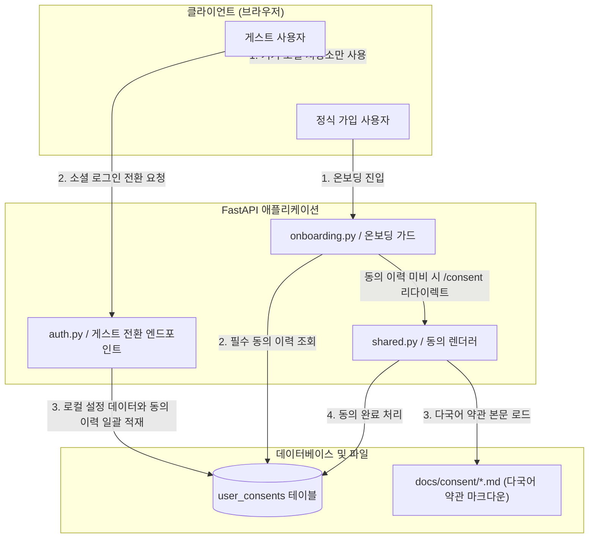

화장품 성분 분석 서비스인 **PickSafe**를 개발하면서 가장 크게 고민했던 지점 중 하나는 기술적인 화려함이 아닌, **'법적 규제 준수'와 '사용자 경험(UX)의 공존'**이었습니다. 

서비스의 핵심 기능은 사용자가 피하고 싶은 기피 성분이나 알레르기 유발 성분을 설정하면, 이를 바탕으로 화장품 성분을 분석해 주는 것입니다. 하지만 이 과정에서 다루는 '특정 성분에 대한 알레르기 정보'나 '피부 고민'은 개인정보보호법상 엄격하게 다루어야 하는 **건강 관련 민감 정보**에 해당합니다.

민감 정보를 수집하기 위해서는 일반 개인정보 수집 동의와 별도로 **명시적인 구분 동의**를 받아야 합니다. 이를 어길 시 법적 문제가 발생할 수 있지만, 그렇다고 가입 초기 단계부터 겹겹이 쌓인 동의 체크박스로 사용자를 지치게 만들고 싶지는 않았습니다. 

이 상충하는 문제를 해결하기 위해 데이터베이스 구조를 개선하고, 비회원(게스트)과 정식 회원의 동의 파이프라인을 유연하게 설계한 과정을 기록으로 남깁니다.

---

## 🎯 마주한 고민과 문제 배경

기존 시스템은 일반적인 가입 약관 동의 하나만으로 모든 데이터를 처리하고 있었습니다. 하지만 법적 검토 결과, 다음과 같은 심각한 한계와 개선 사항이 식별되었습니다.

1. **민감 정보의 통합 동의 불가**: 개인정보보호법에 의거, 건강 관련 정보(기피 성분) 수집은 일반 개인정보 수집 동의와 **별도의 체크박스로 분리하여 각각 동의**를 받아야 합니다. 하나로 묶어서 "모두 동의" 처리하는 방식은 규정 위반 소지가 있었습니다.
2. **동의 이력 추적(Audit Trail) 부재**: 약관은 서비스가 성장함에 따라 개정됩니다. 사용자가 '어느 시점'에 '어떤 버전'의 약관에 동의했는지 추적할 수 있는 DB 스키마가 없었습니다.
3. **게스트 모드에서의 UX 마찰**: PickSafe는 가입 없이도 성분을 분석해 볼 수 있는 '게스트 모드'를 지원합니다. 게스트 모드 진입 시점부터 거대한 동의 팝업을 띄우는 것은 신규 사용자 유입에 큰 장벽이 되었습니다.

따라서 법적 규제를 완벽히 준수하면서도, 사용자가 서비스를 탐색하는 흐름을 방해하지 않는 **'지연된 동의(Lazy Consent) 및 이관 체계'**가 필요했습니다.

---

## ⚖️ 기술적 대안 비교 및 선택 이유

동의 여부를 검증하고 화면을 제어하는 방식을 두고 두 가지 대안을 비교했습니다.

### 대안 1: 전역 미들웨어(Middleware) 기반의 인터셉터 패턴
* **방식**: 모든 API 요청 또는 페이지 진입 시점에 전역 미들웨어에서 사용자의 최신 동의 여부를 DB에서 조회하고, 동의가 없으면 `/consent` 페이지로 강제 리다이렉트합니다.
* **장점**: 누락 없이 완벽하게 동의 여부를 강제할 수 있습니다.
* **단점**: 정적 파일(CSS, JS) 요청이나 게스트 전용 API, 랜딩 페이지 등 동의가 필요 없는 경로까지 일일이 예외 처리를 해주어야 하므로 미들웨어가 무거워집니다. 또한, 게스트 모드의 자유로운 탐색을 원천 차단하게 되어 UX 관점에서 최악이었습니다.

### 대안 2: 특정 진입점 가드(Guard) 및 레이지(Lazy) 동의 처리 (선택)
* **방식**: 게스트는 서버에 데이터를 저장하지 않고 로컬 저장소(Local Storage)만 사용하므로 동의 과정을 완전히 생략합니다. 대신, 서버에 민감 정보가 저장되는 시점인 **'온보딩(기피성분 설정)'** 단계와 **'소셜 회원가입 전환'** 단계에서만 핀포인트로 동의를 검증하고 수집합니다.
* **장점**: 게스트 모드의 마찰을 제로(0)로 유지할 수 있으며, 서버 리소스(DB I/O)를 절약할 수 있습니다. 법적으로 정보가 서버에 기록되는 시점에 정확히 동의 증적을 남기므로 규제도 완벽히 만족합니다.
* **단점**: 컨트롤러 레이어에서 동의 여부를 확인하는 로직이 일부 분산될 수 있으나, 공통 의존성 주입(Dependency Injection)을 통해 충분히 깔끔하게 해결할 수 있습니다.

이러한 분석을 바탕으로 **대안 2**를 선택하고, 구체적인 아키텍처 설계에 착수했습니다.

---

## 🏗️ 시스템 아키텍처 및 흐름

전체적인 동의 검증 및 데이터 이관 흐름은 아래와 같이 동작합니다.



---

## 💻 핵심 구현 및 트러블슈팅

### 1. 동의 이력 관리 테이블 스키마 설계
동의 이력을 영속적으로 관리하기 위해 `user_consents` 테이블을 신설했습니다. 한 사용자가 여러 종류의 동의(일반 약관, 민감 정보)를 수행하므로 일대다(1:N) 관계로 설계했습니다.

```python
from datetime import datetime
from sqlalchemy import Column, Integer, String, DateTime, ForeignKey, UniqueConstraint
from sqlalchemy.orm import relationship
from database import Base

class UserConsent(Base):
    __tablename__ = "user_consents"

    id = Column(Integer, primary_key=True, index=True)
    user_id = Column(Integer, ForeignKey("users.id", ondelete="CASCADE"), nullable=False)
    consent_type = Column(String(50), nullable=False)  # 예: 'privacy_policy', 'sensitive_health_data'
    version = Column(String(20), nullable=False)       # 예: '2026-07-08'
    agreed_at = Column(DateTime, default=datetime.utcnow, nullable=False)

    user = relationship("User", back_populates="consents")

    # 동일 사용자가 동일 버전의 동일 약관에 중복 동의하는 것을 방지
    __table_args__ = (
        UniqueConstraint("user_id", "consent_type", "version", name="uq_user_consent_type_version"),
    )
```

### 2. 트러블슈팅: 게스트 전환 시 동의 이력의 원자성(Atomicity) 보장 문제

#### 상황 (Issue)
게스트 사용자가 서비스를 이용하다가 소셜 로그인을 통해 정식 회원으로 전환(`POST /auth/guest-convert`)할 때, 기기 로컬에 임시로 쌓아두었던 알레르기 성분 데이터와 함께 **"두 가지 필수 동의 이력(일반 정보, 민감 정보)"**을 서버에 한 번에 등록해야 했습니다.

처음에는 단순하게 루프를 돌며 개별적으로 `insert`를 실행하게 구현했습니다. 그러나 네트워크 불안정이나 DB 제약 조건 위배로 인해 **일반 약관 동의는 성공했으나 민감 정보 동의 기록이 누락되는 불일치 상태**가 발생할 여지가 있었습니다. 법적 증적이 하나라도 누락되면 규제 위반이 되므로, 이는 결코 허용될 수 없었습니다.

#### 해결 (Solution)
FastAPI와 SQLAlchemy의 세션 컨텍스트 매니저를 활용하여, 데이터 이관과 동의 처리를 **단일 데이터베이스 트랜잭션**으로 묶어 원자성을 보장하도록 개선했습니다.

```python
from fastapi import APIRouter, Depends, HTTPException, status
from sqlalchemy.orm import Session
from database import get_db
from models import User, UserConsent, UserAllergen
from schemas import GuestConvertRequest

router = APIRouter()

@router.post("/auth/guest-convert", status_code=status.HTTP_201_CREATED)
def convert_guest_to_member(payload: GuestConvertRequest, db: Session = Depends(get_db)):
    # 1. 트랜잭션 시작
    with db.begin():
        # 신규 유저 생성 프로세스 (가상 구현)
        new_user = User(email=payload.email, hashed_password="...")
        db.add(new_user)
        db.flush()  # 신규 유저 ID 확보

        # 2. 필수 동의 사항 일괄 등록 (원자성 보장)
        required_consents = [
            {"type": "privacy_policy", "version": "2026-07-08"},
            {"type": "sensitive_health_data", "version": "2026-07-08"}
        ]
        
        for consent in required_consents:
            consent_record = UserConsent(
                user_id=new_user.id,
                consent_type=consent["type"],
                version=consent["version"]
            )
            db.add(consent_record)

        # 3. 로컬에 보관 중이던 기피 성분(민감 정보) 데이터 이관
        if payload.local_allergens:
            for allergen_code in payload.local_allergens:
                allergen_record = UserAllergen(
                    user_id=new_user.id,
                    allergen_code=allergen_code
                )
                db.add(allergen_record)
                
    # 블록을 벗어나면 자동으로 commit 되며, 에러 발생 시 전체 rollback 처리됨
    return {"status": "success", "user_id": new_user.id}
```

### 3. 다국어 약관 동의 화면의 Dynamic Rendering
법적 고지 사항은 수정이 잦고 가독성이 중요합니다. 이를 HTML 코드 내에 하드코딩하는 대신, `docs/consent/` 경로에 마크다운 파일로 관리하고 사용자의 Locale 설정에 맞춰 동적으로 변환하여 HTML Collapsible(아코디언) 뷰에 바인딩하도록 설계했습니다.

```python
import os
import markdown
from fastapi import Request
from fastapi.templating import Jinja2Templates

templates = Jinja2Templates(directory="templates")

def get_localized_consent_html(locale: str, consent_type: str) -> str:
    # 기본값은 영어(en)로 설정하여 Fallback 처리
    file_path = f"docs/consent/{consent_type}_{locale}.md"
    if not os.path.exists(file_path):
        file_path = f"docs/consent/{consent_type}_en.md"
        
    try:
        with open(file_path, "r", encoding="utf-8") as f:
            text = f.read()
        return markdown.markdown(text)
    except FileNotFoundError:
        return "<p>Terms and conditions are temporarily unavailable.</p>"
```

---

## 💡 돌아보며 배운 점 (회고)

### 기술이 비즈니스와 규제를 서포트하는 방식
이번 작업을 통해 아키텍처 설계는 단순히 성능 최적화나 트래픽 분산에만 국한되지 않는다는 것을 다시금 깨달았습니다. **서비스가 속한 도메인의 규제(Compliance)를 이해하고, 이를 시스템 구조에 어떻게 깔끔하게 녹여낼 것인가** 또한 시니어 엔지니어가 갖추어야 할 핵심 역량이었습니다.

### 얻은 성과
1. **완벽한 규제 준수**: 일반 동의와 민감 정보 동의를 분리하고 버전별 이력을 추적할 수 있게 되어, 추후 개인정보 보호 감사나 이슈 발생 시 명확한 증적을 제시할 수 있게 되었습니다.
2. **UX 마찰 제거**: 게스트 모드 진입 장벽을 완전히 제거함으로써, 사용자가 서비스를 충분히 경험한 뒤 가입하도록 유도하는 부드러운 온보딩 흐름을 유지할 수 있었습니다.
3. **데이터 정합성 확보**: 트랜잭션 처리를 통해 동의 이력과 민감 데이터가 언제나 일치하도록 보장했습니다.

### 향후 과제
약관이 개정되었을 때 기존 사용자들에게 재동의를 요구하는 파이프라인을 구축해야 합니다. 사용자가 로그인할 때 보유한 동의 버전 정보와 시스템의 최신 요구 버전을 비교하여, 백그라운드에서 유연하게 재동의 팝업을 띄워주는 스케줄러나 미들웨어 게이트를 추가로 고민해 볼 계획입니다.