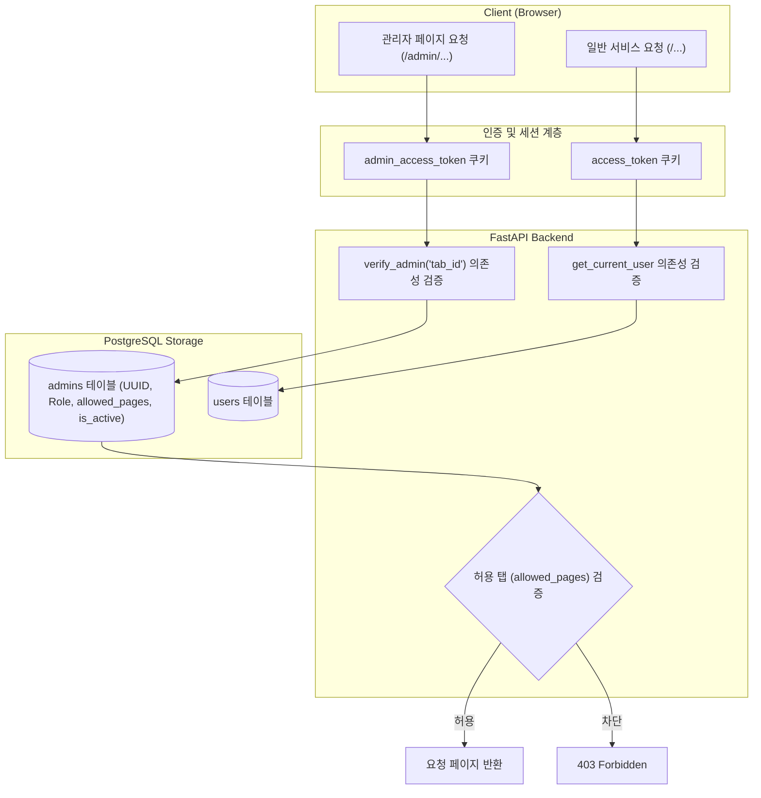

화장품 성분 분석 서비스 PickSafe를 개발하면서 관리자 포털(Admin Portal)의 인증 및 인가 구조를 재설계해야 하는 시점이 있었습니다. 

초기에는 빠른 기능 검증을 위해 일반 사용자 테이블에 관리자 플래그(`role='admin'`)를 두고 동일한 인증 흐름을 공유하도록 구현했으나, 서비스 기능이 확장되면서 세션 간섭과 보안 취약점, 세부 권한 제어의 한계가 명확히 드러났습니다. 계정 스키마 격리부터 쿠키 네임스페이스 분리, 구글 소셜 로그인 단일화 및 역할 기반 권한 제어(RBAC)를 적용하며 겪었던 기술적 고민과 해결 과정을 정리합니다.

---

## 🎯 마주한 고민과 문제 배경

### 1. 단일 세션 쿠키 공유로 인한 상태 오염
초기 설계에서는 일반 회원과 관리자가 모두 동일한 `access_token` 쿠키를 공유했습니다. 브라우저에서 관리자 계정으로 로그인한 뒤 서비스 일반 화면으로 이동하거나, 반대로 일반 계정으로 테스트를 진행할 때 세션이 덮어씌워지거나 권한 상태가 꼬이는 문제가 지속적으로 발생했습니다.

### 2. 패스워드 기반 인증의 관리 부담과 보안 리스크
로컬 개발 환경 편의를 위해 시딩된 고정 패스워드 계정 방식은 자칫 운영 환경 노출 시 심각한 보안 위협이 될 수 있었습니다. 패스워드 재설정, 2단계 인증(MFA) 등을 직접 구현하고 유지보수하기보다는, 신뢰할 수 있는 외부 Identity Provider(Google OAuth)를 활용해 인증 단계를 단일화하는 것이 안전하다고 판단했습니다.

### 3. 세분화된 관리자 역할 제어의 필요성
운영 단계에서는 모든 관리자가 전체 시스템 지표나 핵심 데이터를 열람할 필요가 없습니다. 콘텐츠 담당자, 고객 지원 담당자 등 각 역할에 맞는 페이지에만 접근할 수 있도록 탭 단위의 접근 제어(RBAC)가 필요했습니다.

---

## ⚖️ 기술적 대안 비교 및 선택 이유

관리자 인증 체계를 개편하며 고려한 주요 대안과 결정 기준은 다음과 같았습니다.

| 비교 항목 | 대안 A: 단일 User 테이블 + 세부 Role 컬럼 | 대안 B: Admin 테이블 및 쿠키 물리적 격리 (선택) |
| :--- | :--- | :--- |
| **데이터 모델** | 기존 `users` 테이블에 권한 배열 또는 JSON 필드 추가 | 관리자 전용 `admins` 테이블 분리 |
| **세션 관리** | `access_token` 하나로 클레임(Claim)에 따라 분기 | `admin_access_token`과 `access_token` 쿠키 분리 |
| **장점** | 스키마 변경이 적고 기존 인증 미들웨어 재사용 가능 | 브라우저 내 일반 유저/어드민 세션 완전 독립, 데이터 오염 방지 |
| **단점** | 테이블 비대화, 일반 회원 가입 플로우와 관리자 생성 결합 | 스키마 추가 생성 및 인증 의존성 이원화 관리 필요 |

관리자 계정은 가입 경로, 라이프사이클, 세션 만료 정책이 일반 사용자와 완전히 다릅니다. 따라서 관리자 전용 테이블을 분리하고 쿠키 식별자를 독립시키는 대안 B를 최종 선택했습니다. 이를 통해 일반 회원 데이터와의 결합도를 제거하고, 브라우저 레벨에서 두 세션이 간섭 없이 공존할 수 있는 환경을 만들었습니다.

---

## 🏗️ 시스템 아키텍처 및 흐름

새롭게 정의한 인증 및 인가 아키텍처는 다음과 같습니다.



---

## 💻 핵심 구현 및 트러블슈팅

### 1. 관리자 테이블 분리와 부트스트랩 로직
일반 사용자(`users`)와 관리자(`admins`)를 완전히 분리하여, 관리자 계정 생성 시 일반 사용자 레코드가 불필요하게 생성되던 부수 효과를 제거했습니다.

시스템 최초 기동 시에는 환경변수로 지정된 최고관리자(`SUPER_ADMIN`) 이메일을 기반으로 계정을 1회 자가 시딩(Bootstrap)하도록 처리했습니다.

```python
# app/core/dependencies.py (핵심 개념 축약)
from fastapi import Request, HTTPException, status, Depends
from app.core.config import settings

async def verify_admin(required_tab: str = None):
    async def dependency(request: Request, db = Depends(get_db)):
        token = request.cookies.get("admin_access_token")
        if not token:
            raise HTTPException(
                status_code=status.HTTP_401_UNAUTHORIZED,
                detail="관리자 로그인이 필요합니다."
            )
        
        payload = decode_jwt(token)
        admin = await get_admin_by_id(db, payload.get("sub"))
        
        if not admin or not admin.is_active:
            raise HTTPException(
                status_code=status.HTTP_403_FORBIDDEN,
                detail="비활성화되었거나 유효하지 않은 관리자 계정입니다."
            )
            
        # 권한 및 허용 페이지 검증
        if admin.role != "super_admin" and required_tab:
            allowed = admin.allowed_pages.split(",") if admin.allowed_pages else []
            if required_tab not in allowed:
                raise HTTPException(
                    status_code=status.HTTP_403_FORBIDDEN,
                    detail="해당 메뉴에 대한 접근 권한이 없습니다."
                )
        return admin
    return dependency
```

### 2. 구글 OAuth 단일화와 계정 전환 UX 개선
비밀번호 기반 로그인을 전면 폐지하고 구글 소셜 인증으로 단일화했습니다. 

소셜 로그인 연동 과정에서 브라우저에 이미 로그인된 기본 계정으로 자동 인증이 진행되어 다른 관리자 계정으로 전환 테스트가 어렵던 문제가 있었습니다. 이를 해결하기 위해 OAuth 인증 요청 파라미터에 `prompt=select_account`를 명시적으로 주입했습니다.

```python
# OAuth 인증 URL 생성 시 prompt 강제
auth_url = (
    f"https://accounts.google.com/o/oauth2/v2/auth?"
    f"client_id={settings.GOOGLE_CLIENT_ID}&"
    f"redirect_uri={settings.ADMIN_OAUTH_REDIRECT_URI}&"
    f"response_type=code&"
    f"scope=openid%20email%20profile&"
    f"prompt=select_account"
)
```

### 3. 개발용 Mock 로그인 보안 강화
로컬 환경에서 외부 OAuth 연동 없이 빠르게 권한별 테스트를 수행하기 위해 Mock 로그인 엔드포인트를 구성했으나, 운영 환경에 실수로 노출될 경우 치명적인 우회 경로가 될 수 있었습니다. 이를 방지하기 위해 환경 변수를 확인하여 운영 환경에서는 즉시 차단되도록 방어 코드를 작성했습니다.

```python
@router.get("/admin/mock-login")
async def mock_admin_login(role: str, env: str = settings.ENV):
    if env == "prod":
        raise HTTPException(
            status_code=status.HTTP_403_FORBIDDEN,
            detail="운영 환경에서는 Mock 로그인을 사용할 수 없습니다."
        )
    # 로컬 테스트용 토큰 발급 및 쿠키 세팅
    ...
```

### 4. HttpOnly 쿠키의 안전한 서버 측 만료
보안을 위해 관리자 세션 쿠키는 `HttpOnly` 속성을 적용했습니다. 자바스크립트(`document.cookie`)로 쿠키를 삭제할 수 없으므로, 로그아웃 처리는 반드시 전용 서버 엔드포인트를 거쳐 쿠키를 명시적으로 소멸(`delete_cookie`)시키도록 구성하여 세션 잔존 버그를 해결했습니다.

또한 운영 환경 관리자 세션은 만료 시간을 2시간으로 엄격하게 제한하여 보안성을 높였습니다.

---

## 💡 돌아보며 배운 점 (회고)

이번 리팩토링을 통해 얻은 가장 큰 소득은 **인증 도메인의 명확한 경계 분리**였습니다.

1. **상태 격리의 중요성:** 사용자 인증과 관리자 인증을 하나의 파이프라인으로 처리하려던 초기 시도는 코드 재사용 측면에서는 유리해 보였으나, 세션 충돌과 예외 처리 비용이 훨씬 컸습니다. 물리적 테이블과 쿠키 네임스페이스를 완전히 분리함으로써 구조가 훨씬 직관적이고 견고해졌습니다.
2. **최소 권한의 원칙(Principle of Least Privilege):** 탭 단위의 RBAC와 Soft Delete 기반의 비활성화 정책을 도입하면서, 관리자 추가 및 권한 회수가 안전하고 투명하게 이루어질 수 있는 기반을 마련했습니다.
3. **환경 분리 안전장치:** 개발 생산성을 위한 편의 기능(Mock 로그인 등)을 작성할 때는 항상 배포 환경 검증 로직을 단단히 묶어두어야 운영 리스크를 예방할 수 있음을 다시 한번 체감했습니다.

향후에는 관리자 작업 로그(Audit Log)를 별도 적재하여 보안 감사 및 이상 징후 모니터링 체계를 추가로 보완해 나갈 계획입니다.