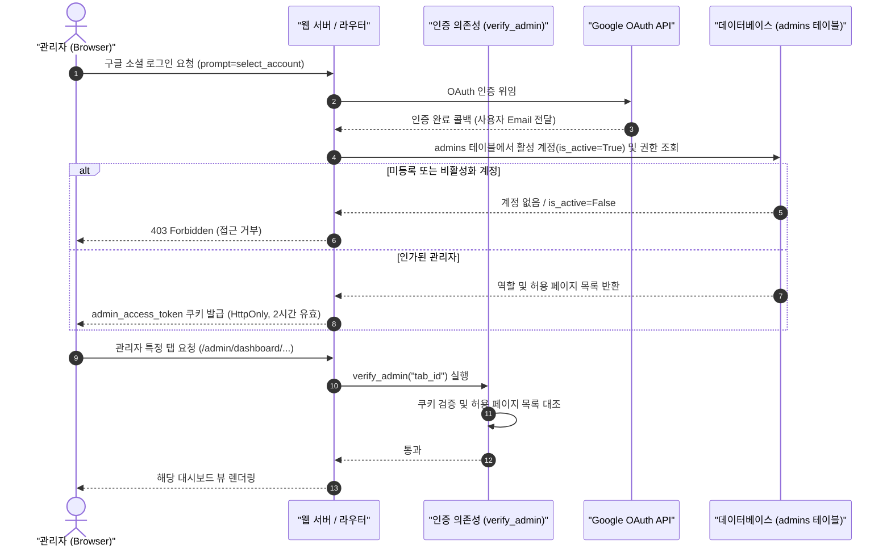

화장품 성분 분석 서비스 PickSafe를 개발하며 초기 백엔드 인증 체계를 구축할 당시, 관리자 권한은 일반 회원 테이블 내 `role='admin'` 컬럼 하나로 단순하게 구분했습니다. 브라우저에서도 동일한 인증 쿠키(`access_token`)를 공유했습니다.

하지만 기능이 확장되고 실제 관리 화면이 늘어나면서 이 단순한 구조는 금세 보안과 운영 양쪽에서 구조적인 문제를 드러냈습니다. 관리자 권한을 가진 채로 일반 유저 화면을 탐색하거나 테스트할 때 세션이 꼬이는 현상이 발생했고, 운영에 필요한 세부 권한 제어(RBAC) 역시 기존 스키마로는 깔끔하게 풀어내기 어려웠습니다.

이 글에서는 계정 체계와 쿠키를 물리적으로 격리하고, 비밀번호 인증을 제거한 뒤 구글 OAuth 단일화 및 역할 기반 권한 제어를 도입하며 겪은 엔지니어링 고민과 해결 과정을 기록합니다.

---

## 🎯 마주한 고민과 문제 배경

초기 설계 단계에서 타협했던 인증 로직은 다음과 같은 세 가지 주요 결함을 안고 있었습니다.

1. **세션 혼용 및 상태 오염:** 일반 사용자와 관리자가 동일한 `access_token` 쿠키를 공유했기 때문에, 관리자 포털에 로그인한 상태에서 유저 테스트를 진행하면 브라우저의 인증 컨텍스트가 뒤섞였습니다.
2. **패스워드 기반 인증의 취약성:** 로컬 개발 및 초기 시딩 과정에서 설정해 둔 기본 비밀번호가 코드베이스와 설정 파일에 잔존할 위험이 있었고, 관리자 로그인 폼 자체가 불필요한 공격 표면(Attack Surface)이 되었습니다.
3. **세분화된 접근 제어(RBAC)의 부재:** 콘텐츠 관리자, 고객 지원 담당자 등 역할에 따라 접근해야 하는 대시보드 메뉴가 달라야 했으나, `role` 문자열 하나만으로는 페이지별 인가(Authorization)를 정밀하게 통제하기 어려웠습니다.

단순히 `users` 테이블에 인가용 컬럼을 덧붙이는 방식으로는 세션 간섭 문제를 근본적으로 풀 수 없다고 판단하여, 데이터베이스와 브라우저 쿠키 양쪽 모두에서 관리자 체계를 완전히 분리하기로 결정했습니다.

---

## ⚖️ 기술적 대안 비교 및 선택 이유

| 비교 항목 | 대안 A: 단일 테이블 + JWT 클레임 확장 | 대안 B: 테이블 및 쿠키 물리적 격리 (최종 선택) |
| :--- | :--- | :--- |
| **계정 모델** | `users` 테이블 내 `role` 및 `permissions` JSON 컬럼 추가 | `users`와 `admins` 테이블 완전 분리 |
| **쿠키 격리** | 단일 `access_token` 쿠키 내 권한 페이로드 포함 | 일반용 `access_token`과 관리자용 `admin_access_token` 이원화 |
| **인증 방식** | 자체 ID/PW 로그인 유지 + 2FA 추가 | ID/PW 폼 전면 폐지, 구글 OAuth 단일화 |
| **장단점 Trade-off** | 구현은 간단하나 세션 혼용 문제를 브라우저 레벨에서 해결하기 어렵고, 탈취 시 피해 반경이 큼 | 초기 마이그레이션과 라우팅 작업 공수가 들지만, 보안 격리성과 권한 관리의 명확성이 크게 향상됨 |

### 1. 왜 테이블과 쿠키를 물리적으로 격리했는가?
일반 회원과 관리자는 생애주기(Lifecycle)와 검증 규칙이 완전히 다릅니다. 관리자 계정 생성 시 일반 회원 레코드와 불필요한 외래키(FK) 의존성을 맺으면, 회원 탈퇴 로직이나 통계 집계 쿼리에서 매번 관리자 예외 처리를 넣어야 하는 복잡도가 생깁니다. 쿠키 역시 `admin_access_token`으로 분리하여 개발자가 동일한 브라우저 탭에서 유저 화면과 어드민 대시보드를 독립적으로 다룰 수 있도록 격리했습니다.

### 2. 왜 ID/PW를 버리고 소셜 OAuth로 단일화했는가?
자체 비밀번호 저장 방식은 해싱, 솔팅, 무차별 대입(Brute-force) 방어 등 관리해야 할 보안 포인트가 많습니다. 사전에 승인된 관리자 이메일만 구글 OAuth 인증을 통과하도록 강제함으로써 계정 탈취 위험을 낮추고 불필요한 인증 폼을 코드베이스에서 제거했습니다.

---

## 🏗️ 시스템 아키텍처 및 흐름

새롭게 재설계한 인증 및 권한 검증 아키텍처는 아래와 같이 동작합니다.



---

## 💻 핵심 구현 및 트러블슈팅

### 1. 백엔드 인가 데코레이터 및 탭 권한 통제

관리자 뷰와 API 엔드포인트에 일관된 권한 검증을 적용하기 위해 FastAPI 의존성 주입(`Depends`) 기반의 인가 검증기를 구현했습니다.

```python
from fastapi import Request, HTTPException, status, Depends
from typing import List

def verify_admin(required_tab: str = None):
    async def dependency(request: Request, db = Depends(get_db)):
        token = request.cookies.get("admin_access_token")
        if not token:
            raise HTTPException(
                status_code=status.HTTP_401_UNAUTHORIZED,
                detail="관리자 인증 세션이 만료되었거나 존재하지 않습니다."
            )

        admin = await get_active_admin_by_token(db, token)
        if not admin or not admin.is_active:
            raise HTTPException(
                status_code=status.HTTP_403_FORBIDDEN,
                detail="접근 권한이 없거나 비활성화된 관리자 계정입니다."
            )

        # 최고 관리자는 모든 권한 허용
        if admin.role == "super_admin" or admin.allowed_pages == "*":
            return admin

        # 세부 권한 탭 검증
        allowed_list: List[str] = admin.allowed_pages.split(",")
        if required_tab and required_tab not in allowed_list:
            raise HTTPException(
                status_code=status.HTTP_403_FORBIDDEN,
                detail="해당 메뉴에 대한 접근 권한이 부여되지 않았습니다."
            )

        return admin

    return dependency
```

시스템의 기본 상태를 파악하는 '인프라 모니터링' 권한은 UI와 백엔드 저장 시점에 강제로 포함되도록 안전장치를 두어 모든 관리자가 최소한의 시스템 헬스체크를 확인할 수 있도록 했습니다.

### 2. 세션 만료 정책과 HttpOnly 쿠키 로그아웃

자바스크립트로 조작할 수 없는 `HttpOnly` 쿠키 특성상, 로그아웃 시 브라우저 내부 상태만 비워서는 세션이 서버 측 쿠키 정책에 남아 있는 문제가 있었습니다. 이를 해결하기 위해 전용 로그아웃 엔드포인트를 두고 명시적으로 쿠키를 만료시키는 응답을 내려주도록 설계했습니다.

또한 운영 환경과 로컬 개발 환경의 세션 수명을 차별화했습니다.
- **운영 환경:** 구글 OAuth 기반 세션은 보안 강화를 위해 만료 시간을 2시간(`max_age=7200`)으로 엄격히 제한.
- **로컬 개발 환경:** 잦은 재로그인으로 인한 개발 생산성 저하를 막기 위해 Mock 로그인 엔드포인트는 긴 수명을 가지도록 분기하되, 환경변수가 운영(`ENV == "prod"`)일 경우 즉시 `403 Forbidden`을 던져 프로덕션 유출을 차단.

### 3. 소셜 로그인 시 계정 선택 강제 (`prompt=select_account`)

구글 OAuth 연동 초기에는 브라우저에 이미 로그인되어 있는 기본 구글 계정으로 자동 승인이 떨어져, 다른 관리자 계정으로 전환해 권한별 UI를 테스트하기가 매우 번거로웠습니다.

OAuth 리다이렉트 URL 파라미터에 `prompt=select_account`를 명시적으로 전달하여, 인증 진입 시 항상 계정 선택 창이 활성화되도록 개선했습니다.

```python
@router.get("/admin/login/google")
async def login_google():
    google_auth_url = (
        "https://accounts.google.com/o/oauth2/v2/auth"
        f"?client_id={SETTINGS.GOOGLE_CLIENT_ID}"
        f"&redirect_uri={SETTINGS.GOOGLE_ADMIN_REDIRECT_URI}"
        "&response_type=code"
        "&scope=openid%20email%20profile"
        "&prompt=select_account"
    )
    return RedirectResponse(url=google_auth_url)
```

---

## 💡 돌아보며 배운 점 (회고)

이번 리팩토링은 단순히 '어드민 페이지를 다듬었다'는 점을 넘어, 서비스의 보안 경계를 어떻게 설정해야 하는지 다시금 생각해보는 계기가 되었습니다.

1. **도메인 모델의 성급한 통합 경계:** 개발 초기에는 테이블 수를 줄이고 구조를 단순화하겠다는 생각으로 일반 사용자와 관리자를 한 테이블에 묶었으나, 이는 결국 쿼리와 비즈니스 로직 전반에 예외 처리를 늘리는 부채가 되었습니다. 처음부터 성격과 권한 범위가 다른 액터(Actor)는 물리적으로 격리하는 것이 장기적인 유지보수에 훨씬 유리하다는 점을 배웠습니다.
2. **단순함과 보안의 균형:** 비밀번호 저장소를 자체 구현하는 대신 신뢰할 수 있는 소셜 OAuth로 단일화하고 화이트리스트 방식으로 관리자 권한을 부여함으로써, 복잡한 인증 방어 로직을 직접 구현하지 않고도 보안성을 크게 끌어올릴 수 있었습니다.
3. **추후 보완할 점:** 현재는 단일 서버 환경에서 쿠키 기반의 세션 식별자를 직접 검증하고 있으나, 향후 서비스 규모 확장에 대비해 세션 무효화(Blacklisting)를 인메모리 캐시 계층으로 분리하거나 분산 감사 로그(Audit Log) 체계를 조금 더 정교하게 다듬을 계획입니다.

작은 권한 격리 작업이었지만, 기초 인프라와 인증 파이프라인을 견고하게 다져둔 덕분에 향후 추가될 새로운 백오피스 기능들도 안전하게 얹을 수 있는 기반이 마련되었습니다.