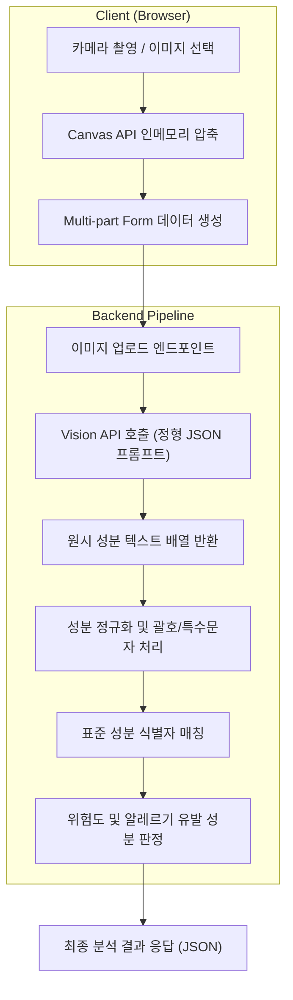

화장품 성분 분석 서비스 PickSafe를 개발하며 가장 먼저 부딪힌 기술적 난관은 사용자가 스마트폰으로 직접 촬영한 성분표 이미지를 안정적으로 텍스트화하고 분석 엔진에 전달하는 과정이었습니다.

스마트폰 카메라는 고해상도 이미지를 만들어내지만, 동시에 조명 반사, 곡면 용기로 인한 왜곡, 초점 흔들림, 작은 폰트 크기 등 다양한 노이즈를 포함합니다. 초기 프로토타입 단계에서 단순하게 이미지를 서버로 전송하고 일반 텍스트 추출을 시도했을 때, 실환경 이미지의 다양한 변수들로 인해 분석 실패율이 높았고 대용량 원본 이미지로 인한 네트워크 병목도 심각했습니다. 

이 문제를 해결하기 위해 클라이언트 사이드 이미지 최적화부터 백엔드 정규화까지의 파이프라인을 새롭게 설계했던 과정을 기록합니다.

---

## 🎯 마주한 고민과 문제 배경

초기 구현에서는 사용자가 촬영한 원본 사진을 그대로 서버로 업로드한 뒤 Vision 모델을 호출하여 텍스트를 파싱하도록 구성했습니다. 그러나 실제 테스트를 진행하면서 다음과 같은 세 가지 주요 문제가 드러났습니다.

1. **대용량 이미지 업로드로 인한 지연과 비용**: 모바일 기기에서 촬영된 4K 이상의 고용량 이미지(5MB~10MB)가 그대로 업로드되면서, 모바일 네트워크 환경에 따라 업로드에만 수 초 이상 소요되었습니다. 이는 백엔드 처리 지연과 외부 API 타임아웃 위험으로 이어졌습니다.
2. **구분자 누락 및 텍스트 뭉침**: 곡면 패키징이나 조명 반사로 인해 쉼표(`,`), 마침표(`.`) 같은 성분 구분 기호가 누락되면서 `정제수글리세린`과 같이 복합 성분이 하나의 단어로 인식되어 DB 매칭에 실패했습니다.
3. **표기 변형 및 비표준 성분명**: 구 성분명 표기(예: `디메치콘` ➔ 표준명 `다이메티콘`)나 `글리세린(식물성)`, `향료(리모넨 함유)`와 같이 괄호 내 부가 정보가 포함된 텍스트가 정형화되지 않아 표준 데이터베이스와의 일치율이 크게 떨어졌습니다.

---

## ⚖️ 기술적 대안 비교 및 선택 이유

성분표 이미지 처리의 효율성과 정확도를 동시에 잡기 위해 클라이언트와 백엔드 각각에서 대안을 검토했습니다.

| 구분 | 대안 A (서버 중심 처리) | 대안 B (클라이언트 전처리 + LLM Vision 구조) |
| :--- | :--- | :--- |
| **이미지 최적화** | 원본 업로드 후 서버(Pillow 등)에서 리사이징 | 브라우저 Canvas API 활용 인메모리 압축 후 전송 |
| **장점** | 클라이언트 연산 부하 없음, 일관된 리사이징 품질 | 네트워크 대역폭 대폭 절감, 서버 I/O 및 스토리지 부하 최소화 |
| **단점** | 느린 네트워크에서 업로드 Latency 누적 | 저사양 모바일 기기에서의 브라우저 렌더링 부하 고려 필요 |
| **선택 결과** | 기각 | **최종 선택 (대안 B)** |

서버 리소스가 제한적인 환경에서 수 메가바이트의 이미지를 직접 수신하고 변환하는 것은 네트워크 I/O 병목을 유발한다고 판단했습니다. 

모바일 브라우저의 `HTMLCanvasElement` API를 활용하면 수 메가바이트 크기의 이미지를 업로드 전 1200px 이하, Web-friendly 압축 포맷으로 실시간 변환할 수 있습니다. 이를 통해 이미지 파일 크기를 약 90% 이상 줄이면서도 OCR 엔진이 성분 텍스트를 판독하는 데 필요한 해상도를 유지할 수 있었습니다.

추출 단계에서는 단순 OCR 엔진 대신 시각적 구조 이해도가 높은 Vision API 기반 파이프라인을 채택하고, 프롬프트 엔지니어링을 통해 단순 텍스트가 아닌 정형화된 JSON 배열 형태로 추출 결과를 받도록 구성했습니다.

---

## 🏗️ 시스템 아키텍처 및 흐름

클라이언트에서 압축된 이미지가 서버로 전달되고, 성분 식별자로 정규화되기까지의 전체 흐름은 다음과 같습니다.



---

## 💻 핵심 구현 및 트러블슈팅

### 1. 클라이언트 사이드 Canvas 인메모리 압축

사용자가 고화질 사진을 선택하더라도 브라우저 메모리 상에서 즉시 리사이징 후 Blob 형태로 변환하여 전송하도록 구현했습니다.

```typescript
// 클라이언트 이미지 사전 압축 유틸리티 예시
export async function compressIngredientImage(file: File, maxDimension = 1200, quality = 0.85): Promise<Blob> {
  return new Promise((resolve, reject) => {
    const img = new Image();
    img.src = URL.createObjectURL(file);
    
    img.onload = () => {
      URL.revokeObjectURL(img.src);
      let { width, height } = img;

      // 비율 유지 리사이징
      if (width > height && width > maxDimension) {
        height = Math.round((height * maxDimension) / width);
        width = max