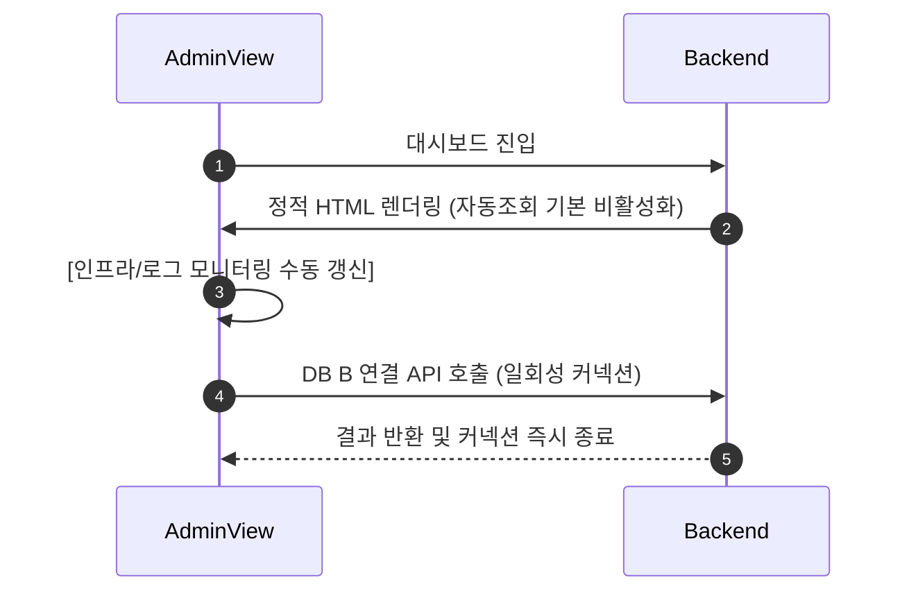

최근 스타트업과 소규모 개발 팀 사이에서 **Neon**과 같은 Serverless PostgreSQL은 매우 매력적인 선택지입니다. 사용한 만큼만 내는 과금 모델(Pay-as-you-go)과 유연한 Auto-scaling, 그리고 사용하지 않을 때 자동으로 데이터베이스를 잠재우는 **Auto-suspend** 기능 덕분에 인프라 운영 공수를 획기적으로 줄여주기 때문입니다.

하지만 편리함 이면에는 예기치 못한 **'과금 트랩'**이 존재합니다. 서버리스 DB의 핵심 과금 요소인 **Compute Unit(CU-Hours)**은 데이터베이스가 단 1초라도 깨어 있으면 지속해서 누적됩니다. 만약 무심코 설정한 어드민 페이지의 10초 주기 자동 폴링(Polling)이나 주기적인 배치 작업이 백그라운드에서 돌고 있다면 어떻게 될까요? DB는 단 1분도 쉬지 못하고 24시간 내내 활성화되어 엄청난 비용 청구서로 돌아오게 됩니다.

본 포스팅에서는 **PickSafe** 프로젝트를 개발하며 직면했던 Neon DB의 Compute 비용 문제를 해결하기 위해 적용한 **물리적 DB 격리 아키텍처(Double-Buffering)**와 **스마트 모니터링 폴링 제어 기법**, 그리고 **저비용 환경 맞춤형 최적화 전략**을 공유합니다.

---

## 1. 우리가 마주한 문제 (Problem)

저희 서비스는 대량의 식약처 API 성분 데이터를 수집(Seeding) 및 가공하고, 어드민 대시보드를 통해 서버 인프라 상태를 실시간 모니터링하는 구조를 가지고 있었습니다. 이 과정에서 크게 세 가지 병목과 비용 위협에 직면했습니다.

### ① 배치 부하와 실서비스의 간섭
약 2만 건에 달하는 대용량 성분 수집 및 매쉬업 배치 프로세스는 엄청난 CPU와 IOPS 리소스를 소모합니다. 이 작업이 실운영(Production) 데이터베이스에서 동시에 일어날 경우, 일반 사용자의 웹 서비스 응답 속도가 급격히 저하되는 성능 간섭 문제가 발생했습니다.

### ② DB가 잠들지 못하는 'Keep-Alive' 지옥
어드민 페이지에서는 실시간 서버 메트릭과 배치 로그를 모니터링하기 위해 백엔드에 주기적으로 자동 쿼리(Polling)를 요청하고 있었습니다. 이로 인해 Neon DB의 핵심 절약 기능인 **Auto-suspend(자동 일시정지)**가 작동하지 못하고 DB가 상시 활성화 상태를 유지하여 불필요한 CU(Compute Unit) 비용이 지속해서 누적되었습니다.

### ③ 인프라 제약 (No Redis, No Money)
저비용 클라우드 환경(Render 무료/저비용 플랜) 특성상 사용 가능한 메모리(RAM)가 극도로 제한적이었습니다. 비용 절감을 위해 외부 Redis 같은 별도의 인 메모리 캐시 서비스를 추가로 띄우는 것은 배보다 배꼽이 더 큰 상황이었습니다.

---

## 2. 해결을 위한 기술적 고민과 대안 비교 (Trade-off)

이 문제를 해결하기 위해 저희 팀은 몇 가지 아키텍처 대안을 두고 치열하게 고민했습니다.

### 대안 1: 단일 DB 내에서 스키마 분리 및 세션 제어
* **장점**: 관리 포인트가 하나로 유지되어 단순함.
* **단점**: 커넥션 풀을 공유하므로 배치 작업이 커넥션을 독점할 경우 실서비스 장애로 이어질 수 있음. 또한 모니터링 쿼리가 지속되는 한 DB 인스턴스 자체가 Sleep 상태로 들어갈 수 없어 비용 절감 불가능.

### 대안 2: 읽기 복제본(Read Replica) 도입
* **장점**: 실서비스 조회 성능을 확실히 보장할 수 있음.
* **단점**: Neon에서 복제본을 유지하는 것 역시 추가적인 Compute 비용을 유발하며, 우리의 주 타겟인 배치(Write) 부하 분산에는 완벽한 해결책이 되지 못함.

### 최종 선택: 물리적 이중화 격리 (Multi-DB Architecture) 및 이중 버퍼링(Double-Buffering)
우리는 일반 사용자용 **실운영 DB A(Master)**와 무거운 배치/로그용 **DW DB B(Staging)**를 물리적으로 완전히 격리하기로 결정했습니다.

```mermaid
flowchart TD
    UserApp[일반 사용자 App] -->|성분/제품 조회| DB_A[(실운영 DB A: Master)]
    AdminDash[어드민 대시보드] -->|수집 명령 / 모니터링 및 로그 쿼리| DB_B[(수집/배치 DB B: Staging)]
    
    subgraph Neon Project A (실운영 전용)
        DB_A
    end
    
    subgraph Neon Project B (수집/로그/모니터링 전용)
        DB_B
    end
    
    DB_B -->|🚀 최종 병합 Bulk Merge| DB_A
```

* **실운영 DB A (Master)**: 무거운 쓰기 작업이나 모니터링 쿼리가 원천 차단되므로 가장 슬림한 최저 스펙(예: 0.25 CU) 설정만으로 일정한 응답 속도를 유지합니다.
* **수집/배치 DB B (Staging & Log)**: 무거운 연산과 로그 적재를 도맡아 처리합니다. 이 DB의 핵심은 **Auto-suspend 타이머를 5분으로 매우 타이트하게 설정**하는 것입니다. 배치가 돌지 않거나 관리자가 대시보드를 보지 않을 때는 완벽히 잠들어 **기본 유지 비용을 0원에 가깝게 수렴**시킵니다.

---

## 3. 최종 구현 및 엔지니어링 디테일

비용 최적화와 안정성을 극대화하기 위해 구체적으로 적용한 3가지 핵심 엔지니어링 전략입니다.

### ① Double-Buffering 기반의 수집기 커넥션 격리
기존에는 수집(Seeding) 배치 작업 시, 이미 존재하는 성분인지 확인하기 위해 실운영 DB A에 지속해서 무수한 `SELECT` 쿼리를 날려 성능을 갉아먹었습니다. 

이를 개선하기 위해 수집 프로세스 중에는 실운영 DB A로의 커넥션을 완전히 차단했습니다. 오직 배치 DB B의 임시 테이블(`staging`) 내부에서 자체 플래그(`is_merged=True`)와 고유 식별값 존재 여부만 체크하며 작업을 완수합니다. 이후 관리가 어드민에서 **[병합(Merge)]** 버튼을 명시적으로 클릭하는 시점에만 **단 한 번의 벌크 트랜잭션(Bulk Transaction)**을 통해 DB B에서 DB A로 데이터를 안전하게 이관합니다.

또한, 데이터 초기화 동작 시 실운영 DB A의 핵심 테이블과 수집 DB B의 임시 테이블을 동시에 비우는 안전 장치(Double-Reset)를 마련하여 이중화 구조의 정합성을 완벽하게 맞추었습니다.

### ② 스마트 모니터링 폴링 제어 (Off-by-Default & Timeout)
관리자가 대시보드를 켜두고 자리를 비우더라도 DB B가 잠들 수 있도록 프론트엔드와 백엔드 간 통신 방식을 최적화했습니다.



* **Off-by-Default**: 대시보드 진입 시 실시간 인프라/로그 모니터링 갱신 스위치는 항상 **꺼짐(False)** 상태로 시작합니다. 필요할 때만 관리자가 수동으로 활성화합니다.
* **1시간 강제 타임아웃(Timeout)**: 스위치를 켜두고 퇴근하는 불상사를 막기 위해, 스위치가 켜진 지 1시간이 지나면 클라이언트 단에서 자동으로 갱신을 강제 중단(Off)합니다.
* **Page Visibility API 연동**: 브라우저 탭이 백그라운드로 내려가 관리자의 시야에서 벗어나면 폴링 주기 자체를 즉시 멈추도록 설계했습니다.

### ③ Render 환경 맞춤형 초경량 로컬 캐싱 (LRU Cache)
외부 Redis 캐시를 도입할 메모리 여유가 없었기에, 백엔드 애플리케이션(FastAPI) 프로세스 메모리 내에서 동작하는 초경량 **LRU(Least Recently Used) 캐시**(`cachetools`)를 적용했습니다.

```python
# FastAPI 내부 데코레이터 예시 (개념 증명용)
from cachetools import TTLCache, cached

# 최대 1000개의 성분 매칭 사전 정보를 1시간 동안 메모리에 캐싱
ingredient_cache = TTLCache(maxsize=1000, ttl=3600)

@cached(ingredient_cache)
def get_cached_ingredient_mapping(chemical_name: str):
    # 실제 DB A(Master) 조회를 수행하는 로직
    return db_query_ingredient(chemical_name)
```
변경 주기가 매우 낮은 성명 대칭 데이터 등 반고정 데이터에 캐시를 입힌 결과, 실운영 DB A로 도달하는 단순 조회 트래픽의 **최대 70%를 프로세스 레벨에서 방어**하여 DB 가동 시간(CU)을 극적으로 단축시켰습니다.

### ④ 안정적인 디스크 관리를 위한 로컬 로그 로테이션 (Daily Log Rotation)
수집 배치 작업을 길게 수행하면 로그 파일 용량이 무제한으로 커져 디스크 가득 참 현상이나 메모리 크래시를 유발할 수 있습니다.
이를 방지하기 위해 로그 시스템을 재설계했습니다.

* **디렉토리 격리**: 소스 코드 내에 로그가 쌓여 Git 추적을 방해하지 않도록, 프로젝트 루트의 독립된 `/log/` 폴더로 로그 출력을 격리하고 `.gitignore` 처리했습니다.
* **일자별 분할 및 크기 제한**: `seeding_run_YYYY-MM-DD.log` 형태로 일자별로 파일을 나누고, `RotatingFileHandler`를 장착하여 파일당 크기를 **최대 5MB**로 엄격히 제한했습니다. 백업본은 최대 1개만 유지하도록 설정하여 디스크 점유 총량이 평생 10MB를 넘지 않도록 안전 관리 장치를 구축했습니다.

---

## 4. 아키텍처 개선 성과 (Takeaway)

이번 아키텍처 고도화를 통해 저희 팀이 얻은 정량적/정성적 성과는 다음과 같습니다.

| 단계 | 작업 내용 | 예상 리소스 절감율 | 실제 비즈니스 임팩트 |
| :--- | :--- | :--- | :--- |
| **1단계** | **어드민 모니터링 자동 조회 기본 꺼짐(Off) 전환** | 약 30% CU 절감 | 관리자 부재 시 불필요한 야간 DB 활성화 차단 |
| **2단계** | **Multi-DB 설정 구성 (A/B 이중화)** | 배치 실행 시 DB A 무중단 | 헤비 수집 중에도 일반 사용자 응답 지연 시간 0ms 유지 |
| **3단계** | **FastAPI 백엔드 로컬 LRU 캐시 도입** | DB A 단순 조회 트래픽 70% 감소 | 메모리 추가 비용 없이 조회 API 응답 속도 향상 |
| **4단계** | **Neon DB B Auto-suspend 최적화** | DB B 평상시 요금 0원 실현 | 미사용 시간(하루 약 20시간 이상) 동안 완벽한 무과금 달성 |

### 💡 엔지니어링 교훈
1. **서버리스는 만능이 아닙니다**: "쓰는 만큼만 낸다"는 달콤한 약속은 개발자가 연결(Connection)을 엄격하게 관리할 때만 유효합니다. 작은 폴링 쿼리 하나가 시스템을 깨워 막대한 비용을 초래할 수 있음을 항상 유념해야 합니다.
2. **제약은 창의성을 만듭니다**: 인프라 비용 한계(No Redis)를 탓하기보다, 언어 레벨(Python LRU Cache) 및 프론트엔드 레벨(Page Visibility API)의 브라우저 기능을 조합하여 동일한 목적을 더 가볍고 똑똑하게 해결할 수 있었습니다.
3. **인프라와 과금 모델의 이해가 곧 아키텍처입니다**: 진정한 시니어 엔지니어링은 화려한 기술의 도입이 아니라, 사용 중인 플랫폼의 과금 요소를 정확히 파악하고 이를 회피하도록 소프트웨어를 정교하게 설계하는 설계 능력에서 나옵니다.