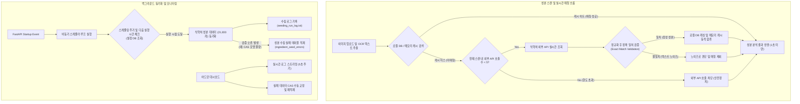

화장품 성분 분석 서비스인 PickSafe를 개발하며 가장 치열하게 고민했던 부분은 성분 매칭의 성능과 정확도였습니다. 사용자가 화장품 성분표 이미지를 업로드하면 OCR을 통해 성분명을 추출하고, 이를 마스터 데이터베이스 및 외부 공공 데이터와 대조하여 안전성 정보를 제공하는 것이 핵심 흐름입니다. 

그러나 초기 구현 이후, 실제 운영 환경에서 예상치 못한 병목과 데이터 정밀도 저하 문제를 마주하게 되었습니다. 제한된 인프라 리소스 속에서 이를 어떻게 극복하고 신뢰할 수 있는 시스템으로 개선했는지, 그 고민과 해결 과정을 담담히 기록해 봅니다.

---

## 🎯 마주한 고민과 문제 배경

### 1. 실시간 외부 API 호출로 인한 3분 대기 현상
초기 설계에서는 로컬 DB에 성분 데이터가 없을 경우, 실시간으로 식약처 공공 API를 조회하도록 구현했습니다. 하지만 이미지 OCR 과정에서 유입되는 '텍스트 노이즈(오타, 줄바꿈 기호, 성분이 아닌 문구 등)'가 문제였습니다. 

로컬 DB에 존재하지 않는 노이즈 문자열이 수십 개씩 발생하면, 시스템은 이 모든 무효한 문자열에 대해 실시간으로 외부 API 호출을 시도했습니다. 이로 인해 단 한 번의 스캔 요청에 수십 건의 외부 HTTP 통신이 발생했고, 외부 API의 응답 지연이 누적되면서 스캔 응답 시간이 최대 3분까지 늘어나거나 연결이 끊어지는 심각한 병목 현상이 발생했습니다.

### 2. '가공소금' 오발 매칭 문제 (데이터 정확도 저하)
외부 API는 입력된 검색어와 유사한 성분을 추천해 주는 퍼지(Fuzzy) 검색 방식으로 동작하는 경우가 많았습니다. 이 때문에 OCR이 잘못 인식한 무의미한 알파벳이나 한글 노이즈 문자열을 외부 API에 검색했을 때, 검색 결과의 첫 번째 항목으로 엉뚱하게 '가공소금'이나 전혀 상관없는 화학 물질이 반환되는 현상이 있었습니다. 

이 데이터가 그대로 로컬 DB에 캐싱되면서, 사용자는 화장품 성분표를 스캔했는데 정작 분석 결과 화면에는 존재하지도 않는 '가공소금'이 포함되어 출력되는 데이터 무결성 결함으로 이어졌습니다.

### 3. 동의 절차의 파편화와 다국어 지원의 부재
사용자 온보딩 과정에서 이용약관(TOS), 개인정보처리방침, 민감 정보 수집 동의가 정돈되지 않은 채 수집되고 있었습니다. 또한, 글로벌 사용자를 대응하기 위해 브라우저 로케일에 따라 적절한 언어의 약관을 보여주어야 했으나, 예외 처리가 촘촘하지 않아 특정 언어 팩이 누락되면 페이지 자체가 에러를 뿜는 현상이 있었습니다.

---

## ⚖️ 기술적 대안 비교 및 선택 이유

### 1. 실시간 API 호출 안전장치 설계
외부 API 호출 지연과 오발 매칭을 방지하기 위해 두 가지 설계 대안을 비교했습니다.

| 비교 항목 | 대안 A: 완전 로컬 매칭 방식 | 대안 B (선택): 하이브리드 캐시 + 상한선 제어 및 정확 일치 검증 |
| :--- | :--- | :--- |
| **개념** | 외부 API 실시간 조회를 완전히 차단하고, 배치로 동기화된 로컬 DB 내에서만 매칭을 수행함. | 실시간 조회를 허용하되, 스캔당 호출 횟수를 엄격히 제한하고 반환된 데이터의 동등성을 정밀 검증함. |
| **스캔 속도** | 극도로 빠름 (1초 미만). 외부 통신 없음. | 빠름 (최대 5회 호출 제한으로 1~2초 내 응답 보장). |
| **데이터 커버리지** | 신규 성분이나 미등록 성분의 즉각적인 반영이 불가능함. | 처음 발견된 신규 유효 성분도 실시간으로 포착하여 DB에 캐싱 가능. |
| **오발 매칭 위험** | 없음. | **정확 일치 검증(Exact Match Validation)**을 도입하여 원천 차단 가능. |

*   **결정 이유**: 사용자가 새로 출시된 화장품을 스캔했을 때도 유연하게 대응하기 위해 **대안 B**를 선택했습니다. 단, 무분별한 호출을 막기 위해 **스캔당 API 호출을 최대 5회로 강제 제한**하고, 외부 API가 반환한 성분명과 입력된 노이즈 문자열을 정규화하여 **정확하게 일치하는 경우에만** DB 캐시에 적재하도록 안전장치를 재설계했습니다.

### 2. 백그라운드 동기화 스케줄러 구현 방식
식약처의 전체 성분 데이터(약 21,833개)를 로컬 DB에 주기적으로 동기화하기 위한 스케줄러가 필요했습니다.

*   **대안 A: Celery + Redis 조합**
    *   *장점*: 강력한 분산 작업 큐 및 스케줄링 기능 제공.
    *   *단점*: 컨테이너 리소스를 추가로 소모하며, 단일 인스턴스로 운영되는 현재의 제한된 서버 환경에서는 오버헤드가 큼.
*   **대안 B (선택): FastAPI Startup Event + 비동기 백그라운드 루프**
    *   *장점*: 별도의 외부 미들웨어(Redis 등) 없이 FastAPI 프로세스 내에서 가볍게 비동기 스레드로 구동 가능. 설정 값을 DB에서 실시간으로 조회하여 주기를 동적으로 변경하기 용이함.
    *   *단점*: 멀티 인스턴스로 확장 시 중복 실행 방지 로직이 필요하나, 현재 단일 인스턴스 환경에서는 가장 효율적이고 비용 친화적임.
    *   *선택 이유*: 인프라 유지 비용 최적화와 단순함을 위해 **대안 B**를 구현하기로 결정했습니다.

---

## 🏗️ 시스템 아키텍처 및 흐름

PickSafe의 성분 매칭 및 백그라운드 동기화 아키텍처는 다음과 같이 구성되어 있습니다.



---

## 💻 핵심 구현 및 트러블슈팅

### 1. 실시간 API 호출 상한선 제어 및 정확 일치 검증 구현
`ingredient_matcher.py`에서 구현한 핵심 매칭 로직입니다. 스캔당 호출 제한 횟수를 제어하고, 정규화를 통해 정확히 일치하는 데이터만 캐싱하도록 필터링합니다.

```python
# ingredient_matcher.py
import re
from typing import List, Optional
from app.models.ingredient import IngredientMaster # 추상화된 성분 마스터 모델

class IngredientMatcher:
    def __init__(self, db_session):
        self.db = db_session
        self.max_api_calls = 5  # 스캔당 외부 API 호출 최대 상한선

    def normalize_string(self, text: str) -> str:
        """대소문자 통일 및 공백, 특수문자 제거로 정규화 수행"""
        if not text:
            return ""
        return re.sub(r'[^a-zA-Z0-9가-힣]', '', text).lower()

    async def match_ingredients(self, extracted_texts: List[str]) -> List[dict]:
        matched_results = []
        api_call_count = 0

        for text in extracted_texts:
            normalized_input = self.normalize_string(text)
            if not normalized_input:
                continue

            # 1단계: 로컬 DB 및 캐시 검색
            local_ingredient = self._search_local_db(normalized_input)
            if local_ingredient:
                matched_results.append(local_ingredient)
                continue

            # 2단계: 캐시 미스 시 외부 API 호출 제어 (최대 5회)
            if api_call_count < self.max_api_calls:
                api_call_count += 1
                external_data = await self._fetch_from_external_api(text)

                if external_data:
                    # 정확 일치 검증 (Exact Match Validation)
                    # 외부 API가 반환한 한글명/영문명과 입력값을 비교
                    api_kor_norm = self.normalize_string(external_data.get("ko_name"))
                    api_eng_norm = self.normalize_string(external_data.get("en_name"))

                    if normalized_input in (api_kor_norm, api_eng_norm):
                        # 검증 통과 시 로컬 DB에 캐싱 및 결과 추가
                        self._save_to_local_db(external_data)
                        matched_results.append(external_data)
                        continue
                    else:
                        # 무의미한 유사 검색 결과(예: 가공소금 오발 매칭)는 노이즈로 판단하여 폐기
                        logger.warning(f"Exact match failed for input: {text}. API returned: {external_data.get('ko_name')}")
            
            # 3단계: 매칭 실패 혹은 호출 제한 초과 시 패스
            logger.info(f"Skipping or failed to match: {text}")
            
        return matched_results
```

### 2. 백그라운드 비동기 스케줄러 구현
FastAPI 시작 시 상시 비동기 스레드 루프로 구동되는 스케줄러의 핵심 구조입니다.

```python
# scheduler.py
import asyncio
import datetime
from app.services.seeding_service import SeedingService

async def seeding_scheduler_loop():
    """웹 서비스와 함께 기동되어 주기를 체크하는 백그라운드 비동기 루프"""
    logger.info("Background seeding scheduler loop started.")
    while True:
        try:
            # 1. 설정 DB로부터 자동 수집 주기 및 활성화 여부 조회
            settings = await SeedingService.get_schedule_settings()
            
            if settings and settings.is_active:
                now = datetime.datetime.utcnow()
                if settings.next_run_time <= now:
                    logger.info("Scheduled time reached. Starting full ingredient sync...")
                    
                    # 2. 백그라운드에서 식약처 데이터 동기화 실행 (21,833개)
                    await SeedingService.run_sync()
                    
                    # 3. 다음 실행 시간 업데이트 및 로그 기록
                    await SeedingService.update_next_run_time(settings)
                    
        except Exception as e:
            logger.error(f"Error in scheduler loop: {str(e)}")
            
        # 60초마다 설정 상태 재확인
        await asyncio.sleep(60)
```

### 3. 트러블슈팅: CAS 번호 포맷 불량 데이터의 강제 구정 재적재
공공 데이터를 대량 수집하다 보면, 일부 데이터의 화학물질 식별번호(CAS No) 형식이 누락되었거나 비표준 포맷으로 기입되어 DB 제약조건(Validation Error)을 위배하는 상황이 발생했습니다. 초기에는 동기화 배치 전체가 롤백되는 참사가 있었습니다.

이를 해결하기 위해 **예외 처리 파이프라인**을 재구축했습니다.
1.  동기화 중 오류가 발생한 성분은 배치를 중단시키지 않고, 오류 내용과 함께 `ingredient_seed_errors` (성분 수집 실패 테이블)에 적재합니다.
2.  어드민 관리자 화면에 해당 에러 리스트를 실시간으로 노출합니다.
3.  관리자가 올바른 CAS 번호(`CAS-XXXX`)를 수동으로 교정 입력할 수 있는 인터페이스를 제공하고, **"재적재" 버튼 클릭 시 유효성 검증을 다시 거쳐 DB에 강제 반영한 뒤 실패 목록에서 즉시 제외**하도록 구현했습니다.

```python
# admin_service.py (CAS 오류 데이터 수동 교정 및 재적재 API 부분)
@router.post("/admin/ingredients/re-seed/{error_id}")
async def re_seed_ingredient(error_id: int, corrected_cas: str, db: Session = Depends(get_db)):
    # 1. 실패 기록 조회
    error_record = db.query(IngredientSeedError).filter_id(error_id).first()
    if not error_record:
        raise HTTPException(status_code=404, detail="Error record not found")

    # 2. CAS 번호 표준 포맷 검증 (예: [0-9]{2,7}-[0-9]{2}-[0-9])
    if not re.match(r'^\d{2,7}-\d{2}-\d$', corrected_cas):
        raise HTTPException(status_code=400, detail="Invalid CAS number format")

    try:
        # 3. 수정된 값으로 성분 마스터 테이블에 강제 적재
        new_ingredient = IngredientMaster(
            cas_no=corrected_cas,
            ko_name=error_record.raw_ko_name,
            en_name=error_record.raw_en_name,
            safety_grade=error_record.safety_grade
        )
        db.add(new_ingredient)
        
        # 4. 실패 이력 테이블에서 삭제
        db.delete(error_record)
        db.commit()
        return {"status": "success", "message": "Ingredient successfully re-seeded after CAS correction."}
    except Exception as e:
        db.rollback()
        raise HTTPException(status_code=500, detail=f"Database write failed: {str(e)}")
```

---

## 💡 돌아보며 배운 점 (회고)

### 1. 실질적인 개선 효과
*   **스캔 속도의 비약적 향상**: 무분별한 외부 실시간 API 호출을 차단하고 로컬 캐싱과 호출 상한선(Max 5)을 적용한 결과, 노이즈가 많은 이미지 스캔 시 **최대 3분 이상 걸리던 응답 시간이 평균 1초 내외로 단축**되었습니다.
*   **데이터 신뢰도 회복**: 정규화 기반의 **정확 일치 검증(Exact Match Validation)**을 도입한 이후, 분석 결과에 뜬금없이 '가공소금'이 출력되던 데이터 정합성 오류가 완벽히 해결되었습니다.
*   **운영 가시성 확보**: 5초 주기로 갱신되는 어드민 실시간 로그 터미널과 실패 데이터 수동 재적재 인터페이스 덕분에, 주기적인 배치 동기화 과정에서 발생하는 데이터 누락 문제를 개발자의 개입 없이 모니터링 화면에서 즉각 대응할 수 있게 되었습니다.

### 2. 엔지니어링 교훈
흔히 대용량 트래픽이나 복잡한 분산 환경을 해결하기 위해 Celery, Redis, Kafka 같은 무거운 도구들을 먼저 떠올리곤 합니다. 하지만 인프라 리소스가 극도로 제한된 환경에서는 시스템의 아키텍처를 무겁게 가져가는 것보다, **문제가 발생하는 지점의 본질(외부 API 호출 병목과 오발 매칭)을 파악하고 비즈니스 규칙(호출 상한선 및 정확성 필터링)을 정교하게 다듬는 것**이 훨씬 비용 효율적이고 강력한 해결책이 될 수 있음을 깊이 깨달았습니다.

앞으로는 OCR 단계에서 텍스트 노이즈를 일차적으로 걸러내는 전처리 필터를 강화하여, 외부 API 호출 시도 자체를 더욱 줄여나갈 계획입니다. 단단하고 담백한 코드가 결국 운영의 안정성을 보장한다는 사실을 다시 한번 가슴에 새깁니다.