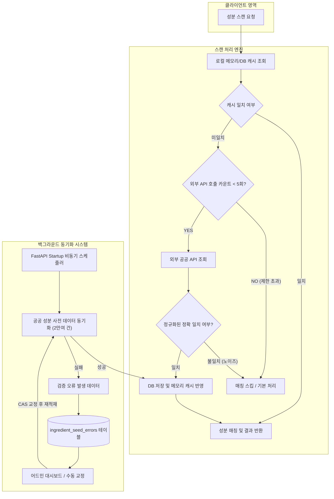

화장품 성분 분석 서비스 **PickSafe**를 개발하면서, 이미지 속 성분표 문자를 읽어 들여 데이터를 분석하는 파이프라인에서 심각한 병목 현상을 마주했습니다. 

제품 성분표 이미지 특성상 OCR 과정에서 오탈자나 노이즈 문자열이 자주 포함되는데, 이를 처리하는 초기 로직이 외부 공공데이터 API에 과도하게 의존하도록 작성되어 있었기 때문입니다. 이 글에서는 스캔 성능 지연을 보완하고 데이터 동기화 아키텍처를 개선한 과정을 담백하게 기록해 둡니다.

---

## 🎯 마주한 고민과 문제 배경

### 1. 외부 API 동기 호출로 인한 지연과 오매칭
초기 설계에서는 이미지 스캔 요청이 들어왔을 때 로컬 DB나 캐시에 존재하지 않는 성분 문자열이 발견되면, 그 즉시 외부 공공 API를 실시간 호출하여 조회했습니다. 

그러나 성분표 이미지의 노이즈 문자열이 늘어날수록 다음과 같은 두 가지 치명적인 문제가 발생했습니다.

1. **지연 시간 폭증**: 하나의 스캔 요청에서 미매칭 노이즈 문자열마다 외부 API를 순차 호출하면서, 스캔 응답 시간이 최대 **3분 이상**까지 늘어나는 현상이 일어났습니다.
2. **유사 검색 결과의 오발 매칭**: 외부 API의 유사 검색 결과 중 최상단 항목을 검증 없이 수용하다 보니, 의미 없는 노이즈 문자열이 '가공소금' 같은 엉뚱한 성분 데이터와 결합되는 정확도 저하 문제가 발생했습니다.

### 2. 마스터 데이터 수집 및 실패 관리의 부재
외부 API 실시간 호출 의존도를 낮추려면 공공 성분 사전 데이터(2만 여건)를 사전에 로컬 DB로 동기화해야 했습니다. 

그러나 메인 웹 서비스 실행 환경에 부담을 주지 않으면서 대량의 데이터를 백그라운드로 안전하게 적재하고, 데이터 형식 불량(예: CAS 번호 오류)으로 실패한 항목을 추적·교정할 모니터링 체계가 부족했습니다.

---

## ⚖️ 기술적 대안 비교 및 선택 이유

### 1. 스캔 실시간 조회 개선안 비교

* **대안 A: 유사도 검색 범위 확장 및 타임아웃 처리**
  * 장점: 기존 구조를 거의 수정하지 않고 적용 가능.
  * 단점: 노이즈 문자열이 많을 때 외부 API 응답을 기다려야 하는 본질적인 병목이 해결되지 않으며, 잘못된 성분 매칭(False Positive) 위험이 여전히 남음.
* **대안 B: 정규화 기반 정확 일치(Exact Match) 검증 + 스캔당 외부 API 호출 제한 (선택)**
  * 장점: 노이즈 문자열에 대한 외부 API 호출 횟수를 엄격히 제한하여 응답 시간을 **1~2초 내로 보장**. 정규화된 완벽 일치 데이터만 DB 및 캐시에 반영하여 데이터 오염 차단.
  * 단점: 미등록 성분의 경우 수동 검증이나 백그라운드 수집 주기까지 조회가 유예될 수 있음.

> **선택 이유**: 서비스 품질을 결정짓는 핵심 요소는 **빠른 스캔 속도**와 **정확한 성분 판정**이었습니다. 응답 시간을 지연시키는 불확실한 실시간 조회보다는, 엄격한 호출 제어와 정규화 검증을 도입하는 것이 타당하다고 판단했습니다.

### 2. 마스터 데이터 동기화 아키텍처 비교

* **대안 A: 별도의 분산 큐(Celery + Redis) 및 워커 파이프라인 도입**
  * 장점: 작업 분리 및 스케일아웃이 용이함.
  * 단점: 현 단계의 인프라 리소스 대비 관리 포인트가 복잡해지며 운영 오버헤드가 증가함.
* **대안 B: FastAPI 내장 비동기 백그라운드 스케줄러 + DB 기반 상태 및 오류 관리 (선택)**
  * 장점: 추가 인프라 구축 없이 단일 애플리케이션 내에서 비동기 스레드로 안정적인 수집 루프 실행 가능.
  * 단점: 메인 프로세스 종료 시 백그라운드 작업 영향도를 고려해야 하므로, 상태 저장 및 재시도 로직을 DB 스키마 수준에서 정밀하게 설계해야 함.

> **선택 이유**: 제한된 인프라 리소스에서 효율적인 가동을 위해, 웹 애플리케이션 시작 시 구동되는 비동기 스케줄러 루프를 활용하고 failure 전용 테이블을 두어 모니터링하는 방식을 선택했습니다.

---

## 🏗️ 시스템 아키텍처 및 흐름

전체 스캔 파이프라인과 백그라운드 데이터 동기화 시스템의 구조는 아래와 같습니다.



---

## 💻 핵심 구현 및 트러블슈팅

### 1. 스캔당 외부 API 호출 제한 및 정확 일치 검증

스캔 응답 지연을 방지하기 위해 요청 1건당 실시간 외부 API 호출을 최대 5회로 제한하는 안전장치를 설치했습니다. 또한, 외부 API에서 반환된 성분명과 입력 문자열을 대소문자 및 공백 제거 정규화를 거쳐 완전 일치하는 경우에만 신규 성분으로 DB와 메모리에 반영하도록 구성했습니다.

```python
# [핵심 개념 구현 예시] 스캔 처리 내 안전장치 로직

MAX_EXTERNAL_API_CALLS = 5

async def process_ingredient_scan(scan_tokens: list[str]) -> list[dict]:
    matched_results = []
    api_call_count = 0

    for token in scan_tokens:
        # 1. 로컬 캐시 및 DB 조회
        ingredient = await find_in_local_cache_or_db(token)
        if ingredient:
            matched_results.append(ingredient)
            continue

        # 2. 외부 API 호출 제한 검사 (Circuit Breaker 역할)
        if api_call_count >= MAX_EXTERNAL_API_CALLS:
            # 호출 한도 초과 시 더 이상 외부 조회를 수행하지 않고 고속 응답
            continue

        # 3. 외부 API 조회 및 Exact Match 검증
        api_call_count += 1
        raw_data = await fetch_from_external_api(token)
        
        if raw_data and is_exact_match(token, raw_data.get("name")):
            # 검증된 유효 성분만 DB 저장 및 로컬 캐시에 동적 합류
            saved_ingredient = await save_to_db_and_cache(raw_data)
            matched_results.append(saved_ingredient)

    return matched_results

def is_exact_match(input_str: str, target_str: str) -> bool:
    """공백 제거 및 대소문자 통일을 통한 엄격한 일치 검증"""
    if not input_str or not target_str:
        return False
    normalized_input = "".join(input_str.split()).lower()
    normalized_target = "".join(target_str.split()).lower()
    return normalized_input == normalized_target
```

이 안전장치 도입으로 수십 개의 노이즈 문자열이 들어오더라도 external fetch 횟수가 제한되어 스캔 타임아웃 현상을 제거할 수 있었습니다.

---

### 2. 백그라운드 동기화 스케줄러와 실패 데이터 관리

실시간 API 조회를 제한하는 대신, 공공데이터의 성분 정보는 백그라운드에서 주기적으로 수집되도록 설계했습니다. 

FastAPI의 startup 이벤트를 활용해 백그라운드 루프를 실행하고, 수집 중 포맷 불량으로 무시되는 데이터는 `ingredient_seed_errors` 테이블에 기록하여 관리자가 UI에서 교정 후 재적재할 수 있도록 조치했습니다.

```python
# [핵심 개념 구현 예시] 백그라운드 스케줄러 루프 및 에러 격리

@app.on_event("startup")
async def start_seeding_scheduler():
    # 애플리케이션 시작 시 백그라운드 스케줄러 루프 실행
    asyncio.create_task(run_seeding_scheduler_loop())

async def run_seeding_scheduler_loop():
    while True:
        try:
            schedule_config = await get_current_schedule_config()
            if schedule_config.is_due():
                await execute_ingredient_seeding()
        except Exception as e:
            logger.error(f"스케줄러 수행 중 예외 발생: {str(e)}")
        
        # 주기적인 체크 대기 (예: 1분 간격)
        await asyncio.sleep(60)

async def execute_ingredient_seeding():
    items = await fetch_all_master_data()
    for item in items:
        try:
            validate_and_upsert_ingredient(item)
        except ValidationError as ve:
            # CAS 번호 포맷 오류 등의 데이터는 에러 테이블에 기록하여 관리자 UI로 이관
            await log_seeding_error(
                raw_data=item, 
                error_message=str(ve),
                status="PENDING_RETRY"
            )
```

어드민 화면에서는 실패 이력을 실시간 모니터링하고, 관리자가 오기재된 화학물질 식별번호(CAS No)를 수정하여 버튼 클릭 시 즉시 재적재할 수 있는 인터페이스를 갖추었습니다.

---

### 3. 이용약관 및 다국어 폴백 체인 구축

서비스 이용자 보호 및 글로벌 사용성을 감안하여 동의 수집 파이프라인도 함께 정비했습니다. 

단순히 언어별 약관을 만드는 것에 그치지 않고, 시스템에 요청된 언어 데이터가 없을 경우 **`요청 언어` $\rightarrow$ `영어(en)` $\rightarrow$ `한국어(ko)`** 순으로 순회하여 출력되는 다국어 폴백 체인을 구성했습니다.

```python
# [핵심 개념 구현 예시] 약관 다국어 폴백 로직

SUPPORTED_LANGUAGES = ["ko", "en", "pt"]

def get_terms_document(doc_type: str, requested_lang: str) -> str:
    # 1. 요청한 언어 파일 확인
    if requested_lang in SUPPORTED_LANGUAGES:
        doc_path = f"docs/consent/{doc_type}_{requested_lang}.md"
        if os.path.exists(doc_path):
            return read_file(doc_path)
            
    # 2. 영어(en) 파일 폴백
    en_path = f"docs/consent/{doc_type}_en.md"
    if os.path.exists(en_path):
        return read_file(en_path)
        
    # 3. 최후의 보루: 한국어(ko) 파일 반환
    return read_file(f"docs/consent/{doc_type}_ko.md")
```

온보딩 과정에서 필수 약관 동의 이력이 확인되지 않으면 동의 페이지로 리다이렉트 처리하고, 소셜 로그인 전환 시에도 동의 이력이 DB 트랜잭션에 포함되도록 개선했습니다.

---

## 💡 돌아보며 배운 점 (회고)

### 1. 실질적인 개선 효과
* **스캔 속도 향상**: 노이즈 문자열이 많이 포함된 이미지를 처리할 때 발생하던 **최대 3분 지연 현상이 1초 내외로 단축**되었습니다.
* **데이터 신뢰성 확보**: 유사 검색 결과 오발 매칭 현상이 사라지고, 완벽히 정규화 일치하는 성분만 로컬 데이터베이스에 캐싱되도록 개선되었습니다.
* **운영 안정성 제고**: 백그라운드 동기화 스케줄러와 오류 교정 인터페이스를 통해 공공 성분 사전 수집 시 발생하는 데이터 결함을 관리자 화면에서 안정적으로 보완할 수 있게 되었습니다.

### 2. 엔지니어링 관점의 교훈
핵심 서비스 파이프라인 내에 외부 API 조회를 동기적으로 결합하는 것은 인프라의 안정성을 외부 요소에 완전히 위임하는 위험한 구조였습니다.

이번 개선 작업을 통해 **"사용자 응답 경로에는 엄격한 제어 및 캐시를 적용하고, 대용량 동기화 작업은 비동기 백그라운드로 격리한다"**는 본질적인 원칙을 직접 구현하며 시스템의 단단함을 높일 수 있었습니다. 추후 성분 데이터의 양이 늘어나더라도 안정적으로 동작할 수 있는 백엔드 기초 체력을 다진 값진 경험이었습니다.