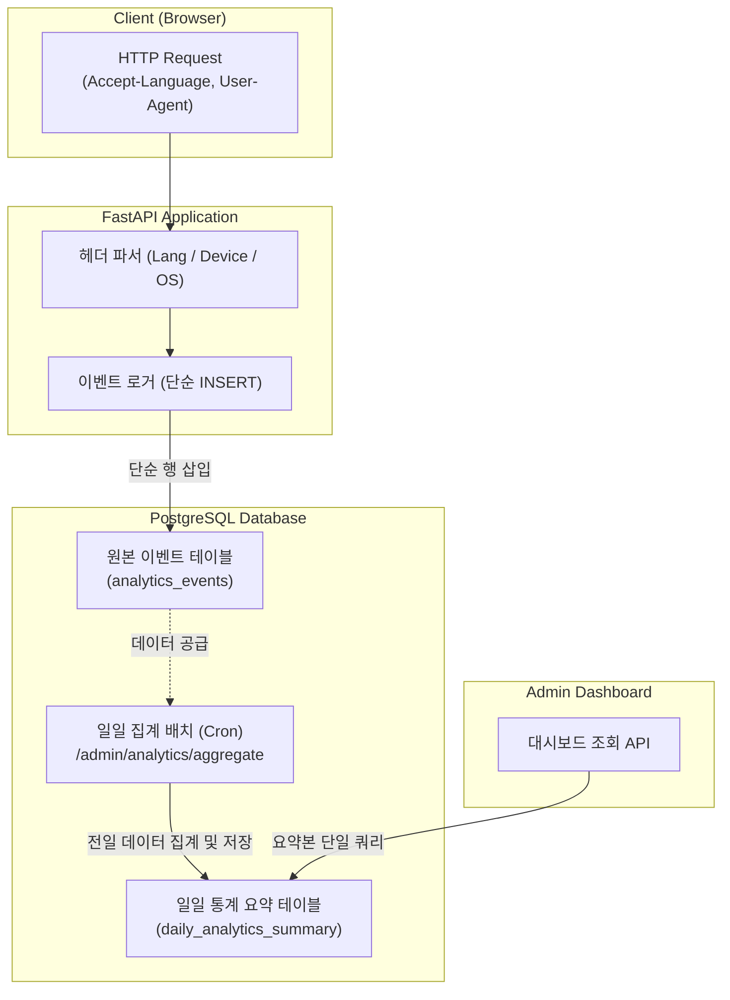

## 🎯 마주한 고민과 문제 배경

PickSafe의 관리자 대시보드를 구성하면서 방문자 분석과 텔레메트리 수집 범위를 어떻게 정의할 것인가에 대한 고민이 깊었습니다. 초기에는 접속자의 상세 위치를 지도에 시각화하거나 실시간 세션 목록, 접속 통신망(ISP) 정보 등 일반적인 웹 분석 툴에서 제공하는 다양한 지표를 모두 수집하는 방안도 검토했습니다.

하지만 이러한 허상 지표(Vanity Metrics)들은 시스템 리소스를 과도하게 소모할 뿐만 아니라, 서비스의 실제 핵심 타깃 환경에서 심각한 데이터 왜곡을 유발한다는 점을 발견했습니다.

1. **GeoIP 기반 국가 분석의 구조적 한계**  
   PickSafe는 한국을 방문한 외국인 관광객이 현지 화장품의 전성분을 분석하는 시나리오가 핵심입니다. 이들은 대부분 한국 현지 통신사의 선불 USIM이나 로밍망을 사용합니다. 따라서 접속 IP를 기반으로 국가를 판별하는 GeoIP(MaxMind 등) 방식을 사용하면, 실제로는 일본인이나 미국인 관광객임에도 접속 국적이 모두 "KR(한국)"로 오조회되었습니다. 다국어 우선순위 결정을 위한 데이터로서의 신뢰도가 전혀 없었습니다.

2. **제한된 데이터베이스 리소스와 쿼리 부하**  
   사용자 요청마다 복합적인 세션 데이터를 기록하고, 관리자가 대시보드를 열 때마다 대량의 원본 로그에 `COUNT`나 `GROUP BY` 같은 무거운 집계 연산을 실시간으로 실행하는 것은 제한된 DB 커넥션과 쿼리 대역폭 환경에서 큰 병목을 유발할 수밖에 없었습니다.

3. **개인정보 보관 리스크**  
   정밀한 추적을 위해 IP 주소나 브라우저 핑거프린팅 데이터를 그대로 저장하는 것은 보안 및 개인정보 관리 관점에서도 불필요한 부담이었습니다.

따라서 실질적인 운영 의사결정에 직결되는 지표만을 선별하고, 데이터베이스 부하를 최소화하는 가벼운 분석 파이프라인이 필요했습니다.

---

## ⚖️ 기술적 대안 비교 및 선택 이유

수집 지표의 범위를 좁히고 신뢰할 수 있는 데이터를 얻기 위해 기술 대안들을 검토했습니다.

### 1. 사용자 언어권 식별 방식

| 비교 항목 | 접속 IP 기반 GeoIP 조회 | 브라우저 `Accept-Language` 헤더 파싱 (선택) |
| :--- | :--- | :--- |
| **정확도** | 현지 로밍/USIM 사용 시 무조건 "KR"로 왜곡 | 사용자의 실제 기기 시스템/브라우저 언어 반영 |
| **외부 의존성** | GeoIP DB 파일 갱신 또는 외부 API 호출 필요 | HTTP 표준 헤더 파싱만으로 추가 오버헤드 없음 |
| **개인정보** | 접속 IP 주소의 수집 및 처리가 수반됨 | IP를 저장하지 않고 언어 코드만 추출하여 안전 |

방한 외국인의 기기 언어 분포를 정확히 측정하기 위해 GeoIP 조회를 전면 배제하고, HTTP 요청 헤더의 `Accept-Language` 중 최우선 로케일 값을 파싱하여 기록하기로 결정했습니다.

### 2. 기기 사양 트래킹 및 파싱 방식

무거운 외부 User-Agent 파싱 라이브러리를 추가하여 종속성을 늘리는 대신, 핵심 분류(기기 유형: Mobile/Tablet/Desktop, OS: iOS/Android/Windows/macOS 등)에 특화된 경량 정규표현식(RegEx) 파서를 자체 구현하여 `User-Agent` 헤더를 즉시 분석하도록 설계했습니다.

### 3. 지표 수집 범위 압축 (3대 핵심 지표)

실시간 분석을 과감히 포기하고, 프로덕트 개선에 직접적으로 기여하는 세 가지 지표로 수집 대상을 엄격히 한정했습니다.

1. **언어 분포**: 다국어 번역 지원 우선순위 검증.
2. **온보딩 완료율 vs 건너뛰기율**: 기피 성분 설정 온보딩의 이탈 장벽 및 콜드스타트 진척도 확인.
3. **게스트 ➔ 회원 전환율**: 비회원 장벽 완화 UI/UX의 전환 효과 검증.

---

## 🏗️ 시스템 아키텍처 및 흐름

요청 처리 단계에서의 오버헤드를 줄이고 대시보드 조회 시의 DB 부하를 차단하기 위해 **단순 로그 적재**와 **배치 일일 집계**를 분리한 2단계 파이프라인을 구축했습니다.



---

## 💻 핵심 구현 및 트러블슈팅

### 1. HTTP 헤더 기반 경량 파서 구현

`Accept-Language` 헤더의 Quality Value(`q=`)를 고려하여 가장 우선순위가 높은 언어 코드를 추출하고, `User-Agent`에서 기기 및 OS 정보를 분리하는 헬퍼 함수를 구현했습니다.

```python
import re
from typing import Tuple

def extract_primary_language(accept_language_header: str | None) -> str:
    if not accept_language_header:
        return "unknown"
    
    # "ja,en-US;q=0.9,en;q=0.8" 형태에서 최우선 언어 추출
    languages = accept_language_header.split(",")
    if not languages:
        return "unknown"
    
    primary = languages[0].split(";")[0].strip().lower()
    return primary[:5] if primary else "unknown"


def parse_device_and_os(user_agent: str | None) -> Tuple[str, str]:
    if not user_agent:
        return "Unknown", "Other"
    
    ua = user_agent.lower()
    
    # OS 판별
    if "iphone" in ua or "ipad" in ua or "ipod" in ua:
        os = "iOS"
    elif "android" in ua:
        os = "Android"
    elif "windows" in ua:
        os = "Windows"
    elif "macintosh" in ua or "mac os x" in ua:
        os = "macOS"
    elif "linux" in ua:
        os = "Linux"
    else:
        os = "Other"
        
    # 기기 유형 판별
    if "ipad" in ua or ("android" in ua and "mobile" not in ua):
        device_type = "Tablet"
    elif "mobile" in ua or "iphone" in ua or "ipod" in ua:
        device_type = "Mobile"
    else:
        device_type = "Desktop"
        
    return device_type, os
```

### 2. 일일 집계 배치 엔드포인트 설계

실시간으로 무거운 통계 쿼리를 날리는 대신, 매일 자정 스케줄러를 통해 전날의 데이터를 1회 집계하여 요약 테이블에 적재하는 엔드포인트를 구성했습니다.

```python
from fastapi import APIRouter, Depends, HTTPException, status
from sqlalchemy.orm import Session
from sqlalchemy import text
from datetime import date, timedelta

router = APIRouter(prefix="/admin/analytics", tags=["Admin-Analytics"])

@router.post("/aggregate")
def aggregate_daily_metrics(
    target_date: date | None = None,
    db: Session = Depends(get_db),
    api_key: str = Depends(verify_admin_cron_key)
):
    # 기본값은 어제 날짜 집계
    calc_date = target_date or (date.today() - timedelta(days=1))
    
    # 멱등성 보장을 위해 기존 집계 데이터가 있다면 삭제 후 재생성
    db.execute(
        text("DELETE FROM daily_analytics_summary WHERE summary_date = :calc_date"),
        {"calc_date": calc_date}
    )
    
    # 원본 로그 테이블로부터 일괄 집계 쿼리 실행
    aggregate_query = text("""
        INSERT INTO daily_analytics_summary (
            summary_date,
            total_visits,
            language_distribution,
            device_distribution,
            onboarding_completed_count,
            onboarding_skipped_count,
            guest_to_member_count
        )
        SELECT
            :calc_date,
            COUNT(*),
            jsonb_object_agg(lang, lang_count),
            jsonb_object_agg(device, device_count),
            COALESCE(SUM(CASE WHEN event_type = 'ONBOARDING_COMPLETE' THEN 1 ELSE 0 END), 0),
            COALESCE(SUM(CASE WHEN event_type = 'ONBOARDING_SKIP' THEN 1 ELSE 0 END), 0),
            COALESCE(SUM(CASE WHEN event_type = 'SIGNUP_FROM_GUEST' THEN 1 ELSE 0 END), 0)
        FROM (
            -- 일자별 원본 로그 서브쿼리
            SELECT 
                primary_language AS lang, COUNT(*) AS lang_count,
                device_type AS device, COUNT(*) AS device_count,
                event_type
            FROM analytics_events
            WHERE recorded_at >= :start_ts AND recorded_at < :end_ts
            GROUP BY primary_language, device_type, event_type
        ) sub;
    """)
    
    start_ts = f"{calc_date} 00:00:00"
    end_ts = f"{calc_date + timedelta(days=1)} 00:00:00"
    
    db.execute(aggregate_query, {"calc_date": calc_date, "start_ts": start_ts, "end_ts": end_ts})
    db.commit()
    
    return {"status": "success", "date": str(calc_date)}
```

### 3. 트러블슈팅: 타임존 불일치로 인한 집계 누락 방지

초기 배치 쿼리 작성 시 서버의 시스템 타임존(UTC)과 사용자 활동 기준 타임존(KST)이 혼재되어 자정 경계선에서의 이벤트가 누락되거나 중복 집계되는 현상이 있었습니다.

이를 해결하기 위해 원본 테이블의 `recorded_at` 컬럼은 항상 UTC 기준의 `TIMESTAMP WITH TIME ZONE`으로 저장하되, 배치 집계 인자(`start_ts`, `end_ts`)를 명시적인 UTC 타임스탬프로 환산하여 범위 쿼리(`>= start_ts AND < end_ts`)를 수행하도록 통일했습니다. 또한 배치 작업이 여러 번 재실행되어도 데이터가 꼬이지 않도록 대상 일자의 기존 요약 행을 삭제하고 다시 쓰는 멱등성을 확보했습니다.

---

## 💡 돌아보며 배운 점 (회고)

1. **비즈니스 콘텍스트가 배제된 기술 선택의 위험성**  
   일반적인 웹 서비스 공식처럼 여겨지는 "방문자 분석 = GeoIP"라는 접근을 맹목적으로 따랐다면, 현지 USIM과 로밍망을 사용하는 방한 외국인 타깃의 특수성을 놓치고 왜곡된 데이터에 기반해 잘못된 다국어 지원 의사결정을 내릴 뻔했습니다. 기술을 도입하기 전 비즈니스 도메인의 사용자 환경을 먼저 면밀히 따져보는 것이 얼마나 중요한지 배웠습니다.

2. **실시간성의 트레이드오프와 단순함의 가치**  
   모든 관리자 지표가 초단위의 실시간성을 가질 필요는 없습니다. 특히 언어 분포나 기기 통계 같은 거시적인 운영 지표는 전날까지의 요약 데이터만으로도 충분한 의사결정이 가능합니다. 실시간 집계를 포기하고 단순한 배치 요약 구조를 선택함으로써, 데이터베이스 부하를 낮추고 안정적인 대역폭을 확보할 수 있었습니다.

3. **향후 보완할 점**  
   현재는 하루 단위의 배치 집계 방식을 취하고 있어 일자별 요약만 제공됩니다. 서비스 운영 단계가 고도화되면 원본 이벤트 로그(`analytics_events`)가 계속 누적되어 용량이 비대해질 수 있으므로, 일정 기간(예: 30일~90일)이 지난 세부 원본 로그는 주기적으로 파티션 드롭하거나 삭제하는 데이터 수명 주기(TTL) 정책을 추가로 적용할 계획입니다.