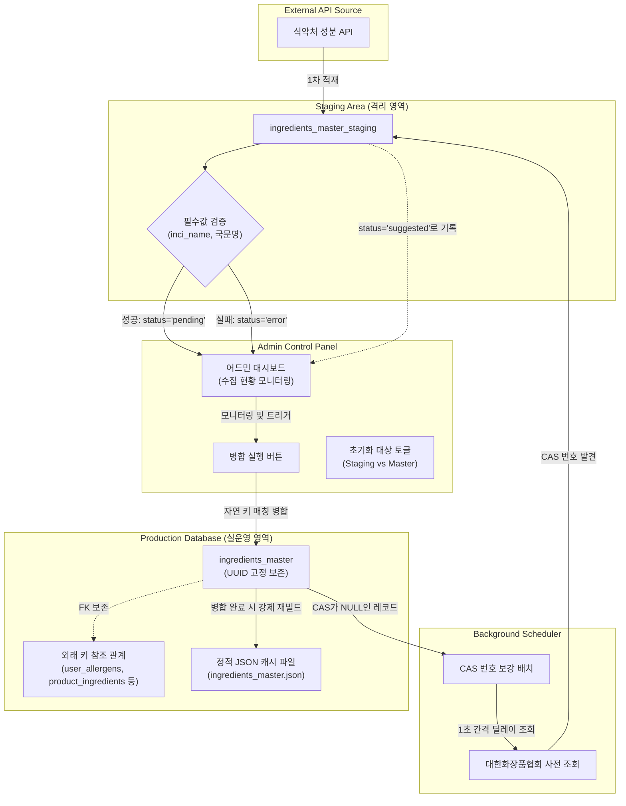

화장품 성분 분석 서비스인 PickSafe를 개발하면서 가장 핵심이 되는 데이터는 식약처 및 공공데이터 포털에서 제공하는 성분 사전 데이터입니다. 초기 개발 단계에서는 수집 주기마다 단순히 전체 데이터를 비우고(Truncate) 새로 적재하거나, 기존 레코드 위에 그대로 덮어쓰는 단순한 방식을 취했습니다.

하지만 서비스 기능이 확장되면서 성분 마스터 테이블(`ingredients_master`)을 참조하는 다른 도메인 테이블들이 늘어났고, 이 방식은 심각한 데이터 무결성 결함을 초래했습니다. 

기존 데이터를 무심코 삭제하거나 행의 UUID(`id`)를 통째로 갱신할 때 발생했던 참조 무결성 붕괴 문제를 해결하고, 안전한 데이터 동기화 파이프라인을 구축하기 위해 도입한 **임시 스테이징 테이블 및 트랜잭션 병합(Merge) 전략**을 정리해 봅니다.

---

## 🎯 마주한 고민과 문제 배경

PickSafe의 데이터베이스 설계에서 성분 마스터 테이블은 여러 핵심 서비스 테이블과 외래 키(FK) 관계를 맺고 있습니다.

*   `user_allergens.ingredient_id` (사용자가 등록한 기피 성분)
*   `product_ingredients.ingredient_id` (화장품 상품별 매칭 성분)
*   `scan_result_ingredients.ingredient_id` (OCR 이미지 스캔 분석 결과 이력)

이 상황에서 식약처 API를 통해 새로운 성분 목록을 수집할 때마다 기존 레코드를 지우고 재적재하게 되면, 기존에 발급되어 있던 UUID가 모두 무효화되거나 삭제 제한(Restrict) 제약 조건에 걸려 수집 프로세스 자체가 실패하는 문제가 발생했습니다. Cascade 옵션을 주어 강제로 삭제할 경우, 사용자가 등록해 둔 기피 성분 정보나 과거 스캔 이력이 함께 날아가는 치명적인 데이터 유실로 이어집니다.

즉, 외부 데이터 수집 과정에서 **"기존 데이터의 고유 식별자(UUID)를 엄격하게 보존하면서, 변경된 정보만 안전하게 반영(Upsert)할 수 있는 격리된 파이프라인"**이 절실히 필요했습니다.

---

## ⚖️ 기술적 대안 비교 및 선택 이유

문제를 해결하기 위해 세 가지 접근 방식을 검토했습니다.

### 대안 1: 실운영 테이블에 직접 실시간 `ON CONFLICT` (Upsert) 실행
*   **방식:** API 수집 루프를 돌며 `inci_name`을 기준으로 운영 테이블에 바로 `INSERT ... ON CONFLICT UPDATE`를 실행합니다.
*   **장점:** 별도의 임시 공간이 필요 없어 구조가 단순합니다.
*   **단점:** 외부 API 제공처의 데이터 오류(필수 필드 누락, 깨진 텍스트 등)가 검증 없이 실운영 테이블에 즉시 반영됩니다. 또한 수집 중 예외가 발생하면 운영 DB 상태가 일관되지 않은 중간 상태로 방치됩니다.

### 대안 2: 데이터베이스 테이블 스왑 (Table Shadowing/Swap)
*   **방식:** `ingredients_master_new` 테이블을 만들어 전체 데이터를 적재한 뒤, 트랜잭션 내에서 테이블 이름을 서로 스왑합니다.
*   **장점:** 쓰기 작업 중에도 기존 테이블 조회 성능에 영향이 거의 없고 구현이 명확합니다.
*   **단점:** 외래 키(FK) 참조 관계가 걸려 있는 상태에서는 테이블 스왑이 불가능하거나, 제약 조건을 임시로 해제해야 하므로 참조 정합성이 깨질 위험이 큽니다.

### 대안 3: 임시 스테이징 테이블 도입 및 자연 키 기반 병합 (선택)
*   **방식:** API 데이터를 1차로 `ingredients_master_staging`에 적재하고 상태(`status`)를 관리합니다. 검증을 통과한 데이터만 자연 키(`inci_name`) 기준으로 단일 트랜잭션 내에서 실운영 테이블로 병합(Upsert)합니다.
*   **장점:** 
    *   실운영 테이블의 기존 UUID를 완벽히 보존할 수 있습니다.
    *   적재 단계와 검증/반영 단계를 격리하여 안전장치를 마련할 수 있습니다.
    *   잘못된 데이터 유입 시 병합을 중단하고 롤백하기 쉽습니다.
*   **단점:** 임시 테이블 관리를 위한 스키마가 늘어나고 병합 로직을 별도로 구현해야 하므로 개발 공수가 증가합니다.

**선택:** 데이터 무결성과 서비스 안정성이 최우선이었기에, 공수가 더 들더라도 **대안 3(스테이징 테이블 및 트랜잭션 병합 전략)**을 최종 선택했습니다.

---

## 🏗️ 시스템 아키텍처 및 흐름

전체적인 데이터 흐름은 아래와 같습니다. 외부 API로부터 수집된 데이터는 스테이징 테이블을 거치며 검증을 받고, 어드민의 최종 승인을 통해 실운영 테이블로 안전하게 병합됩니다.



---

## 💻 핵심 구현 및 트러블슈팅

### 1. 자연 키(`inci_name`) 기반 트랜잭션 병합 로직

병합의 핵심은 **"동일한 INCI(국제화장품성분명)를 가진 레코드가 이미 존재한다면 기존 UUID를 유지한 채 데이터만 업데이트(UPDATE)하고, 신규 성분일 때만 새 UUID를 생성하여 추가(INSERT)하는 것"**입니다.

아래는 SQLAlchemy와 PostgreSQL 환경에서 이를 안전하게 단일 트랜잭션으로 처리하는 핵심 비즈니스 로직입니다.

```python
from uuid import uuid4
from sqlalchemy.orm import Session
from models import IngredientMaster, IngredientMasterStaging

def merge_staging_to_master(db: Session):
    # 1. 병합 대상 대기(pending) 상태의 데이터 조회
    staging_records = db.query(IngredientMasterStaging).filter(
        IngredientMasterStaging.status == "pending"
    ).all()
    
    if not staging_records:
        return {"status": "success", "merged_count": 0}
    
    # 2. 성능 최적화를 위해 실운영 테이블의 기존 inci_name 맵핑 정보 로드
    existing_ingredients = db.query(IngredientMaster.id, IngredientMaster.inci_name).all()
    master_map = {item.inci_name: item.id for item in existing_ingredients}
    
    merged_count = 0
    try:
        for stage in staging_records:
            # 자연 키(inci_name) 매칭 검사
            existing_id = master_map.get(stage.inci_name)
            
            if existing_id:
                # [CASE 1] 이미 존재하는 성분: 기존 UUID(id) 고정 유지, 정보만 업데이트
                master_record = db.query(IngredientMaster).filter(IngredientMaster.id == existing_id).first()
                if master_record:
                    master_record.ko_name = stage.ko_name
                    master_record.cas_no = stage.cas_no or master_record.cas_no
                    master_record.regulation_reason = stage.regulation_reason
            else:
                # [CASE 2] 신규 성분: 새 UUID 부여하여 추가
                new_ingredient = IngredientMaster(
                    id=str(uuid4()), # 00000000-0000-0000-0000-000000000000 형태의 고유값 생성
                    inci_name=stage.inci_name,
                    ko_name=stage.ko_name,
                    cas_no=stage.cas_no,
                    regulation_reason=stage.regulation_reason
                )
                db.add(new_ingredient)
            
            # 스테이징 상태 업데이트
            stage.status = "merged"
            merged_count += 1
        
        # 3. 단일 트랜잭션 커밋
        db.commit()
        
        # 4. 조회 성능을 위한 정적 JSON 캐시 파일 강제 재빌드 트리거
        rebuild_static_json_cache()
        
    except Exception as e:
        db.rollback()
        raise e

    return {"status": "success", "merged_count": merged_count}
```

### 2. 트러블슈팅: CAS 번호 누락 문제와 백그라운드 보강 배치

공공 데이터 수집 중 예상치 못한 병목을 마주했습니다. 식약처 API에서 제공하는 성분 데이터 중 상당수가 화학물질 식별번호인 **CAS 번호(CAS No)**가 비어 있는 채로 수집된다는 점이었습니다. 

처음에는 CAS 번호가 없는 데이터를 모두 `error` 상태로 분류해 수집을 중단시켰더니, 정작 정상적인 성분명 정보까지 실운영에 반영되지 못하는 문제가 발생했습니다.

**해결 방안:**
1. 명칭(`inci_name`, `ko_name`)이 정상이면 CAS 번호가 없더라도 우선 `pending` 상태로 분류하여 실운영 병합을 허용했습니다.
2. 병합 완료 이후, 실운영 테이블에서 `cas_no`가 `NULL`인 성분들만 추출하여 대한화장품협회 사전을 백그라운드로 조회하는 스케줄러(Batch)를 구축했습니다.
3. 대상 서버에 과도한 트래픽 부하를 주어 차단당하는 일을 방지하기 위해, **1초 간격의 지연(Delay)**을 명시적으로 주고 단일 스레드로 안전하게 가동되도록 설계했습니다.

```python
import time
from services import external_kcia_search_api

def job_enrich_missing_cas_numbers(db: Session):
    # 실운영에서 CAS 번호가 비어있는 성분 조회
    target_ingredients = db.query(IngredientMaster).filter(
        IngredientMaster.cas_no.is_(None)
    ).limit(50).all() # 배치당 처리량 제한
    
    for ingredient in target_ingredients:
        try:
            # 외부 사전 검색 실행
            found_cas = external_kcia_search_api(ingredient.inci_name)
            
            if found_cas:
                # 찾은 CAS 정보를 스테이징 테이블에 'suggested' 상태로 임시 기록
                # 어드민이 화면에서 확인 후 원클릭으로 승인할 수 있도록 유도
                suggested_record = IngredientMasterStaging(
                    inci_name=ingredient.inci_name,
                    ko_name=ingredient.ko_name,
                    cas_no=found_cas,
                    status="suggested",
                    regulation_reason="Suggested by background enrichment batch"
                )
                db.add(suggested_record)
                db.commit()
            
            # 예의 있는 크롤러: 타겟 서버 보호를 위해 1초 대기
            time.sleep(1.0)
            
        except Exception as e:
            # 파싱 실패 로그를 남기고 다음 루프로 진행 (전체 배치가 죽지 않도록 격리)
            log_error(f"Failed parsing for {ingredient.inci_name}: {str(e)}")
            continue
```

---

## 💡 돌아보며 배운 점 (회고)

이번 개편을 통해 얻은 가장 큰 소득은 **데이터 인프라의 안정성 확보**입니다. 이전에는 수집 스크립트를 실행할 때마다 '혹시라도 기존 데이터가 꼬이거나 유저 데이터가 유실되면 어쩌지' 하는 불안감이 늘 존재했습니다. 

스테이징 레이어를 중간에 배치하고, 자연 키 기반의 Upsert 트랜잭션을 적용한 이후로는 다음과 같은 실질적인 변화를 체감할 수 있었습니다.

1.  **참조 정합성 보장:** 수집 주기를 여러 번 반복하더라도 기존 가입자의 기피 성분 설정이나 과거 스캔 히스토리의 UUID가 깨지는 일이 100% 방지되었습니다.
2.  **인적 실수 원천 차단:** 어드민 대시보드에 데이터 초기화(비우기) 기능을 구현할 때, 대상 테이블을 토글(`Staging` vs `Master`)하도록 설계하고 기본값을 `Staging`으로 고정했습니다. 실수로 실운영 데이터를 통째로 날려버릴 수 있는 위험을 UI 수준에서 한 번 더 차단했습니다.
3.  **점진적 데이터 보강의 가능성:** 완벽하지 않은 외부 API 데이터를 수집 시점에 무조건 드롭하는 대신, '일단 적재 후 백그라운드에서 점진적으로 보강'하는 파이프라인의 유연성을 확보했습니다.

초기 설계 단계에서 "동작하는 기능을 빠르게 만드는 것"에만 급급했다면 이러한 정합성 문제를 간과했을 것입니다. 데이터의 생명 주기와 참조 관계를 면밀히 파악하고, 격리된 스테이징 영역을 두는 것이 장기적인 유지보수 관점에서 얼마나 가치 있는 일인지 깊이 깨닫게 된 경험이었습니다.