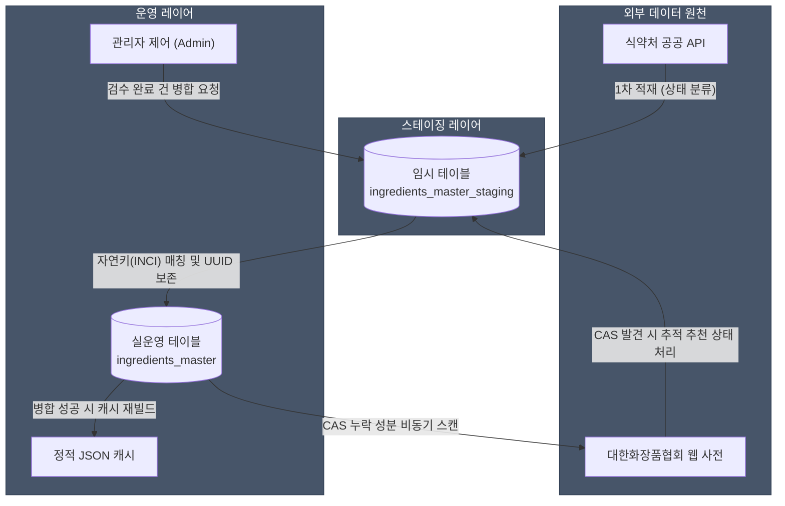

화장품 성분 분석 서비스 PickSafe를 개발하며 외부 공공 데이터베이스(식약처 성분 정보)를 동기화하는 과정을 개편했습니다. 공공 API나 외부 데이터 원천에서 대량의 데이터를 수집해 서비스 DB에 반영할 때, 가장 흔하게 마주치는 문제는 **'기존 실운영 데이터와의 충돌 및 참조 무결성 깨짐'**입니다.

초기에는 단순하게 수집된 데이터를 운영 테이블에 직접 덮어쓰거나 전체 데이터를 재적재하는 방식을 검토했으나, 이는 서비스의 핵심 연관 데이터 구조를 파괴할 수 있는 치명적인 위험을 안고 있었습니다. 이를 해결하기 위해 스테이징(Staging) 테이블 기반의 검증 및 병합(Merge) 아키텍처를 도입한 고민과 과정, 그리고 얻은 교훈을 담백하게 기록해 둡니다.

---

## 🎯 마주한 고민과 문제 배경

PickSafe의 데이터베이스에서 성분 마스터 테이블(`ingredients_master`)은 시스템 전체의 중추 역할을 담당합니다. 사용자 개개인이 설정한 알레르기/유해 성분 설정, 각 화장품 상품의 성분 매칭 정보, 이미지 스캔 후 도출된 분석 기록 등 주요 데이터들이 모두 `ingredients_master`의 고유 식별자(UUID)를 외래 키(FK)로 참조하고 있습니다.

```text
[ user_allergens ] ------------+
                               | (FK: ingredient_id)
[ product_ingredients ] -------+---> [ ingredients_master ]
                               |
[ scan_result_ingredients ] ---+
```

기존처럼 수집 단계에서 운영 테이블을 직접 조작하거나 일괄 재적재하는 방식을 사용할 경우 다음과 같은 문제가 발생합니다:

1. **외래 키 참조 붕괴 (FK Corruption)**: 외부 데이터 갱신 과정에서 기존 레코드의 UUID가 변경되거나 삭제되면, 사용자가 등록해 둔 기피 성분 설정이나 과거 스캔 히스토리가 엉뚱한 성분을 가리키거나 유실됩니다.
2. **검증되지 않은 노이즈 데이터의 직접 유입**: 외부 API 데이터 중에는 성분 국문명이나 표준 성분명(INCI)이 누락되어 있거나, 포맷이 불완전한 상태로 들어오는 케이스가 존재합니다. 이를 실시간으로 운영 데이터베이스에 반영하면 서비스 전체 분석 정확도가 떨어집니다.
3. **트랜잭션 락 및 가용성 저하**: 수집 작업과 사용자의 조회 작업이 동일한 테이블에서 경합을 벌이게 되어 DB 커넥션 병목이나 트랜잭션 대기 지연이 발생할 수 있습니다.

따라서 **기존 운영 레코드의 UUID를 철저히 보존**하면서, **불완전한 데이터를 격리 및 검수**한 뒤 운영 환경에 반영할 안전한 격리 레이어가 필요했습니다.

---

## ⚖️ 기술적 대안 비교 및 선택 이유

문제 해결을 위해 두 가지 아키텍처적 접근 방식을 비교 검토했습니다.

| 비교 항목 | 대안 A: 운영 테이블 직접 Upsert 및 DB 락 활용 | 대안 B: 스테이징 테이블 도입 및 트랜잭션 병합 (선택) |
| :--- | :--- | :--- |
| **데이터 격리성** | 없음 (실운영 DB에 직접 쓰기 수행) | 높음 (임시 스테이징 테이블에서 1차 수집 및 검증) |
| **참조 무결성** | Upsert 실수 시 FK 깨짐 위험 상존 | 자연 키 기반 조회를 통해 기존 UUID 고정 보존 |
| **데이터 검수** | 불완전 데이터 유입 시 즉각 서비스 노출 | 상태값 관리(`pending`, `error` 등)를 통해 검수 후 반영 |
| **운영 복구성** | 롤백 복잡도가 높고 실시간 장애 유발 가능 | 수집 오류 발생 시 스테이징만 초기화하면 되므로 안전 |
| **구현 복잡도** | 상대적으로 단순함 | 상태 전이 및 트랜잭션 병합 로직 구현 필요 |

### 선택 이유
단순 구현의 편의성보다는 **데이터 무결성과 운영 안정성**이 훨씬 중요한 가치라고 판단했습니다. 

대안 B를 선택함으로써 외부 수집 프로세스는 임시 공간인 스테이징 테이블(`ingredients_master_staging`)에만 영향을 미치도록 완전 격리했습니다. 검증을 통과한 데이터만 단일 트랜잭션으로 안전하게 운영 테이블로 병합(Merge)되는 구조를 설계했습니다.

---

## 🏗️ 시스템 아키텍처 및 흐름

전체 수집, 검증, 병합, 사후 보강 흐름은 다음과 같은 단계를 거칩니다.



### 스테이징 레코드의 상태 생애주기 (Lifecycle)
스테이징 테이블 내 데이터는 `status` 필드를 통해 엄격하게 상태가 관리됩니다.

- `pending`: 필수 명칭 정보(국문명, INCI명)가 모두 정제되어 운영 DB로 병합 가능한 대기 상태.
- `error`: 필수 데이터가 누락되어 어드민의 수동 확인이 필요한 상태.
- `suggested`: 백그라운드 배치 작업에 의해 사후 정보(CAS 번호 등)가 보강되어 승인을 기다리는 상태.
- `merged`: 실운영 DB로 성공적으로 반영되어 보존 조치된 상태.

---

## 💻 핵심 구현 및 트러블슈팅

### 1. 자연 키(Natural Key) 기반의 트랜잭션 Upsert

병합의 핵심은 **표준 성분명(INCI)**을 자연 키 매칭 기준으로 사용하는 것입니다. 운영 DB에 이미 존재하는 성분이라면 기존 UUID를 절대로 변경하지 않고 메타데이터만 UPDATE하며, 존재하지 않는 신규 성분일 때만 새 UUID를 생성하여 INSERT합니다.

아래는 이해를 돕기 위해 축약한 병합 트랜잭션의 개념 코드입니다.

```python
# 서비스 및 트랜잭션 처리 개념 코드
def merge_pending_staging_ingredients(db_session):
    """
    pending 상태의 스테이징 데이터를 실운영 테이블로 안전하게 병합합니다.
    """
    pending_items = db_session.query(StagingIngredient)\
        .filter(StagingIngredient.status == "pending")\
        .all()

    try:
        with db_session.begin_nested(): # 트랜잭션 세이브포인트
            for item in pending_items:
                # 자연 키(INCI Name)를 기준으로 기존 운영 데이터 조회
                existing = db_session.query(MasterIngredient)\
                    .filter(MasterIngredient.inci_name == item.inci_name)\
                    .first()

                if existing:
                    # [UPDATE] 기존 레코드가 존재하면 UUID는 보존하고 속성만 갱신
                    existing.korean_name = item.korean_name
                    existing.cas_no = item.cas_no or existing.cas_no
                    existing.updated_at = datetime.utcnow()
                else:
                    # [INSERT] 존재하지 않는 경우에만 신규 UUID로 추가
                    new_ingredient = MasterIngredient(
                        id=generate_uuid(), # 00000000-0000-...
                        inci_name=item.inci_name,
                        korean_name=item.korean_name,
                        cas_no=item.cas_no or "CAS-XXXX"
                    )
                    db_session.add(new_ingredient)

                # 스테이징 상태 업데이트
                item.status = "merged"

        # 모든 병합 완료 후 DB 커밋 및 서비스 캐시 일괄 재빌드
        db_session.commit()
        rebuild_static_ingredient_cache()

    except Exception as e:
        db_session.rollback()
        raise EngineException(f"Merge Transaction Failed: {str(e)}")
```

### 2. 비동기 사후 CAS 번호 보강 배치

화장품 규제 및 분석에서 식별용 CAS 번호는 유용하지만, 공공 API 수집 시점에 CAS 번호가 누락된 경우가 종종 있습니다. 그렇다고 CAS 번호가 없다고 해서 정제된 성분의 수집을 막는 것은 서비스 반영 속도를 떨어뜨립니다.

이를 극복하기 위해 **"우선 병합 후, 비동기 사후 보강"** 패턴을 도입했습니다.
- 병합 단계에서는 CAS 번호가 없어도 필수 명칭만 정상이면 `pending` 상태로 승인하여 운영 DB에 반영합니다.
- 이후 백그라운드 스케줄러가 `cas_no`가 `NULL`인 운영 성분들을 추출하여 외부 협회 사전을 1초 간격의 Throttling 딜레이를 두고 차분히 조회합니다.
- 정보가 발견되면 운영 DB를 직접 고치지 않고, 스테이징 테이블에 `status = 'suggested'` 상태로 추천 레코드를 생성하여 어드민이 최종 승인할 수 있도록 조치했습니다.

### 3. 인적 실수 방지 (Safe Operational Safeguards)

운영 도중 데이터 초기화(Reset) 작업 시 실수로 실운영 테이블을 밀어버리는 사고를 방지하기 위해 다음과 같은 안전장치를 마련했습니다.

- **초기화 대상 토글 선택**: 어드민 데이터 정리 API 호출 시 파라미터(`target_table`)를 명시적으로 요구합니다.
- **안전한 기본값 설정**: 백엔드 API와 UI의 기본 선택지는 항상 `임시 테이블 (Staging)`로 고정하여, 실수로 버튼을 누르더라도 운영 데이터(`ingredients_master`)가 삭제되지 않도록 보호했습니다.
- **이중 메트릭 노출**: 대시보드 화면에 `실운영 성분 수`와 `임시 활성 성분 수`를 함께 시각화하여 데이터 동기화 지연 및 병합 대기 건수를 한눈에 파악할 수 있게 구성했습니다.

---

## 💡 돌아보며 배운 점 (회고)

### 얻은 효과
1. **참조 무결성 100% 보존**: 데이터 갱신 작업 중에도 기존 사용자의 유해 성분 설정이나 과거 스캔 히스토리의 UUID 참조가 깨지는 현상을 완전히 방지할 수 있었습니다.
2. **검수 프로세스 안정화**: 외부 API 데이터의 오류나 노이즈가 유입되어도 실운영 서비스에는 영향을 주지 않으며, 스테이징 단계에서 정제하거나 롤백할 수 있는 여유가 생겼습니다.
3. **가용성 확보**: 수집 및 보강이라는 무거운 외부 통신 작업을 사용자 서비스 쿼리 흐름과 분리하여, 운영 DB 락 및 응답 지연 문제를 예방했습니다.

### 보완할 점과 교훈
초기에는 모든 수집 데이터를 즉시 완전 자동 반영하는 것이 더 효율적일 것이라 생각했습니다. 하지만 실제 외부 데이터 공공 API를 다뤄보면서 명칭 오기, 규격 불일치 등 예외 케이스가 빈번함을 배웠습니다. 

**"완전 자동화보다 중요한 것은 예측 가능한 데이터 안정성"**이라는 점을 다시금 깨달았습니다. 격리 레이어(Staging)를 두고 트랜잭션 범위를 명확히 통제하는 아키텍처가 장기적인 서비스 운영 측면에서 훨씬 더 적은 비용을 소모한다는 것을 확인한 프로젝트였습니다.

향후에는 INCI 표준명 정규화(Normalization) 파서의 예외 처리 패턴을 더욱 강화하여 스테이징 진입 시점의 자동 정제율을 조금 더 끌어올릴 계획입니다.