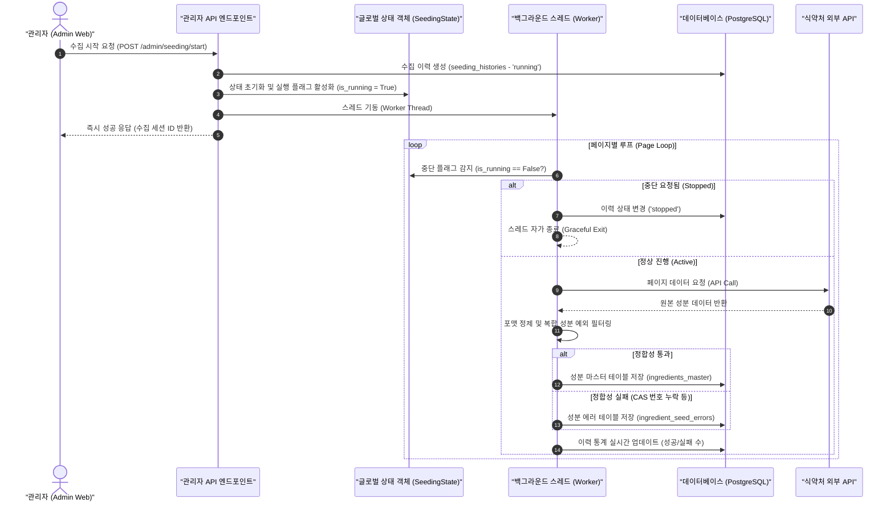

화장품 성분 분석 서비스인 **PickSafe**를 개발하면서 가장 먼저 마주한 거대한 장벽은 외부 공공 데이터의 불안정성이었습니다. 식약처에서 제공하는 공인 성분 데이터를 수집하여 서비스의 뼈대가 되는 성분 마스터 사전을 구축해야 했으나, 공공 API가 반환하는 데이터의 정합성은 예상보다 훨씬 거칠었습니다. 

CAS(Chemical Abstracts Service) 등록 번호가 누락되어 있거나, 포맷이 깨져 있거나, 하나의 필드에 여러 개의 CAS 번호가 쉼표나 슬래시로 뒤섞여 들어오는 등 비표준 데이터가 도처에 존재했습니다. 이로 인해 데이터 적재 과정에서 수많은 예외가 발생했고, 서버 엔진은 무의미한 에러 로그를 쏟아내며 멈추기 일쑤였습니다.

이 글에서는 이러한 외부 데이터의 품질 오류를 스스로 바로잡는 자율 교정 체계를 설계하고, 자원 제약이 있는 인프라 환경에서 안전하게 동작하는 백그라운드 수집 제어기를 구현한 과정을 담백하게 기록해 보고자 합니다.

---

## 🎯 마주한 고민과 문제 배경

기존에 구현되어 있던 수집 엔진은 단순하게 백그라운드 스레드에서 무한 루프를 돌며 식약처 API를 호출하는 방식이었습니다. 서비스 초기 단계였기에 단순하게 접근했으나, 운영 안정성 측면에서 다음과 같은 치명적인 한계가 드러났습니다.

1. **불투명한 블랙박스 작업**: 배치가 한 번 시작되면 현재 몇 번째 페이지를 읽고 있는지, 성공률은 얼마나 되는지 모니터링할 방법이 없었습니다.
2. **제어 불가능한 스레드**: 수집 도중 외부 API의 Rate Limit에 걸리거나 데이터베이스 커넥션 병목이 발생했을 때, 실행 중인 백그라운드 작업을 강제로 안전하게 중지(Graceful Stop)시킬 수단이 없었습니다.
3. **무의미한 에러 로그 누적**: 복합 원료나 추출물처럼 화학 물질 식별 번호(CAS No)가 원래 존재하지 않는 성분(예: 슬래시 `/`가 포함된 복합 성분)들까지 전부 'CAS 번호 누락 에러'로 분류되어 에러 큐에 쌓였습니다. 이로 인해 사람이 직접 확인해야 하는 진짜 에러를 식별하기가 매우 어려웠습니다.

이 문제를 해결하기 위해 시스템을 전면적으로 개편하기로 결정했습니다. 목표는 **"가볍고 안전한 스레드 제어 체계"**와 **"노이즈를 걸러내는 자율 교정 파이프라인"**을 구축하는 것이었습니다.

---

## ⚖️ 기술적 대안 비교 및 선택 이유

가장 먼저 백그라운드 작업을 어떻게 관리할 것인가에 대한 아키텍처적 고민이 있었습니다.

| 비교 항목 | 대안 A: Celery + Redis | 대안 B: Custom Thread + DB State Management |
| :--- | :--- | :--- |
| **인프라 복잡도** | Redis 및 별도 Celery 워커 프로세스 운영 필요 (높음) | 추가 인프라 없이 애플리케이션 내부에서 처리 (낮음) |
| **자원 사용량** | 최소 100~200MB 이상의 추가 메모리 점유 | 스레드 생성에 따른 극소량의 메모리만 점유 |
| **태스크 제어** | Celery 자체 `revoke(terminate=True)` 지원 | 스레드 내부 루프에서 글로벌 상태 플래그 폴링 체크 구현 필요 |
| **도입 비용** | 인프라 비용 및 관리 포인트 증가 | 초기 구현 공수 발생하나 유지보수 비용 거의 없음 |

### 선택 이유
현재 인프라는 제한된 리소스 내에서 효율적으로 운영되어야 하는 제약이 있었습니다. 메시지 큐(Celery/Redis)를 도입하는 것은 오버엔지니어링이자 불필요한 고정 비용 지출을 의미했습니다. 

따라서 **대안 B**를 선택했습니다. Python의 `threading` 모듈을 활용하되, 스레드 간 메모리 공유 문제를 극복할 수 있는 안전한 글로벌 상태 객체(`SeedingState`)를 정의하고, 수집 세션의 상태 전이를 데이터베이스(`SeedingHistory`)에 기록하여 추적하는 방식을 설계했습니다.

---

## 🏗️ 시스템 아키텍처 및 흐름

전체적인 데이터 수집 및 제어 흐름은 다음과 같이 구성됩니다. 관리자가 제어 명령을 내리면 글로벌 상태 객체가 변경되고, 백그라운드 스레드는 매 루프마다 이 상태를 확인하여 자가 중단 여부를 결정합니다.



---

## 💻 핵심 구현 및 트러블슈팅

### 1. 스레드 섀도잉 방지를 위한 글로벌 상태 객체 (`SeedingState`)

Python에서 멀티스레딩을 다룰 때 모듈 단위 캐싱이나 컨텍스트 차이로 인해 스레드가 동일한 변수를 바라보지 못하는 '스레드 섀도잉' 현상이 발생할 수 있습니다. 이를 방지하기 위해 단일 인스턴스로 유지되는 상태 관리 클래스를 구현했습니다.

```python
# app/core/seeding/state.py
import threading
from typing import Optional

class SeedingState:
    _instance = None
    _lock = threading.Lock()

    def __new__(cls):
        with cls._lock:
            if cls._instance is None:
                cls._instance = super().__new__(cls)
                cls._instance._is_running = False
                cls._instance._current_history_id = None
        return cls._instance

    @property
    def is_running(self) -> bool:
        return self._is_running

    def start(self, history_id: int):
        self._is_running = True
        self._current_history_id = history_id

    def stop(self):
        self._is_running = False
        self._current_history_id = None

# 모듈 레벨에서 싱글톤 인스턴스 노출
seeding_state = SeedingState()
```

백그라운드 스레드는 식약처 API로부터 한 페이지를 수집할 때마다 아래와 같이 `seeding_state.is_running`을 체크합니다. 만약 관리자가 **[수집 중지]**를 누르면 이 플래그가 `False`로 변하고, 스레드는 현재 쓰던 데이터를 마저 안전하게 DB에 쓰고(Graceful) 즉시 루프를 탈출합니다.

```python
# 백그라운드 워커의 루프 내부
for page in range(start_page, end_page + 1):
    if not seeding_state.is_running:
        logger.info("수집 중지 명령이 감지되어 작업을 안전하게 중단합니다.")
        update_history_status(history_id, "stopped")
        break
    
    # ... 외부 API 호출 및 데이터 처리 로직 ...
```

### 2. 복합 성분(Composite) 분류 및 오류 필터링

가장 골칫거리였던 식약처의 데이터 오기를 정제하는 자율 교정 로직입니다. 

대한화장품협회 사전에 따르면, 이름에 슬래시(`/`)가 들어간 복합 원료나 혼합 추출물은 단일 화학 물질이 아니므로 고유한 CAS 번호가 존재하지 않는 것이 정상입니다. 기존에는 이를 단순 누락 에러로 잡아내어 휴먼 에러 검토 리소스를 낭비하게 만들었습니다.

이를 해결하기 위해 자율 필터 규칙을 적용했습니다.

```python
# app/core/seeding/parser.py
import re
from typing import Optional, Tuple

def clean_cas_number(cas_str: Optional[str]) -> Optional[str]:
    if not cas_str:
        return None
    # 공백 제거 및 비표준 문자 정제
    cleaned = re.sub(r"\s+", "", cas_str)
    # CAS 번호 표준 포맷 패턴 (예: 58-08-2)
    match = re.match(r"^\d{2,7}-\d{2}-\d$", cleaned)
    if match:
        return cleaned
    return None

def validate_and_classify_ingredient(name_ko: str, raw_cas: Optional[str]) -> Tuple[bool, Optional[str]]:
    """
    성분의 유효성을 검증하고 자율 교정된 CAS 번호를 반환합니다.
    반환값: (is_valid, cleaned_cas)
    """
    cleaned_cas = clean_cas_number(raw_cas)
    
    # 1. 복합 성분 예외 처리: 이름에 슬래시가 포함된 경우
    if "/" in name_ko:
        # 복합 성분은 CAS 번호가 없어도 정상이므로 에러 처리하지 않고 통과시킵니다.
        return True, cleaned_cas if cleaned_cas else None
        
    # 2. 단일 성분인데 유효한 CAS 번호가 없는 경우
    if not cleaned_cas or cleaned_cas in ["0", "00-00-0", "CAS-XXXX"]:
        # 이는 정합성이 깨진 데이터이므로 에러 큐로 보냅니다.
        return False, None
        
    return True, cleaned_cas
```

이 규칙 덕분에 슬래시가 포함된 수천 건의 복합 성분들이 에러 큐로 빠지지 않고 정상적으로 성분 마스터 테이블에 적재되었습니다.

### 3. 검토 편의를 위한 외부 사전 연동 및 일괄 재적재

에러 큐(`ingredient_seed_errors`)에 쌓인 진짜 에러들은 관리자가 직접 눈으로 확인하고 교정해야 합니다. 이때 관리자가 성분명을 복사해서 다시 포털 사이트에 검색하는 번거로움을 줄이기 위해, 어드민 화면에서 공인 사전으로 바로 연결되는 새 탭 링크를 연동했습니다.

```javascript
// 관리자 화면 성분 검토 컴포넌트 일부
const handleKCIASearch = (ingredientName) => {
  const url = `https://kcia.or.kr/cid/search/ingd_list.php?skind=ALL&sword=${encodeURIComponent(ingredientName)}`;
  window.open(url, '_blank');
};

const handleCosIngSearch = (inciName) => {
  const url = `https://ec.europa.eu/growth/tools-databases/cosing/index.cfm?fuseaction=search.simple&keyword=${encodeURIComponent(inciName)}`;
  window.open(url, '_blank');
};
```

수정된 오류 성분들은 개별로 재적재할 필요 없이, 여러 행을 체크박스로 다중 선택하여 한 번에 재처리할 수 있도록 일괄 재적재 API 엔드포인트를 구축했습니다.

```python
# app/api/admin.py
from fastapi import APIRouter, Depends, HTTPException
from pydantic import BaseModel
from typing import List

router = APIRouter(prefix="/admin/seeding")

class RetryBatchRequest(BaseModel):
    error_ids: List[int]

@router.post("/retry-batch")
async def retry_failed_seeding_batch(payload: RetryBatchRequest):
    success_count = 0
    failed_count = 0
    
    for error_id in payload.error_ids:
        # 에러 레코드 조회 및 교정된 데이터로 재적재 시도
        try:
            is_resolved = process_corrected_ingredient(error_id)
            if is_resolved:
                success_count += 1
            else:
                failed_count += 1
        except Exception as e:
            failed_count += 1
            
    return {
        "status": "success",
        "processed": len(payload.error_ids),
        "success": success_count,
        "failed": failed_count
    }
```

---

## 💡 돌아보며 배운 점 (회고)

### 1. "외부 데이터는 항상 더럽다"는 전제
공공 기관의 API라고 해서 완벽히 정제된 데이터가 올 것이라 맹신한 것이 초기 설계의 가장 큰 패착이었습니다. 데이터 파이프라인을 설계할 때는 항상 입력단에서 방어적인 검증(Validation)과 자율 교정(Self-Correction) 레이어를 촘촘하게 구성해야 함을 뼈저리게 배웠습니다.

### 2. 가볍고 명확한 해결책의 가치
처음 스레드 제어 문제를 마주했을 때 머릿속에는 Celery, Redis, RabbitMQ 같은 거창한 도구들이 먼저 떠올랐습니다. 하지만 "현재 우리 인프라 규모와 예산에서 이것이 정말 최선인가?"를 자문했을 때 답은 '아니오'였습니다. 서비스의 현재 스케일에 맞는 경량화된 솔루션(싱글톤 상태 객체와 DB 기반 상태 추적)을 직접 구현함으로써 인프라 복잡도를 전혀 늘리지 않고도 완벽한 제어권을 확보할 수 있었습니다.

### 3. 운영 효율화를 위한 도구의 중요성
복합 성분 예외 필터링과 어드민 내 외부 사전 새 탭 검색 연동을 도입한 후, 에러 로그의 노이즈가 눈에 띄게 줄었습니다. 실제로 사람이 수동으로 검토하고 교정해야 하는 데이터의 양이 **90% 이상 절감**되는 효과를 보았습니다. 잘 설계된 백엔드 로직 하나가 실제 운영 단계에서 얼마나 많은 휴먼 리소스를 세이브할 수 있는지 실감할 수 있었던 소중한 경험이었습니다.