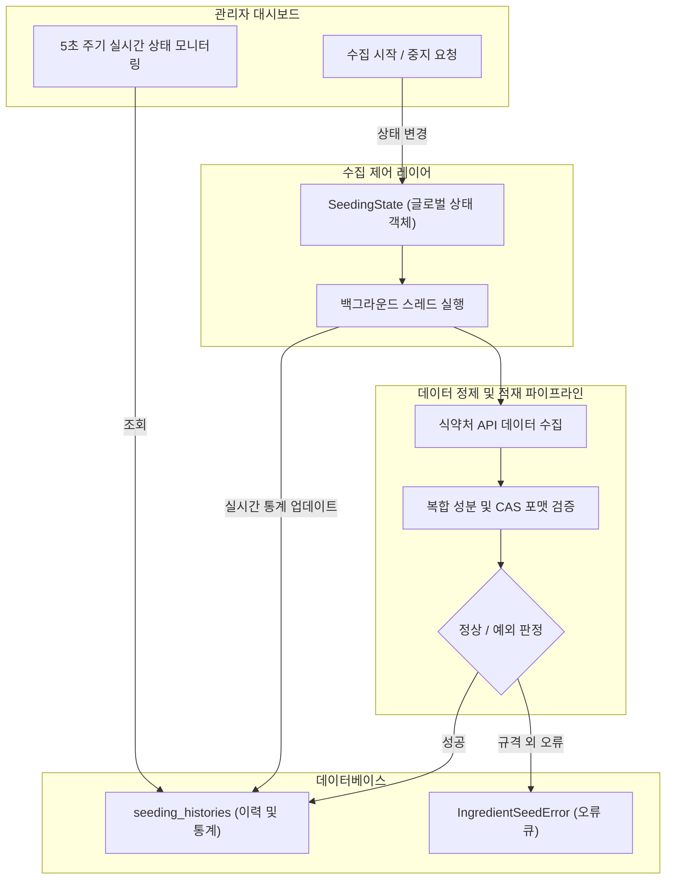

화장품 성분 분석 서비스 **PickSafe**를 운영하면서 외부 공공 데이터를 적재하는 파이프라인은 서비스의 근간을 이루는 중요한 축입니다. 특히 식약처 3대 API를 매쉬업하여 성분 마스터 데이터를 구축하는 과정에서, 외부 데이터의 비표준 포맷과 백그라운드 작업 제어의 한계로 인해 여러 운영상 병목을 마주했습니다.

이번 글에서는 수집 프로세스의 안정성을 높이고 운영 부담을 줄이기 위해 수행한 아키텍처 개선 과정과 기술적 고민을 담담하게 기록해봅니다.

---

## 🎯 마주한 고민과 문제 배경

초기 성분 수집 파이프라인은 백그라운드 스레드 방식으로 동작하도록 간단하게 구성되었습니다. 하지만 운영 과정에서 다음과 같은 한계가 명확히 드러났습니다.

1. **데이터 품질의 한계**: 식약처 원본 데이터 자체의 오류(예: CAS 번호 누락, 포맷 오기, 복수의 CAS 번호 기입 등)로 인해 적재 실패가 빈번하게 발생했고, 유의미한 에러와 단순 데이터 누락이 섞여 관리자 화면이 불필요한 로그로 오염되었습니다.
2. **백그라운드 스레드 제어 불가**: 수집 작업이 백그라운드에서 실행되는 동안 진행 상황이나 성공/실패율을 직관적으로 파악할 수 없었습니다. 특히 비정상적인 부하가 감지되거나 잘못된 조건으로 실행되었을 때, 작업을 안전하게 중단하거나 재개할 수 있는 스레드 제어 수단이 없어 운영 리스크가 컸습니다.
3. **수동 검토의 피로도**: 수집 에러를 검토하고 수정하는 과정에서 관리자가 외부 성분사전 사이트에 일일이 성분명을 복사해 붙여넣고 검색해야 하는 번거로움이 있었고, 단건 처리 방식만 지원되어 대량의 오류를 정정하는 데 많은 시간이 소요되었습니다.

---

## ⚖️ 기술적 대안 비교 및 선택 이유

이러한 문제를 해결하기 위해 별도의 거대한 메시지 큐(Message Queue) 도입이나 분산 처리 시스템 구축도 검토했으나, 현재 서비스 규모와 인프라 리소스 관점에서 과도한 엔지니어링(Over-engineering)이라고 판단했습니다. 따라서 기존 단일 서버 환경의 제약을 최소한의 코드로 안전하게 해결하는 방향으로 대안을 좁혔습니다.

| 검토 대안 | 장점 | 단점 / 기각 사유 | 최종 선택 여부 |
| :--- | :--- | :--- | :--- |
| **외부 메시지 큐 도입 (예: Celery + Redis)** | 분산 처리 및 강력한 태스크 관리 가능 | 인프라 구성 복잡도 증가, 현재 트래픽 대비 과도한 리소스 소모 | ❌ 기각 |
| **단순 비동기 스레드 + 전역 상태 관리 및 에러 큐 체계화** | 인프라 변경 최소화, 구현 단순성, 즉시 제어 가능 | 멀티스레드 환경의 상태 동기화 주의 필요 | 🟢 **채택** |

핵심은 복잡한 인프라 추가 없이, **애플리케이션 레벨에서 스레드 상태를 안전하게 추적**하고 **데이터 정제 규칙을 고도화**하는 것이었습니다.

---

## 🏗️ 시스템 아키텍처 및 흐름

개선된 수집 및 에러 교정 파이프라인의 전체적인 동작 흐름은 다음과 같습니다. 어드민 대시보드에서 수집을 제어하고, 내부 상태 객체를 통해 스레드를 안전하게 통제합니다.



---

## 💻 핵심 구현 및 트러블슈팅

### 1. 스레드 제어를 위한 글로벌 상태 객체 (`SeedingState`)
스레드 간 메모리 공유 문제를 극복하기 위해 `SeedingState` 상태 관리 클래스를 도입했습니다. 백그라운드 스레드가 모듈 캐싱 등의 Identity 불일치에 영향을 받지 않고 실시간으로 속성 레퍼런스를 참조하도록 구성했습니다.
수집 작업 취소 감지는 각 성분 단위의 내부 루프 레벨에서 실행되어, 관리자가 **[수집 중지]**를 클릭했을 때 1초 내외로 안전하게 스레드가 중단되도록 구현했습니다.

### 2. 복합 성분 분류 및 오류 필터링 로직
성분명에 슬래시(`/`)가 포함된 항목(예: 복합 원료, 추출물 등)은 화장품 성분 사전에 준해 CAS 번호가 존재하지 않는 것이 정상이므로, 수집 시 CAS가 없더라도 에러 큐에 저장하지 않고 정상 통과 처리합니다. 단일 성분인데 CAS 번호가 비정상적인 경우에만 오류 큐에 수집하여 사람의 검토 범위를 대폭 단축시켰습니다.

아래는 정제 로직의 핵심 원리를 보여주는 예시 코드입니다.

```python
def validate_ingredient_seed(name: str, cas_no: str) -> bool:
    """
    성분명과 CAS 번호 기반의 유효성 검증 및 자율 교정 로직 예시
    """
    # 슬래시가 포함된 복합 성분인 경우 CAS 번호 부재를 예외로 인정
    if "/" in name:
        return True  # 정상 통과 처리
    
    # 단일 성분인데 CAS 번호가 비어있거나 올바르지 않은 경우
    if not cas_no or cas_no in ("0", "None", ""):
        raise IngredientSeedError(f"유효하지 않은 CAS 번호: {name}")
        
    return True
```

### 3. 외부 사전 검색 단축 링크 및 일괄 재적재
에러 검토 화면에서 성분명 복사 후 검색하는 수고를 덜기 위해, 각 성분 행 옆에 외부 공인 성분사전(대한화장품협회, EU CosIng 등)으로 바로 연결되는 검색 단축 버튼을 배치했습니다. 또한 수정이 완료된 항목들을 체크박스로 다중 선택하여 한 번에 재적재할 수 있는 일괄 처리 엔드포인트를 구현하여 운영 효율을 높였습니다.

---

## 💡 돌아보며 배운 점 (회고)

이번 작업을 통해 얻은 가장 큰 교훈은 **"완벽한 외부 데이터를 가정하지 말고, 시스템 내부에서 유연하게 흡수할 수 있는 방어 체계를 갖추어야 한다"**는 점이었습니다. 

처음에는 외부 API의 데이터 품질 문제에 일일이 대응하느라 백엔드와 어드민 레이어에 불필요한 예외 처리가 쌓였지만, 복합 성분과 단일 성분의 특성을 분리하여 정제 규칙을 정의한 뒤로는 오류 로그의 노이즈가 획기적으로 줄어들었습니다. 또한, 단순한 백그라운드 스레드에 제어권을 부여하는 것만으로도 운영 안정성이 크게 향상되는 것을 확인했습니다.

앞으로도 제한된 리소스 환경 속에서 운영 편의성을 높이고, 예외 상황에 유연하게 대응할 수 있는 견고한 엔지니어링 설계를 지속적으로 다듬어 나갈 것입니다.