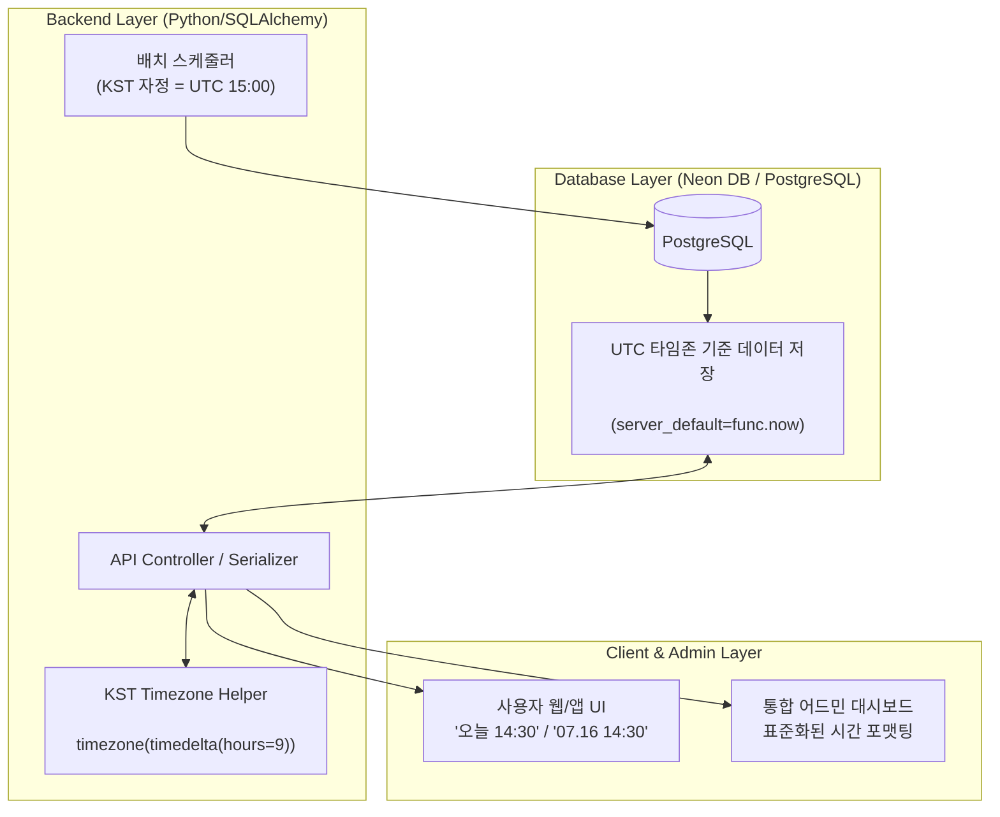

화장품 성분 분석 서비스 PickSafe를 개발하고 운용하면서, 초기 인프라 구축 시점에는 미처 깊게 고려하지 못했던 **타임존(Timezone) 불일치 문제**로 인해 사용자 경험과 시스템 운영상에서 여러 혼란을 마주했습니다.

Render 호스팅 환경과 Neon DB(PostgreSQL) 기반으로 서비스를 배포하면서 기본 타임존이 UTC(+00:00)로 설정되어 있었는데, 서비스가 점차 자리를 잡아가면서 데이터 정합성과 배치 스케줄링 측면에서 명확한 문제가 드러나기 시작했습니다.

이번 글에서는 인프라 환경의 UTC 타임존 파편화 문제로 발생한 이슈들과 이를 애플리케이션 레이어에서 KST(한국 표준시, +09:00) 기준으로 깔끔하게 정립하고 어드민 UI 포맷까지 일원화한 백엔드/프론트엔드 리팩토링 과정을 기록합니다.

---

## 🎯 마주한 고민과 문제 배경

### 1. 사용자 화면의 시간 표시 오류 ("어제 스캔함" 문제)
사용자가 오후 2시(14:00 KST)에 제품 성분을 스캔했을 때, 서버 및 DB에는 UTC 기준인 오전 5시(05:00 UTC)로 기록되었습니다.
이 데이터가 클라이언트로 전달될 때 타임존 오프셋 처리가 모호하게 이루어지면서 마이페이지나 어드민 스캔 이력에 **'어제 스캔한 기록'**으로 잘못 노출되거나 날짜가 하루씩 밀리는 현상이 발생했습니다.

### 2. 배치 스케줄러 실행 시점과 피크 타임 부하 충돌
외부 기관(식약처 등)의 데이터 변경 사항을 주기적으로 반영하는 데이터 수집 배치 스케줄러가 기존에는 **'UTC 자정(00:00 UTC)'**을 기준으로 실행되도록 설정되어 있었습니다.
그러나 UTC 자정은 **한국 시간(KST)으로 오전 9시**에 해당합니다. 서비스 사용량이 점차 늘어나는 출근 및 아침 시간대에 데이터 수집 작업이 동시에 실행되면서 DB 커넥션과 API 응답 시간에 불필요한 부하가 집중되었습니다.

### 3. 어드민 페이지 데이터 포맷 및 디자인 파편화
서비스 관리용 어드민 페이지 내 각 모듈(성분 마스터 관리, 데이터 보강 이력, 방문자 통계, 문의 관리 등)마다 날짜 노출 방식이 제각각이었습니다.
어떤 테이블은 `2026-07-16T05:00:00Z`와 같은 ISO 8601 원본 문자열을 그대로 보여주고, 어떤 페이지는 `YYYY-MM-DD HH:MM`, 또 다른 곳은 상대 시간("방금 전")을 사용하는 등 일관성이 떨어졌습니다.

---

## ⚖️ 기술적 대안 비교 및 선택 이유

타임존 불일치 문제를 해결하기 위해 시스템 레이어와 애플리케이션 레이어 중 어디서 주도적으로 기준을 잡아야 할지 대안을 비교했습니다.

| 구분 | 대안 A: DB/인프라 타임존 직접 변경 | 대안 B: DB는 UTC 저장 유지 + 애플리케이션 레이어 KST 직렬화 (선택) |
| :--- | :--- | :--- |
| **방식** | PostgreSQL 및 서버 인프라 환경변수를 `Asia/Seoul`로 강제 변경 | DB 데이터는 UTC 기준(`func.now()`)으로 보존하되, 애플리케이션 응답 및 비즈니스 로직에서 KST 오프셋 명시적 변환 |
| **장점** | SQL 쿼리 작성 시 별도 타임존 변환 함수 없이 KST 기준으로 조회 가능 | 서버/DB 인프라의 이관이나 다중 지역 확장 시 데이터 정합성 보장, 분산 클라우드 환경 표준 준수 |
| **단점** | 크로스 플랫폼 호스팅(Render, Neon DB) 특성상 시스템 인프라 설정 의존성이 생기며, 글로벌 데이터 확장 시 재작업 필요 | API 직렬화 로직 및 DTO 변환 시 타임존 오프셋을 처리해 주는 헬퍼 도입 필요 |

### 최종 선택: 대안 B (DB UTC 저장 + 애플리케이션 KST 직렬화 표준화)

데이터베이스 원본 레코드는 **글로벌 표준인 UTC**로 안전하게 보존(`server_default=func.now()`)하고, 사용자 및 어드민에게 노출되는 데이터의 직렬화/파싱 레이어에서 **KST 타임존 오프셋(`timezone(timedelta(hours=9))`)을 명시적으로 적용**하는 방식을 선택했습니다.

이 방식을 사용하면 인프라 환경이 변경되더라도 데이터베이스의 시간 축이 흔들리지 않으며, 배치 스케줄러의 타임존 역시 애플리케이션 코드 내에서 명확한 KST 자정(15:00 UTC)으로 제어할 수 있게 됩니다.

---

## 🏗️ 시스템 아키텍처 및 흐름

데이터 저장부터 사용자/관리자 UI 전달까지의 타임존 데이터 흐름은 다음과 같습니다.



---

## 💻 핵심 구현 및 트러블슈팅

### 1. 백엔드 KST 타임존 변환 헬퍼 모듈화

Python의 기본 `datetime` 라이브러리를 사용하여 KST 오프셋 상수를 정의하고, SQLAlchemy 모델을 직렬화하거나 API 응답 DTO를 구성할 때 타임존 변환을 강제하는 표준 방식을 정립했습니다.

```python
from datetime import datetime, timezone, timedelta
from typing import Optional

# KST 타임존 글로벌 상수 정의 (+09:00)
KST = timezone(timedelta(hours=9))

def to_kst_datetime(dt: Optional[datetime]) -> Optional[datetime]:
    """
    UTC naive/aware datetime 객체를 KST timezone-aware datetime으로 변환합니다.
    """
    if dt is None:
        return None
    
    # naive datetime인 경우 UTC로 간주
    if dt.tzinfo is None:
        dt = dt.replace(tzinfo=timezone.utc)
        
    return dt.astimezone(KST)

def format_kst_string(dt: Optional[datetime], fmt: str = "%Y-%m-%d %H:%M:%S") -> str:
    """
    datetime 객체를 KST 기준 포맷 문자열로 변환합니다.
    """
    kst_dt = to_kst_datetime(dt)
    if kst_dt is None:
        return ""
    return kst_dt.strftime(fmt)
```

어드민 엔드포인트 응답 구성 시, DB에서 조회한 원본 UTC 데이터에 위 변환 함수를 거치도록 통합했습니다.

```python
# 어드민 성분 보강 내역 조회 응답 예시 (개념 코드)
@router.get("/admin/ingredient-logs")
def get_ingredient_update_logs(db: Session = Depends(get_db)):
    logs = db.query(IngredientLogModel).order_by(IngredientLogModel.created_at.desc()).limit(50).all()
    
    response = []
    for log in logs:
        response.append({
            "id": log.id,
            "cas_number": log.cas_number,  # CAS-XXXX 형태 추상화
            "status": log.status,
            # UTC 시간 데이터를 KST 포맷 문자열로 명시적 변환
            "created_at": format_kst_string(log.created_at),
            "updated_at": format_kst_string(log.updated_at)
        })
    return response
```

### 2. 배치 스케줄러 타임존 정렬

기존에는 별도 타임존 지정 없이 `0 0 * * *` (자정 실행)으로 설정되어 UTC 기준 자정(KST 오전 9시)에 구동되던 수집 스케줄러의 크론식을 KST 자정에 맞춰 조정했습니다. KST 00:00은 UTC 기준 전날 15:00에 해당합니다.

```python
# 배치 스케줄러 설정 (KST 자정 정합성 확보)
# KST 기준 00:00 실행 = UTC 기준 15:00 실행
CRON_KST_MIDNIGHT = "0 15 * * *" 

scheduler.add_job(
    run_daily_ingredient_collector,
    trigger='cron',
    hour=15,
    minute=0,
    id='daily_ingredient_collector'
)
```

### 3. 프론트엔드 포맷터 일원화 및 어드민 UI 리팩토링

프론트엔드 영역에서도 서버에서 내려오는 KST 문자열이나 ISO 일시 데이터를 유연하고 일관되게 보여줄 수 있도록 상대 시간 포맷터를 일원화했습니다.

* **오늘 작성된 데이터**: `"오늘 14:30"`
* **올해 작성된 데이터**: `"07.16 14:30"`
* **과거 데이터**: `"2025.12.01"`

동시에 사이드바, 아이콘 세트, 성분 보강 오류 관리 테이블 등 어드민 페이지 전반의 visual hierarchy를 정리하여 관리 도구의 가독성을 한층 끌어올렸습니다.

---

## 💡 돌아보며 배운 점 (회고)

### 1. 단순해 보이는 시간 데이터도 레이어 간 협약이 핵심이다
서비스 초기에는 DB나 클라우드 서버의 기본 설정인 UTC를 무심코 방치하기 쉽습니다. 그러나 사용자에게 직접 보여지는 시간 데이터와 내부에서 주기적으로 실행되는 스케줄러 작업이 연동되기 시작하면, 타임존 기준이 불명확할 경우 의도치 않은 트래픽 부하나 버그성 화면 표시로 이어집니다. 
이번 작업을 통해 **"DB 저장은 UTC, 비즈니스 처리 및 직렬화는 KST"**라는 명확한 원칙을 전역에 적용함으로써 데이터 정합성을 깔끔하게 확보할 수 있었습니다.

### 2. 시스템 안정성은 부하 분산에서 시작된다
수집 스케줄러의 실행 시점을 단순 계산 착오로 KST 오전 9시(UTC 자정)에 방치했던 점은 운영상 아찔했던 부분이었습니다. 배치 실행 시점을 사용자 방문이 적은 KST 자정(UTC 15:00)으로 정상화한 것만으로도 아침 시간대 데이터베이스 IOPS와 API 응답 속도 안정화에 기여했습니다.

### 3. 어드민 UI 통합이 가져다준 생산성
사용자용 서비스 화면뿐만 아니라 내부 운영을 위한 어드민 도구 역시 데이터 포맷과 아이콘 컴포넌트의 일관성이 얼마나 중요한지 깨달았습니다. 표준화된 날짜 포맷터와 디자인 시스템을 도입한 덕분에, 이후 새로운 어드민 관리 모듈을 추가할 때 일시 노출 로직을 새로 고민하지 않고 빠르게 개발에 집중할 수 있게 되었습니다.