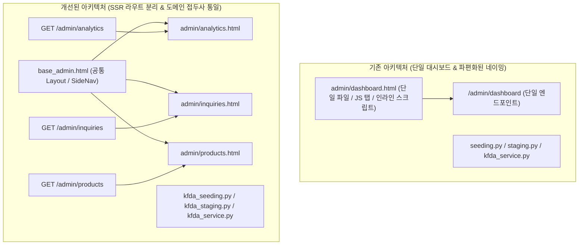

화장품 성분 분석 서비스 PickSafe를 개발하고 유지보수하면서, 서비스 초기 빠르게 기능을 추가하느라 누적된 구조적 부채들을 마주하게 되었습니다. 

특히 외부 데이터(식약처 성분 정보)를 수집하고 보강하는 백엔드 파이프라인의 모듈 명명 규칙이 레이어마다 상이했고, 어드민 영역의 경우 단일 HTML 파일에 여러 화면의 로직과 인라인 스크립트가 집약되어 있어 변경 시 손상 위험이 매우 높은 상태였습니다.

이 글은 위험도를 최소화하면서 명명 규칙을 통일하고, 단일 거대 템플릿을 SSR(Server-Side Rendering) 기반의 독립 라우트 및 모듈형 템플릿으로 안전하게 분리해 나간 과정을 담았습니다.

---

## 🎯 마주한 고민과 문제 배경

프로젝트가 확장됨에 따라 크게 세 가지 영역에서 구조적 정합성이 흔들리는 문제를 마주했습니다.

### 1. 백엔드 레이어 간 명명 규칙 불일치
식약처(KFDA) 데이터 수집, 데이터 보강, DB 병합, 스케줄링을 담당하는 백엔드 파일들의 이름이 레이어마다 제각각이었습니다.
* DB 모델: `models/staging.py`
* 라우터: `routers/seeding.py`
* 서비스: `services/kfda_service.py`, `services/seed_kfda_ingredients.py`

동일한 도메인 맥락을 다룸에도 불구하고 파일명만으로는 식약처 관련 로직인지 한눈에 파악하기 어려웠고, 의존성 관계를 추적할 때 혼선이 발생했습니다.

### 2. 어드민 대시보드 템플릿의 비대화와 수정 리스크
기존 어드민 페이지(`admin/dashboard.html`)는 방문자 분석, 문의 관리, 인기 제품 관리, 번역 관리, 수집 및 보강 상태 조회 등 서로 다른 6개 이상의 기능 섹션을 **단일 URL 내에서 클라이언트 사이드 JS 탭 전환 방식**으로 처리하고 있었습니다.

* **손상 이력:** 여러 기능의 HTML 구조와 인라인 JavaScript가 한 파일에 뒤엉켜 있다 보니, 한 화면의 로직을 수정하다가 다른 화면의 이벤트 리스너나 DOM 요소가 깨지는 사고가 과거 두 차례 발생했습니다.
* **원칙 위반:** 프로젝트 내부의 "SSR 중심 + 최소한의 JS 활용"이라는 기본 프론트엔드 작성 원칙과 어긋나 있었으며, 코드 가독성과 유지보수성이 크게 저하되었습니다.

### 3. 기능 명세 문서와 실제 코드 경로의 괴리
기능 명세 문서(`docs/features/`) 내 "관련 파일 경로" 항목들이 실제 파일 위치 변경을 제때 반영하지 못해 문서와 코드베이스 간의 불일치가 존재했습니다.

---

## ⚖️ 기술적 대안 비교 및 선택 이유

문제를 해결하기 위해 두 가지 접근 방식을 검토했습니다.

### 대안 A: 빅뱅 방식의 일괄 리팩토링 및 클라이언트 SPA 전환
* **방식:** 백엔드 파일 리네이밍과 어드민 프론트엔드의 SPA(React/Vue 등) 전환을 한 번의 작업 단위로 전체 적용.
* **장점:** 한 번에 깔끔한 현대적 아키텍처로 전환 가능.
* **단점:** 리네이밍 과정에서 모듈 임포트 누락으로 인한 런타임 에러 발생 위험이 큼. 어드민 템플릿의 손상 이력이 있는 상태에서 전체 분리를 한꺼번에 진행할 경우 회귀 테스트 부담이 과도하게 증가함.

### 대안 B: 점진적 SSR 라우트 분리 및 단일 모듈 접두사 통일 (최종 선택)
* **방식:** 
  1. 리스크가 없는 문서 정합성 감사를 먼저 수행.
  2. 백엔드 모듈은 접두사(`kfda_`)를 정의하고 **'파일 1개 수정 → 임포트 검증 → 서버 기동 확인'** 단계를 반복.
  3. 어드민 대시보드는 공통 레이아웃(`base_admin.html`)을 정의한 후, **화면(URL) 단위로 섹션을 하나씩 독립 라우트/템플릿으로 분리**.
* **선택 이유:** 기존 SSR 아키텍처 기조를 유지하여 추가적인 프레임워크 라이브러리 도입 없이 유지보수성을 극대화할 수 있습니다. 무엇보다 단계별 검증을 거치므로 운영 안정성을 완벽히 확보할 수 있다는 이점이 있었습니다.

---

## 🏗️ 시스템 아키텍처 및 흐름

어드민 시스템의 구조를 단일 탭 전환 방식에서 Jinja2 템플릿 상속 기반의 SSR 라우트 구조로 전환하고, 데이터 파이프라인 모듈의 네이밍을 도메인 중심으로 통일한 아키텍처는 다음과 같습니다.



---

## 💻 핵심 구현 및 트러블슈팅

### 1. 안전한 백엔드 파일 리네이밍 기법
파편화되어 있던 식약처 관련 파일들의 접두사를 `kfda_`로 통일했습니다. 런타임 `ImportError`를 방지하기 위해 단일 커밋 단위로 아래 검증 프로세스를 적용했습니다.

```bash
# 1. 파일 변경 전 모듈 참조 전수 조사
grep -rn "seed_kfda_ingredients\|kfda_service\|staging" web/backend/app/

# 2. 개별 파일 리네이밍 및 임포트 경로 수정 (예: seeding.py -> kfda_seeding.py)
# 3. Python 컴파일 및 런타임 임포트 검증 스크립트 실행
python -m py_compile web/backend/app/routers/kfda_seeding.py
```

`models/staging.py`의 경우 단순히 `staging.py`라는 모호한 이름 대신 `kfda_staging.py`로 변경하여, 임시 스테이징 테이블이 식약처 데이터 수집용임을 명확히 했습니다.

```python
# web/backend/app/routers/kfda_seeding.py (임포트 경로 수정 예시)

# 기존:
# from app.services.seed_kfda_ingredients import run_seeding
# from app.models.staging import RawIngredientStaging

# 변경 후:
from app.services.kfda_seeding_service import run_seeding
from app.models.kfda_staging import RawIngredientStaging
```

### 2. Jinja2 기반 공통 레이아웃(`base_admin.html`) 추출
기존 `dashboard.html`에서 반복 사용되던 사이드바 네비게이션, 헤더, 공통 CSS/JS 의존성을 `base_admin.html`로 격리했습니다.

```html
<!-- web/frontend/templates/admin/base_admin.html -->
<!DOCTYPE html>
<html lang="ko">
<head>
    <meta charset="UTF-8">
    <title>PickSafe 어드민</title>
    <link rel="stylesheet" href="/static/css/admin.css">
</head>
<body>
    <div class="admin-wrapper">
        <aside class="sidebar">
            <nav>
                <a href="/admin/analytics" class="nav-item">방문자 분석</a>
                <a href="/admin/inquiries" class="nav-item">문의 관리</a>
                <a href="/admin/products" class="nav-item">인기 제품 관리</a>
            </nav>
        </aside>
        <main class="content">
            
        </main>
    </div>
    
</body>
</html>
```

### 3. 화면 단위 SSR 라우트 및 스크립트 분리
기존 `dashboard.html` 내 인라인 자바스크립트로 뒤얽혀 있던 문의 관리 화면을 독립된 라우트와 전용 템플릿으로 분리했습니다.

```python
# web/backend/app/routers/admin.py (독립 라우트 분리)

@router.get("/admin/inquiries", response_class=HTMLResponse)
async def get_admin_inquiries(
    request: Request,
    db: Session = Depends(get_db)
):
    inquiries = await get_inquiry_list(db)
    return templates.TemplateResponse(
        "admin/inquiries.html",
        {"request": request, "inquiries": inquiries}
    )
```

```html
<!-- web/frontend/templates/admin/inquiries.html -->


문의 관리 - PickSafe 어드민


<div class="inquiry-container">
    <h2>1:1 문의 내역</h2>
    <table class="data-table">
        <!-- 데이터 렌더링 -->
    </table>
</div>



<script src="/static/js/admin/inquiries.js"></script>

```

한번에 전체 탭을 분리하지 않고 `/admin/analytics` -> `/admin/inquiries` -> `/admin/products` 순서로 하나씩 라우트를 생성하고 동작을 확증한 뒤 기존 `dashboard.html`에서 해당 코드 조각을 제거했습니다. 최종적으로 `dashboard.html`은 기본 개요 화면(`/admin/analytics`)으로 이동하는 엔트리포인트 역할만 담당하도록 정돈되었습니다.

---

## 💡 돌아보며 배운 점 (회고)

이번 구조 정합성 개선 작업을 통해 얻은 기술적 결실과 교훈은 다음과 같습니다.

### 1. 변경의 파급 범위(Blast Radius) 최소화
기존에는 어드민 대시보드의 자바스크립트나 HTML 구조 하나를 수정할 때마다 대시보드 내 전체 기능에 영향이 없는지 전수 확인해야 했습니다. 라우트 및 템플릿 분리 후에는 **문의 관리 화면을 수정하더라도 방문자 분석이나 제품 관리 화면에 전혀 영향을 주지 않는 구조**가 완성되었습니다.

### 2. 가독성과 도메인 인지성 향상
`kfda_` 접두사 통일을 통해 백엔드 레이어 전반에서 해당 모듈이 어떤 도메인을 다루고 있는지 명확해졌습니다. 단순해 보이는 파일명 정리가 프로젝트 파악 및 디버깅 시간을 크게 줄여줌을 체감했습니다.

### 3. 리스크 기반의 점진적 리팩토링 원칙 수립
안정적인 서비스를 유지하면서 부채를 청산하는 최선의 방법은 '리스크가 낮은 작업부터, 작게 쪼개어 검증하며 진행하는 것'입니다. 

* 1단계: 문서 정합성 감사 (코드 변경 없음)
* 2단계: 백엔드 모듈 1개씩 리네이밍 및 컴파일 검증
* 3단계: 프론트엔드 섹션 1개씩 라우트 분리 및 E2E 동작 확인

이러한 점진적 접근을 통해 단 한 건의 런타임 장애나 기능 손상 없이 거대 템플릿 단일화 문제를 안전하게 해결할 수 있었습니다. 앞으로도 기능 추가 과정에서 발생할 수 있는 비대화 요소를 주기적으로 점검하고 정리해 나갈 계획입니다.