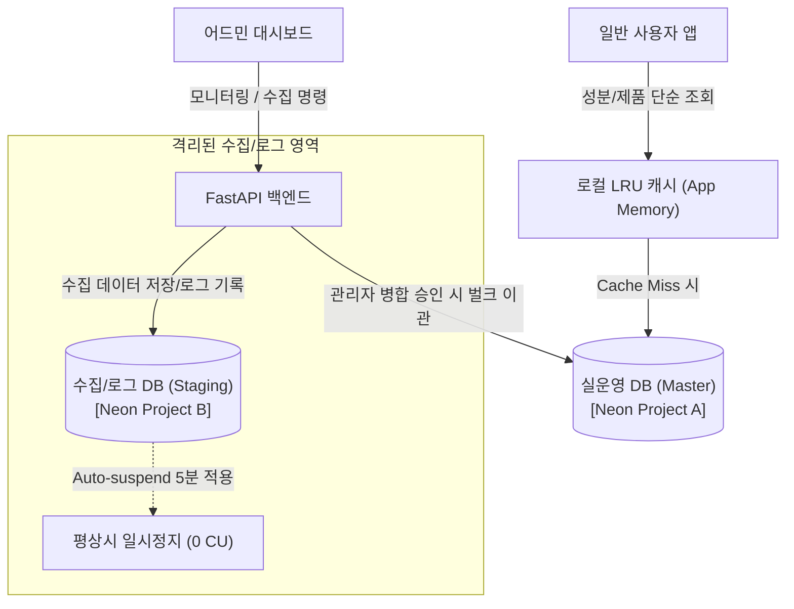
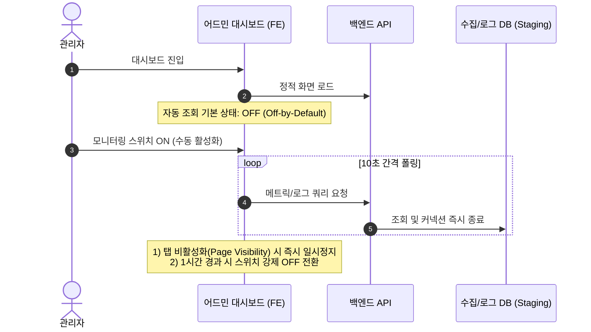

화장품 성분 분석 서비스인 **PickSafe**를 개발하면서 데이터베이스 운용과 관련된 현실적인 아키텍처 병목에 직면했습니다.

서버리스 PostgreSQL 서비스인 Neon을 메인 데이터베이스로 채택하여 운용하던 중, 배치 데이터 수집과 어드민 대시보드의 백그라운드 쿼리로 인해 **Compute 리소스 소모(CU-Hours)**가 지속되는 문제가 발생했습니다. 비용 절감과 서비스 안정성을 동시에 확보하기 위해 진행했던 아키텍처 분리 및 모니터링 제어 작업의 고민과 과정을 정돈해 기록합니다.

---

## 🎯 마주한 고민과 문제 배경

Neon 데이터베이스는 DB 커넥션이 활성화되어 있거나 쿼리가 가동되는 시간(Compute Active Time)을 기준으로 CU(Compute Unit)를 측정해 과금합니다. 일정 시간 쿼리가 없으면 DB가 자동으로 일시정지(Auto-suspend) 상태로 들어가 리소스 소모를 중단하는 구조입니다.

하지만 실운영 환경을 구축하는 과정에서 다음과 같은 문제점들이 드러났습니다.

1. **배치 작업과 실운영 쿼리의 리소스 경합**  
   외부 API를 통해 수만 건 단위의 원료 및 성분 데이터를 정기적으로 수집(Seeding)하고 매쉬업하는 배치 프로세스가 실행될 때, CPU와 IOPS 사용량이 급증했습니다. 이로 인해 실운영 사용자 요청의 응답 속도가 간헐적으로 지연되는 현상이 관찰되었습니다.
2. **Auto-suspend 진입을 방해하는 어드민 모니터링**  
   어드민 페이지에서 백엔드 상태 및 로그를 모니터링하기 위해 주기적으로 자동 조회를 수행할 경우, DB 커넥션이 상시 유지되는 현상이 발생했습니다. 관리자가 모니터링 화면을 켜둔 채 자리를 비우면 DB가 일시정지 상태에 진입하지 못해 불필요한 Compute 과금이 지속되었습니다.
3. **제한된 서버 인프라 메모리 환경**  
   서버 인프라 메모리가 넉넉하지 않은 환경 특성상 별도의 외부 인메모리 캐시(Redis 등) 시스템을 별도로 띄워 레이어를 추가하는 것은 인프라 복잡도와 고정 비용을 높이는 원인이 되었습니다.

이러한 문제를 해결하기 위해 **"실운영 트래픽의 안정성 확보"**와 **"비활성 시간대의 Compute 사용량 Zero화"**라는 두 가지 목표를 세우고 구조 개선에 착수했습니다.

---

## ⚖️ 기술적 대안 비교 및 선택 이유

문제를 해결하기 위해 크게 두 가지 대안을 비교 검토했습니다.

| 비교 항목 | 대안 A: 단일 DB 유지 + 외부 캐시 서버 구축 | 대안 B: 데이터베이스 물리 격리 + 앱 내 LRU 캐시 (선택) |
| :--- | :--- | :--- |
| **구조 복잡도** | 인프라 구성요소 추가 (Redis 등 관리 필요) | 어플리케이션 내 멀티 DB 라우팅 로직 구현 |
| **비용 효율성** | 캐시 서버 고정 비용 발생, DB 상시 점유 리스크 존재 | 배치 전용 DB의 타이트한 Auto-suspend로 가동 시에만 과금 |
| **격리성** | 배치 실행 시 여전히 동일 DB 인스턴스에 쓰기 부하 전달 | 수집/배치 DB와 실운영 DB가 완전 격리되어 부하 간섭 없음 |
| **메모리 영향** | 외부 인메모리 DB로 서버 RAM 영향 적음 | 앱 프로세스 내 경량 메모리 사용 (제한된 경량 라이브러리 활용) |

### 최종 선택 이유

**대안 B**를 선택했습니다. 외부 인프라 레이어를 늘리지 않으면서, 배치 연산과 로그 모니터링용 DB를 별도로 분리하는 것이 구조적으로 안전하다고 판단했습니다. 

배치/로그 전용 DB에는 **5분의 Auto-suspend 타임아웃**을 설정하고, 수집 작업이 없는 평상시에는 활성화 시간을 제로에 가깝게 유지하도록 구성했습니다. 또한 앱 내부의 경량 메모리 캐시를 결합하여 단순 성분 사전 조회 쿼리가 실운영 DB로 직접 들어가는 비중을 대폭 줄이기로 결정했습니다.

---

## 🏗️ 시스템 아키텍처 및 흐름

개선된 시스템은 수집·로그용 DB(Staging/DW)와 사용자 전용 DB(Master)를 물리적으로 분리하고, 최종 검증된 데이터만 이관하는 **이중 버퍼링(Double-Buffering)** 구조를 취합니다.



어드민 모니터링 폴링 동작 역시 백엔드와 DB의 불필요한 활성화를 차단하도록 클라이언트 제어 흐름을 설계했습니다.



---

## 💻 핵심 구현 및 트러블슈팅

### 1. 수집기 DB 커넥션 완전 격리 (Double-Buffering)

초기 구현에서는 수집 배치 진행 중에도 중복 검사를 위해 실운영 DB(Master)에 지속적으로 `SELECT` 요청을 보냈습니다. 이 방식은 수집 중 실운영 DB의 리소스를 소모하는 문제가 있었습니다.

이를 개선하기 위해 수집 도중에는 실운영 DB 접속을 차단하고, 수집 DB(Staging) 내부의 병합 여부 플래그(`is_merged`) 및 식별 정보 존재 여부만 확인하도록 변경했습니다. 데이터 수집과 정제가 완료된 이후 어드민에서 '병합(Merge)' 명령을 수행할 때만 단일 트랜잭션으로 데이터를 이관하도록 조치했습니다.

```python
# database_router.py (개념 요약 예시)
from contextlib import contextmanager

class DatabaseRouter:
    """
    작업 성격에 따른 이중 DB 커넥션 라우팅 어댑터
    """
    def __init__(self, master_url: str, staging_url: str):
        self.master_engine = create_engine(master_url, pool_pre_ping=True)
        self.staging_engine = create_engine(staging_url, pool_pre_ping=True)

    @contextmanager
    def get_db_session(self, target: str = "master"):
        engine = self.master_engine if target == "master" else self.staging_engine
        session = Session(bind=engine)
        try:
            yield session
            session.commit()
        except Exception:
            session.rollback()
            raise
        finally:
            session.close()
```

### 2. 로컬 LRU 캐시를 통한 읽기 쿼리 절감

외부 캐시 인프라 없이 Python의 `cachetools` 라이브러리를 활용해 자주 변경되지 않는 성분명 1:1 대칭 매칭 정보를 메모리에 캐싱했습니다.

```python
# ingredient_service.py (개념 요약 예시)
from cachetools import TTLCache

# 최대 1,000개 항목, 1시간(3600초) 유효 범주 설정
_ingredient_cache = TTLCache(maxsize=1000, ttl=3600)

def get_normalized_ingredient(raw_name: str, db_session):
    """
    성분 정규화 정보 조회 (로컬 캐시 적용)
    """
    if raw_name in _ingredient_cache:
        return _ingredient_cache[raw_name]
    
    # Cache Miss 시에만 실운영 DB 조회
    result = db_session.query(IngredientMaster).filter_by(raw_name=raw_name).first()
    if result:
        _ingredient_cache[raw_name] = result
    return result
```

### 3. 클라이언트 폴링 안전장치 및 1시간 강제 타임아웃

어드민 모니터링 폴링으로 인해 DB B가 계속 깨어있는 현상을 방지하기 위해 클라이언트 영역에 3중 안전장치를 구성했습니다.

1. **Off-by-Default**: 대시보드 진입 시 자동 갱신 스위치는 기본적으로 꺼짐 상태로 시작.
2. **Page Visibility API 연동**: 어드민 탭이 백그라운드로 내려가면 즉시 폴링 타이머 중단.
3. **1시간 자동 안전 타임아웃**: 스위치를 켜둔 채 방치하더라도 1시간이 지나면 자동으로 스위치를 Off로 전환.

```javascript
// dashboard_monitoring.js (개념 요약 예시)
let pollingTimer = null;
let activeStartTime = null;
const MAX_POLLING_DURATION = 3600 * 1000; // 1시간

function startMonitoring() {
    activeStartTime = Date.now();
    pollingTimer = setInterval(() => {
        // 1시간 초과 방지 검증
        if (Date.now() - activeStartTime > MAX_POLLING_DURATION) {
            stopMonitoring();
            alert("안전을 위해 모니터링 자동 갱신이 종료되었습니다.");
            return;
        }
        
        // 브라우저 탭 활성화 여부 확인
        if (!document.hidden) {
            fetchMetricsData();
        }
    }, 10000);
}

function stopMonitoring() {
    if (pollingTimer) clearInterval(pollingTimer);
    document.getElementById('auto-refresh-toggle').checked = false;
}
```

### 4. 일자별 로그 분할 및 Rotating 관리

수집 과정에서 발생하는 로그 파일이 단일 파일에 누적 기록되면 디스크 용량을 압박하고 어드민 조회 시 메모리 문제가 생길 수 있습니다. 이를 해결하기 위해 프로젝트 루트의 독립된 `/log/` 디렉토리에 일자별 분할 및 크기 제한 로테이션을 적용했습니다.

```python
# logger_config.py (개념 요약 예시)
import logging
from logging.handlers import RotatingFileHandler
import os

def setup_seeding_logger():
    log_dir = os.path.join(os.getcwd(), "logs")
    os.makedirs(log_dir, exist_ok=True)
    
    log_filepath = os.path.join(log_dir, "seeding_activity.log")
    
    # 핸들러 당 최대 5MB, 최대 백업본 1개로 제한하여 총 10MB 이내 유지
    handler = RotatingFileHandler(
        log_filepath, 
        maxBytes=5 * 1024 * 1024, 
        backupCount=1, 
        encoding='utf-8'
    )
    
    formatter = logging.Formatter('[%(asctime)s] %(levelname)s: %(message)s')
    handler.setFormatter(formatter)
    
    logger = logging.getLogger("seeding")
    logger.setLevel(logging.INFO)
    logger.addHandler(handler)
    return logger
```

---

## 💡 돌아보며 배운 점

이번 개선 작업을 진행하며 인프라 스케일을 무작정 늘리는 것만이 해답이 아니라는 점을 다시금 깨달았습니다.

1. **과금 모델의 특성을 고려한 설계의 중요성**  
   서버리스 DB의 핵심 이점인 Auto-suspend를 제대로 활용하기 위해서는 백엔드의 커넥션 관리뿐만 아니라 대시보드나 클라이언트의 폴링 동작까지 함께 고려해야 한다는 것을 배웠습니다.
2. **명확한 격리를 통한 안전성 확보**  
   배치 연산과 모니터링 연산을 실운영 DB에서 완전히 떼어냄으로써, 수십만 건의 데이터를 정제·이관하는 도중에도 사용자 서비스의 응답 타임라인을 일정하게 유지할 수 있게 되었습니다.
3. **가장 단순한 해결책의 가치**  
   고비용 인프라 장치를 새로 도입하는 대신, 어플리케이션 단의 LRU 캐시와 클라이언트 측 안전 타임아웃이라는 경량화된 접근으로도 원하는 비용 절감 목표를 충분히 달성할 수 있었습니다.

제한된 리소스 환경일수록 트래픽과 데이터의 흐름을 정밀하게 제어하는 소프트웨어적인 설계 고민이 무엇보다 중요하다는 사실을 확인한 계기였습니다. 앞으로도 서비스의 정합성을 유지하면서 효율성을 높일 수 있는 담백한 아키텍처를 꾸준히 고민해 나가고자 합니다.