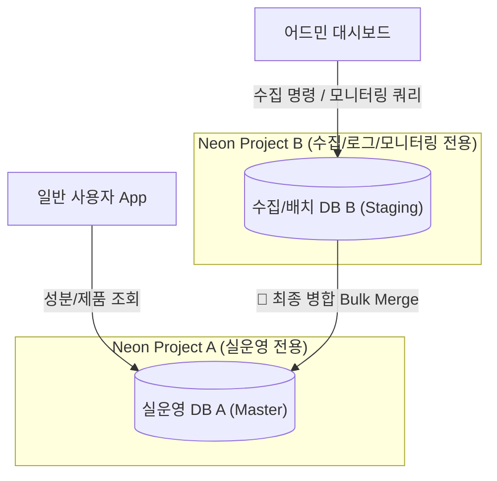
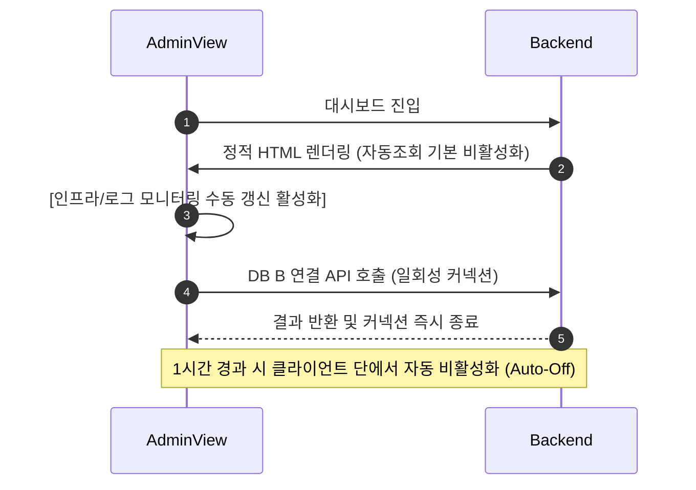

화장품 성분 분석 서비스인 **PickSafe**를 개발하면서 가장 크게 마주한 현실적인 장벽은 다름 아닌 **제한된 인프라 리소스와 클라우드 비용**이었습니다. 

서비스의 핵심 기능은 식약처 등에서 제공하는 대량의 성분 데이터를 수집하고 이를 제품 정보와 매칭하여 안전성 분석 결과를 제공하는 것입니다. 초기 설계 단계에서는 유연한 확장성과 관리의 편의성을 위해 서버리스 PostgreSQL인 **Neon DB**를 선택했습니다. 그러나 개발을 진행하고 실제 운영 환경을 모사해 테스트하는 과정에서 예상치 못한 비용 리스크와 성능 병목을 마주하게 되었습니다.

이 글은 제한된 예산과 인프라(Render 무료/저비용 티어) 환경에서 Neon DB의 독특한 과금 모델을 이해하고, 이를 극복하기 위해 취했던 아키텍처 분리 및 모니터링 폴링 최적화 과정을 담은 기술 회고록입니다.

---

## 🎯 마주한 고민과 문제 배경

### 1. Neon DB의 Compute 시간(CU-Hours) 과금 구조
Neon DB는 사용하지 않을 때 데이터베이스를 자동으로 일시 정지(Auto-suspend)하는 훌륭한 기능을 제공합니다. 하지만 반대로 말하면, **단 하나의 커넥션이라도 유지되거나 쿼리가 지속적으로 인입되면 DB가 계속 깨어 있는 상태(Active)를 유지**하게 됩니다. 이 활성화 시간(Compute Active Time) 동안 점유하는 Compute Unit(CU)에 비례해 비용이 청구됩니다.

### 2. 어드민 모니터링의 Keep-Alive 덫
관리자 전용 서브도메인(어드민 페이지)에서 서버 상태, 인프라 메트릭스, 실시간 수집 로그를 모니터링하기 위해 주기적으로 백엔드에 API 요청을 보내는 폴링(Polling)을 구현했습니다. 
이 과정에서 DB 커넥션이 지속적으로 갱신되었고, 결과적으로 DB가 단 1분도 쉬지 못하고 24시간 내내 활성화되는 문제가 발생했습니다. 이대로 서비스를 배포한다면 아무도 서비스를 쓰지 않는 새벽 시간대에도 고스란히 Compute 비용이 청구되는 상황이었습니다.

### 3. 무거운 배치 작업의 간섭
식약처 API로부터 약 2만 건의 성분 데이터를 수집(Seeding)하고 가공하는 배치 프로세스는 CPU와 I/O 리소스를 대량으로 소모합니다. 이 무거운 연산이 일반 사용자가 서비스를 이용하는 실운영 데이터베이스에서 동시에 실행될 경우, 단순 조회 요청의 응답 속도마저 급격히 떨어지는 병목 현상이 관찰되었습니다.

### 4. 인메모리 캐시 도입의 제약
데이터베이스로 향하는 단순 조회 쿼리를 줄이기 위해 Redis 같은 외부 인메모리 캐시 도입을 검토했으나, 현재 활용 중인 Render의 저비용 컨테이너 환경에서는 추가적인 RAM 메모리 확보가 곤란했습니다. 외부 캐시 서비스를 별도로 구독하는 것 역시 추가적인 비용 지출을 의미했기에, 대안이 필요했습니다.

---

## ⚖️ 기술적 대안 비교 및 선택 이유

문제를 해결하기 위해 두 가지 방향성을 두고 고민했습니다.

### 대안 1: 단일 DB 유지 + 커넥션 풀링 최적화 + 외부 Redis 도입
*   **장점**: 아키텍처가 단순하여 데이터 동기화 문제를 신경 쓸 필요가 없음.
*   **단점**: Redis 도입으로 인한 추가 비용 발생. 대규모 배치 작업 시 실운영 테이블에 발생하는 락(Lock)과 I/O 병목을 근본적으로 해결하기 어려움.

### 대안 2: 물리적 Multi-DB 격리 + 로컬 LRU 캐시 + 폴링 최적화 (선택)
*   **장점**: 
    *   실운영 DB와 배치/로그용 DB를 완벽히 격리하여 상호 간섭 원천 차단.
    *   배치용 DB는 작업이 없을 때 타이트하게 Auto-suspend(5분)를 적용하여 평상시 Compute 비용을 0원으로 유지 가능.
    *   Redis 없이 백엔드 애플리케이션의 로컬 메모리를 활용하는 LRU 캐시로 메모리 점유율 최소화 및 비용 절감.
*   **단점**: 두 데이터베이스 간의 데이터 병합(Merge) 로직을 직접 구현해야 하므로 개발 공수가 증가함.

배치 작업의 안정성과 비용 절감이라는 두 마리 토끼를 모두 잡기 위해, 다소 복잡하더라도 **대안 2**의 아키텍처 격리 노선을 선택했습니다.

---

## 🏗️ 시스템 아키텍처 및 흐름

설계한 Multi-DB 아키텍처와 어드민 모니터링 흐름은 다음과 같습니다.

### 1. Multi-DB 격리 및 이중 버퍼링(Double-Buffering) 구조



*   **실운영 DB A (Master)**: 일반 사용자용 성분 정보 조회, 인기 제품 검색 등 실서비스만 담당합니다. 배치 연산이나 모니터링 쿼리가 전혀 들어오지 않으므로 Neon의 최저 리소스 설정(0.25 CU)만으로도 일정한 응답 속도를 보장합니다.
*   **수집/배치 DB B (Staging - `DEV_DATABASE_DW_URL`)**: 수집 임시 데이터(`ingredients_master_staging`), 서버 인프라 메트릭스 및 실시간 로그를 저장합니다. 평소에는 완전히 잠들어 있다가, 배치가 돌거나 관리자가 대시보드를 열었을 때만 활성화됩니다.

### 2. 어드민 모니터링의 온디맨드 제어 흐름



---

## 💻 핵심 구현 및 트러블슈팅

### 1. 이중 데이터베이스 라우팅과 안전한 초기화 기법
FastAPI와 SQLAlchemy를 활용하여 두 데이터베이스의 세션을 독립적으로 관리하고, 수집 데이터 초기화 시 정합성이 깨지지 않도록 이중화 초기화 로직을 구현했습니다.

```python
# database.py
from sqlalchemy import create_engine
from sqlalchemy.orm import sessionmaker, declarative_base
import os

# 환경 변수 분리
DATABASE_URL_A = os.getenv("DATABASE_URL")  # 실운영 DB A
DATABASE_URL_B = os.getenv("DEV_DATABASE_DW_URL")  # 배치/로그 DB B

engine_a = create_engine(DATABASE_URL_A, pool_pre_ping=True, pool_recycle=1800)
engine_b = create_engine(DATABASE_URL_B, pool_pre_ping=True, pool_recycle=1800)

SessionLocalA = sessionmaker(autocommit=False, autoflush=False, bind=engine_a)
SessionLocalB = sessionmaker(autocommit=False, autoflush=False, bind=engine_b)

Base = declarative_base()
```

데이터 초기화 요청 시, 실운영 환경의 데이터를 지울 때는 반드시 스테이징 테이블도 함께 비워 정합성을 유지하도록 강제했습니다.

```python
# admin.py (일부 발췌)
def reset_database_safely(db_type: str):
    session_a = SessionLocalA()
    session_b = SessionLocalB()
    try:
        if db_type == "production":
            # 실운영 초기화 시 두 테이블 모두 비워 정합성 보장 (이중화 초기화)
            session_a.query(IngredientMaster).delete()
            session_b.query(IngredientMasterStaging).delete()
            session_a.commit()
            session_b.commit()
        elif db_type == "staging":
            session_b.query(IngredientMasterStaging).delete()
            session_b.commit()
    except Exception as e:
        session_a.rollback()
        session_b.rollback()
        raise e
    finally:
        session_a.close()
        session_b.close()
```

### 2. 수집기(Seeding) 커넥션 격리 및 벌크 병합(Double-Buffering)
기존에는 수집 배치가 돌 때마다 실운영 DB A에 `SELECT` 쿼리를 날려 중복 여부를 체크했습니다. 이는 실운영 DB의 Compute 자원을 낭비하는 원인이었습니다.

이를 개선하여, 수집 중에는 오직 DB B의 스테이징 테이블(`ingredients_master_staging`) 내에 존재하는 중복 여부 플래그(`is_merged`)와 임시 식별값(CAS 번호 등)만을 대조하도록 완전히 격리했습니다.

```python
# seeder.py
def run_seeding_process():
    db_b = SessionLocalB()
    try:
        # 중복 체크 및 임시 저장은 모두 DB B(Staging) 내에서만 수행
        unprocessed_ingredients = db_b.query(IngredientMasterStaging).filter(
            IngredientMasterStaging.is_merged == False
        ).all()
        
        for ingredient in unprocessed_ingredients:
            # 외부 API 매쉬업 및 가공 로직 수행
            # (이 과정에서 DB A로의 커넥션은 전혀 발생하지 않음)
            ingredient.cas_number = "CAS-XXXX"  # 비식별화 예시
            ingredient.is_merged = True
        
        db_b.commit()
    finally:
        db_b.close()
```

이후 어드민 페이지에서 관리자가 **[병합(Merge)]** 버튼을 누르는 시점에만 DB B의 데이터를 읽어와 DB A로의 단일 트랜잭션 벌크 인서트(Bulk Insert)를 수행합니다.

### 3. 경량 로컬 LRU 캐시 도입
외부 Redis를 사용할 수 없는 제약을 극복하기 위해 Python의 내장 메모리를 사용하는 `cachetools` 라이브러리를 도입했습니다. 성분 대칭 정보와 같이 거의 변경되지 않는 정적 데이터 조회 시 DB A로 향하는 트래픽을 차단했습니다.

```python
# ingredient_matcher.py
from cachetools import TTLCache

# 최대 1000개의 성분 매칭 데이터를 1시간(3600초) 동안 메모리에 캐싱
ingredient_cache = TTLCache(maxsize=1000, ttl=3600)

def get_ingredient_by_name(db_session, name: str):
    if name in ingredient_cache:
        return ingredient_cache[name]
    
    # 캐시 미스 시 DB A 조회
    ingredient = db_session.query(IngredientMaster).filter_by(name=name).first()
    if ingredient:
        ingredient_cache[name] = {
            "id": "00000000-0000-0000-0000-000000000000",  # 비식별화된 UUID
            "name": ingredient.name,
            "safety_grade": ingredient.safety_grade
        }
    return ingredient_cache.get(name)
```

### 4. 일자별 로그 로테이션(Daily Log Rotation) 적용
수집기가 장시간 구동될 때 발생하는 로그가 단일 파일에 누적되면, 디스크 용량 부족 문제와 어드민 뷰 로딩 시 메모리 크래시가 발생할 우려가 있었습니다. 또한 프로젝트 루트 경로에 무작위로 로그가 쌓여 Git 형상 관리에 혼선을 주기도 했습니다.

이를 해결하기 위해 로그 저장 경로를 `/log/` 폴더로 격리하여 `.gitignore`에 등록하고, `RotatingFileHandler`를 통해 용량을 엄격히 제한했습니다.

```python
# logger_config.py
import os
import logging
from logging.handlers import RotatingFileHandler

LOG_DIR = os.path.join(os.path.dirname(os.path.dirname(__file__)), "log")
if not os.path.exists(LOG_DIR):
    os.makedirs(LOG_DIR)

log_file_path = os.path.join(LOG_DIR, "seeding_run.log")

# 최대 5MB 크기로 제한, 백업본은 1개만 유지하여 총 용량이 10MB를 넘지 않도록 관리
file_handler = RotatingFileHandler(
    log_file_path, maxBytes=5 * 1024 * 1024, backupCount=1, encoding="utf-8"
)
file_handler.setFormatter(logging.Formatter('%(asctime)s - %(levelname)s - %(message)s'))

logger = logging.getLogger("SeedingLogger")
logger.setLevel(logging.INFO)
logger.addHandler(file_handler)
```

---

## 💡 돌아보며 배운 점 (회고)

이번 최적화 작업을 거치며 얻은 가장 값진 교훈은 **"서버리스(Serverless) 기술은 설계 단계에서부터 그 수명 주기(Life Cycle)를 고려해야만 진짜 가치를 발휘한다"**는 점이었습니다.

### 1. 실질적인 개선 효과
*   **Compute 비용 절감**: 모니터링 폴링을 기본적으로 비활성화하고 1시간 타임아웃 장치를 마련한 결과, 어드민 페이지로 인해 DB가 상시 활성화되어 있던 문제가 해결되었습니다. 배치 DB B는 사용하지 않을 때 5분 만에 깔끔히 잠들게(Auto-suspend) 되어, 배치 미구동 시 청구 요금이 0원에 수렴하는 효과를 보았습니다.
*   **성능 안정성 확보**: 무거운 데이터 수집 및 가공 연산이 스테이징 DB B로 완전히 격리되면서, 수집 작업이 진행되는 동안에도 일반 사용자가 이용하는 실운영 DB A의 조회 응답 시간은 평균 50ms 미만의 안정적인 수치를 유지했습니다.
*   **메모리 효율성**: 외부 캐시 서버 없이 로컬 LRU 캐시를 적재적소에 활용함으로써, 추가 비용 없이 DB A 조회 트래픽을 상당 부분 상쇄할 수 있었습니다.

### 2. 향후 과제
현재의 Multi-DB 구조는 매우 효과적이지만, 스테이징 DB B에서 실운영 DB A로 데이터를 최종 병합할 때 일시적으로 트랜잭션 락이 발생할 여지가 있습니다. 향후 서비스 규모가 커지고 제품 데이터가 더 늘어난다면, Bulk Insert 시 단일 트랜잭션 크기를 적절한 청크(Chunk) 단위로 쪼개어 순차 병합하는 로직을 추가로 보완할 계획입니다.

기술적인 화려함보다는 현실적인 제약 속에서 비용과 성능의 균형점을 찾아 나가는 과정이 엔지니어로서 한 단계 성장할 수 있었던 소중한 경험이었습니다.