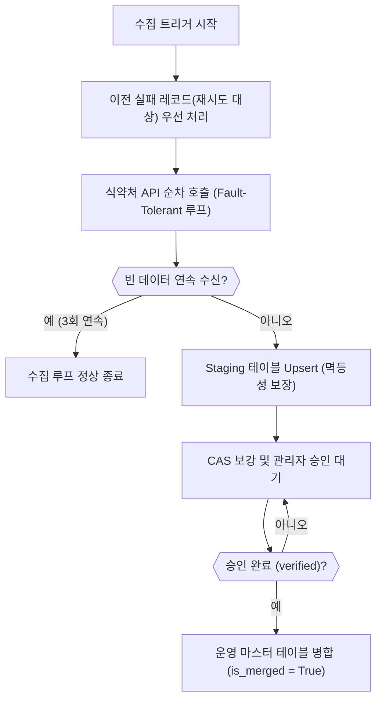

화장품 성분 분석 서비스 PickSafe를 운영하면서 외부 공공 API를 연동해 성분 데이터를 수집·정제하는 파이프라인은 서비스의 뼈대와 같습니다. 식약처 데이터를 주기적으로 가져와 마스터 테이블에 적재하고, 화학물질 식별 번호(CAS No)가 누락된 성분들은 추가 스크래핑을 통해 보강하는 구조입니다.

하지만 초기 구현된 파이프라인을 그대로 방치한 채 데이터 규모가 늘어나면서, 운영 관점에서 치명적인 구조적 결함들이 수면 위로 드러났습니다. 이번 글에서는 이 문제를 해결하기 위해 파이프라인 전체를 다시 설계하며 고민했던 지점들을 담담히 정리해 보려고 합니다.

---

## 🎯 마주한 고민과 문제 배경

초기 성분 수집 로직은 단순하고 직관적으로 작성되었습니다. 하지만 다음과 같은 실무적 한계에 부딪혔습니다.

1. **멱등성 결여로 인한 데이터 유실**: 수집 스크립트가 실행될 때마다 기존 임시(Staging) 테이블의 데이터를 일괄 삭제(`delete()`)하고 다시 적재하는 방식을 취하고 있었습니다. 관리자가 아직 검토하지 못한 오류(`error`) 상태의 레코드까지 함께 날아가는 문제가 있었습니다.
2. **CAS 누락 데이터의 영구 소외**: 마스터 테이블에 성분명이 이미 존재하면 수집 루프에서 스킵하도록 구현되어 있었습니다. 이로 인해 최초 수집 시 CAS 번호가 비어 있던 성분들은 이후 보강 후보군에서 영구적으로 차단되었습니다.
3. **API 장애를 '데이터의 끝'으로 오인**: 외부 공공 API가 일시적인 타임아웃이나 호출 제한으로 인해 빈 배열을 반환할 경우, 이를 "더 이상 가져올 데이터가 없다"고 판단하여 수집 루프가 조기 종료되었습니다.
4. **거대해진 라우터 파일**: 수집, CAS 보강, 스케줄링, 병합 로직이 어드민 라우터 파일 하나에 전부 밀집되어 있어 작은 수정에도 사이드 이펙트가 발생하기 쉬웠습니다.

---

## ⚖️ 기술적 대안 비교 및 선택 이유

문제를 해결하기 위해 여러 대안을 검토했습니다.

- **대안 A: 기존 구조 유지 및 예외 처리 구문(`try-except`)만 보강**
  - *장점*: 수정 범위가 작고 빠르게 적용 가능
  - *단점*: 근본적인 데이터 모델의 결함(단일 상태 값의 한계)을 해결할 수 없어, 유지보수 부채가 가중됨
- **대안 B: 메시지 큐(MQ) 기반의 비동기 분산 파이프라인 도입**
  - *장점*: 대규모 트래픽과 확장성에 유리
  - *단점*: 현재 인프라 환경에서 과도한 오버엔지니어링이며, 관리 포인트만 늘어남
- **대안 C: 관계형 데이터베이스의 Upsert 패턴 및 다차원 상태 속성 분리 (채택)**
  - *장점*: 기존 스택을 유지하면서도 데이터 무결성과 재시도 메커니즘을 확실하게 보장할 수 있음
  - *단점*: 테이블 스키마 변경 및 기존 데이터 마이그레이션 작업이 필요함

현실적인 리소스와 운영 안정성을 고려하여 **대안 C**를 선택했습니다. 데이터의 상태를 하나의 문자열 필드로 관리하던 방식을 버리고, 명확한 관심사별로 컬럼을 분리하여 상태 모델을 정교화했습니다.

---

## 🏗️ 시스템 아키텍처 및 흐름

재설계된 성분 수집 및 보강 파이프라인의 전체적인 흐름은 다음과 같습니다. 일시적인 네트워크 실패는 재시도 큐를 거치고, 최종 데이터는 검증 단계를 거쳐 마스터 테이블로 병합됩니다.



---

## 💻 핵심 구현 및 트러블슈팅

### 1. 다차원 상태 속성 분리
기존의 모호한 `status` 문자열 필드를 제거하고, 아래와 같이 역할을 명확히 분리된 독립 필드로 재구성했습니다.

- `is_merged` (Boolean): 운영 DB 이관 여부. KCIA 스크래핑 등으로 보강되었더라도 관리자의 최종 승인(`verified`)을 거치기 전에는 절대 자동으로 병합되지 않도록 방어벽을 세웠습니다.
- `sync_status` (String): API 수집 자체의 성공(`success`)과 실패(`failed`, `critical_failed`)를 분리 관리.
- `cas_status` (String): CAS 번호의 상태(`needed`, `suggested`, `verified`, `not_found`)를 독립 추적.
- `retry_count` (Integer): API 호출 실패 시 재시도 횟수 누적.

### 2. 네트워크 회복 탄력성 확보 (Fault-Tolerant 루프)
외부 API의 일시적인 응답 지연이나 타임아웃으로 인해 전체 파이프라인이 중단되는 현상을 막기 위해 재시도 메커니즘을 도입했습니다.

```python
# 파이프라인 내부 재시도 및 Fault-Tolerant 처리의 개념적 구조
def process_external_seeding_loop(db_session):
    # 1. 이전 실패 건 우선 재시도 (상한선 제한)
    failed_targets = get_retryable_failed_records(db_session, max_retries=5)
    for record in failed_targets:
        try:
            data = fetch_external_api_page(record.page_no)
            update_staging_success(db_session, record, data)
        except ExternalAPIError:
            increment_retry_count(db_session, record)

    # 2. 본 수집 루프 (연속 빈 데이터 방어)
    consecutive_empty_count = 0
    current_page = 1
    
    while consecutive_empty_count < 3:
        response = fetch_external_api_page(current_page)
        if not response.items:
            consecutive_empty_count += 1
            current_page += 1
            continue
            
        consecutive_empty_count = 0  데이터가 들어오면 리셋
        upsert_staging_records(db_session, response.items)
        current_page += 1
```

수집 루프 실행 전 `sync_status = 'failed'`이면서 재시도 횟수가 상한선(5회)을 넘지 않은 레코드들을 먼저 처리합니다. 만약 5회를 초과해 실패한 경우 `critical_failed` 상태로 전환하여 자동 재시도 큐에서 제외하고, 관리자 대시보드에서 수동으로 원인을 파악할 수 있도록 격리했습니다. 또한 외부 API가 일시적으로 빈 데이터를 주더라도 3회 연속으로 들어올 때만 진짜 종료로 간주하도록 방어 로직을 더했습니다.

### 3. 구조적 모듈화
`admin.py` 라우터 파일에 혼재되어 있던 수집, 스케줄러, 병합 관련 엔드포인트들을 독립된 라우터 파일로 물리적으로 분리하여, 코드 수정 시 발생하던 구문 충돌 위험을 원천 차단했습니다.

---

## 💡 돌아보며 배운 점 (회고)

이번 재설계를 통해 얻은 가장 큰 교훈은 **"외부 시스템에 의존하는 파이프라인일수록 실패를 기본 전제로 설계해야 한다"**는 점입니다. 

처음에는 코드를 단순하게 짜는 것이 개발 속도를 높여준다고 생각했지만, 운영 단계에서 데이터 유실과 침묵 속의 실패(Silent Failure)를 마주하면서 오히려 더 큰 유지보수 비용을 치르게 되었습니다. 상태 값을 다차원으로 쪼개고, 멱등성을 보장하는 Upsert 패턴을 적용하며, 네트워크 장애에 대비한 방어 장치를 마련하는 과정은 견고한 소프트웨어를 만들기 위해 반드시 거쳐야 할 과정임을 몸소 느꼈습니다.

앞으로도 제한된 리소스 환경 속에서 데이터의 무결성과 시스템의 회복 탄력성을 높이는 방향으로 코드를 다듬어 나갈 계획입니다.