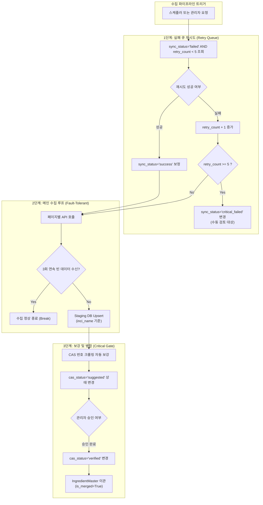

화장품 성분 분석 서비스 PickSafe를 개발하며 외부 공공 데이터 베이스인 식약처 API 및 대한화장품협회 사전을 연동하는 수집 파이프라인을 운영하고 있었습니다. 

초기 파이프라인 구조는 조속한 개발을 위해 단순하게 구축되었으나, 데이터 수집량이 쌓이고 네트워크 환경에 이상이 생길 때마다 **데이터 유실**, **CAS 번호 누락 성분의 영구 소외**, **API 타임아웃에 따른 배치 조기 종료** 등 여러 무결성 결함이 드러났습니다.

이 글은 기존 파이프라인의 구조적 한계를 분석하고, 데이터 멱등성(Idempotency)과 네트워크 회복 탄력성(Fault Tolerance)을 보장하는 구조로 파이프라인을 재설계한 과정에 관한 엔지니어링 기록입니다.

---

## 🎯 마주한 고민과 문제 배경

기존 시스템에서는 식약처 성분 데이터를 수집할 때 임시 적재 테이블(`IngredientMasterStaging`)에 데이터를 받아둔 뒤, 검증 작업을 거쳐 운영 마스터 테이블(`IngredientMaster`)로 병합(Merge)하는 방식을 사용했습니다. 하지만 운영 과정에서 다음과 같은 결정적인 문제들이 확인되었습니다.

### 1. 멱등성 결여 및 미해결 오류 데이터 유실
수집 작업을 1페이지부터 다시 실행할 때 기존 코드에는 Staging 테이블의 임시 데이터를 일괄 삭제(`delete()`)하는 로직이 포함되어 있었습니다. 이 과정에서 이전에 API 호출 실패나 데이터 이상으로 인해 `error` 상태로 분류되어 있던 데이터까지 함께 지워지는 문제가 발생했습니다. 관리자가 오류 원인을 분석하기도 전에 데이터가 유실되어 수집 상태 파악이 불가능했습니다.

### 2. CAS 번호 누락 데이터의 영구 소외
운영 데이터베이스에 성분 영문명(`inci_name`)이 이미 존재하면 수집 중복으로 판단하고 스킵하는 단순한 판단 로직이 존재했습니다. 그 결과, 과거 수집 시점에 CAS 번호(식별 번호)를 채우지 못한 채 마스터 테이블로 넘어간 성분들은 재수집 및 CAS 자동 보강 작업 대상에서 영구적으로 제외되었습니다.

### 3. 일시적 네트워크 장애로 인한 조기 종료
식약처 API 호출 시 일시적인 타임아웃이나 트래픽 한도로 인해 빈 배열(`[]`) 응답이 반환되면, 파이프라인은 이를 "모든 성분 수집 완료"로 잘못 판단하고 전체 수집 루프를 종료해버렸습니다. 이로 인해 배치 스케줄러가 돌아도 실제 데이터는 중간에 멈춰버리는 현상이 잦았습니다.

### 4. 단일 파일 밀집에 따른 유지보수 위험
수집, 스케줄링, 스크래핑 보강, 병합 로직이 모두 관리자용 라우터 파일(`admin.py`)에 모여 있었습니다. 코드가 복잡해짐에 따라 작은 수정에도 예기치 못한 구문 오류나 side-effect가 발생할 위험이 커졌습니다.

---

## ⚖️ 기술적 대안 비교 및 선택 이유

이러한 문제들을 근본적으로 해결하기 위해 데이터 모델과 수집 루프 제어 방식을 재검토했습니다.

### 1. 상태 표현 모델: 단일 Enum 문자열 vs 다차원 불리언/상태 필드

* **기존 방식 (단일 `status` 컬럼)**: `pending`, `error`, `suggested`, `merged` 등의 단일 문자열로 데이터 상태를 관리했습니다.
  * **한계**: "API 네트워크 통신 실패"로 인한 에러인지, "성분 정보는 수집했으나 CAS 번호 보강이 필요한" 상태인지 단일 문자열만으로는 다차원적인 상태를 표현할 수 없었습니다.
* **선택한 방식 (독립적 다차원 필드 분리)**: 단일 `status` 컬럼을 완전히 제거하고, 의미가 독립된 필드들로 분리했습니다.
  * `is_merged` (Boolean): 마스터 DB 이관 여부
  * `sync_status` (Enum): API 수집 성공/실패 상태 (`success`, `failed`, `critical_failed`)
  * `cas_status` (Enum): CAS 번호 상태 (`needed`, `suggested`, `verified`, `not_found`)
  * `cas_source` (Enum): CAS 번호 수집 출처 (`kfda`, `kcia`, `manual`)
  * `retry_count` (Integer): 수집 재시도 횟수 누적 카운트

| 구분 | 단일 문자열 `status` | 독립 다차원 상태 필드 (선택) |
| :--- | :--- | :--- |
| **상태 조합 표현력** | 낮음 (네트워크 에러와 CAS 누락 구분 불가) | 높음 (각 단계의 상태를 명확히 표현) |
| **병합 안전성** | 조건문 복잡도 증가로 오작동 위험 존재 | `cas_status='verified'` & `is_merged=False` 게이트 제어 가능 |
| **재시도 큐 조회** | 에러 원인 구분이 힘들어 복구 쿼리 작성 어려움 | `sync_status='failed'` 및 `retry_count < 5` 조건으로 즉시 필터링 |

### 2. 데이터 업데이트 전략: 삭제 후 재삽입 vs 멱등성 Upsert

* **삭제 후 재삽입 (Hard Delete)**: 수집 재시작 시 기존 임시 데이터를 지우므로 연산은 단순하지만 데이터 유실 위험이 매우 높습니다.
* **자연 키 기반 Upsert (선택)**: 식약처 데이터의 고유한 조합인 `inci_name`(영문명) + `korean_name`(국문명) 자연 키를 기준으로 존재 여부를 확인합니다. 이미 존재하는 경우 기존의 오류 메시지나 관리자 승인 이력을 유지하면서 데이터만 갱신(Upsert)하도록 변경했습니다.

---

## 🏗️ 시스템 아키텍처 및 흐름

재설계한 파이프라인은 실패한 이전 수집 건의 재시도 큐를 우선적으로 처리한 후, 정상 페이지 수집 및 자동 보강, 게이트 검증을 거쳐 마스터 테이블로 이관됩니다.



---

## 💻 핵심 구현 및 트러블슈팅

### 1. 상태 모델 분리 및 Critical Gate 구축

관리자의 승인을 거치지 않은 자동 보강 추천 데이터가 실수로 마스터 DB에 병합되는 일을 방지하기 위해 엄격한 게이트 조건을 코드에 적용했습니다.

```python
# app/models/staging.py 일부 요약
class IngredientMasterStaging(Base):
    __tablename__ = "ingredient_master_staging"

    id = Column(UUID(as_uuid=True), primary_key=True, default=uuid.uuid4)
    korean_name = Column(String, nullable=False)
    inci_name = Column(String, nullable=False, index=True)
    
    # 다차원 상태 필드
    is_merged = Column(Boolean, default=False, nullable=False)
    sync_status = Column(String, default="success", nullable=False) # success, failed, critical_failed
    cas_status = Column(String, default="needed", nullable=False)   # needed, suggested, verified, not_found
    cas_source = Column(String, nullable=True)                      # kfda, kcia, manual
    retry_count = Column(Integer, default=0, nullable=False)
```

병합 처리 시에는 오직 `cas_status == 'verified'` 상태인 레코드만 조회하도록 비즈니스 로직을 격리했습니다.

```python
# app/services/seeding_service.py 일부
def get_mergeable_staging_items(db: Session):
    """
    [CRITICAL GATE]
    cas_status가 'suggested'(자동 추천) 상태인 레코드는 절대로 자동 병합될 수 없으며,
    관리자 승인을 통해 'verified'로 전환된 항목만 마스터 DB 이관 대상으로 추출합니다.
    """
    return db.query(IngredientMasterStaging).filter(
        IngredientMasterStaging.is_merged == False,
        IngredientMasterStaging.sync_status == "success",
        IngredientMasterStaging.cas_status == "verified"
    ).all()
```

### 2. 장애 회복성을 갖춘 네트워크 수집 루프 (Fault-Tolerant Loop)

일시적인 API 응답 지연으로 인해 빈 데이터가 전달되었을 때 조기 종료되는 것을 막기 위해 연속 빈 응답 카운터(`empty_response_strike`)를 도입했습니다.

```python
# app/services/seeding_service.py 일부
MAX_STRIKE_LIMIT = 3

def fetch_kfda_ingredients_loop(db: Session, start_page: int = 1):
    current_page = start_page
    empty_strike = 0

    while True:
        try:
            response_data = call_kfda_api(page=current_page)
            
            if not response_data:
                empty_strike += 1
                logger.warning(f"페이지 {current_page} 빈 응답 수신 (누적 Strike: {empty_strike}/{MAX_STRIKE_LIMIT})")
                
                # 3회 연속 빈 데이터 수신 시에만 진짜 수집 끝으로 판단
                if empty_strike >= MAX_STRIKE_LIMIT:
                    logger.info("최종 수집 완료 지점에 도달했습니다.")
                    break
                
                current_page += 1
                continue

            # 정상 수신 시 스트라이크 초기화
            empty_strike = 0
            upsert_staging_data(db, response_data)
            current_page += 1

        except Exception as e:
            # 네트워크 통신 타임아웃 등 에러 처리
            record_page_failure(db, page_no=current_page, error_msg=str(e))
            current_page += 1
```

### 3. 라우터 파일의 물리적 분리

기존에 `admin.py` 라우터 파일 내에 뒤섞여 있던 수집 및 스케줄러 엔드포인트들을 도려내어 독립된 라우터 파일인 `seeding.py`로 이관했습니다. 이를 통해 대시보드 관리 기능과 백그라운드 데이터 수집 기능 간의 결합도를 낮췄습니다.

---

## 💡 돌아보며 배운 점 (회고)

이번 재설계 작업을 진행하며 외부 데이터를 다루는 파이프라인 구축 시 명심해야 할 엔지니어링 원칙들을 다시금 정립할 수 있었습니다.

### 1. 외부 시스템의 상태는 결코 신뢰할 수 없다
공공 API나 외부 웹사이트는 언제든 타임아웃이 발생할 수 있고, 예상치 못한 빈 데이터를 반환할 수 있습니다. 단 한 번의 실패 응답을 시스템의 '종료 signal'로 곧바로 해석해서는 안 되며, 연속적인 재시도 및 임계값(Threshold) 설정을 통해 파이프라인의 회복 탄력성을 높여야 한다는 점을 배웠습니다.

### 2. 데이터 재실행 가능성(Idempotency)의 중요성
파이프라인을 언제, 몇 번을 재실행하더라도 기존 데이터가 유실되지 않도록 디자인하는 것이 핵심이었습니다. 단순 `delete()` 후 `insert()` 방식은 개발 초기에는 편리하지만 운영 환경에서는 에러 분석 기록을 파괴하는 주범이 됩니다. 자연 키 기반의 Upsert와 재시도 횟수 제한(`retry_count`) 메커니즘을 통해 데이터 무결성을 안전하게 지킬 수 있게 되었습니다.

### 3. 상태 모델의 명확성이 만드는 코드의 안전성
단순 문자열 하나로 시스템의 전체 상태를 표현하려 했던 초기 설계가 가장 큰 원인이었습니다. 상태의 의미를 분리하여 다차원 속성으로 세분화하자, 코드가 훨씬 단순해졌고 검증 게이트(Critical Gate)를 구축하기도 수월해졌습니다.

추후에는 수동 검토가 필요해진 `critical_failed` 상태의 데이터가 발생했을 때 어드민 대시보드 알림뿐만 아니라 외부 메신저 알림 연동까지 확장하여 운영 피드백 주기(Feedback Loop)를 더욱 단축해볼 계획입니다.