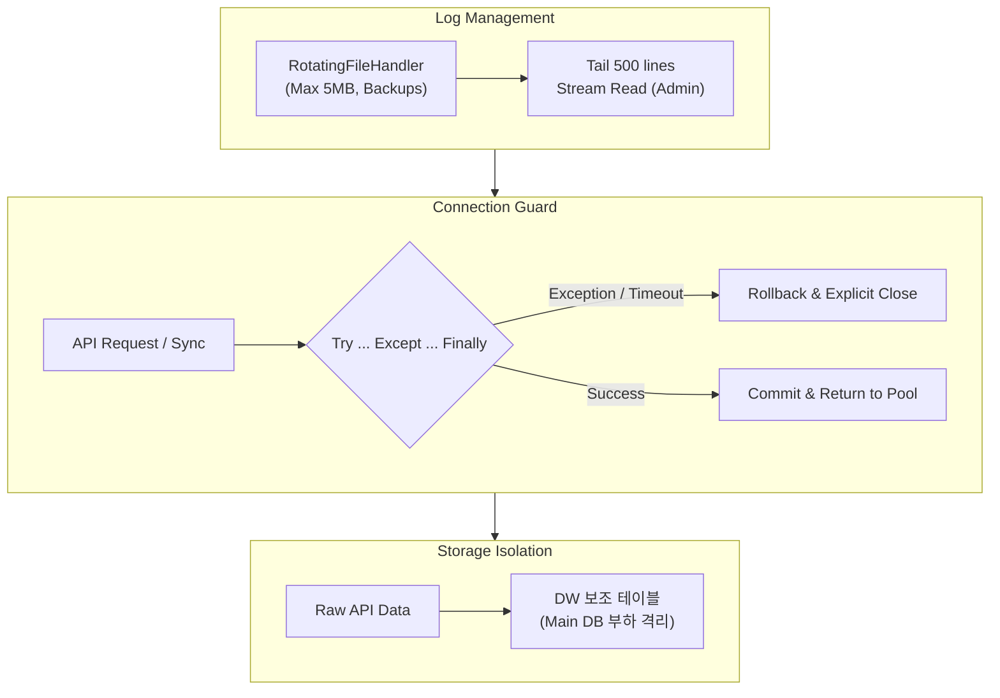

화장품 성분 분석 서비스 **PickSafe**를 개발하고 운영하면서 외부 공공데이터를 주기적으로 동기화하는 파이프라인을 구축했습니다. 

국내 화장품 전성분 데이터를 대량으로 수집·동기화하는 과정은 서비스의 기초 데이터를 다지는 중요한 작업이지만, 제한된 인프라 환경에서 수만 건의 데이터를 다룰 때 예상치 못한 시스템 병목을 마주하게 되었습니다. 이번 글에서는 당시 마주한 문제들과 이를 해결하기 위해 적용한 아키텍처 개선 과정을 담담하게 기록해봅니다.

---

## 🎯 마주한 고민과 문제 배경

식약처 공공데이터 포털 OpenAPI로부터 방대한 양의 화장품 전성분 데이터를 수집하는 과정에서 운영 안정성을 위협하는 세 가지 치명적인 병목이 발생했습니다.

1. **디스크 용량 급증**: 수집 프로세스 실행 시 발생하는 상세 디버그 로그가 단일 파일에 무제한 누적되면서, 서버 디스크 사용량이 임계치에 도달하는 위험이 반복되었습니다.
2. **네트워크 단절 시 커넥션 고갈**: 외부 API와 통신 중 간헐적인 네트워크 타임아웃이나 예외가 발생할 때, 데이터베이스 세션이 정상적으로 반환되지 못하고 `idle in transaction` 상태로 잔류하는 누수 현상이 발생했습니다.
3. **실시간 로그 모니터링 부하**: 관리자 전용 서브도메인에서 수집 진행 상황을 확인하기 위해 로그를 폴링할 때마다 전체 대용량 파일을 통째로 읽어 들이면서 서버 CPU 스파이크를 유발했습니다.

---

## ⚖️ 기술적 대안 비교 및 선택 이유

처음에는 무심코 지나치기 쉬운 로그 관리와 단순한 HTTP 요청 로직이었지만, 운영 관점에서 시스템의 생존을 결정짓는 요소였습니다.

* **로그 관리 방식**: 
  - *대안 A (외부 로깅 SaaS 도입)*: 인프라 연동이 복잡하고 초기 서비스 단계에서 불필요한 운영 비용 발생.
  - *대안 B (표준 RotatingFileHandler 적용)*: 별도의 외부 인프라 없이 Python 표준 라이브러리 레벨에서 파일 크기와 백업 개수를 제어할 수 있어 채택.
* **DB 세션 관리**: 
  - 명시적인 `try ... except ... finally` 블록을 구성하여 예외 발생 여부와 상관없이 트랜잭션 종료 및 커넥션 반환을 보장하도록 구조를 수정했습니다.

---

## 🏗️ 시스템 아키텍처 및 흐름

아래 다이어그램은 이번 개선 작업을 통해 정립된 로그 로테이션, 커넥션 안전 회수, 그리고 데이터 격리 흐름을 나타냅니다.



---

## 💻 핵심 구현 및 트러블슈팅

### 1. 로그 파일 제어 및 스트리밍 조회
단일 파일에 로그가 쌓이는 구조를 개선하기 위해 `RotatingFileHandler`를 도입하여 파일 크기 제한을 걸었습니다. 또한, 관리자 페이지에서 전체 파일을 읽지 않고 파일의 끝부분(Tail)만 가볍게 읽어오도록 스트리밍 방식을 적용했습니다.

```python
# 로그 핸들러 설정 예시 (개념적 구조)
from logging.handlers import RotatingFileHandler
import logging

handler = RotatingFileHandler(
    "logs/sync_service.log", 
    maxBytes=5 * 1024 * 1024,  # 5MB 제한
    backupCount=3
)
logging.basicConfig(handlers=[handler], level=logging.INFO)

def read_latest_logs(lines=500):
    # 전체 파일을 메모리에 올리지 않고 끝부분만 스트리밍 읽기 수행
    with open("logs/sync_service.log", "r") as f:
        return tail_lines(f, lines)
```

### 2. 세션 고갈 방어 (Safe Teardown)
외부 OpenAPI 호출 중 타임아웃(예: 10초)이 발생하거나 파이프라인 내부에서 예외가 던져졌을 때, 커넥션이 커넥션 풀로 안전하게 반환되도록 방어 로직을 강화했습니다.

```python
# 세션 안전 반환 패턴 예시
def execute_sync_pipeline():
    session = SessionLocal()
    try:
        # 외부 API 호출 및 데이터 가공
        response = call_external_api(timeout=10)
        session.bulk_save_objects(parsed_objects)
        session.commit()
    except Exception as e:
        session.rollback()
        logger.error(f"Sync failed: {e}")
        raise
    finally:
        session.close() # 예외 발생 여부와 상관없이 명시적 세션 반환
```

---

## 💡 돌아보며 배운 점 (회고)

이번 최적화를 통해 수만 건에 달하는 식약처 성분 데이터를 수집할 때 발생하던 디스크 부족과 커넥션 누수 문제를 완전히 해소할 수 있었습니다. 특히 관리자 모니터링 시 발생하던 불필요한 메모리 점유율을 크게 낮추어, 제한된 리소스 환경에서도 서비스가 안정적으로 동작하는 발판을 마련했습니다.

기능을 구현하는 것만큼이나, 시스템이 장기적으로 운영될 때 발생할 수 있는 인프라 병목(디스크, 커넥션, 메모리)을 사전에 예측하고 방어 코드를 작성하는 것이 얼마나 중요한지 다시금 깨달았습니다. 앞으로도 PickSafe가 다루는 데이터와 트래픽의 성격을 면밀히 관찰하며 견고한 아키텍처를 다져나갈 것입니다.