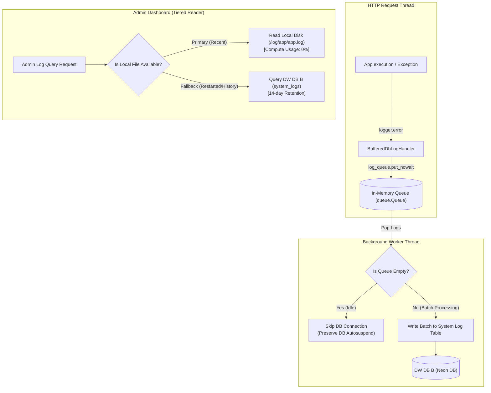

화장품 성분 분석 서비스 PickSafe를 개발하고 배포 인프라를 운용하면서, 애플리케이션의 동작 상태와 예외를 정확하게 기록하고 모니터링하는 일은 서비스 안정성의 기본이었습니다. 

그러나 클라우드 PaaS 배포 환경의 특성과 유휴 상태 시 자동으로 Compute 연산 자원을 수면 상태로 전환하는 서버리스 DB(Neon DB)를 함께 도입하는 과정에서 예상치 못한 로그 유실 문제와 인프라 비효율성을 마주했습니다.

이 글은 컨테이너 재부팅 시 발생하는 로컬 로그 유실 문제를 극복하고, 유휴 DB 비용 절감과 메인 스레드 비블로킹(Non-blocking) 특성을 보장하는 이중 조회 기반 비동기 로깅 시스템을 설계하고 고도화한 기술적 과정을 담았습니다.

---

## 🎯 마주한 고민과 문제 배경

 PickSafe 백엔드는 컨테이너 기반 PaaS(Render) 환경에 배포되어 있습니다. 이러한 배포 가상 컨테이너는 **휘발성(Ephemeral) 디스크** 특성을 가집니다.

```
[배포/재부팅 발생] 
  └─> 로컬 디스크 초기화 
       └─> `/log/app/app.log` 파일 삭제 
            └─> 치명적 예외 발생 당시의 과거 트레이스백 유실
```

서버 재부팅이나 핫리로드가 실행되면 로컬 파일 시스템에 저장되던 로그 파일이 말끔히 초기화되었습니다. 이로 인해 운영 중 치명적인 오류가 발생하더라도 재부팅 이후에는 과거 원인을 추적할 수 없는 문제가 발생했습니다.

이 문제를 해결하려면 외부 데이터베이스에 영구적으로 로그를 적재(DB Logging)해야 했습니다. 하지만 단순하게 DB에 direct 쓰기를 적용할 경우 또 다른 심각한 문제들이 나타났습니다.

1. **HTTP 요청 스레드 블로킹**: 사용자 요청을 처리하는 메인 스레드에서 synchronous하게 DB에 로그를 기록하면, DB 네트워크 레이턴시가 사용자 응답 시간으로 직결됩니다.
2. **서버리스 DB Compute 유휴 수면(Autosuspend) 방해**: PickSafe의 데이터 전용 DB B(Neon DB)는 유휴 상태일 때 Compute 연산을 0%로 내려 비용을 최적화합니다. 그러나 로그를 남기기 위해 주기적으로 짧은 커넥션을 계속 유지하거나 단순 버퍼 타이머를 돌리면 DB가 잠들지 못하고 연산 자원이 지속 소비됩니다.
3. **프로세스 갑작스러운 종료 시 로그 유실**: 메모리 버퍼에 로그를 적재해 둘 경우, OOM(Out of Memory)이나 SIGKILL 등의 신호로 프로세스가 비정상 종료되면 버퍼에 남아있던 결정적인 에러 로그가 사라질 위험이 있었습니다.

---

## ⚖️ 기술적 대안 비교 및 선택 이유

로그의 영구 보존성, 메인 스레드 응답성, 인프라 비용 최적화라는 3가지 목표를 달성하기 위해 몇 가지 대안을 검토했습니다.

| 비교 항목 | 대안 A: 외부 SaaS 도입 (Datadog/Sentry 등) | 대안 B: Synchronous Direct DB 쓰기 | 대안 C: 인메모리 큐 기반 비동기 배치 + 이중 조회 (최종 선택) |
| :--- | :--- | :--- | :--- |
| **응답 속도 영향** | 미미함 | **높음** (매 요청 시 DB I/O 대기) | **없음** (메인 스레드 비블로킹) |
| **운영 비용** | 데이터 적재량 증가 시 비용 부담 증가 | DB 커넥션 상시 유지로 Compute 비용 증가 | DB 유휴 수면 100% 보장으로 **비용 최적화** |
| **운영 복잡도** | 외부 서드파티 모듈 의존성 증가 | 코드 작성은 간단하나 장애 전파 위험 | 내부 비동기 워커 및 종료 처리 구현 필요 |
| **로그 영구 보존** | 보장됨 | 보장됨 | 종료 시 플러시(Flush) 연동으로 보장됨 |

외부 서비스 도입은 초기 도입 및 유지비용이 우려되었고, 단순 직렬 DB 로깅은 API 성능 저하와 DB 연산 자원 낭비를 유발했습니다. 

결과적으로 **'Thread-safe 인메모리 비동기 큐(`queue.Queue`) + 전용 백그라운드 워커 + 이중 조회(Tiered Log Reader) 구조'**를 자체 설계하는 대안 C를 선택했습니다.

---

## 🏗️ 시스템 아키텍처 및 흐름

전체 로그 수집 및 조회 흐름은 다음과 같이 메인 스레드 비블로킹 영역과 백그라운드 적재 영역, 그리고 어드민 조회 영역으로 분리하였습니다.



### 아키텍처의 핵심 포인트
1. **메인 스레드 분리**: API 요청을 처리하는 메인 스레드는 `put_nowait()`을 통해 인메모리 큐에 로그 아이템만 던지고 즉시 반환됩니다.
2. **DB Compute 보장 (Autosuspend)**: 백그라운드 워커는 큐가 비어있는 동안 DB 연결을 생성하거나 유지하지 않으므로, 유휴 시간대 DB의 수면 상태(Autosuspend)를 해치지 않습니다.
3. **이중 조회 (Tiered Reader)**: 어드민 화면에서 최근 로그를 실시간 폴링할 때는 로컬 디스크 파일만 읽어 DB 연산을 일으키지 않습니다. 재부팅으로 로컬 파일이 지워졌거나 과거 이력이 필요한 경우에만 DB B를 조회합니다.

---

## 💻 핵심 구현 및 트러블슈팅

시스템 구현 과정에서 여러 엣지 케이스를 마주쳤고, 이를 단계별로 보완해 나갔습니다.

### 1. 예외 스택트레이스(Traceback) 유실 문제 해결

초기 작성 시 `record.getMessage()`만 수집하도록 구현했더니, `logger.exception()`이나 `logger.error(..., exc_info=True)`로 호출된 예외의 구체적인 Traceback 문자열이 저장되지 않고 단문 에러 메시지만 남는 현상이 있었습니다.

이를 방지하기 위해 로깅 핸들러에서 무조건 `self.format(record)`를 거치도록 수정하여 예외 스택트레이스 전문이 DB에 보관되도록 조치했습니다.

```python
# log_buffer_handler.py (핵심 개념 축약)
import logging
import queue
import sys

class BufferedDbLogHandler(logging.Handler):
    def __init__(self, log_queue: queue.Queue):
        super().__init__()
        self.log_queue = log_queue

    def emit(self, record: logging.LogRecord):
        try:
            # record.getMessage() 대신 self.format(record)을 사용하여
            # exc_info(트레이스백) 전문을 메시지에 완전히 포함시킵니다.
            formatted_message = self.format(record)
            
            log_entry = {
                "level": record.levelname,
                "logger_name": record.name,
                "message": formatted_message,
                "created_at": record.created
            }
            # 메인 스레드가 대기하지 않도록 non-blocking 배치
            self.log_queue.put_nowait(log_entry)
        except queue.Full:
            # 큐가 꽉 찼을 경우 오버플로우 추적 카운트를 올리고 드롭
            self._handle_queue_full()
        except Exception as e:
            # 중요: 로깅 핸들러 내부 오류 발생 시 logger.error를 부르면 무한 재귀에 빠집니다.
            # 반드시 sys.stderr를 사용해 무한 루프를 차단합니다.
            sys.stderr.write(f"[LogHandler Error] Fail to emit log: {e}\n")
```

### 2. 로깅 시스템 자체 오류 시 무한 재귀(Self-Reference) 차단

DB 적재 모듈에서 DB 커넥션 오류 등으로 로그 쓰기가 실패했을 때, 내부에서 다시 `logger.error()`를 호출하게 되면 `LogHandler -> logger.error -> LogHandler` 순환 구조가 형성되어 스택 오버플로우와 애플리케이션 다운을 유발합니다.

따라서 로그 핸들러 내부나 DB 비동기 적재 루틴 안에서 발생한 예외 상황은 **표준 에러 출력(`sys.stderr.write`)**으로만 처리하도록 엄격히 제한했습니다.

### 3. 프로세스 종료 시 잔여 로그 유실 차단 (Graceful Shutdown)

Render 배포 등으로 컨테이너가 종료 신호(SIGTERM)를 받을 때, 메모리 큐나 백그라운드 워커 버퍼(`batch`)에 남아 있던 마지막 에러 로그들이 DB에 쓰이지 못하고 소멸할 위험이 있었습니다.

이를 막기 위해 워커 루프 종료 시점과 FastAPI의 종료 이벤트(`shutdown`) 시점에 잔여 배치 버퍼를 강제로 DB에 플러시(Flush)하는 로직을 연동했습니다.

```python
# 백그라운드 워커의 종료 및 플러시 로직 예시
def flush_remaining_logs(self):
    batch = []
    # 큐에 남아있는 남은 로그 항목을 모두 인출
    while not self.log_queue.empty():
        try:
            log_entry = self.log_queue.get_nowait()
            batch.append(log_entry)
        except queue.Empty:
            break
            
    # 잔여 배치가 존재한다면 즉시 DB에 플러시
    if batch:
        self._write_batch_to_db(batch)
```

### 4. DB 용량 제약 및 인덱스 최적화

데이터베이스 저장 공간 무제한 증가를 막기 위해, 하루 평균 발생하는 로그량을 계산하여 **14일 자동 정제(Retention Policy)** 스케줄러를 가동했습니다. 

* 14일간 보관되는 로그 용량은 수십 Megabyte 수준으로 유지되어, 무료 티어/저비용 DB 스토리지 한도 대비 매우 적은 비중을 차지하게 되었습니다.
* 어드민 UI에서의 조건별 검색 속도를 위해 DB 테이블에 `(created_at, level)` 및 `(service, created_at)` 복합 인덱스(Composite Index)를 구성했습니다.

---

## 💡 돌아보며 배운 점

이번 영구 비동기 로깅 시스템 구축을 통해 배운 주요 교훈과 개선 효과는 다음과 같습니다.

1. **인프라 제약 조건에 맞는 유연한 아키텍처 수립**
   휘발성 컨테이너 환경의 단점과 서버리스 DB의 비용 최적화(Autosuspend)라는 서로 다른 두 요구조건 사이에서 trade-off를 분석했습니다. 1차 디스크 조회, 2차 DB Fallback이라는 2단계 이중 조회 구조를 도출해 냄으로써 기능성과 알뜰한 인프라 운용을 동시에 챙길 수 있었습니다.

2. **파이썬 표준 `logging` 라이브러리의 내부 메커니즘 이해**
   단순히 `logger.info()`를 호출하는 수준을 넘어, `Handler` 확장, `record` 객체의 서식화 시점(`self.format`), 예외 트레이스백 추출 방식, 스레드 간 비동기 큐 연동 과정에서 발생할 수 있는 무한 재귀(Self-Reference) 이슈 등 파이썬 로깅 프레임워크의 깊은 동작 원리를 파악할 수 있었습니다.

3. **안전한 프로세스 라이프사이클 관리**
   애플리케이션이 정상 작동할 때뿐만 아니라, 종료(Shutdown)되거나 시스템 에러가 터지는 비정상 상황에서 "어떻게 마지막 유실 없는 1건을 보장할 것인가"를 고민했습니다. Graceful Shutdown 핸들링과 예외 처리 회랑(Fallback) 구축의 중요성을 깊이 체감했습니다.

앞으로 서비스 규모가 더욱 확장되고 로그 데이터의 양이 수십 배 이상 커진다면, 이 아키텍처를 기반으로 메시지 큐 기반의 독립 로그 수집 파이프라인으로 자연스럽게 진화시켜 나갈 수 있는 단단한 기초를 마련했습니다.