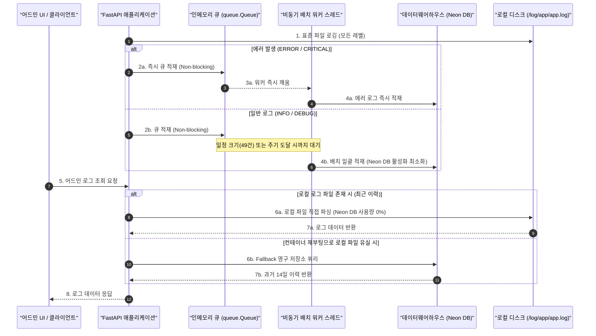

화장품 성분 분석 서비스인 **PickSafe**를 개발하고 운영하면서, 한정된 인프라 리소스 안에서 서비스 안정성을 확보하는 것은 언제나 가장 큰 과제였습니다. 

특히 애플리케이션을 배포한 Render 플랫폼의 가상 컨테이너는 **휘발성(Ephemeral) 디스크** 특성을 가집니다. 즉, 서버가 재부팅되거나 핫리로드가 발생할 때마다 로컬에 쌓아두었던 텍스트 로그 파일(`/log/app/app.log`)이 완전히 초기화되는 문제가 있었습니다. 운영 중 예기치 못한 에러가 발생했을 때, 컨테이너가 재시작되어 버리면 과거의 장애 원인을 추적할 길이 완전히 사라지는 치명적인 한계가 존재했습니다.

이 글에서는 영구 저장소인 외부 데이터웨어하우스 DB(Neon DB)에 로그를 보존하면서도, 서버리스 DB의 컴퓨트 리소스 소비를 극적으로 절감하고 에러 로그 유실을 방지하기 위해 고민했던 아키텍처 설계와 트러블슈팅 과정을 담백하게 공유하고자 합니다.

---

## 🎯 마주한 고민과 문제 배경

가장 직관적인 해결책은 에러가 발생할 때마다 데이터베이스에 즉시 `INSERT`를 요청하는 로깅 핸들러를 붙이는 것입니다. 그러나 이 방식은 두 가지 치명적인 병목과 비용 리스크를 안고 있었습니다.

1. **FastAPI의 Request-Response 스레드 블로킹**
   사용자의 요청을 처리하는 메인 스레드 내에서 데이터베이스 커넥션을 맺고 로그를 직접 동기식으로 INSERT하게 되면, 네트워크 지연(I/O Bottleneck)으로 인해 사용자 응답 속도가 심각하게 저하됩니다.
2. **서버리스 DB의 Autosuspend(유휴 수면) 방해 및 비용 폭탄**
   외부 로그 적재 저장소로 사용 중인 Neon DB(PostgreSQL)는 일정 시간 요청이 없으면 활성화된 컴퓨트 노드를 자동으로 종료하는 **Autosuspend(유휴 수면)** 기능이 핵심입니다. 이를 통해 유휴 상태일 때 컴퓨트 사용량(Compute Hours)을 0%로 유지할 수 있습니다. 그러나 5초 주기로 어드민 대시보드에서 보낸 폴링 요청이나 일상적인 `INFO` 로그가 수시로 DB에 직접 쓰인다면, DB는 단 1초도 쉬지 못하고 상시 활성화되어 무료 티어의 컴퓨트 쿼터를 순식간에 소진하게 됩니다.

따라서 다음과 같은 제약 조건을 충족하는 영구 로그 시스템을 직접 설계해야 했습니다.

* **실시간성 확보**: 서비스에 치명적인 `ERROR`나 `CRITICAL` 로그는 즉시 영구 저장소에 기록되어야 한다.
* **비동기/논블로킹**: 로깅 작업이 실제 사용자 API 요청 처리 속도에 어떠한 악영향도 주어서는 안 된다.
* **DB 리소스 최적화**: 일상적인 `INFO` 로그는 메모리에 버퍼링하여 배치(Batch) 형태로 모아서 적재하고, 유휴 상황에서는 DB 커넥션을 원천 차단하여 Neon DB의 자동 수면 상태를 보장해야 한다.

---

## ⚖️ 기술적 대안 비교 및 선택 이유

설계 단계에서 세 가지 아키텍처 모델을 두고 장단점을 비교해 보았습니다.

| 비교 항목 | 대안 A: 외부 SaaS 로깅 솔루션 (Datadog 등) | 대안 B: 단순 동기식 DB 로깅 핸들러 | 대안 C: 2단계 이중 조회 + 비동기 배치 핸들러 (선택) |
| :--- | :--- | :--- | :--- |
| **도입 및 유지 비용** | 매우 높음 (프리 티어 한계 초과 시 과금) | 낮음 (기존 DB 활용) | **매우 낮음** (기존 DB 활용 및 리소스 최적화) |
| **응답 성능 영향** | 거의 없음 (비동기 에이전트 작동) | 매우 큼 (I/O 블로킹 발생) | **없음** (인메모리 큐 및 독립 워커 스레드) |
| **Neon DB 수면 보장** | 해당 없음 (DB를 안 쓰므로 영향 없음) | 불가능 (지속적인 쓰기로 상시 활성화) | **완벽 보장** (큐가 비었을 때 DB 세션 단절) |
| **로그 유실 가능성** | 낮음 | 낮음 | **매우 낮음** (Graceful Shutdown 시 잔여 버퍼 플러시) |

외부 SaaS 솔루션은 초기 단계 서비스인 PickSafe에 비용적 부담이 컸고, 단순 동기식 적재는 성능 저하가 뻔히 보였습니다. 결과적으로 **로컬 디스크와 DB를 혼합한 2단계 이중 조회(Tiered Log Reader)** 아키텍처를 고안하고, 이를 처리할 **비동기 배치 핸들러**를 직접 구현하기로 결정했습니다.

---

## 🏗️ 시스템 아키텍처 및 흐름

이 시스템의 핵심은 **"평소에는 디스크를 읽어 Neon DB 사용량을 0%로 유지하고, 디스크가 유실되거나 과거 이력이 필요할 때만 DB를 조회한다"**는 개념과 **"일상 로그는 모아서 쓰고, 에러 로그는 즉시 큐를 비워 적재한다"**는 쓰기 전략의 조화입니다.



### 1단계: 이중 조회 (Tiered Log Reader)
* **1차 조회 (Primary)**: 관리자 대시보드에서 5초 주기로 실시간 로그를 폴링할 때는 로컬 디스크 파일(`/log/app/app.log`)을 직접 읽어 파싱합니다. 이때 Neon DB에는 단 한 번의 쿼리도 날아가지 않으므로 **컴퓨트 사용량은 0%**가 됩니다.
* **2차 조회 (Fallback & 고이력)**: 서버 재부팅으로 로컬 파일이 완전히 날아갔거나, 14일간의 영구 보존 이력을 추적해야 할 때만 데이터웨어하우스 DB의 `system_logs` 테이블을 쿼리합니다.

### 2단계: 보존 기한 정책 (Retention Policy)
* 일평균 약 5,000건의 로그가 쌓인다고 가정했을 때, 14일 저장 시 총 용량은 약 **17.5 MB** 내외입니다. 이는 Neon DB Free Tier 한도(500MB)의 **약 3.5%** 수준으로, 인프라 비용 걱정 없이 여유롭게 운영할 수 있는 스케일입니다.

---

## 💻 핵심 구현 및 트러블슈팅

이 시스템을 안정적으로 구현하는 과정에서 마주한 기술적 문제들과 이를 해결한 구체적인 구현 코드입니다.

### 1. `BufferedDbLogHandler` 비동기 로깅 핸들러 구현

스레드 안전한 생산자-소비자 패턴을 구현하기 위해 파이썬 표준 라이브러리의 `queue.Queue`를 사용했습니다. 메인 스레드는 `queue.put_nowait()`로 로그를 신속하게 밀어 넣고 즉시 복귀하며, 백그라운드 데몬 스레드가 큐를 감시하며 배치를 처리합니다.

```python
import logging
import queue
import sys
import threading
import time
from datetime import datetime, timezone
from sqlalchemy.orm import Session
from app.database import SessionLocal  # 실제 커넥션 팩토리
from app.models.analytics import SystemLog

class BufferedDbLogHandler(logging.Handler):
    def __init__(self, service_name: str, max_queue_size: int = 1000, batch_size: int = 50, flush_interval: float = 10.0):
        super().__init__()
        self.service_name = service_name
        self.batch_size = batch_size
        self.flush_interval = flush_interval
        
        self.log_queue = queue.Queue(maxsize=max_queue_size)
        self.dropped_count = 0
        self.container_id = f"instance-{threading.get_ident()}"
        
        self.is_running = True
        self.worker_thread = threading.Thread(target=self._worker, daemon=True)
        self.worker_thread.start()

    def emit(self, record):
        try:
            # 트레이스백 전문 보존을 위해 무조건 포맷팅 수행
            message = self.format(record)
            log_data = {
                "level": record.levelname,
                "service": self.service_name,
                "logger_name": record.name,
                "container_id": self.container_id,
                "message": message,
                "created_at": datetime.fromtimestamp(record.created, tz=timezone.utc)
            }
            # Non-blocking으로 큐에 적재
            self.log_queue.put_nowait(log_data)
        except queue.Full:
            self.dropped_count += 1
            # 큐가 가득 찼을 때 로깅 시스템 내부 에러가 전체 애플리케이션을 죽이지 않도록 sys.stderr로 격리
            sys.stderr.write(f"[LogHandler] Queue Full! Dropped logs count: {self.dropped_count}\n")
        except Exception as e:
            sys.stderr.write(f"[LogHandler] Emit failed: {str(e)}\n")

    def _worker(self):
        last_flush_time = time.time()
        batch = []

        while self.is_running or not self.log_queue.empty():
            try:
                # 큐에서 데이터를 가져오되, 주기적 플러시를 위해 타임아웃 설정
                timeout = max(0.1, self.flush_interval - (time.time() - last_time := last_flush_time))
                log_data = self.log_queue.get(timeout=timeout)
                batch.append(log_data)
                self.log_queue.task_done()
            except queue.Empty:
                pass

            # 배치 적재 조건 검사 (배치 크기 도달 또는 플러시 주기 초과)
            now = time.time()
            if batch and (len(batch) >= self.batch_size or (now - last_flush_time) >= self.flush_interval):
                self._write_batch(batch)
                batch.clear()
                last_flush_time = now

        # 루프가 정상 종료되었으나 남아있는 잔여 로그 플러시
        if batch:
            self._write_batch(batch)

    def _write_batch(self, batch):
        db: Session = SessionLocal()
        try:
            db_logs = [
                SystemLog(
                    id=None,  # DB에서 UUID 자동 생성 혹은 UUIDv4 할당
                    level=log["level"],
                    service=log["service"],
                    logger_name=log["logger_name"],
                    container_id=log["container_id"],
                    message=log["message"],
                    created_at=log["created_at"]
                ) for log in batch
            ]
            db.bulk_save_objects(db_logs)
            db.commit()
        except Exception as e:
            db.rollback()
            # 무한 재귀(Self-Reference) 방지를 위해 절대 logger.error를 호출하지 않음
            sys.stderr.write(f"[LogHandler] Failed to write batch to Neon DB: {str(e)}\n")
        finally:
            db.close()

    def close(self):
        self.is_running = False
        self.worker_thread.join(timeout=3.0)
        super().close()
```

### 2. 무한 재귀(Self-Reference) 루프 차단 트러블슈팅

개발 도중 매우 흥미롭고 아찔한 무한 루프 버그를 마주했습니다. 
만약 외부 네트워크 장애로 인해 Neon DB 커넥션이 끊어졌을 때, `_write_batch` 내부의 `except` 블록에서 디버깅 편의를 위해 `logger.error("DB 로깅 실패")`를 호출하게 설계했었습니다.

이때의 흐름은 다음과 같았습니다.
1. DB 적재 오류 발생 -> `logger.error()` 호출
2. `logger.error()`가 다시 `BufferedDbLogHandler`를 호출하여 큐에 에러 로그 삽입
3. 비동기 워커가 큐에서 해당 에러 로그를 꺼내 DB 적재 시도
4. 다시 DB 적재 오류 발생 -> `logger.error()` 호출 ...

이 과정이 무한히 반복되며 CPU 점유율이 100%로 치솟고, 인메모리 큐 오버플로우가 발생해 컨테이너가 OOM-kill(메모리 부족으로 인한 강제 종료)되는 현상이 발생했습니다.

* **해결책**: 로깅 핸들러 내부에서 발생하는 모든 예외는 표준 파이썬 로깅 모듈을 타지 않도록 격리했습니다. 대신 `sys.stderr.write`를 사용하여 콘솔 표준 에러 출력으로만 우회 처리함으로써, 로깅 시스템 장애가 메인 서비스의 무한 루프로 번지는 것을 완벽히 차단했습니다.

### 3. Graceful Shutdown 지원 및 잔여 로그 보존

서버가 재배포되거나 종료될 때(SIGTERM 수신 시), 메모리 버퍼(큐)에 담겨 있던 최대 49건의 로그가 그대로 증발하는 문제가 있었습니다. 

FastAPI의 수명 주기(Lifespan) 이벤트와 연동하여, 애플리케이션 종료 시 로깅 핸들러의 `close()` 메서드를 명시적으로 호출하도록 보완했습니다. `close()` 함수는 워커 스레드의 루프 플래그(`is_running`)를 `False`로 변경한 뒤, `worker_thread.join(timeout=3.0)`을 통해 큐에 남아 있는 모든 잔여 로그를 최종적으로 DB에 밀어 넣고 안전하게 종료됩니다.

```python
# main.py의 Lifespan 이벤트 예시
from fastapi import FastAPI
from contextlib import asynccontextmanager
from app.services.log_buffer_handler import BufferedDbLogHandler

db_log_handler = BufferedDbLogHandler(service_name="FastAPI")

@asynccontextmanager
async def lifespan(app: FastAPI):
    # Startup: 데이터베이스 초기화 및 일일 정제 스케줄러 가동
    # start_daily_prune_scheduler()
    yield
    # Shutdown: 안전한 핸들러 종료 및 메모리 잔여 로그 강제 플러시
    db_log_handler.close()

app = FastAPI(lifespan=lifespan)
```

---

## 💡 돌아보며 배운 점 (회고)

이번 영구 시스템 로그 모니터링 시스템을 구축하면서 얻은 가장 큰 엔지니어링적 교훈은 **"인프라의 제약 조건은 타협의 대상이 아니라, 더 우아한 아키텍처를 유도하는 훌륭한 힌트"**가 될 수 있다는 점입니다.

1. **로컬 리소스와 원격 리소스의 현명한 조합**
   무조건적인 클라우드 저장은 비용과 성능의 낭비를 초래합니다. 휘발성이더라도 접근 속도가 압도적으로 빠른 로컬 파일 시스템을 1차 캐시(Primary)로 활용하고, 영구 보존이 필요한 시점에만 2차 Fallback 데이터베이스를 이용하는 이중 레이어 구조가 소규모 서비스에서 얼마나 효율적인지 체감할 수 있었습니다.
2. **방어적 프로그래밍의 중요성**
   로깅 시스템은 시스템의 최후방 방어선입니다. 방어선 자체가 무너졌을 때(DB 커넥션 에러 등) 스스로를 복구할 수 있도록 무한 재귀를 피하고 `sys.stderr`로 예외를 격리하는 등의 장치는, 실제 프로덕션 환경에서 서비스가 조용히 침몰하는 것을 막아주는 결정적인 역할을 해 주었습니다.

앞으로 서비스의 트래픽이 늘어난다면, 현재의 멀티스레드 기반 인메모리 큐 방식을 넘어서 Redis 같은 경량 메시지 브로커를 둔 분산 로그 아키텍처로 확장해야 할 시점이 올 것입니다. 하지만 제한된 리소스 내에서 Neon DB의 유휴 수면을 완벽히 보장하면서도 단 하나의 에러 로그도 놓치지 않게 설계한 지금의 구조는, PickSafe의 든든한 기술적 초석이 되어주고 있습니다.