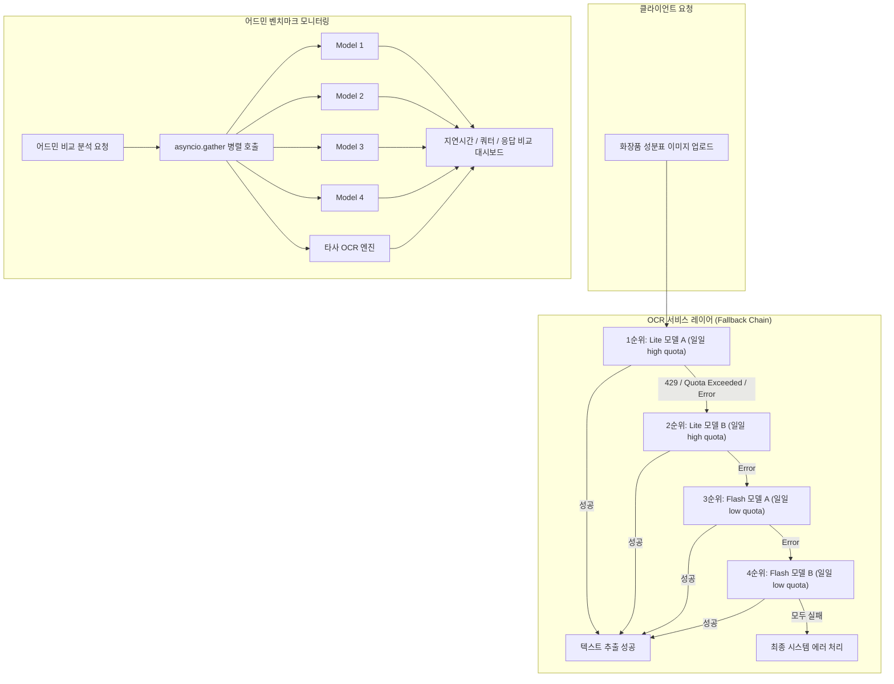

화장품 성분 분석 서비스인 PickSafe를 개발하면서 가장 핵심이 되는 기능 중 하나는 사용자가 촬영한 성분표 이미지에서 텍스트를 정밀하게 추출하는 OCR(광학 문자 인식) 파이프라인입니다. 

초기 구현에서는 단일 외부 LLM 기반 OCR 모델에 의존하여 텍스트를 추출했습니다. 하지만 서비스 운영을 준비하며 외부 API의 일일 요청 제한(RPD)과 분당 요청 제한(RPM)이라는 현실적인 인프라 제약에 부딪혔습니다. 특히 무료 티어나 제한된 쿼터 범위 내에서 연동할 때, 특정 시간대에 요청이 몰리거나 쿼터가 고갈되면 HTTP 429(Too Many Requests) 에러가 발생하여 전체 성분 분석 파이프라인이 중단되는 문제가 생겼습니다.

이 글은 제한된 API 리소스 조건 속에서도 서비스 가용성을 높이기 위해 Gemini 모델 기반의 4단계 순차 연동(Fallback Chain)을 설계하고, 이를 어드민 모니터링 및 병렬 벤치마크 체계로 확장한 과정에 대한 기록입니다.

---

## 🎯 마주한 고민과 문제 배경

화장품 성분표는 미세한 문자 오탈자가 유해 성분 판정 결과에 큰 영향을 미칩니다. 따라서 일반적인 OCR 엔진보다 문맥 이해도가 높은 멀티모달 LLM 계열의 OCR 모델을 적극 활용하고자 했습니다.

그러나 외부 API 연동 시 다음과 같은 문제점들이 드러났습니다:

1. **단일 실패 지점(SPOF) 문제**: 하나의 모델만 전적으로 바라볼 경우, 해당 모델의 API 장애나 rate limit 발생 시 사용자 스캔 기능이 즉시 마비됩니다.
2. **모델별 쿼터 불균형**: 일일 제공 쿼터가 높은 경량 모델(Lite)과 처리 성능은 높으나 쿼터가 매우 적은 고성능 모델(Flash)이 존재합니다. 단일 모델로 고정하면 인프라 리소스 활용 효율이 극도로 떨어집니다.
3. **가시성 부족**: 어떤 모델이 현재 얼마만큼의 쿼터를 소모했는지, 처리 속도(Latency)는 어떠한지 실시간으로 추적하기 어려워 최적의 모델 호출 순서를 정량적으로 검증하기 힘들었습니다.

이러한 문제를 해결하기 위해 시스템의 안정성을 확보하면서도 쿼터 소모를 효율화할 수 있는 복합적인 API 호출 구조가 필요했습니다.

---

## ⚖️ 기술적 대안 비교 및 선택 이유

문제 해결을 위해 크게 세 가지 접근 방식을 검토했습니다.

| 대안 | 장점 | 단점 | 선택 여부 |
| :--- | :--- | :--- | :---: |
| **1. 단일 고성능 모델 전용 구성** | 구현이 단순하고 모니터링 포인트가 적음 | 429 에러 발생 시 즉시 서비스 장애로 직결 | 미선택 |
| **2. 라운드 로빈(Round Robin) 분산** | 트래픽을 균등하게 분산하여 부하 경감 | 모델별 쿼터 한도(예: 일일 500회 vs 20회) 차이를 반영하지 못해 비효율적 | 미선택 |
| **3. 우선순위 기반 4단계 순차 연동 (Fallback Chain)** | 쿼터가 넉넉한 모델을 우선 소모하고, 실패 시 차선책 모델로 자동 전환되어 가용성 극대화 | 구현 복잡도 증가 및 각 모델별 상태 관리 필요 | **최종 선택** |

### 최종 선택: 우선순위 기반 4단계 순차 연동
쿼터 한도가 높은 Lite 계열 모델(`Gemini 3.1 Flash-Lite`, `Gemini 3.5 Flash-Lite`)을 1순위, 2순위 주력 호출 대상으로 배치하고, 일일 제한량이 적은 상위 모델(`Gemini 3.5 Flash`, `Gemini 3.6 Flash`)을 3순위, 4순위 비상 폴백(Fallback)으로 배치했습니다.

이 방식을 통해 1순위 모델에서 429 에러나 일시적 서버 에러가 발생하더라도 사용자에게 에러를 반환하지 않고 2, 3, 4순위 모델로 유연하게 넘어갈 수 있는 유연성을 확보했습니다.

---

## 🏗️ 시스템 아키텍처 및 흐름

전체 시스템은 **사용자 스캔 파이프라인의 자동 폴백 흐름**과 **어드민에서의 병렬 벤치마크/모니터링 흐름** 두 가지 영역으로 나뉩니다.



---

## 💻 핵심 구현 및 트러블슈팅

### 1. 순차 폴백 체인(Fallback Chain) 구현

OCR 서비스 레이어에서는 모델 목록을 순위대로 순회하며 호출을 시도합니다. 특정 모델 호출 시 `QuotaExceeded` 또는 HTTP 429 관련 예외가 발생하거나 응답이 유효하지 않을 경우, 쿼터 감소 상태를 기록하고 다음 모델로 자동 전환합니다.

*(아래 코드는 이해를 돕기 위해 핵심 구조 중심으로 축약한 예시입니다.)*

```python
# app/services/ocr_service.py (개념적 구현 예시)
import logging
from typing import List, Dict, Any

logger = logging.getLogger(__name__)

# 우선순위에 따른 모델 호출 순서 정의
MODEL_CANDIDATES = [
    "gemini-3.1-flash-lite", # 1순위 (주력)
    "gemini-3.5-flash-lite", # 2순위
    "gemini-3.5-flash",      # 3순위 (비상)
    "gemini-3.6-flash",      # 4순위
]

async def process_ocr_with_fallback(image_bytes: bytes) -> Dict[str, Any]:
    last_exception = None
    
    for model_name in MODEL_CANDIDATES:
        try:
            # 쿼터 잔여량 사전에 체크 (옵션)
            if not await check_model_quota_available(model_name):
                logger.warning(f"모델 {model_name}의 쿼터가 소진되어 다음 모델로 이동합니다.")
                continue

            # API 호출 실행
            result = await call_gemini_ocr_api(model_name, image_bytes)
            
            # 성공 시 metrics 갱신 후 결과 반환
            await update_model_metrics(model_name, success=True)
            return result

        except Exception as e:
            # 429 Too Many Requests 또는 Quota 초과 에러 감지
            logger.warning(f"모델 {model_name} 호출 실패: {str(e)}. 다음 폴백 모델을 시도합니다.")
            await decrement_model_quota(model_name)
            last_exception = e
            continue

    # 모든 후보 모델 실패 시
    logger.error("모든 OCR 모델 폴백 호출에 실패했습니다.")
    raise RuntimeError("OCR 처리 불가능 상태") from last_exception
```

### 2. 어드민 병렬 벤치마크 (asyncio.gather 활용)

어드민 모니터링 시스템에서는 4개의 Gemini 모델과 타사 외부 OCR 엔진(Clova OCR)을 포함한 총 5개 엔진의 성능 및 속도를 실시간으로 대조해야 했습니다. 

이때 순차적으로 호출하면 대기 시간이 과도하게 길어지므로, Python의 `asyncio.gather`를 이용하여 동기 블로킹 없이 5개 엔진을 동시에 호출하고 결과를 취합하도록 구현했습니다.

```python
# app/routers/admin.py (개념적 구현 예시)
import asyncio
import time
from fastapi import APIRouter

router = APIRouter()

async def benchmark_single_engine(engine_id: str, image_bytes: bytes) -> dict:
    start_time = time.perf_counter()
    try:
        # 비동기로 각 엔진 API 호출
        response = await call_specific_ocr_engine(engine_id, image_bytes)
        latency = time.perf_counter() - start_time
        return {
            "engine_id": engine_id,
            "status": "SUCCESS",
            "latency_ms": round(latency * 1000, 2),
            "raw_text": response.get("text", "")
        }
    except Exception as e:
        latency = time.perf_counter() - start_time
        return {
            "engine_id": engine_id,
            "status": "FAILED",
            "latency_ms": round(latency * 1000, 2),
            "error": str(e)
        }

@router.post("/admin/ocr-compare/run")
async def run_ocr_benchmark(image_bytes: bytes):
    target_engines = [
        "gemini-3.1-flash-lite",
        "gemini-3.5-flash-lite",
        "gemini-3.5-flash",
        "gemini-3.6-flash",
        "clova-ocr-engine"
    ]

    # 5개 엔진 동시 병렬 요청
    tasks = [benchmark_single_engine(engine, image_bytes) for engine in target_engines]
    results = await asyncio.gather(*tasks)

    return {"benchmark_results": results}
```

### 트러블슈팅: 비동기 병렬 요청 시 DB 커넥션 및 스레드 병목

`asyncio.gather`를 통해 5개 엔진을 동시에 호출할 때, 각 API 호출 내부에서 인메모리 metric DB나 세션을 동기식으로 다룰 경우 Event Loop가 블로킹되는 현상을 경험했습니다.

이를 해결하기 위해 외부 API 호출 부문과 세션 저장 레이어를 철저히 비동기(Non-blocking I/O)로 분리하였고, API 지연시간 측정 시 `time.time()` 대신 `time.perf_counter()`를 사용하여 나노초 단위의 정밀한 지연 시간을 측정할 수 있도록 보완했습니다.

---

## 💡 돌아보며 배운 점

### 1. 외부 API 의존성 격리와 가용성 확보
서비스의 핵심 기능이 외부 API에 의존할 때, 단일 API의 SLA만 믿고 개발하는 것은 매우 위험하다는 점을 깨달았습니다. 폴백 체인(Fallback Chain) 아키텍처를 도입한 이후, 특정 모델의 rate limit 발생 상황에서도 사용자 단에서의 스캔 실패율을 거의 0%에 가깝게 유지할 수 있었습니다.

### 2. 정량적 모니터링을 통한 쿼터 효율화
단순히 순차 폴백만 구현하는 것에 그치지 않고, 어드민 대시보드에서 각 모델별 평균 지연시간(Latency)과 남은 쿼터(Quota), RPM을 실시간으로 추적할 수 있도록 시각화한 점이 유효했습니다.
실제로 수집된 latency 데이터를 통해 Lite 모델이 Flash 모델 대비 정확도 면에서 큰 차이가 없으면서도 응답 속도가 충분히 빠르다는 정량적 근거를 얻을 수 있었고, 이를 통해 1순위 배치의 타당성을 입증할 수 있었습니다.

### 추후 개선 과제
현재의 폴백 체인은 고정된 시퀀스(1순위 -> 2순위 -> 3순위 -> 4순위)로 동작합니다. 향후 트래픽이 확장된다면, 어드민 모니터링에서 수집된 실시간 Latency와 에러율 지표를 기반으로 우선순위 배열을 동적으로 재구성하는 **동적 폴백(Dynamic Fallback)** 구조로 발전시켜 볼 계획입니다.