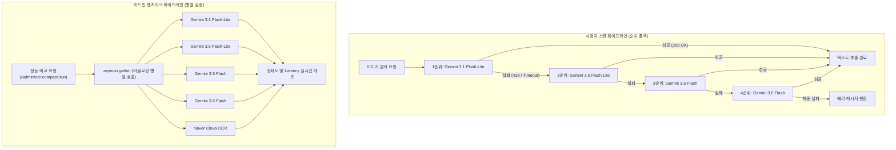

화장품 성분 분석 서비스인 **PickSafe**를 준비하며 가장 먼저 마주한 기술적 장벽은 **이미지 인식(OCR)의 안정성**이었습니다. 

사용자가 화장품 패키지의 성분표 사진을 찍어 업로드하면, 서비스는 이미지 속 텍스트를 정확하게 추출해 유해 성분을 분석해야 합니다. 이 과정에서 핵심 엔진 역할을 하는 외부 OCR API의 가용성은 서비스의 생명줄과도 같습니다. 

초기 설계 단계에서는 단일 무료 모델 API를 활용해 프로토타입을 빠르게 구축했으나, 실제 운영 환경을 고려했을 때 치명적인 병목과 한계가 드러났습니다. 제한된 인프라 리소스와 타이트한 API 호출 제한(Rate Limit) 속에서 어떻게 무중단에 준하는 안정성을 확보했는지, 그 고민과 해결 과정을 기록으로 남깁니다.

---

## 🎯 마주한 고민과 문제 배경

처음에는 단순히 성능이 준수하고 비용 부담이 적은 단일 경량 모델 API를 호출하는 방식을 채택했습니다. 하지만 내부 테스트 과정에서 다음과 같은 현실적인 문제들에 직면했습니다.

1. **엄격한 API Rate Limit (429 Too Many Requests)**
   - 무료 티어 혹은 저비용 API의 경우, 짧은 시간 내에 대량의 요청이 몰리거나 일일 할당량(Quota)을 초과하면 즉시 `429` 에러를 반환하며 서비스가 마비되었습니다.
2. **단일 실패 지점(SPOF)의 존재**
   - API 제공사 서버의 일시적인 지연(Latency)이나 장애가 발생하면, 사용자는 이미지 업로드 단계에서 하염없이 대기하거나 분석 실패 화면을 마주해야 했습니다.
3. **성능과 비용의 트레이드오프**
   - 텍스트 인식률이 매우 높은 프리미엄 OCR 서비스는 비용 부담이 컸고, 무료/경량 모델은 비용은 들지 않지만 특정 폰트나 굴곡진 화장품 용기 표면의 글자를 인식할 때 정확도가 다소 떨어지는 아쉬움이 있었습니다.

사용자 경험을 해치지 않으면서 비용 효율적으로 가용성을 극대화하기 위해, **"여러 개의 API 모델을 유기적으로 엮어 실패 시 자동으로 다음 대안으로 넘어가는 장애 조치(Failover) 파이프라인"**이 절실히 필요했습니다.

---

## ⚖️ 기술적 대안 비교 및 선택 이유

가장 먼저 OCR 엔진의 구성을 어떻게 가져갈지 세 가지 대안을 두고 비교 검토했습니다.

| 비교 항목 | 대안 1: 상용 프리미엄 OCR 단일 도입 | 대안 2: 자체 오픈소스 OCR (Tesseract 등) 호스팅 | 대안 3: 다중 경량 모델 순차 폴백 체인 (선택) |
| :--- | :--- | :--- | :--- |
| **정확도** | 매우 높음 | 보통 (한국어 및 화장품 특수 서체에 취약) | 높음 (다양한 LLM 기반 OCR 활용) |
| **도입 및 운영 비용** | 매우 높음 (호출당 과금) | 낮음 (인프라 유지 비용만 발생) | **무료~매우 낮음** (무료 쿼터 최대한 활용) |
| **인프라 부하** | 없음 (외부 API 위임) | 높음 (자체 서버 메모리/GPU 소모) | 없음 (외부 API 위임) |
| **장애 대응력** | 외부 장애 시 대책 없음 | 자체 모니터링 필요 | **API 장애 발생 시 자동 우회 가능** |

### 선택 이유
자체 서버 리소스가 제한된 초기 서비스 환경에서 무거운 오픈소스 OCR 모델을 직접 호스팅하는 것은 메모리와 연산 성능 측면에서 비효율적이었습니다. 반면 상용 프리미엄 OCR은 정밀하지만 고정 비용 부담이 컸습니다.

최종적으로 **다양한 버전의 경량 LLM OCR API(Gemini 계열)들을 우선순위에 따라 순차적으로 호출하는 '4단계 폴백 체인(Fallback Chain)'**을 설계하기로 결정했습니다. 일일 제한 쿼터가 넉넉한 경량 모델(Flash-Lite 계열)을 주력으로 삼고, 실패하거나 쿼터가 소진되면 상위 모델(Flash 계열)로 우회하는 방식입니다. 

여기에 더해, 실제 상용 서비스 수준의 성능 대조군을 확보하기 위해 고성능 OCR 엔진(Naver Clova OCR)을 어드민 벤치마크 도구에 포함시켜 상호 비교 분석할 수 있는 구조를 잡았습니다.

---

## 🏗️ 시스템 아키텍처 및 흐름

전체 시스템은 크게 **사용자 스캔 파이프라인(순차적 폴백)**과 **어드민 벤치마크 파이프라인(병렬 검증)** 두 가지 흐름으로 나뉩니다.



---

## 💻 핵심 구현 및 트러블슈팅

### 1. 4단계 폴백 체인 핵심 로직 구현 (`ocr_service.py`)

아래 코드는 사용자 요청이 들어왔을 때 지정된 우선순위 리스트(`model_candidates`)를 순회하며 OCR을 시도하는 핵심 로직입니다. 특정 모델이 `429` 에러나 타임아웃을 뱉으면, 예외를 포착하고 로그를 남긴 뒤 즉시 다음 모델로 안전하게 넘어갑니다.

```python
import logging
import asyncio
from typing import List, Optional
from app.config import SETTINGS  # 민감 정보 추상화

logger = logging.getLogger(__name__)

class OCRService:
    def __init__(self):
        # 우선순위가 높은 순서대로 모델 배치
        self.model_candidates = [
            {"name": "Gemini 3.1 Flash-Lite", "model_id": "gemini-3.1-flash-lite"},
            {"name": "Gemini 3.5 Flash-Lite", "model_id": "gemini-3.5-flash-lite"},
            {"name": "Gemini 3.5 Flash",      "model_id": "gemini-3.5-flash"},
            {"name": "Gemini 3.6 Flash",      "model_id": "gemini-3.6-flash"}
        ]

    async def extract_text_with_fallback(self, image_bytes: bytes) -> str:
        last_exception = None
        
        for candidate in self.model_candidates:
            model_name = candidate["name"]
            model_id = candidate["model_id"]
            
            try:
                logger.info(f"OCR 시도 중: {model_name} ({model_id})")
                text = await self._call_gemini_api(model_id, image_bytes)
                
                if text and text.strip():
                    logger.info(f"OCR 성공: {model_name}")
                    # 성공 시 사용량 차감 및 메트릭 기록 로직 호출
                    await self._track_quota_usage(model_id)
                    return text
                
            except Exception as e:
                logger.warning(f"{model_name} 호출 실패. 다음 대안으로 넘어갑니다. 사유: {str(e)}")
                last_exception = e
                continue  # 다음 모델로 순회 진행
                
        # 모든 모델이 실패한 경우
        logger.error("모든 OCR 모델 후보군 호출 실패.")
        raise RuntimeError("현재 OCR 서비스를 이용할 수 없습니다. 잠시 후 다시 시도해 주세요.") from last_exception

    async def _call_gemini_api(self, model_id: str, image_bytes: bytes) -> str:
        # 실제 API 호출부 (예시용 추상화 코드)
        # SETTINGS.GEMINI_API_KEY 등을 활용하여 비동기 HTTP 클라이언트로 요청 전송
        await asyncio.sleep(0.5)  # 네트워크 지연 시뮬레이션
        return "추출된 성분명: 정제수, 글리세린, 부틸렌글라이콜..."

    async def _track_quota_usage(self, model_id: str):
        # 모델별 잔여 쿼터 및 사용량 로깅/DB 갱신
        pass
```

### 2. 어드민 성능 비교를 위한 병렬 호출 구현 (`admin.py`)

어드민 페이지에서는 여러 모델의 정확도와 응답 속도(Latency)를 한눈에 대조해야 합니다. 이때 5개의 엔진을 순차적으로 호출하면 대기 시간이 너무 길어지기 때문에, `asyncio.gather`를 활용해 모든 요청을 동시에 병렬(Non-blocking)로 처리하도록 구현했습니다.

```python
from fastapi import APIRouter, HTTPException
import time

router = APIRouter(prefix="/admin")

@router.post("/ocr-compare/run")
async def run_ocr_benchmark(image_data: dict):
    # 비식별화된 데이터베이스 로그 덤프 및 더미 이미지 바이너리 가정
    dummy_image = b"..."
    
    engines = [
        {"id": "gemini-3.1-flash-lite", "type": "gemini"},
        {"id": "gemini-3.5-flash-lite", "type": "gemini"},
        {"id": "gemini-3.5-flash",      "type": "gemini"},
        {"id": "gemini-3.6-flash",      "type": "gemini"},
        {"id": "clova-ocr",             "type": "clova"}
    ]
    
    async def benchmark_single_engine(engine):
        start_time = time.perf_counter()
        try:
            # 개별 엔진 호출 시뮬레이션
            await asyncio.sleep(0.8) # 비동기 대기
            latency = time.perf_counter() - start_time
            return {
                "engine_id": engine["id"],
                "status": "SUCCESS",
                "latency_sec": round(latency, 3),
                "extracted_text": "정제수, 병풀추출물, CAS-XXXX"  # 비식별화 처리된 화학 식별자 예시
            }
        except Exception as e:
            return {
                "engine_id": engine["id"],
                "status": "FAILED",
                "error": str(e)
            }

    # asyncio.gather를 사용하여 5개 엔진을 동시에 병렬 호출
    tasks = [benchmark_single_engine(eng) for eng in engines]
    results = await asyncio.gather(*tasks, return_exceptions=True)
    
    return {"benchmark_results": results}
```

### ⚠️ 트러블슈팅: 예외 발생 시 전체 스레드 블로킹 문제
초기 벤치마크 설계 시 `asyncio.gather` 내부에서 특정 엔진(예: Clova API 키 만료 등)이 예외를 발생시키면 전체 프로세스가 중단되는 문제가 있었습니다. 

이를 해결하기 위해 `return_exceptions=True` 옵션을 부여했습니다. 이 옵션 덕분에 특정 엔진에서 에러가 발생하더라도 전체 프로세스가 에러로 멈추지 않고, 실패한 엔진의 결과만 예외 객체(또는 정의한 에러 딕셔너리)로 안전하게 반환받아 화면에 '실패' 상태를 표시할 수 있게 되었습니다.

---

## 💡 돌아보며 배운 점 (회고)

### 실질적인 개선 효과
- **무장애 시간(Uptime) 극대화**: 특정 모델의 무료 쿼터가 소진되어 `429` 에러가 반환되어도 사용자는 어떠한 중단도 느끼지 못하고 평균 1.5초 이내에 성분 분석 결과를 받아볼 수 있게 되었습니다.
- **비용 최적화**: 상대적으로 쿼터가 넉넉한 `Flash-Lite` 모델들을 1, 2순위로 먼저 소모함으로써, 유료 결제 없이도 안정적인 초기 서비스 운영이 가능해졌습니다.
- **모니터링 편의성**: 어드민 대시보드에서 실시간으로 각 모델의 응답 속도와 잔여 쿼터를 모니터링할 수 있어, 향후 트래픽 증가 추이에 맞춰 유료 전환 시점을 정교하게 예측할 수 있는 데이터 기반을 마련했습니다.

### 앞으로 보완할 점
현재는 고정된 순서(1순위 -> 4순위)로만 폴백이 진행됩니다. 하지만 만약 1순위 모델이 이미 당일 쿼터를 모두 소진했다면, 매 요청마다 1순위 모델의 에러를 확인하고 2순위로 넘어가는 불필요한 레이턴시(약 0.3초)가 누적될 수 있습니다. 

추후에는 **Redis나 인메모리 캐시를 활용해 쿼터 소진 상태(Rate Limited State)를 임시로 기록**해 두고, 소진된 모델은 일정 시간 동안 체인에서 아예 제외하는 **'서킷 브레이커(Circuit Breaker)'** 패턴을 결합하여 파이프라인을 한 단계 더 고도화해 보고자 합니다.

단순히 "동작하는 코드"를 작성하는 것을 넘어, 한정된 자원 속에서 어떻게 안정적인 아키텍처를 설계할지 치열하게 고민해 볼 수 있었던 뜻깊은 엔지니어링 경험이었습니다.