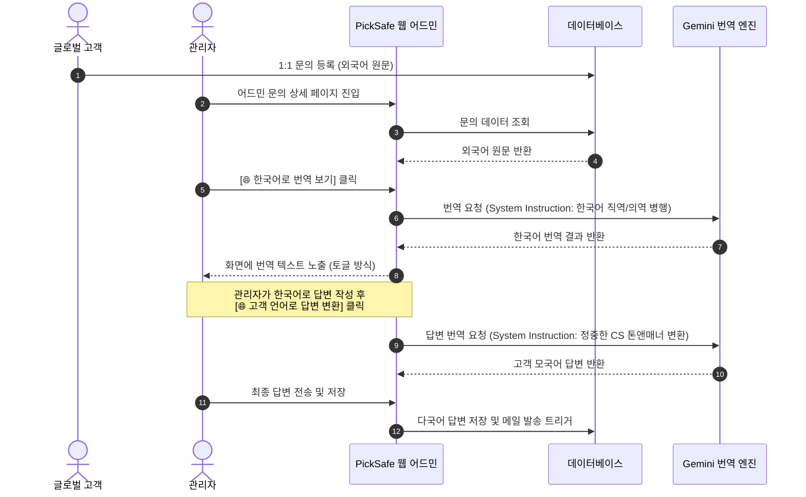

화장품 성분 분석 서비스인 **PickSafe**를 개발하고 운영하면서, 최근 예상치 못한 변화를 마주했습니다. 국내 사용자뿐만 아니라 다양한 국가에서 유입되는 사용자가 늘어나면서 영어, 일본어, 중국어로 작성된 1:1 고객 문의(성분 매칭 제보, 앱 버그 신고 등)가 점진적으로 증가하기 시작한 것입니다. 

제한된 인프라 리소스와 운영 환경 속에서 글로벌 사용자의 피드백에 빠르게 대응하는 것은 서비스 신뢰도와 직결되는 중요한 문제였습니다. 그러나 기존의 투박한 어드민 시스템과 수동 번역 프로세스로는 늘어나는 다국어 문의를 감당하기에 명백한 한계가 있었습니다. 

이 글에서는 비대해진 어드민 코드를 도메인별로 분할하고, AI 번역 엔진을 결합하여 글로벌 고객 대응 효율을 극적으로 개선한 과정과 그 과정에서의 기술적 고민을 담백하게 기록해 보고자 합니다.

---

## 🎯 마주한 고민과 문제 배경

기존의 어드민 시스템은 빠르게 기능을 붙여 나가다 보니 크게 두 가지의 병목을 가지고 있었습니다.

### 1. 수동 번역 프로세스로 인한 응답 지연
외국어 문의가 들어오면 어드민 화면에서 텍스트를 복사해 외부 번역기에 붙여넣어 내용을 파악해야 했습니다. 답변을 작성할 때도 한국어로 초안을 쓴 뒤 다시 외부 번역기를 거쳐 정중한 톤앤매너로 다듬은 후 발송해야 했습니다. 이 과정에서 단순 복사-붙여넣기 작업에만 많은 시간이 소요되었고, 번역 품질의 일관성을 유지하기 어려워 오번역으로 인한 커뮤니케이션 오해가 발생하곤 했습니다.

### 2. 어드민 모듈의 모놀리스화로 인한 유지보수성 저하
초기 설계 당시 단일 파일(`admin.py`)에 모든 어드민 라우터와 비즈니스 로직을 밀어 넣었던 것이 화근이었습니다. 문의 관리, 다국어 사전 관리, 방문자 통계, 시스템 설정 등이 한 파일에 섞여 코드 길이가 수천 줄에 달하게 되었습니다. 새로운 기능을 추가하거나 템플릿을 수정할 때마다 사이드 이펙트를 걱정해야 하는 상황에 이르렀습니다.

---

## ⚖️ 기술적 대안 비교 및 선택 이유

문제를 해결하기 위해 어드민 아키텍처의 리팩터링 방향과 번역 엔진 도입을 두고 대안들을 비교 검토했습니다.

### 1. 어드민 모듈 아키텍처 설계 대안

| 비교 항목 | 대안 A: 기존 구조 유지 및 헬퍼 함수 분리 | 대안 B (선택): 도메인 기반 디렉터리 분할 |
| :--- | :--- | :--- |
| **구조** | `admin.py` 내부에 코드를 두고, 비즈니스 로직만 별도 모듈로 호출 | `app/routers/admin/` 디렉터리 하위에 기능별 라우터 완전 분할 |
| **유지보수성** | 파일 크기는 소폭 줄어드나, 라우터 정의가 한 곳에 쏠려 있어 복잡도 여전함 | 도메인별(문의, 번역, 설정 등)로 관심사가 분리되어 코드 파악이 매우 직관적임 |
| **협업/확장성** | 코드 수정 시 병목 발생 가능성 높음 | 독립된 템플릿 및 JS 파일 매칭으로 영향도 최소화 |

**선택 이유**: 어드민 페이지의 규모가 더 커지기 전에 물리적으로 라우터와 템플릿, 정적 자산(JS)을 완전히 분리하는 것이 장기적인 생산성 측면에서 유리하다고 판단하여 **대안 B**를 선택했습니다.

### 2. 번역 엔진 선택 대안

| 비교 항목 | 대안 A: 기존 Rule-based 번역 API (DeepL / Google Cloud) | 대안 B (선택): LLM 기반 번역 API (Gemini Pro) |
| :--- | :--- | :--- |
| **번역 품질** | 기계적이고 직역 위주의 번역 제공 | 문맥 이해도가 높고 자연스러운 구어체 구현 가능 |
| **톤앤매너 제어** | 불가능 (단순 텍스트 매핑) | 가능 (System Instruction을 통해 "정중한 CS 톤" 지정 가능) |
| **비용 및 제약** | 호출 건당 과금, 무료 티어 한도 타이트함 | 현재 서비스 스케일 대비 합리적인 요금제 및 유연한 쿼터 제공 |

**선택 이유**: 단순 단어 대 단어의 기계적 번역보다, 고객의 감정 선과 문맥을 파악하고 이에 맞춰 정중한 답변 템플릿을 생성할 수 있는 **Gemini Pro API(대안 B)**가 1:1 문의 대응에 가장 적합하다고 판단했습니다.

---

## 🏗️ 시스템 아키텍처 및 흐름

전체적인 시스템 아키텍처와 다국어 문의가 처리되는 흐름은 다음과 같습니다.

---

## 💻 핵심 구현 및 트러블슈팅

### 1. 도메인별 어드민 라우터 분할

먼