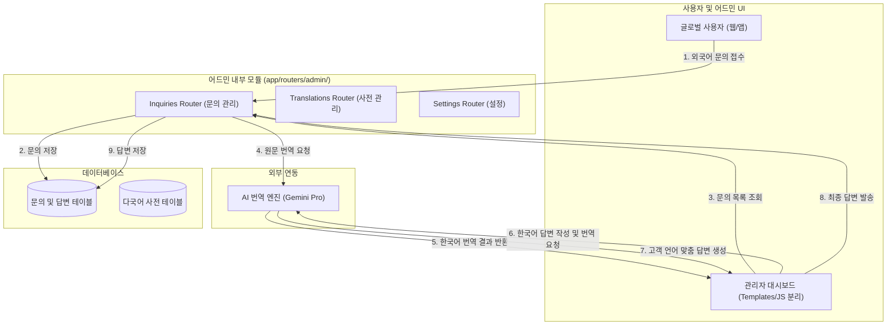

화장품 성분 분석 서비스인 **PickSafe**를 개발하고 운영하면서, 예상보다 빠른 속도로 다양한 국가의 사용자가 유입되기 시작했습니다. 이에 따라 영어, 일본어, 중국어 등으로 작성된 1:1 고객 문의(성분 매칭 제보, 데이터 오류 신고 등)의 비중이 크게 늘어났습니다.

하지만 기존의 어드민 시스템은 이러한 글로벌 운영 요구사항을 감당하기에 구조적으로나 기능적으로 한계가 명확했습니다. 단일 파일로 비대해진 어드민 라우터는 코드 한 줄 고치기 두려운 스파게티 코드가 되어 가고 있었고, 다국어 문의 처리는 수동 번역에 의존하여 비효율의 극치를 달리고 있었습니다. 

이 문제를 해결하기 위해 진행했던 **어드민 아키텍처 모듈화**와 **실시간 AI 번역 엔진 도입** 과정의 기록을 담백하게 공유합니다.

---

## 🎯 마주한 고민과 문제 배경

기존 시스템에서 글로벌 고객 문의를 처리하는 과정은 크게 두 가지 병목을 가지고 있었습니다.

### 1. 운영상의 병목: 수동 번역 프로세스
외국어 문의가 접수되면 관리자는 다음과 같은 번거로운 단계를 거쳐야 했습니다.
* 문의 원문을 복사하여 외부 번역기에 붙여넣기 후 내용 파악
* 한국어로 답변 작성 후 다시 번역기로 번역
* 번역된 답변의 어색한 문장(CS 톤앤매너에 맞지 않는 직역 등)을 수동으로 보정
* 최종 답변을 복사하여 고객에게 발송

이 과정에서 답변 지연이 발생했고, 번역 품질의 일관성을 유지하기 어려웠습니다.

### 2. 기술적 병목: 비대해진 모놀리식 어드민 라우터 (`admin.py`)
초기 빠르게 기능을 검증하기 위해 어드민 관련 기능을 `admin.py`라는 단일 파일에 모두 밀어 넣었습니다. 
* 문의 관리, 다국어 사전 관리, 대시보드 지표 조회, 설정 변경 로직이 한데 엉켜 있었습니다.
* 코드 라인 수가 수천 줄을 넘어가며 가독성이 극도로 저하되었고, 간단한 버그 수정조차 다른 기능에 영향을 주지 않을까 불안해하며 작업해야 했습니다.
* 프론트엔드 템플릿과 자바스크립트 파일 역시 어드민 하위에 통째로 묶여 있어 유지보수 생산성이 급격히 떨어졌습니다.

---

## ⚖️ 기술적 대안 비교 및 선택 이유

문제를 해결하기 위해 크게 두 가지 영역에서 기술적 의사결정이 필요했습니다.

### 고민 1. 비대해진 어드민 라우터를 어떻게 분할할 것인가?

| 대안 | 장점 | 단점 | 선택 여부 |
| :--- | :--- | :--- | :--- |
| **대안 A: 단일 파일 유지 및 내부 헬퍼 함수 분리** | 구조 변화가 적어 리팩토링 리스크가 낮음 | 파일 크기 자체가 줄어들지 않아 근본적인 가독성 해결 불가 | 미선택 |
| **대안 B: 어드민 전용 마이크로 서비스(MSA) 분리** | 완벽한 결합도 제거, 독립적인 배포 가능 | 인프라 리소스 추가 소모, 서비스 간 통신 오버헤드 및 개발 공수 과다 | 미선택 |
| **대안 C: 도메인 기반 라우터 분할 및 패키지화** | 기존 단일 어플리케이션 내에서 모듈성 확보, 낮은 인프라 비용 | 라우터 등록 및 의존성 주입 구조의 재설계 필요 | **최종 선택** |

**선택 이유:** 현재의 인프라 규모와 제한된 리소스 내에서 무리하게 MSA로 전환하는 것은 오버헤드가 더 크다고 판단했습니다. 동일한 어플리케이션 컨텍스트 내에서 도메인별로 라우터를 명확히 분할(`app/routers/admin/`)하고, 이에 매핑되는 템플릿과 정적 자산(JS)을 1:1로 격리하는 것만으로도 충분히 높은 수준의 유지보수성을 확보할 수 있다고 보았습니다.

### 고민 2. 실시간 번역 엔진을 어떻게 구성할 것인가?

| 대안 | 장점 | 단점 | 선택 여부 |
| :--- | :--- | :--- | :--- |
| **대안 A: 전통적인 번역 API (Google/DeepL)** | 빠른 응답 속도, 번역의 안정성 | 단순 직역 위주로, CS 특유의 정중하고 친절한 톤앤매너(Tone & Manner) 반영이 어려움 | 미선택 |
| **대안 B: LLM 기반 번역 API (Gemini Pro)** | 문맥 이해도가 높고, 프롬프트를 통해 정중한 CS 답변 톤 제어 가능 | 전통적 API 대비 약간의 지연 시간(Latency) 존재 | **최종 선택** |

**선택 이유:** 1:1 문의 답변은 실시간 채팅이 아닌 비동기식 이메일/게시판 형태이므로 몇 초 수준의 지연 시간은 큰 문제가 되지 않았습니다. 그보다 중요한 것은 **"고객에게 얼마나 자연스럽고 전문적인 답변을 전달할 수 있는가"**였기에, 프롬프트 엔지니어링을 통해 답변의 톤을 제어할 수 있는 Gemini Pro API를 도입하기로 결정했습니다.

---

## 🏗️ 시스템 아키텍처 및 흐름

어드민 모듈을 도메인별로 완전히 격리하고, 실시간 AI 번역 엔진을 연동한 전체 아키텍처와 흐름은 다음과 같습니다.



---

## 💻 핵심 구현 및 트러블슈팅

### 1. 어드민 라우터 구조적 리팩토링
가장 먼저 거대했던 `admin.py`를 기능 단위의 패키지로 쪼개어 재배치했습니다.

```
app/
├── routers/
│   └── admin/
│       ├── __init__.py
│       ├── inquiries.py       # 1:1 고객문의 처리
│       ├── translations.py    # 다국어 성분 사전 관리
│       └── settings.py        # 시스템 설정 관리
```

라우터를 분할하면서 각 모듈이 독립적으로 동작하도록 의존성 주입 구조를 정비했습니다. 아래는 개별 분리된 문의 처리 라우터의 축약 예시입니다.

```python
# app/routers/admin/inquiries.py
from fastapi import APIRouter, Depends, HTTPException, status
from sqlalchemy.orm import Session
from app.database import get_db
from app.services.translation import translation_service

router = APIRouter(
    prefix="/admin/inquiries",
    tags=["Admin Inquiries"]
)

@router.get("/{inquiry_id}")
def get_inquiry_detail(inquiry_id: int, db: Session = Depends(get_db)):
    inquiry = db.query(InquiryModel).filter(InquiryModel.id == inquiry_id).first()
    if not inquiry:
        raise HTTPException(status_code=404, detail="Inquiry not found")
    return inquiry
```

### 2. LLM 기반 실시간 다국어 번역 서비스 구현
번역 로직은 비즈니스 레이어로 분리하여 `translation_service`로 구현했습니다. 특히, 단순 번역이 아닌 **"고객 지원에 적합한 정중한 톤앤매너"**를 유지하도록 시스템 프롬프트를 정교하게 설계했습니다.

보안을 위해 API 키 및 민감한 설정 정보는 환경 변수(`SETTINGS.GEMINI_API_KEY`)로 추상화하여 처리했습니다.

```python
# app/services/translation.py
import os
import google.generativeai as genai

class TranslationService:
    def __init__(self):
        # 환경 변수에서 API 키를 안전하게 로드
        api_key = os.getenv("GEMINI_API_KEY", "SETTINGS.DEFAULT_KEY")
        genai.configure(api_key=api_key)
        self.model = genai.GenerativeModel('gemini-pro')

    def translate_customer_inquiry(self, text: str, target_lang: str = "ko") -> str:
        """
        고객이 접수한 외국어 문의를 한국어로 번역합니다.
        """
        prompt = f"""
        Translate the following customer inquiry into natural and clear Korean.
        Preserve technical terms related to cosmetics ingredients.
        
        Inquiry: {text}
        Translation:
        """
        try:
            response = self.model.generate_content(prompt)
            return response.text.strip()
        except Exception as e:
            # 외부 API 장애 시 원문을 보존하는 Fallback 처리
            return f"[번역 오류 발생 - 원문 보존] {text}"

    def translate_admin_reply(self, reply_text: str, target_lang: str) -> str:
        """
        관리자가 한국어로 작성한 답변을 고객의 모국어로 번역합니다.
        CS 톤앤매너에 맞게 정중하고 친절한 어조로 변환합니다.
        """
        prompt = f"""
        Translate the following customer support reply into {target_lang}.
        The tone must be extremely polite, professional, and helpful (Customer Service tone).
        Do not translate brand names or specific cosmetic ingredient names if they should remain in English.

        Reply: {reply_text}
        Translation:
        """
        try:
            response = self.model.generate_content(prompt)
            return response.text.strip()
        except Exception as e:
            return reply_text
```

### 3. 다국어 사전 시더(Seeder) 독립화
다국어 사전 데이터의 정합성을 보장하기 위해, 소스 코드 내에 하드코딩되어 있던 사전 매핑 테이블을 걷어내고 독립적인 데이터베이스 시더 파이프라인(`bin/seed_multilingual_db.py`)을 구축했습니다.

실제 식약처 성분 UUID나 민감한 식별자 정보는 비식별화 처리하여 안전한 더미 데이터 구조로 구성했습니다.

```python
# bin/seed_multilingual_db.py (일부 발췌)
import uuid

# 실데이터 유출 방지를 위한 비식별화 처리 예시
DUMMY_INGREDIENTS = [
    {
        "id": "00000000-0000-0000-0000-000000000001",
        "cas_no": "CAS-0000-00-1",
        "name_ko": "정제수",
        "name_en": "Water",
        "name_ja": "水"
    },
    {
        "id": "00000000-0000-0000-0000-000000000002",
        "cas_no": "CAS-0000-00-2",
        "name_ko": "글리세린",
        "name_en": "Glycerin",
        "name_ja": "グリセリン"
    }
]

def seed_multilingual_dictionary(db_session):
    # 중복 체크 및 Bulk Insert 수행 로직
    pass
```

---

## 💡 돌아보며 배운 점

### 1. 정량적 성과: 글로벌 응대 시간 80% 단축
이번 리팩토링과 AI 번역 엔진 도입을 통해, 기존에 인당 평균 **15분** 이상 소요되던 외국어 문의 응대 처리 시간이 **3분** 내외로 크게 단축되었습니다. 
관리자는 브라우저 탭을 여러 개 띄워두고 복사/붙여넣기를 반복할 필요 없이, 어드민 대시보드 내에서 즉시 원문을 토글하여 번역하고 정중한 톤의 다국어 답변을 클릭 한 번으로 완성할 수 있게 되었습니다.

### 2. 코드베이스의 건강함 회복
수천 줄에 달하던 `admin.py`가 역할에 따라 깔끔하게 쪼개지면서, 새로운 어드민 기능 요구사항이 들어와도 두려움 없이 코드를 수정할 수 있는 구조가 되었습니다. 프론트엔드 코드 역시 도메인별로 파편화되어 정리되면서 협업 및 유지보수 생산성이 눈에 띄게 개선되었습니다.

### 3. 기술적 교훈: 적재적소의 LLM 활용
모든 번역 요구사항에 무조건 무겁고 비싼 LLM을 적용할 필요는 없습니다. 하지만 이번 사례처럼 **"단순 정보 전달을 넘어 어조(Tone)와 맥락(Context)의 제어가 중요한 CS 영역"**에서는 적절한 프롬프트가 가미된 LLM API가 기존 번역기보다 훨씬 뛰어난 비즈니스 가치를 만들어낼 수 있음을 직접 체감했습니다.

앞으로 서비스 규모가 더 확장된다면, 자주 들어오는 문의 유형을 AI가 사전 분류하여 초안 답변까지 자동으로 제안해 주는 자동화 파이프라인을 덧붙여 보고 싶습니다.