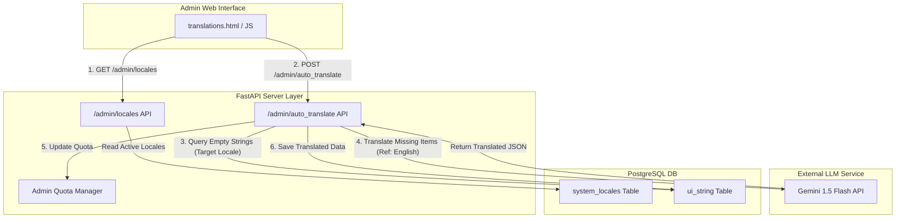

화장품 성분 분석 서비스 PickSafe를 개발하며 글로벌 사용자 유입이 늘어남에 따라 다국어 지원 확장이 주요 과제로 떠올랐습니다. 서비스 초기에는 한국어, 영어, 일본어, 간체/번체 중국어, 포르투갈어 등 6개 언어를 기준으로 UI 텍스트(`ui_string`)를 하드코딩하여 운영하고 있었습니다.

하지만 스페인어, 프랑스어 등 신규 언어 추가 요청이 들어올 때마다 코드 베이스 전반을 수정해야 하는 정체 현상이 발생했습니다. 이번 글에서는 정적 구조의 다국어 시스템이 안고 있던 한계를 정립하고, 이를 동적 로케일 구조 및 LLM 기반 일괄 자동 번역 파이프라인으로 전환한 과정과 그에 대한 기술적 회고를 기록합니다.

---

## 🎯 마주한 고민과 문제 배경

초기 시스템 구조에서는 신규 언어 하나를 지원하기 위해 프론트엔드와 백엔드, DB 레이어 모두에서 수동 작업이 요구되었습니다.

1. **높은 유지보수 공수**: 프론트엔드 HTML/JS의 렌더링 파이프라인, 백엔드의 API 요청 검증 로직, DB 테이블 컬럼에 이르기까지 언어 코드가 하드코딩되어 있었습니다. 언어가 추가될 때마다 3개 레이어의 코드를 동시에 수정하고 배포해야 했습니다.
2. **번역 리소스 부족**: 구조를 바꾸더라도 수백 개에 달하는 기존 UI UI 텍스트(`ui_string`)를 매번 사람이 수동으로 번역해 채워 넣는 작업은 단시간 내 처리가 불가능했습니다.
3. **데이터 누락 관리의 어려움**: 관리자 페이지에서 특정 언어의 텍스트가 비어 있는지 확인하고, 빈칸만 골라 일괄로 채워줄 수 있는 서버 측 자동화 수단이 부재했습니다.

이러한 문제는 단순한 단순 운영 불편을 넘어, 글로벌 서비스 확장 속도를 저해하는 기술 부채로 작용하기 시작했습니다.

---

## ⚖️ 기술적 대안 비교 및 선택 이유

문제를 해결하기 위해 클라이언트 사이드 즉시 번역 방식과 백엔드 주도 일괄 번역 파이프라인 방식을 비교 검토했습니다.

| 비교 항목 | 대안 A: 클라이언트 브라우저 번역 (Google Translate API) | 대안 B: 백엔드 주도 동적 로케일 & Gemini API 일괄 번역 (선택) |
| :--- | :--- | :--- |
| **처리 시점** | 클라이언트 렌더링 시점 (실시간) | 어드민 데이터 입력/생성 시점 (배치/일괄) |
| **데이터 보장성** | 클라이언트 환경에 의존하여 렌더링 결과 불확실 | DB에 완전한 텍스트로 보존되어 안정적인 응답 속도 보장 |
| **API 키 보안** | 프론트엔드 노출 위험 존재 (CORS 및 도난 우려) | 백엔드 환경변수(`SETTINGS.GEMINI_API_KEY`)로 안전하게 격리 |
| **기존 번역 보호** | 기존 검수 완료 데이터와의 구분이 모호함 | DB 내 **빈 문자열(Null/Empty)**만 타겟팅하여 검수 데이터 보호 |
| **확장성** | 언어 추가 시 FE 렌더링 코드 수정 필요 | DB의 `system_locales` 메타데이터 기반으로 UI 자동 동적 생성 |

검토 결과, 클라이언트 측 번역은 API 키 보안 및 네트워크 지연 타임아웃 리스크가 컸습니다. 무엇보다 사람이 이미 검수해 둔 양질의 번역 데이터를 보존하면서 **'누락된 빈칸만 골라 채우는 안정성'**을 확보하기 위해 백엔드 주도의 파이프라인(대안 B)을 선택했습니다.

번역 엔진으로는 대용량 프롬프트 처리 속도가 빠르고 단어 맥락 이해도가 높은 **Gemini 1.5 Flash**를 채택했습니다.

---

## 🏗️ 시스템 아키텍처 및 흐름

전체 시스템은 어드민 설정(`admin_setting.py`)의 메타데이터를 기반으로 동작하며, DB에 등록된 활성화 언어(`system_locales`)를 바라보고 프론트엔드가 동적으로 UI를 구성하도록 설계했습니다.



### 동작 과정
1. **동적 UI 생성**: 어드민 페이지 접근 시 `/admin/locales` API를 호출하여 현재 활성화된 언어 목록을 가져와 테이블 칼럼 및 모달 폼을 동적으로 그리게 됩니다.
2. **누락 데이터 추출**: 관리자가 `[✨ 빈칸 자동 번역]`을 실행하면 서버는 `ui_string` 테이블에서 대상 언어의 값이 비어 있는 레코드만 필터링합니다.
3. **맥락 기반 번역**: 가장 기준점이 되는 영어(`English`) 원문을 추출하여 Gemini API에 프롬프트로 전달합니다.
4. **결과 검증 및 적재**: 번역된 데이터를 DB에 개별 파싱하여 저장하고, 사용된 API 쿼터는 `Admin_Quotas`에 기록됩니다.

---

## 💻 핵심 구현 및 트러블슈팅

### 1. 빈칸 전용 타겟팅 및 Gemini API 번역 로직

핵심은 이미 검수 완료된 타겟 언어 데이터를 건드리지 않고, 오직 빈 문자열(`""`) 상태인 데이터만 골라내어 프롬프트 효율성을 최적화하는 것이었습니다.

```python
# backend/app/services/translation_service.py
import json
import httpx
from fastapi import HTTPException
from app.core.config import SETTINGS

async def translate_missing_ui_strings(
    db_session, 
    target_locale: str, 
    missing_items: list[dict]
) -> dict:
    """
    missing_items: [{'id': 101, 'key': 'BUTTON_SAVE', 'en_text': 'Save'}]
    """
    if not missing_items:
        return {"translated_count": 0}

    # Gemini 1.5 Flash에 전달할 프롬프트 구성 (JSON Output 유도)
    prompt_payload = {
        "target_language": target_locale,
        "items": [{"id": item["id"], "text": item["en_text"]} for item in missing_items]
    }

    system_instruction = (
        "You are a professional translator for a cosmetics analysis service. "
        "Translate the given English UI texts into the target language accurately. "
        "Maintain the exact JSON structure provided in the request."
    )

    url = f"https://generativelanguage.googleapis.com/v1beta/models/gemini-1.5-flash:generateContent?key={SETTINGS.GEMINI_API_KEY}"
    
    headers = {"Content-Type": "application/json"}
    body = {
        "contents": [{
            "parts": [{"text": f"{system_instruction}\n\nPayload:\n{json.dumps(prompt_payload)} "}]
        }],
        "generationConfig": {
            "response_mime_type": "application/json"
        }
    }

    async with httpx.AsyncClient(timeout=30.0) as client:
        response = await client.post(url, headers=headers, json=body)
        if response.status_code != 200:
            raise HTTPException(status_code=500, detail="External Translation Service Error")

        result = response.json()
        raw_text = result['candidates'][0]['content']['parts'][0]['text']
        translated_json = json.loads(raw_text)

    # DB 일괄 업데이트 수행
    updated_count = 0
    for item in translated_json.get("items", []):
        record_id = item.get("id")
        translated_text = item.get("text")
        
        if record_id and translated_text:
            # DB 레코드 내 해당 locale 컬럼만 업데이트
            update_db_ui_string(db_session, record_id, target_locale, translated_text)
            updated_count += 1

    return {"translated_count": updated_count}
```

### 2. 트러블슈팅: 타임아웃 및 스키마 일관성 문제

구현 과정에서 두 가지 기술적 버그를 마주하고 해결했습니다.

#### ① Gemini 응답 형태의 유연성으로 인한 JSON 파싱 예외
- **문제**: LLM이 간혹 JSON 이외의 설명 텍스트를 덧붙이거나 `items` 배열의 키 구조를 임의로 변경하여 백엔드 파싱 에러가 발생했습니다.
- **해결**: API 요청 시 `generationConfig`에 `"response_mime_type": "application/json"`을 명시하여 출력을 JSON으로 강제하고, Pydantic 모델을 통한 입출력 검증 레이어를 두어 구조가 일치하지 않을 경우 재시도(Retry)하는 로직을 추가했습니다.

#### ② 동기 방식 호출에 따른 대량 데이터 번역 시 타임아웃 위험
- **문제**: 번역할 UI 텍스트가 한 번에 수백 개 이상 몰릴 경우, 단일 HTTP 요청의 처리 시간이 길어져 HTTP 클라이언트 타임아웃(30초)을 초과할 가능성이 존재했습니다.
- **해결**: 단기적으로는 일괄 요청 단위를 50개씩 분할(Chunking)하여 처리하도록 조율했습니다. 쿼터 연동 모니터링 시스템(`Admin_Quotas`)을 연동해 각 요청마다 사용량을 엄격히 추적하도록 조치했습니다.

---

## 💡 돌아보며 배운 점 (회고)

이번 개편을 통해 코드 수정 없이 어드민 UI 클릭만으로 신규 언어를 유연하게 시스템에 등록하고, 단 몇 초 만에 수백 개의 미번역 UI 데이터를 자동 처리할 수 있는 기반을 마련했습니다.

### 실질적인 개선 효과
- **코드 결합도 제거**: 프론트엔드와 백엔드의 하드코딩된 언어 구조를 완전히 분리하여, 새로운 로케일을 다루기 위한 소스코드 재배포 과정이 소멸되었습니다.
- **데이터 안전성**: 무조건적인 자동 덮어쓰기가 아닌 '빈칸(Null/Empty)' 전용 번역 전략을 취함으로써 기존에 검수된 데이터의 손실 없이 번역 커버리지를 100%로 끌어올렸습니다.

### 향후 보완할 과제
현재의 일괄 번역 엔드포인트는 동기(Sync) HTTP 요청 기반으로 작동합니다. 데이터 량이 수천 건 단위로 늘어날 미래의 상황을 고려하면 다음과 같은 개선 방안이 필요합니다.

1. **비동기 워커 전환**: `FastAPI BackgroundTasks` 또는 `Celery`를 도입하여 자동 번역 요청을 비동기 작업으로 전환.
2. **진행 상태 시각화**: 어드민 UI에 WebSocket이나 SSE(Server-Sent Events)를 연동하여 번역 진행률(Progress Bar)을 실시간으로 안내하는 UX 개선.

단순히 기능을 만드는 것을 넘어, 확장 가능한 구조(Design for Change)를 설계하는 것이 시스템 전체의 수명을 얼마나 연장해 주는지 깊이 체감할 수 있었던 엔지니어링 작업이었습니다.