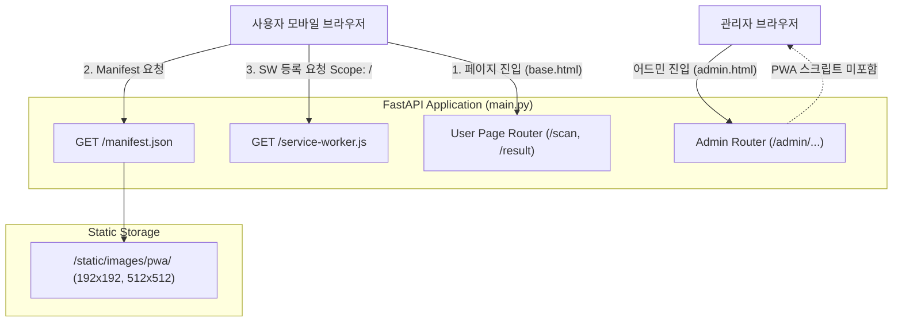

화장품 성분 분석 서비스 PickSafe를 개발하고 운영하면서, 모바일 웹 브라우저를 통한 접속 비중이 전체 트래픽의 대다수를 차지한다는 점을 확인했습니다. 하지만 사용자가 매번 Safari나 Chrome 브라우저를 열고 URL을 직접 입력하거나 북마크를 뒤져 진입하는 과정은 분명한 사용자 경험(UX)의 허들이었습니다.

네이티브 앱을 새로 구축하기에는 리소스 관리와 스토어 배포 공수가 컸기에, 현재의 웹 생태계를 유지하면서 네이티브 앱과 유사한 진입 경험을 제공할 수 있는 **PWA(Progressive Web App)** 도입을 결정했습니다.

이 글은 PickSafe에 PWA를 1차적으로 적용하는 과정에서 마주했던 기술적 고민, 단순 설치(A2HS) 중심의 전략을 선택한 배경, 그리고 서비스 워커의 Scope 문제를 해결하기 위한 백엔드 라우팅 설계 과정을 담은 기록입니다.

---

## 🎯 마주한 고민과 문제 배경

PWA 도입을 고려할 때 가장 흔히 범하는 실수는 "서비스 워커(Service Worker)를 붙였으니 오프라인 Caching부터 강하게 적용하자"라는 접근입니다. 저 역시 처음에는 적극적인 Caching 전략(NetworkFirst 또는 StaleWhileRevalidate)을 적용하려 했습니다.

하지만 현재 PickSafe의 서비스 상태와 운영 리소스를 냉정하게 점검해 보았을 때 다음과 같은 문제점과 위험 요소가 식별되었습니다.

1. **캐싱 전략 오류로 인한 최신 자원 미갱신 리스크**
   성분 데이터베이스 업데이트 및 서비스 UI 개편이 빈번하게 일어나는 현 단계에서, 서비스 워커의 캐시 제어가 정교하지 못하면 사용자가 구버전 JavaScript나 CSS를 계속 바라보며 최신 성분 분석 결과를 얻지 못하는 치명적인 장애로 이어질 수 있었습니다.
2. **목적과 수단의 전객도**
   현재 사용자 입장에서 가장 급선무인 개선점은 "오프라인 상태에서의 성분 조회"가 아니라 **"홈 화면에서 클릭 한 번으로 빠르게 앱으로 진입하는 경험(Add to Home Screen)"**이었습니다.
3. **어드민 영역과의 Separation 문제**
   관리자 전용 페이지(`/admin/...`)에 서비스 워커나 앱 설치 프롬프트가 노출되는 것은 불필요할 뿐만 아니라 권한 제어나 오프라인 동작 측면에서도 보안상 원치 않는 동작이었습니다.

따라서 단계적 접근(Phased Approach)을 택하여, 1차 단계(Phase 1)에서는 **"안정적인 모바일 홈 화면 설치 경험 구축"**을 최우선 목표로 정의했습니다.

---

## ⚖️ 기술적 대안 비교 및 선택 이유

PWA Phase 1 전략 수립 시 검토한 주요 대안 및 Trade-off는 다음과 같습니다.

| 구분 | 대안 A: 전면적 PWA (오프라인 Caching 포함) | 대안 B: Phase 1 설치 전용 PWA (선택) |
| :--- | :--- | :--- |
| **목적** | 오프라인 동작 지원 + 앱 설치 | **홈 화면 앱 설치(A2HS) 및 브랜드 일체감** |
| **서비스 워커 역할** | Fetch 이벤트 가로채기 및 Cache Storage 제어 | **브라우저 PWA 조건 충족용 빈(Empty) 워커 등록** |
| **리스크** | 리소스 미갱신, 캐시 무효화 실패 시 서비스 장애 | **캐시 이슈 제로(0), 정적 자원은 기존 HTTP 캐시 활용** |
| **구현 복잡도** | 높음 (Workbox 도입, Caching Strategy 설계 필요) | **낮음 (안정성 검증 후 차후 Phase 2 확장 가능)** |

### 선택 이유
결과적으로 **대안 B**를 선택했습니다. 서비스 워커의 `Fetch` / `Install` 이벤트 가로채기 로직을 완전히 비워둠으로써, PWA 설치 요건(Web App Manifest + Service Worker 등록)은 충족하되 서비스 동작 방식은 기존 웹 애플리케이션의 안정성을 그대로 유지할 수 있었습니다.

또한, PWA 적용 대상을 사용자용 레이아웃(`base.html`)으로 한정하고 어드민 템플릿에는 스크립트를 완전히 제거하여 어드민 영역과의 분리를 명확히 했습니다.

---

## 🏗️ 시스템 아키텍처 및 서비스 워커 Scope 라우팅

PWA를 도입할 때 마주친 핵심 기술적 한계 중 하나는 **서비스 워커의 통제 범위(Scope)**였습니다.

기본적으로 브라우저 보안 명세상 서비스 워커 파일이 위치한 디렉토리가 해당 워커의 기본 Scope가 됩니다. PickSafe의 정적 파일 구조상 `service-worker.js`가 `/static/js/service-worker.js`에 배치될 경우, 이 서비스 워커는 `/static/js/` 하위 요청만 통제할 수 있어 최상위 도메인 전체(`/`, `/scan`, `/result` 등)를 PWA로 인지시키지 못합니다.

이를 해결하기 위해 정적 자원 위치와 관계없이 백엔드(FastAPI) 엔드포인트를 통해 루트 경로(`/`)에서 Manifest와 Service Worker를 직접 서빙하는 아키텍처를 구성했습니다.



---

## 💻 핵심 구현 및 트러블슈팅

### 1. 백엔드 루트 라우팅 구현 (`main.py`)
서비스 워커와 매니페스트 파일이 도메인 루트(`/`) 스코프를 가질 수 있도록 백엔드 단에서 `FileResponse`를 활용해 루트 엔드포인트를 매핑했습니다.

```python
from fastapi import FastAPI
from fastapi.responses import FileResponse
import os

app = FastAPI()

# PWA Root Endpoints for Scope Resolution
BASE_DIR = os.path.dirname(os.path.abspath(__file__))

@app.get("/manifest.json", include_in_schema=False)
async def get_manifest():
    manifest_path = os.path.join(BASE_DIR, "static", "manifest.json")
    return FileResponse(manifest_path, media_type="application/json")

@app.get("/service-worker.js", include_in_schema=False)
async def get_service_worker():
    sw_path = os.path.join(BASE_DIR, "static", "js", "service-worker.js")
    # Service Worker의 MIME Type은 반드시 application/javascript 이어야 함
    return FileResponse(sw_path, media_type="application/javascript")
```

### 2. 의도적으로 비워둔 Service Worker (`service-worker.js`)
Phase 1의 목표에 맞게 오프라인 캐싱 로직을 배제하고 설치 필수 요건만 갖춘 형태입니다.

```javascript
// service-worker.js
// Phase 1: 홈 화면 설치 지원을 위한 최소 구조 정의
// 캐싱 전략은 Phase 2 안정화 이후 단계적으로 적용 예정

self.addEventListener('install', (event) => {
  // 대기 상태를 거치지 않고 즉시 활성화
  self.skipWaiting();
});

self.addEventListener('activate', (event) => {
  // 제어권을 즉시 확보
  event.waitUntil(self.clients.claim());
});

// fetch 이벤트를 가로채지 않고 네트워크 기본 동작에 위임
self.addEventListener('fetch', (event) => {
  return; 
});
```

### 3. 사용자 화면 전용 스크립트 적용 및 UI 파라미터 (`base.html`)
테마 컬러는 기존 PickSafe의 디자인 정체성인 아이보리 파스텔 톤(`#FFF8F0`)으로 맞추어, 브라우저 상단 상태바 및 스플래시 화면의 일체감을 도모했습니다.

```html
<!-- base.html (사용자 화면 전용) -->
<head>
    <link rel="manifest" href="/manifest.json">
    <meta name="theme-color" content="#FFF8F0">
    
    <!-- iOS Safari 전용 설정 -->
    <meta name="apple-mobile-web-app-capable" content="yes">
    <meta name="apple-mobile-web-app-status-bar-style" content="default">
    <meta name="apple-mobile-web-app-title" content="PickSafe">
    <link rel="apple-touch-icon" href="/static/images/pwa/icon-192.png">
</head>
<body>
    <!-- 본문 콘텐츠 -->

    <script>
      if ('serviceWorker' in navigator) {
        window.addEventListener('load', () => {
          navigator.serviceWorker.register('/service-worker.js', { scope: '/' })
            .then((reg) => {
              console.log('PWA Service Worker registered with scope:', reg.scope);
            })
            .catch((err) => {
              console.error('Service Worker registration failed:', err);
            });
        });
      }
    </script>
</body>
```

---

## 🧪 검증 결과

구현 완료 후 다음과 같이 3가지 주요 시나리오에 대해 검증을 진행했습니다.

1. **iOS Safari 검증**: 아이폰 Safari 환경에서 '홈 화면에 추가' 진행 시, `#FFF8F0` 배경색의 스플래시 화면과 함께 지정된 규격(192x192 리사이징)의 아이콘이 홈 화면에 정상적으로 생성되는 것을 확인했습니다.
2. **Android Chrome 검증**: 안드로이드 Chrome 환경 접속 시 하단 '앱 설치' 프롬프트 바가 정상적으로 트리거되는 것을 확인했습니다.
3. **어드민 영역 격리 검증**: `/admin/...` 관련 관리자 페이지 접속 시 서비스 워커 등록 스크립트가 호출되지 않으며, PWA 프롬프트가 차단되는 것을 확인했습니다.

---

## 💡 돌아보며 배운 점 (회고)

엔지니어로서 새로운 기술을 도입할 때, 해당 기술이 제공하는 모든 화려한 기능(예: Offline First Caching, Push Notification)을 한 번에 다 적용하고 싶은 욕심이 들기 마련입니다.

하지만 이번 PWA Phase 1 작업을 거치며 **"현재 서비스에 가장 필요한 본질적인 가치가 무엇인가"**를 먼저 고민하고 기술의 스코프를 자발적으로 제한하는 작업의 중요성을 다시금 배웠습니다.

- **안전한 단계적 배포(Phased Rollout)**: 캐싱을 과감히 보류함으로써 서비스 안정성을 100% 보장한 상태에서 '홈 화면 진입 경험'이라는 핵심 목표만 빠르게 달성할 수 있었습니다.
- **웹 표준 사양과 백엔드 구조의 이해**: 단순 정적 파일 배치가 아닌, 브라우저의 Service Worker Scope 명세와 백엔드 라우팅 간의 관계를 정리해 봄으로써 아키텍처적 완성도를 높일 수 있었습니다.

향후 모바일 진입 트래픽 및 설치 유저 추이를 모니터링한 뒤, 정적 폰트나 변경 빈도가 낮은 핵심 CSS 자원부터 부분적으로 `CacheFirst` 캐싱을 도입하는 **PWA Phase 2**로 차분히 확장해 나갈 계획입니다.