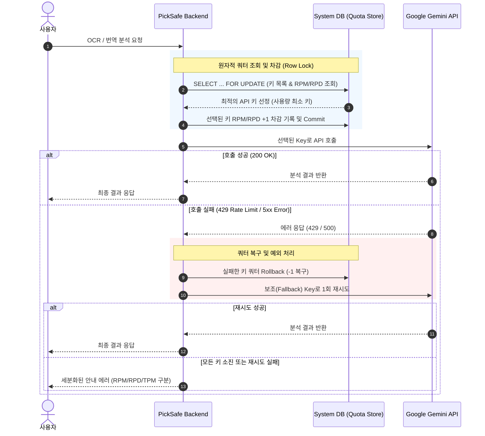

화장품 성분 분석 서비스 **PickSafe**를 개발하면서 성분 이미지 OCR 및 해외 제품 성분 번역 기능을 구현하기 위해 Google Gemini API(Flash 및 Flash-Lite 모델)를 도입했습니다. 

초기에는 일일 허용량(RPD, Requests Per Day)만 단순 추적하면 안정적으로 동작할 것이라 판단했으나, 실제 운영 환경에 가까워질수록 순간적인 분당 요청 수(RPM, Requests Per Minute) 초과로 인한 `429 Too Many Requests` 에러가 빈번하게 발생하는 문제에 직면했습니다.

이 글은 제한된 무료/티어 API 쿼터 환경에서 동시성 경쟁 상태(Race Condition)를 해결하고, 서비스의 안정성을 높이기 위해 수행했던 기술적 아키텍처 재설계와 트러블슈팅 과정을 담았습니다.

---

## 🎯 마주한 고민과 문제 배경

### 1. RPD만으로는 막을 수 없는 RPM 병목
초기 설계에서는 API 키별로 하루에 몇 번 호출했는지만 기록했습니다. 그러나 실측 결과 주력 모델인 `Gemini 3.1 Flash-Lite`의 경우 키당 **RPM 15, RPD 500** 수준으로 분당 요청 제한이 매우 타이트했습니다.

사용자가 동시 접속하여 이미지 스캔을 요청하는 순간, 하루 총량(RPD)은 여유가 남아있음에도 불구하고 분당 한도(RPM)를 순식간에 초과하여 API 호출이 실패하는 현상이 발생했습니다. API 키를 2개로 늘리더라도 합산 RPM은 30에 불과했기 때문에, 요청을 정밀하게 분산시키지 않으면 서비스가 쉽게 마비될 수 있었습니다.

### 2. '조회-선택-차감' 비동기 처리 간 경쟁 상태 (Race Condition)
기존 로직은 아래와 같은 순서로 작동했습니다.

1. DB에서 키별 남은 사용량 조회
2. 사용량이 남은 키 선택
3. 해당 키의 사용량 1 증가 후 Gemini API 호출

동시 요청이 거의 없는 환경에서는 문제가 없었지만, 여러 요청이 한 번에 몰릴 경우 **1번(조회) 단계에서 동일한 키를 동시에 '여유 있음'으로 판단**하는 경쟁 상태가 발생했습니다. 이로 인해 특정 API 키 하나로 모든 요청이 쏠리며 즉시 429 에러가 터졌습니다.

### 3. 실증 실패 시 롤백(Rollback) 부재
로컬 DB에서는 사용량을 차감했으나, 구글 서버와의 네트워크 통신 에러나 일시적 429 발생으로 실제 응답을 받지 못한 경우에도 차감된 쿼터가 복구되지 않았습니다. 이로 인해 로컬의 쿼터 집계와 실제 Google API 서버의 쿼터 집계 간 격차가 벌어지는 현상이 확인되었습니다.

---

## ⚖️ 기술적 대안 비교 및 선택 이유

문제 해결을 위해 크게 두 가지 핵심 요소를 검토했습니다.

### 1. 키 선택 전략: 순수 랜덤 vs 사용량 기반 우선순위
* **순수 랜덤 / 라운드로빈**: 구현은 간단하지만, 짧은 순간 우연히 동일한 키가 연속 선택되면 RPM 한도를 쉽게 넘깁니다.
* **최소 사용량 우선 (Least-Used Priority)**: 현재 분(Minute) 버킷에서 **사용량이 가장 적은 키를 우선 배치**하는 방식을 채택했습니다. 분 단위 카운터가 같은 경우에만 라운드로빈 방식으로 분산하도록 개선했습니다.

### 2. 동시성 제어: Redis Distributed Lock vs RDBMS Row-level Lock
동시 요청 시 차감 연산의 원자성(Atomicity)을 보장하기 위한 방안을 비교했습니다.

| 비교 항목 | Redis 기반 분산 락 | RDBMS Row-level Lock (`with_for_update`) |
| :--- | :--- | :--- |
| **장점** | 메모리 기반으로 처리 속도가 매우 빠름 | 별도 인프라 구축 없이 기존 RDBMS 트랜잭션 활용 가능 |
| **단점** | Redis 인프라 추가 관리 필요, DB와의 데이터 동기화 신경 써야 함 | 순간 인프라 락 대기 시간이 발생할 수 있음 |
| **결합성** | 쿼터 데이터 상태 관리가 메모리/DB로 파편화될 수 있음 | 조회부터 차감까지 단일 DB 트랜잭션 내 완벽한 원자성 보장 |

**선택**: PickSafe 시스템 구조상 백엔드 DB로 PostgreSQL/MySQL 계열을 이미 사용 중이었으며, 외부 LLM API 호출에 걸리는 시간(보통 1~2초)에 비하면 DB의 Row Lock 대기 시간(수 ms)은 무시할 수 있는 수준이었습니다. 따라서 구조적 복잡성을 늘리지 않고 **SQLAlchemy의 `with_for_update()`를 통한 Row-level Lock** 방식을 선택했습니다.

---

## 🏗️ 시스템 아키텍처 및 흐름

수정된 API 요청 처리 아키텍처 흐름은 다음과 같습니다. DB 락을 통해 안전하게 키를 선점하고, 실패 시 롤백 및 재시도(Fallback) 알고리즘을 거치도록 설계했습니다.



---

## 💻 핵심 구현 및 트러블슈팅

### 1. SQLAlchemy `with_for_update()`를 활용한 원자적 쿼터 차감
여러 스레드나 프로세스가 동시에 쿼터를 차감할 때 덮어쓰기 문제(Lost Update)가 발생하지 않도록 트랜잭션 내에서 비관적 락(Pessimistic Lock)을 적용했습니다.

```python
from datetime import datetime
from sqlalchemy.orm import Session
from contextlib import contextmanager

def get_and_increment_quota(db: Session, category: str):
    """
    현재 분(minute) 기준 사용량이 가장 적은 키를 원자적으로 조회하여 차감합니다.
    """
    now = datetime.utcnow()
    current_minute = now.strftime("%Y-%m-%d %H:%M")
    current_day = now.strftime("%Y-%m-%d")

    # Row Lock을 적용하여 조건에 맞는 API Key 레코드 조회
    selected_key = (
        db.query(ApiKeyQuota)
        .filter(
            ApiKeyQuota.category == category,
            ApiKeyQuota.is_active == True,
            ApiKeyQuota.rpd_usage < ApiKeyQuota.rpd_limit,
            ApiKeyQuota.rpm_usage < ApiKeyQuota.rpm_limit
        )
        .with_for_update()  # FOR UPDATE 락 획득
        .order_by(ApiKeyQuota.rpm_usage.asc(), ApiKeyQuota.rpd_usage.asc())
        .first()
    )

    if not selected_key:
        return None

    # 분 단위 버킷 리셋 체크
    if selected_key.last_rpm_minute != current_minute:
        selected_key.rpm_usage = 0
        selected_key.last_rpm_minute = current_minute

    # 일 단위 버킷 리셋 체크
    if selected_key.last_rpd_day != current_day:
        selected_key.rpd_usage = 0
        selected_key.last_rpd_day = current_day

    # 사용량 차감 (카운트 증가)
    selected_key.rpm_usage += 1
    selected_key.rpd_usage += 1
    
    db.commit()
    return selected_key
```

### 2. 쿼터 복구(Rollback) 및 예외 세분화 핸들링
외부 API 호출 도중 예외가 발생하면 차감했던 쿼터를 원상복구하고, 실패 원인에 따라 세분화된 에러를 사용자에게 전달하도록 처리했습니다.

```python
def execute_gemini_request_with_retry(db: Session, payload: dict):
    key_info = get_and_increment_quota(db, category="OCR")
    
    if not key_info:
        # 모든 키 소진 시 에러 원인 세분화 안내
        raise QuotaExhaustedException("현재 요청이 몰려 잠시 지연되고 있습니다. 1분 후 다시 시도해 주세요.")

    try:
        # Gemini API 호출 (실제 API Key 문자열은 환경변수에서 매핑)
        api_key = getattr(SETTINGS, key_info.key_alias)
        response = call_gemini_api(api_key, payload)
        return response

    except GeminiRateLimitException as e:
        # 429 발생 시 로컬 쿼터 Rollback
        rollback_quota(db, key_info.id)
        
        # 남은 다른 키로 1회 재시도 (Fallback)
        fallback_key = get_and_increment_quota(db, category="OCR")
        if fallback_key:
            try:
                fallback_api_key = getattr(SETTINGS, fallback_key.key_alias)
                return call_gemini_api(fallback_api_key, payload)
            except Exception:
                rollback_quota(db, fallback_key.id)
                
        raise QuotaExhaustedException("요청이 폭주하여 처리가 지연되었습니다. 잠시 후 다시 시도해 주세요.")

    except Exception as e:
        # 기타 서버 에러 발생 시에도 쿼터 복구
        rollback_quota(db, key_info.id)
        raise e
```

### 3. 보안 마스킹 및 어드민 데이터 소스 단일화 (SSOT)
API 키 식별자가 대시보드나 로그에 직접 노출되는 것을 방지하기 위해 `AQ.A***6V9w`와 같은 마스킹 문자열조차 완전히 배제하고, `KEY_A`, `KEY_B` 형태의 가상 라벨(Alias)을 사용했습니다.

또한 인프라 모니터링, 번역 관리, OCR 성능 비교 화면에서 쿼터 정보가 다르게 표시되는 문제를 막기 위해, 세 화면이 각자 DB를 조회하는 대신 **단일 쿼터 조회 서비스(`QuotaMonitoringService.get_status()`)**를 바라보도록 통합하여 단일 진실 공급원(Single Source of Truth)을 확보했습니다.

---

## 💡 돌아보며 배운 점 (회고)

이번 작업을 진행하면서 얻은 주요 기술적 레슨은 다음과 같습니다.

1. **외부 API 통합 시 쿼터 관리는 단순 호출 이상의 영역이다**  
   LLM API는 일반적인 REST API와 달리 RPM, RPD, TPM 등 다차원의 제약 조건이 존재합니다. 클라이언트 측에서 차감 상태를 관리할 때는 고정 분(Minute) 버킷과 일(Day) 버킷을 명확히 분리하여 추적해야 외부 서비스의 429 발생을 미리 차단할 수 있음을 배웠습니다.

2. **성능과 일관성 사이의 현실적인 Trade-off**  
   동시성 해결을 위해 처음에는 Redis 분산 락이나 토큰 버킷 알고리즘 도입을 먼저 떠올렸습니다. 하지만 현재 PickSafe의 서비스 규모와 LLM 호출 레이턴시를 고려했을 때, DB의 `with_for_update()`를 활용한 비관적 락이 복잡성을 늘리지 않으면서 완벽한 트랜잭션 안전성을 제공하는 가장 합리적인 선택이었습니다. 무조건 최신 기술을 도입하는 것보다 현재 아키텍처 내에서 가장 적절한 도구를 찾는 것이 중요함을 재확인했습니다.

3. **실패 복구(Rollback) 로직의 중요성**  
   차감 로직만 작성하고 실패 시 복구 로직을 빠뜨리면, 시간이 지남에 따라 로컬 DB 상태와 실제 외부 API 서버 간의 데이터 불일치(Drift)가 누적됩니다. 예외 상황 발생 시 쿼터를 복구하는 유닛 테스트를 반드시 동반해야 시스템 안정성이 담보된다는 점을 체득했습니다.

추후 PickSafe의 트래픽이 크게 증가하여 DB Lock에 따른 대기 시간이 병목으로 작용하는 시점이 온다면, 그 때 Redis Lua 스크립트를 활용한 분산 카운터 방식으로 단계적 전환을 검토할 예정입니다.
