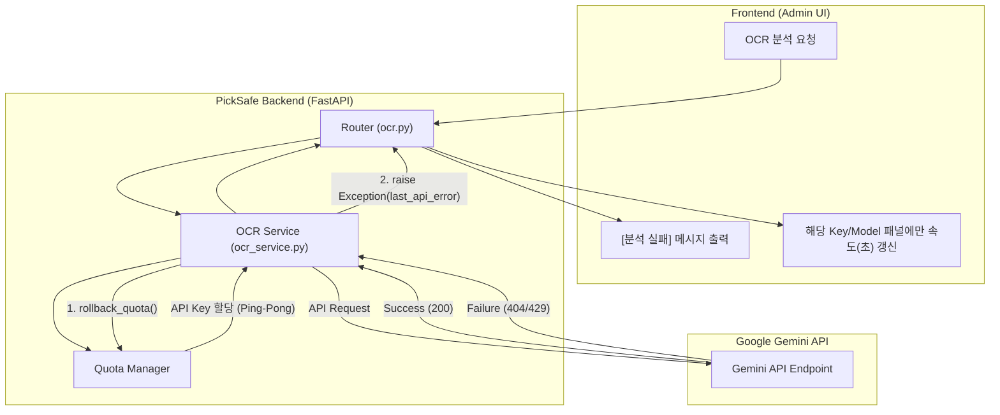

화장품 성분 분석 서비스 **PickSafe**의 백엔드를 구축하면서, 성분표 이미지 인식의 정확도와 처리 속도를 높이기 위해 Gemini OCR 다중 API 키 분산 처리(Load Balancing / Ping-Pong) 시스템을 도입했습니다. 

여러 개의 구글 API 키를 분산 활용해 처리 쿼터를 확보하고, 최신 Gemini 모델들을 유연하게 테스트하려는 목적이었습니다. 하지만 로컬 및 테스트 환경에서 지원하지 않는 커스텀 모델(예: `Gemini 3.5 Flash-Lite` 등)을 호출하거나 네트워크 파이프라인에서 간헐적 에러가 발생할 때, 예상치 못한 백엔드 및 프론트엔드 사이드 임팩트가 드러났습니다.

이번 글에서는 시스템 실패를 우회하려다 생긴 사이드 이펙트와, 이를 투명한 예외 처리 및 UI 타게팅 개선으로 바로잡은 트러블슈팅 과정을 정리합니다.

---

## 🎯 마주한 고민과 문제 배경

### 1. Mock 데이터 폴백이 가린 벤치마크 신뢰성
기존 백엔드 파이프라인에서는 API 호출 시 404 Not Found나 429 Too Many Requests 등의 오류가 발생하면, 사용자의 쿼터를 롤백(`rollback_quota`)한 뒤 하드코딩된 가짜(Mock) 성분 데이터("리모넨, 리날룰...")를 강제로 리턴하도록 구현되어 있었습니다. 

서비스의 셧다운을 막으려는 일종의 방어적 복구(Graceful Degradation) 장치였으나, 이는 모델 벤치마크 테스트 환경에서 치명적인 독이 되었습니다.

* API 제약이나 모델 지원 불가로 인한 실제 실패 현황이 은폐되었습니다.
* 개발 과정에서 최적의 모델 속도와 정확도를 측정할 때, Mock 데이터가 성공 결과처럼 섞여 들어와 벤치마크 데이터 전체의 신뢰도가 떨어졌습니다.

### 2. 레이아웃 오버플로우 및 UI 표출 버그
Mock 데이터 반환 사실을 알리기 위해 프론트엔드 타이틀 뱃지 영역에 `[API 실패 / Mock 폴백]`이라는 장문의 텍스트를 강제로 주입하면서 좁은 UI 영역의 레이아웃이 깨지는 오버플로우가 발생했습니다.

또한, 멀티키 핑퐁 구조에서 렌더링 타게팅 오류가 존재했습니다. 예를 들어 `Gemini 3.5 Flash` 모델이 `Key_1`로 배정되어 정상 처리되었음에도, 화면에서는 `Key_1` 패널뿐만 아니라 사용되지도 않은 `Key_2` 패널의 인식 속도(초) 타이머까지 동시에 동일한 값으로 갱신되는 프론트엔드 DOM 타게팅 버그가 있었습니다.

---

## ⚖️ 기술적 대안 비교 및 선택 이유

실패 상황을 처리하는 방식에 대해 두 가지 대안을 비교 검토했습니다.

| 비교 항목 | 대안 A: Mock 폴백 유지 + 경고 표출 (기존 방식) | 대안 B: 예외(Exception) 투명성 확보 및 명시적 실패 리턴 (선택) |
| :--- | :--- | :--- |
| **시스템 투명성** | 🔴 낮음 (가짜 데이터로 실패 은폐) | 🟢 높음 (발생한 에러 원인을 적나라하게 표출) |
| **벤치마크 데이터 신뢰도** | 🔴 저하 (모델별 실제 성능 측정 불가능) | 🟢 우수 (정확한 성공률 및 실패 원인 수집 가능) |
| **UI/UX 안정성** | 🔴 레이아웃 오버플로우 발생 위험 | 🟢 정돈된 에러 박스 표출로 레이아웃 보존 |
| **쿼터 관리** | 🟢 쿼터 롤백 수행 | 🟢 쿼터 롤백 수행 + 차감 데이터 보정 |

결론적으로, 벤치마크와 관리자 기능에서는 **"잘못된 성공 정보보다 명확한 실패 정보가 훨씬 가치 있다"**는 판단하에 **대안 B**를 선택했습니다. 에러를 은폐하는 대신 예외를 명시적으로 `raise`하고, 프론트엔드는 정해진 영역 내에서 이를 정갈하게 보여주는 구조로 전환했습니다.

---

## 🏗️ 시스템 아키텍처 및 흐름

개선된 OCR 처리 및 예외 전달, 그리고 프론트엔드 패널 타게팅 흐름은 다음과 같습니다.



---

## 💻 핵심 구현 및 트러블슈팅

### 1. 백엔드: Mock 데이터 제거 및 명시적 예외 처리
`web/backend/app/services/ocr_service.py`에서 루프 실패 시 관습적으로 남아있던 Mock 데이터 반환 코드를 제거하고, 발생한 에러 원인을 상위 라우터로 명확히 전파하도록 변경했습니다.

```python
# web/backend/app/services/ocr_service.py

# ... API 키 로드밸런싱 및 루프 처리 ...
for key_info in available_keys:
    try:
        # API 호출 및 처리
        result = call_gemini_api(key_info, image_data)
        return result
    except Exception as e:
        # 실패 시 해당 키의 사용 쿼터 롤백
        self.quota_manager.rollback_quota(key_info.key_name)
        last_api_error = str(e)
        continue

# [개선] 기존: 하드코딩된 Mock 데이터 반환
# return {"ingredients": "리모넨, 리날룰...", "is_mock": True}

# [개선] 변경: 실패 원인을 투명하게 전파하기 위해 예외 강제 발생
raise Exception(f"API 호출 실패: {last_api_error}")
```

라우터(`ocr.py`)에서는 해당 예외를 캐치하여 사용자가 보는 텍스트 상자에 `[분석 실패] ...` 메시지를 전달하도록 구성했습니다.

### 2. 프론트엔드: UI 클린업 및 실시간 쿼터 속도 표출 타게팅 픽스
`web/frontend/static/js/admin/ocr.js`에서 발생하던 두 가지 UI 문제를 해결했습니다.

#### A. 뱃지 텍스트 간소화
타이틀 영역 레이아웃을 파괴하던 불필요한 에러 뱃지 로직을 제거하고, 사용된 키를 표시하는 뱃지 문구를 축약했습니다.
* 기존: `[사용 Key: Key_1]`
* 변경: **`[Key_1]`**

#### B. `data-key` 속성을 활용한 DOM 타게팅 버그 수정
기존에는 `data-model` 속성으로만 DOM 요소를 탐색했기 때문에, 동일한 모델명을 가진 모든 Key 패널의 속도 텍스트가 동시에 바뀌는 버그가 있었습니다. 이를 해결하기 위해 HTML 카드를 동적으로 그릴 때 `data-key` 속성을 명시하고, 업데이트 시 두 속성을 동시에 검증하도록 수정했습니다.

```javascript
// 1. 쿼터 카드 동적 생성 시 data-key 명시
function createQuotaCard(modelName, keyName) {
    return `
        <div class="quota-card">
            <span class="model-name">${modelName}</span>
            <div class="model-time" data-model="${modelName}" data-key="${keyName}">
                - 초
            </div>
        </div>
    `;
}

// 2. updateQuotaTimeUI 헬퍼 함수 타게팅 개선
function updateQuotaTimeUI(modelName, keyUsed, elapsedTime) {
    // [개선] data-model과 data-key가 모두 일치하는 단일 요소만 타게팅
    const selector = `.model-time[data-model="${modelName}"][data-key="${keyUsed}"]`;
    const targetElements = document.querySelectorAll(selector);

    targetElements.forEach(el => {
        el.textContent = `${elapsedTime}초`;
    });
}
```

---

## 💡 돌아보며 배운 점 (회고)

### 1. 복구 전략(Fallback)의 성격 구분
사용자 대상의 서비스 프로덕션 환경에서는 Mock 데이터나 캐시 데이터를 보여주는 Graceful Degradation이 유효한 UX 전략일 수 있습니다. 하지만 시스템의 실제 성능과 에러율을 측정해야 하는 **관리자/벤치마크 도구에서는 은폐된 복구 전략이 시스템의 통찰을 방해**한다는 점을 깨달았습니다. 상황에 따라 예외를 적나라하게 드러내는 것이 오히려 더 건강한 설계일 수 있습니다.

### 2. UI 상태와 백엔드 콘텍스트의 동기화
멀티 키/멀티 모델과 같이 다차원 상태를 시각화할 때는 DOM 요소의 식별자 역시 그 차원(Key + Model)을 모두 반영해야 합니다. 단일 식별자(`data-model`)만으로 DOM을 조작하다가 발생한 타게팅 버그를 복기하며, 프론트엔드 상태 표현 구조를 백엔드의 데이터 모델만큼이나 꼼꼼하게 설계해야 함을 다시 한번 배웠습니다.

이번 개선을 통해 백엔드는 예외 상황을 숨기지 않는 단단함을 갖추게 되었고, 프론트엔드는 트래픽이 어떤 키로 분산되어 얼마의 속도로 처리되는지 투명하게 시각화할 수 있게 되었습니다.