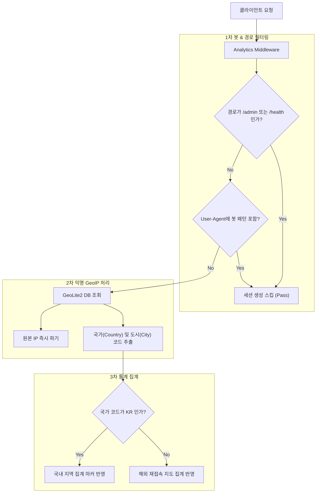

화장품 성분 분석 서비스인 **PickSafe**를 개발하면서 세워두었던 기존 방문자 분석 체계를 전면 재검토하고 고도화하는 작업을 진행했습니다. 

초기 설계 단계에서는 "방한 외국인 관광객이 한국 현지 통신망(SIM/eSIM)을 사용하는 동안에는 IP 기반 위치(GeoIP)가 어차피 한국으로 잡힌다"는 이유로 IP 기반 국가 판별을 의도적으로 제외했습니다. 하지만 서비스 범위가 확장되고 브라질 대상 파일럿 등을 준비하면서 새로운 질문이 생겼습니다. **"한국 여행을 마치고 자국으로 돌아간 사용자가 귀국 후에도 PickSafe를 계속 이용하는가?"**

이 질문에 답하기 위해서는 역설적으로 기존에 배제했던 GeoIP 판별이 다시 필요해졌습니다. 귀국한 사용자는 자국 통신망으로 접속하므로 이 시점의 IP는 매우 정확한 신호가 되기 때문입니다. 이와 더불어 통계 데이터의 신뢰도를 저해하던 내부 봇 트래픽을 정제하는 작업을 함께 진행했습니다.

---

## 🎯 마주한 고민과 문제 배경

### 1. 봇 트래픽으로 인한 통계 오염 (Garbage In, Garbage Out)
실제 유저 세션을 시각화하기에 앞서 DB 로그를 실측해보니, 기기 및 OS 분포 통계에서 **"Unknown / Other" 비율이 90%를 상회하는 기현상**이 발생했습니다. 

원인을 분석해 보니 세션 기록 미들웨어가 아래와 같은 비브라우저 트래픽까지 전부 세션으로 수집하고 있었습니다.
- 식약처 성분 데이터 수집 스케줄러 (`python-requests`)
- 서버 호스팅 환경(Render)의 슬립 방지 헬스체크 핑 (`curl`)
- 어드민 내부 페이지(`/admin/*`) 작업 트래픽

이러한 가상 세션을 정제하지 않고 시각화 차트를 만드는 것은 무의미했기에, 데이터 수집 레이어 자체에서 오염 원인을 제거하는 작업이 선행되어야 했습니다.

### 2. IP 저장 없는 국가/도시 단위 재접속 추적
개인정보 보호 원칙상 **사용자의 원본 IP 주소를 DB에 저장하거나 어드민 화면에 노출하는 것은 금지**했습니다. 
따라서 원본 IP를 저장하지 않으면서도, "해외 통신망을 통한 세션 접속"만을 식별하여 국가 및 도시 단위로 집계할 수 있는 경량화된 구조가 필요했습니다.

---

## ⚖️ 기술적 대안 비교 및 선택 이유

### 봇 필터링: DB 조회 시 필터링 vs 미들웨어 상단 차단

| 비교 항목 | DB 집계 시 필터링 (Query-time) | 미들웨어 상단 차단 (Ingestion-time) |
| :--- | :--- | :--- |
| **처리 방식** | 일단 모든 요청을 DB에 저장 후 SQL `WHERE`로 제외 | 세션 생성 단계에서 User-Agent 검사 후 무시 |
| **장점** | 원본 로그가 보존되어 원인 분석에 유리 | DB 쓰기 부하가 감소하고 데이터 원장이 깨끗함 |
| **단점** | DB 데이터량이 폭증하며 집계 쿼리 성능 저하 | 필터링 조건 변경 시 과거 데이터 복구 불가능 |
| **선택** | ❌ | **선택 (Adopted)** |

**선택 이유**: 헬스체크 및 스케줄러 핑은 서비스 분석 관점에서 의미가 전혀 없는 순수 노이즈 데이터입니다. 복잡한 봇 탐지 머신러닝 라이브러리를 도입하는 대신, 미들웨어 단에서 하드코딩된 UA 패턴 문자열 매칭(`python-requests`, `curl`, `axios` 등) 및 경로 매칭(`/admin/*`, `/health`)을 통해 **아예 세션 엔티티를 생성하지 않는 방식**을 선택했습니다.

### GeoIP 처리 및 지적 표시 분리

1. **MaxMind GeoLite2 오프라인 DB 활용**: 외부 API 호출에 따른 지연 시간(Latency) 부담을 없애기 위해 내장형 `.mmdb` 파일 기반 조회를 선택했습니다.
2. **국내/해외 지도 분리**: 
   - 국내 접속(`KR`) 데이터는 마케팅/제휴 참고용 도시/구 단위 지도로 분리했습니다.
   - 해외 접속(비 `KR`) 데이터는 "귀국 후 재사용(Retention)" 성과 측정용 지도로 분리했습니다.
   - 단일 지도로 합칠 경우 국내 데이터의 압도적인 물량으로 인해 해외 재접속 신호가 묻히는 현상을 방지했습니다.

---

## 🏗️ 시스템 아키텍처 및 흐름

요청 처리 미들웨어에서 봇 트래픽을 선제 차단하고, IP를 익명화된 지리 정보로 변환하여 세션 통계에 합산하는 데이터 흐름입니다.



---

## 💻 핵심 구현 및 트러블슈팅

### 1. 세션 미들웨어 상의 봇 및 어드민 경로 필터링

요청 유입 시 가장 먼저 실행되는 미들웨어에 제외 대상을 정의하여 세션 생성을 방지했습니다.

```python
# app/middleware/analytics.py
import re
from fastapi import Request

# 알려진 스케줄러, 크롤러 및 HTTP 클라이언트 UA 패턴
BOT_UA_PATTERNS = re.compile(
    r"(python-requests|curl|axios|httpx|Go-http-client|cron-job\.org|Render)",
    re.IGNORECASE
)

EXCLUDED_PATHS = ["/health", "/docs", "/openapi.json"]

async def analytics_middleware(request: Request, call_next):
    path = request.url.path
    user_agent = request.headers.get("user-agent", "")

    # 1. 어드민 경로 및 시스템 엔드포인트 제외
    if path.startswith("/admin") or any(path.startswith(p) for p in EXCLUDED_PATHS):
        return await call_next(request)

    # 2. 비브라우저/봇 UA 패턴 제외
    if not user_agent or BOT_UA_PATTERNS.search(user_agent):
        return await call_next(request)

    # 3. 검증된 사용자 요청에 한해서만 세션 기록 로직 진행
    # ... (GeoIP 추출 및 익명 세션 집계)
    
    response = await call_next(request)
    return response
```

### 2. IP 익명화 처리와 MaxMind GeoLite2 연동

IP 주소를 데이터베이스에 남기지 않고, 메모리 내에서 즉시 지리적 명칭으로 변환하도록 작성했습니다. 환경 변수(`SETTINGS.GEOIP_DB_PATH`)를 사용해 시크릿 경로를 추상화했습니다.

```python
# app/services/geoip.py
import geoip2.database
from app.core.config import SETTINGS

class GeoIPService:
    def __init__(self):
        # 보안을 위해 DB 경로는 환경 변수로 관리
        self.reader = geoip2.database.Reader(SETTINGS.GEOIP_DB_PATH)

    def get_location_summary(self, ip_address: str) -> dict:
        """
        IP 주소를 받아 국가 및 도시 정보만 반환하고, IP 자체는 보관하지 않음.
        """
        try:
            response = self.reader.city(ip_address)
            return {
                "country_code": response.country.iso_code or "UNKNOWN",
                "city_name": response.city.name or "UNKNOWN",
            }
        except Exception:
            return {"country_code": "UNKNOWN", "city_name": "UNKNOWN"}
```

### 트러블슈팅: 모바일 데이터(LTE/5G) 접속 시 서울 쏠림 현상

**문제 현상**: 국내 지역 지도를 구축한 후 테스트 데이터를 수집해보니, 지방에서 접속한 모바일 기기 세션 다수가 서울 서초구/중구 등으로 집계되는 현상이 관찰되었습니다.

**원인 분석**: 모바일 이동통신망(LTE/5G) 접속 시, 통신사의 무선 코어망 게이트웨이(P-GW) IP가 서울 본사 기지국 관문으로 배치되어 나타나는 GeoIP 자체의 기술적 한계였습니다.

**해결 방안**: 
- 해당 지표는 정밀한 위치 추적 용도가 아닌 **"전반적인 사용자 유입 지역의 방향성 참고용"** 데이터임을 어드민 UI에 명확한 뉘앙스로 명시했습니다.
- 시스템적으로는 사용자 좌표를 정밀 추적(Pinpoint)하는 방식을 철저히 배제하고, **국가/도시 단위의 세션 수 수치만 더해지는 집계 마커(Aggregate Marker)** 방식으로 시각화를 제한하여 정확도 왜곡에 따른 오해를 방지했습니다.

---

## 💡 돌아보며 배운 점 (회고)

### 1. 기술적 제약의 유효기간은 맥락에 따라 달라진다
초기에는 "관광객의 한국 현지 통신망 이용" 때문에 GeoIP 도입을 철회했었습니다. 그러나 **"귀국 후 재사용 검증"**이라는 새로운 기획적 요구사항이 들어왔을 때, 이전의 기술적 제약(현지 통신망 IP 불일치)은 자연스럽게 해소되었습니다. 과거에 기각했던 기술 요소라도 서비스가 서 있는 맥락이 바뀌면 다시 유효한 솔루션이 될 수 있음을 배웠습니다.

### 2. 겉모습(시각화)보다 파이프라인의 순도가 우선이다
차트와 지도를 아무리 수려하게 구현하더라도, 정제되지 않은 데이터가 유입되면 대시보드는 잘못된 의사결정을 유도하는 도구로 전락합니다. 미들웨어 단에서 봇 트래픽을 단호하게 필터링한 덕분에, 기기 및 OS 분포에서 "Unknown" 비중이 정상 범위로 감소했고 시각화 지표의 신뢰성을 확보할 수 있었습니다.

### 3. 개인정보 보호와 분석 목적의 균형
원본 IP를 저장하지 않고 통계성 집계 마커 형태만 남김으로써, 개인정보 노출 리스크를 원천 차단하면서도 비즈니스 요구사항(해외 유입 및 retention 파악)을 완벽히 만족시킬 수 있었습니다. 추후 시각화 요소를 확장할 때도 이 익명화 원칙을 일관되게 유지할 계획입니다.