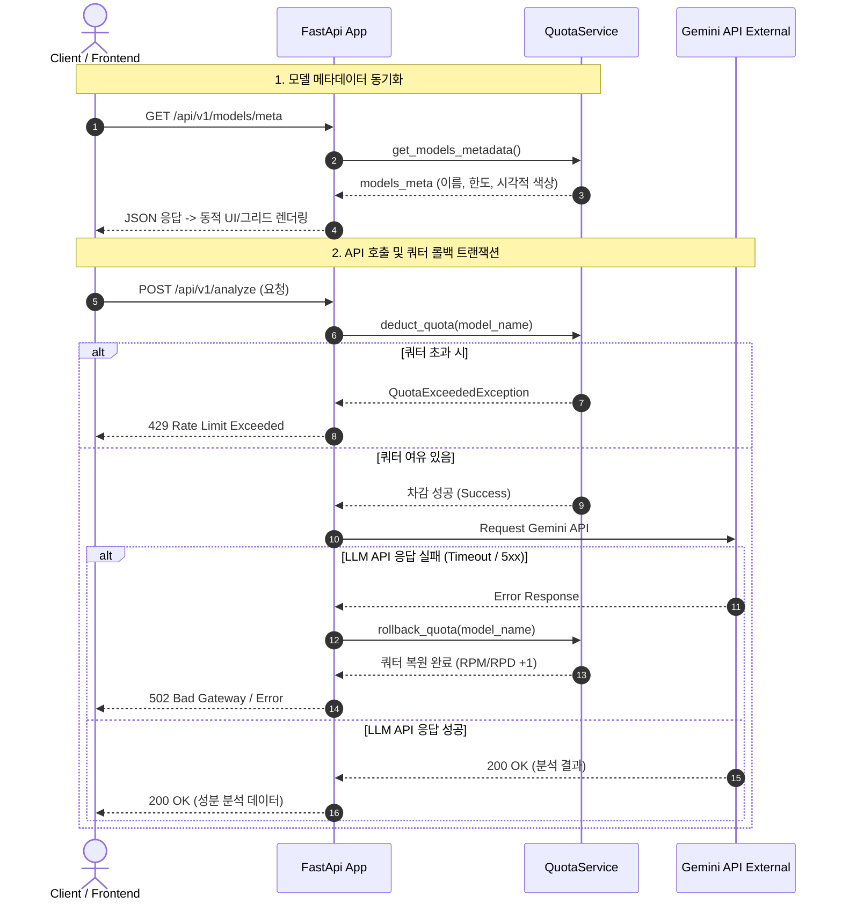

화장품 성분 분석 서비스인 PickSafe에서는 성분표 OCR 추출, 다국어 번역, 위험도 분석 등 핵심 로직 상당 부분을 Gemini LLM API에 의존하고 있습니다. 

API 호출 비용과 제한(Limit)을 제어하기 위해 백엔드에서 멀티 API 키 로드밸런싱과 쿼터 차감 로직을 운용해왔지만, 서비스 기능이 확장되면서 백엔드와 프론트엔드 간의 데이터 불일치 및 쿼터 추적 오류 등 기술적 부채가 수면 위로 올라왔습니다.

이 글에서는 파편화된 모델 설정 정보를 단일 진실 소스(Single Source of Truth)로 통합하고, API 오류 발생 시 쿼터 정합성을 보장하기 위한 롤백 메커니즘을 구축했던 과정과 프론트엔드 비동기 동기화 문제를 해결한 경험을 기록합니다.

---

## 🎯 마주한 고민과 문제 배경

운영 모니터링을 진행하면서 크게 세 가지 영역에서 구조적인 문제를 마주했습니다.

### 1. 프론트엔드-백엔드 간 메타데이터 파편화
OCR 성능 테스트, 통계 대시보드, 번역 관리, 인프라 모니터링 등 각 화면마다 사용되는 Gemini 모델의 표시 순서와 시각적 배색(Hex Color) 정보가 프론트엔드 스크립트(`ocr.js`, `translations.js`, `infra.js`) 곳곳에 하드코딩되어 있었습니다. 
جديد 모델이 출시되거나 특정 모델이 Deprecated될 때마다 백엔드 코드뿐만 아니라 프론트엔드의 여러 JS 파일을 일일이 찾아서 수정해야 했고, 이 과정에서 페이지별로 렌더링 색상이나 모델명이 달라지는 시각적 통일성 저하가 발생했습니다.

### 2. API 호출 실패 시 쿼터 낭비 및 추적 정합성 결여
Gemini API 호출 시 선제적으로 일일 한도(RPD)와 분당 한도(RPM)를 차감하도록 구현되어 있었습니다. 그러나 외부 API 서버의 순간적인 타임아웃(504)이나 500 번대 내부 에러로 인해 실제 응답을 받지 못한 경우에도 차감된 쿼터가 복원되지 않았습니다. 결과적으로 시스템이 기록하는 잔여 쿼터와 실제 사용 가능한 쿼터 간의 오차가 지속적으로 벌어졌습니다.

### 3. 프론트엔드 경쟁 상태(Race Condition) 및 레이아웃 깨짐
번역 관리 페이지 초기화 과정에서 언어 설정(`loadLocaleSettings`) 데이터 로드가 완료되기 전에 테이블 렌더링 함수가 실행되어 빈 화면이 노출되는 간헐적 버그가 있었습니다. 또한 인프라 쿼터 모니터링 카드가 화면 해상도에 따라 3개 또는 1개씩 제멋대로 가변 렌더링되어 대시보드의 정렬이 깨지는 문제가 있었습니다.

---

## ⚖️ 기술적 대안 비교 및 선택 이유

### 1. 모델 메타데이터 관리 방식

| 구분 | 대안 A: DB 테이블 관리 | 대안 B: 프론트엔드 상수 관리 | 대안 C: 백엔드 SSOT + `.env` 동적 구성 (선택) |
| :--- | :--- | :--- | :--- |
| **장점** | 관리자 UI에서 완벽한 가변 제어 가능 | 백엔드 호출 없이 빠름 | 코드 재배포 없이 환경변수만으로 제어 가능, 런타임 오버헤드 최적 |
| **단점** | 단순 구성 정보 조회에 DB I/O 발생 | 모델 변경 시 프론트엔드 빌드/배포 필수, 파편화 위험 | 환경변수 포맷 파싱 로직 필요 |
| **선택 이유** | 모델 메타데이터는 변경 주기가 길어 DB 저장까지는 과도함 | 유지보수성이 떨어지고 동기화 불일치 재발 | 백엔드를 단일 진실 소스로 삼고 API로 프론트엔드에 전달하는 방식이 가장 정갈함 |

백엔드 `quota_service.py` 내의 `AVAILABLE_MODELS` 구조체를 **단일 진실 소스(SSOT)**로 정의하고, 시스템 환경변수(`GEMINI_MODELS_CONFIG`)를 통해 소스 코드 수정 없이도 모델 목록, RPM/RPD 한도, 시각적 브랜드 색상을 동적으로 재구성할 수 있도록 결정했습니다.

### 2. 쿼터 차감 정합성 보장 방식

* **대안 A: API 응답 성공 후 차감 (Post-deduction)**
  * *문제점*: 동시 요청이 몰릴 경우 순간적으로 RPM/RPD 한도를 초과하여 Gemini API 측에서 `429 Too Many Requests` 에러를 반환할 위험이 큼.
* **대안 B: 선 차감 후 실패 시 롤백 (Pre-deduction with Rollback) — 선택**
  * *장점*: 임계 영역(Critical Section) 이전에 한도를 체킹하여 과도한 요청을 즉시 차단할 수 있으며, API 호출 실패 시 차감분을 원상 복구하므로 정합성이 보장됨.

---

## 🏗️ 시스템 아키텍처 및 흐름

개선된 시스템은 백엔드 중심의 설정 전달 및 쿼터 차감/롤백 트랜잭션 흐름을 갖습니다.



---

## 💻 핵심 구현 및 트러블슈팅

### 1. 백엔드 단일 진실 소스(SSOT) 및 환경변수 주입

`quota_service.py`에 모델 정보를 일원화하고, Gemini 브랜드 정체성을 반영한 색상을 기본 할당했습니다. 환경변수 `GEMINI_MODELS_CONFIG`가 존재할 경우 코드 변경 없이 동적으로 덮어쓰도록 구현했습니다.

```python
# quota_service.py
import os
import json
import logging

logger = logging.getLogger(__name__)

# 기본 시그니처 모델 및 제미나이 브랜드 색상 매핑
DEFAULT_AVAILABLE_MODELS = [
    {
        "id": "gemini-3.5-flash-lite",
        "name": "Gemini 3.5 Flash-Lite",
        "rpm": 30,
        "rpd": 1500,
        "color": "#2563eb" # Gemini Deep Blue
    },
    {
        "id": "gemini-3.5-flash",
        "name": "Gemini 3.5 Flash",
        "rpm": 15,
        "rpd": 1500,
        "color": "#9333ea" # Gemini Purple
    },
    {
        "id": "gemini-3.6-flash",
        "name": "Gemini 3.6 Flash",
        "rpm": 15,
        "rpd": 1500,
        "color": "#ec4899" # Gemini Pink
    },
    {
        "id": "gemini-3.1-flash-lite",
        "name": "Gemini 3.1 Flash-Lite (Backup)",
        "rpm": 15,
        "rpd": 1500,
        "color": "#f59e0b" # Gemini Orange
    }
]

class QuotaService:
    def __init__(self):
        self.models = self._load_model_configurations()

    def _load_model_configurations(self):
        # 환경변수에서 동적 설정 로드 (보안 및 유연성 확보)
        env_config = os.getenv("GEMINI_MODELS_CONFIG")
        if env_config:
            try:
                return json.loads(env_config)
            except json.JSONDecodeError as e:
                logger.error(f"Failed to parse GEMINI_MODELS_CONFIG: {e}")
        return DEFAULT_AVAILABLE_MODELS

    def get_models_metadata(self):
        """프론트엔드 UI 렌더링에 전달할 메타데이터 구조화"""
        return [
            {
                "model_id": m["id"],
                "display_name": m["name"],
                "color": m["color"],
                "limits": {"rpm": m["rpm"], "rpd": m["rpd"]}
            }
            for m in self.models
        ]
```

### 2. 쿼터 롤백 로직 적용

API 호출 실패 시 차감된 쿼터를 원상 복구하는 context manager 패턴 형태의 롤백 로직을 추가했습니다.

```python
# quota_service.py (이어서)

class QuotaService:
    # ... 이전 코드 ...

    def deduct_quota(self, model_id: str) -> bool:
        """쿼터 선 차감 로직"""
        # (메모리 내 Redis 또는 인메모리 쿼터 상태 차감 처리)
        logger.info(f"[Quota Deducted] Model: {model_id}")
        return True

    def rollback_quota(self, model_id: str):
        """API 호출 실패 시 쿼터 복원 로직"""
        # RPD 및 RPM 차감분 원복
        logger.warning(f"[Quota Rollback] Restoring quota for model: {model_id}")
        self._increment_rpd(model_id, amount=1)
        self._increment_rpm(model_id, amount=1)

# api_router.py
@router.post("/analyze")
async def analyze_ingredients(payload: AnalyzeRequest):
    model_id = payload.model_id
    
    # 1. 쿼터 선 차감
    if not quota_service.deduct_quota(model_id):
        raise HTTPException(status_code=429, detail="Quota Exceeded")

    try:
        # 2. 외부 LLM API 호출
        result = await gemini_client.generate_content(model=model_id, prompt=payload.prompt)
        return {"status": "success", "data": result}
        
    except Exception as exc:
        # 3. 예외 발생 시 쿼터 롤백 수행
        logger.error(f"Gemini API call failed: {exc}. Initiating rollback.")
        quota_service.rollback_quota(model_id)
        raise HTTPException(status_code=502, detail="External API Failure")
```

### 3. 프론트엔드 비동기 동기화 및 레이아웃 통일

`translations.js`에서 발생하던 Race Condition 문제는 언어 자원 로드 단계를 `async/await`로 명확히 대기하도록 보완했습니다.

```javascript
// translations.js
document.addEventListener('DOMContentLoaded', async () => {
    try {
        // [Fix] 언어 설정 로드가 완전히 끝난 후 테이블을 렌더링하도록 흐름 제어
        await loadLocaleSettings();
        await renderTranslationTable();
    } catch (error) {
        console.error("Failed to initialize translation view:", error);
    }
});

async function renderTranslationTable() {
    // 백엔드 단일 진실 소스로부터 메타데이터 수신
    const response = await fetch('/api/v1/models/meta');
    const modelsMeta = await response.json();
    
    // 모델 드롭다운 콤보박스 및 색상 동적 배치
    buildModelSelectDropdown(modelsMeta);
}
```

또한 인프라 대시보드의 카드 배치가 들쭉날쭉하던 현상은 CSS Grid 속성을 2 컬럼 고정 레이아웃으로 명시하여 모든 모니터링 페이지에서 균일한 2x2 형태의 카드가 출력되도록 수정했습니다.

```css
/* infra_monitoring.css */
.quota-card-container {
    display: grid;
    /* 해상도 제약 내에서 정갈한 2x2 그리드 유지 */
    grid-template-columns: repeat(2, 1fr);
    gap: 1.5rem;
}
```

---

## 💡 돌아보며 배운 점

이번 개편 과정은 대규모 신규 기능을 만드는 작업은 아니었으나, 시스템 내에 쌓여있던 운영 상의 불안정 요소를 제거하는 중요한 계기가 되었습니다.

1. **상수의 중앙 집권화(SSOT)가 가져다준 생산성**  
   기존에는 차세대 모델(예: Gemini 3.7 등)이 추가되면 프론트엔드 코드 전반을 수색하듯 수정해야 했습니다. 이제는 백엔드 메타데이터 배열 또는 `.env` 설정 단 한 줄 수정만으로 모든 웹 페이지의 드롭다운, 모니터링 그래프 색상, 쿼터 제한 수치가 자동 동기화됩니다.

2. **트랜잭션 정합성의 가치**  
   네트워크 불안정이나 외부 API의 일시적 장애가 발생했을 때 쿼터를 복원해 줌으로써, 대시보드의 쿼터 모니터링 그래프가 실제 사용량과 정확히 일치하게 되었습니다. 단순한 '차감' 로직 뒤에 '예외 시 보상(Rollback)' 로직을 배치하는 것이 시스템 신뢰도에 얼마나 큰 차이를 만드는지 재확인했습니다.

3. **비동기 흐름 명시의 중요성**  
   프론트엔드에서의 비동기 처리 생략(`await` 누락)은 개발 환경에서는 쉽게 발견되지 않다가 네트워크 지연이 발생하는 환경에서 빈 화면을 만들어냅니다. 데이터 의존성이 존재하는 초기화 로직은 반드시 순차적 흐름을 보장하도록 설계해야 함을 다시금 되새기게 되었습니다.

앞으로는 쿼터 상태를 인메모리보다 유연하게 관리할 수 있도록 Redis 기반의 Token Bucket 알고리즘으로 고도화하는 작업을 검토해볼 예정입니다.