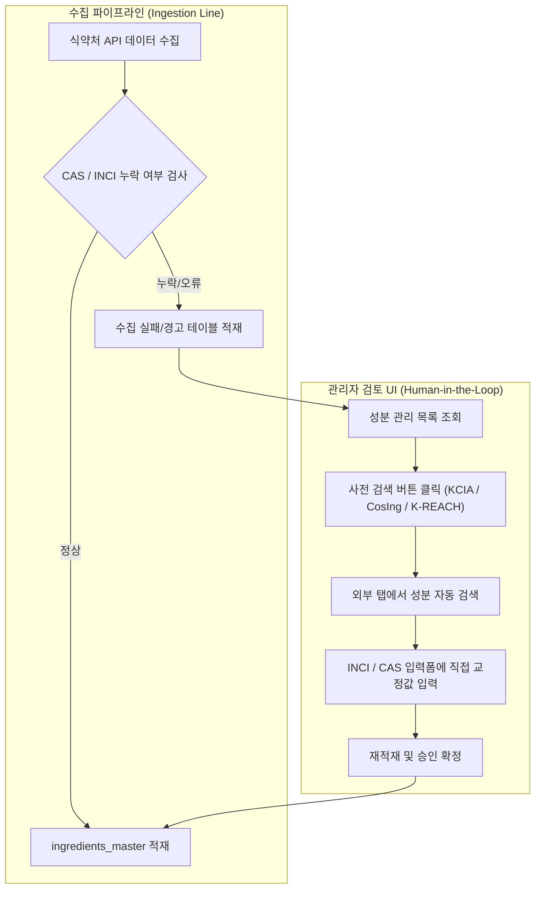

식약처 공공데이터를 기반으로 성분 안전성 정보를 분석하는 PickSafe를 개발하면서, 수집 데이터의 누락된 결합키(CAS 번호, 영문 INCI명)를 어떻게 신뢰성 있게 보강할 것인가에 대한 문제에 마주했습니다. 

단순히 외부 데이터 원천을 더 많이 붙이고 자동 매칭을 확대하면 해결될 것으로 생각했으나, 데이터 무결성 검증 과정에서 예상치 못한 한계를 발견하고 계획을 전면 백지화하는 과정을 거쳤습니다. 이 글은 외부 데이터 연동 과정에서 겪은 기술적 고민과 완전 자동화를 포기하고 수동 검토 도구를 고도화하기로 결정한 엔지니어링 의사결정 기록입니다.

---

## 🎯 마주한 고민과 문제 배경

식약처 성분 데이터베이스를 수집해 파이프라인을 태우다 보면 복합 성분이나 식물 추출물 등 약 10여 건 이상의 주요 성분에서 영문 INCI명이나 CAS 번호가 누락되어 들어오는 현상이 발생했습니다.

```text
[입력 데이터 예시]
- 성분명: 2-알킬-N-카복시메틸-N-하이드록시에틸이미다졸리늄베타인
- 식약처 CAS: (미제공)
- 식약처 INCI: (미제공)
```

이러한 식별자의 누락은 해외 규제 DB나 학술 논문 데이터베이스와의 매핑을 불가능하게 만들어 분석 서비스의 신뢰도를 떨어뜨립니다. 기존에는 대한화장품협회(KCIA) 웹 사이트를 실시간 스크래핑하여 보강하는 방식을 사용했으나 다음과 같은 한계가 있었습니다.

1. **실시간 스크래핑의 불확실성:** 검색 결과의 첫 번째 항목을 자동 매칭하는 과정에서 유사한 이름의 전혀 다른 CAS 번호가 오매핑되는 사고가 발생했습니다.
2. **단일 소스의 한계:** KCIA 검색만으로는 보완되지 않는 특수 성분이 존재했습니다.

이에 따라 EU CosIng, 환경부 K-REACH, PCPC/wINCI 등 외부 출처를 추가로 연동하여 CAS/INCI 식별자 커버리지를 넓히고자 했습니다.

---

## ⚖️ 기술적 대안 비교 및 선택 이유

성분 보강 소스를 확장하기 위해 검토한 대상은 총 세 가지였습니다.

| 소스 | 접근 방식 | 적합성 평가 | 비고 |
| :--- | :--- | :--- | :--- |
| **EU CosIng** | 대량 파일 다운로드 후 로컬 매칭 | ⚠️ 부분 적합 | 공식 단일 덤프 미제공. 서드파티 데이터셋은 갱신 주기 불투명 |
| **K-REACH (환경부)** | 웹 검색 시스템 | ⚠️ 수동 참고용 | 유해화학물질 등록용으로 화장품 커버리지 불확실 |
| **PCPC / wINCI** | API 연동 | ❌ 도입 불가 | 고가의 연간 구독제, 무료 API 없음 |

### 초기 구상: CosIng 전체 인벤토리 로컬 캐시 구축
처음 접근한 방식은 EU CosIng 포털에서 전체 인벤토리를 다운로드 받아 `cosing_reference`라는 로컬 테이블을 구축하는 것이었습니다. 실시간 스크래핑 대신 전체 로컬 데이터를 두고 영문 INCI명 기반으로 **완전 일치(Exact Match)** 쿼리만 수행하면 network latency도 없고 잘못된 오매핑 리스크도 줄일 수 있을 것으로 기대했습니다.

```sql
-- 초기 구상했던 로컬 캐시 매칭 쿼리
SELECT cas_number, inci_name 
FROM cosing_reference 
WHERE UPPER(inci_name) = UPPER(:input_inci_name);
```

### 피봇(Pivot)과 백지화 결정 사유
그러나 구현 착수 직후 데이터 원천 조사 단계에서 결정적인 난관에 부딪혔습니다.
1. EU CosIng 공식 포털은 전체 인벤토리를 단일 파일(CSV/JSON)로 제공하는 공식 다운로드 창구를 지원하지 않았습니다.
2. 대안으로 Kaggle이나 GitHub의 서드파티 오픈소스 스크래퍼 데이터셋을 검토했으나, 데이터의 무결성과 최신 갱신 주기를 검증할 수 없었습니다.

PickSafe는 성분 안전성 정보를 다루는 서비스이므로 출처가 불분명한 데이터가 DB에 대량으로 유입되는 위험을 수용할 수 없었습니다. 따라서 **CosIng 로컬 캐시 자동 매칭 기능은 전면 백지화**하기로 결정했습니다.

대신, **자동화의 위험을 감수하는 대신 관리자의 수동 검토 생산성을 극대화하는 'Human-in-the-Loop' 구조**로 방향을 전환했습니다.

---

## 🏗️ 시스템 아키텍처 및 흐름

수집 파이프라인 안에서 위험한 자동 매칭을 수행하는 대신, 누락된 데이터는 관리자가 단 몇 번의 클릭으로 외부 소스를 조회하고 교정할 수 있도록 검토 흐름을 새로 설계했습니다.



---

## 💻 핵심 구현 및 트러블슈팅

자동화를 포기하는 대신 작업자가 어드민 UI에서 느끼는 피로도를 최소화하도록 세 가지 핵심 기능을 구현했습니다.

### 1. K-REACH 및 외부 사전 수동 검색 분기 로직
검색 버튼 클릭 시 영문 INCI명이 존재하면 영문명으로, 없을 경우 국문 성분명으로 외부 검색 쿼리를 자동 분기하도록 구성했습니다.

```typescript
// 어드민 UI: 외부 사전 검색 URL 생성 함수
export const getExternalSearchUrl = (
  source: 'KCIA' | 'CosIng' | 'KREACH',
  ingredient: { nameKr: string; nameEn?: string }
): string => {
  const query = ingredient.nameEn && ingredient.nameEn.trim() !== '' 
    ? ingredient.nameEn 
    : ingredient.nameKr;

  const encodedQuery = encodeURIComponent(query);

  switch (source) {
    case 'KCIA':
      return `https://kcia.or.kr/cid/search/ingd_list.asp?search_word=${encodedQuery}`;
    case 'CosIng':
      return `https://ec.europa.eu/growth/tools-databases/cosing/index.cfm?fuseaction=search.results&keyword=${encodedQuery}`;
    case 'KREACH':
      return `https://kreach.mcee.go.kr/portal/chemdata/chemdataList.do?searchWord=${encodedQuery}`;
    default:
      return '#';
  }
};
```

### 2. INCI 및 CAS 동시 교정 입력 폼 제공
기존에는 CAS 번호만 수정할 수 있었으나, INCI 영문명이 비어있는 성분들을 위해 양방향 수정 모듈을 어드민 백엔드 API와 프론트엔드 테이블에 반영했습니다.

```python
# FastAPI 어드민 성분 재적재 스키마 및 엔드포인트
class IngredientCorrectionRequest(BaseModel):
    ingredient_id: int
    corrected_cas_number: Optional[str] = Field(None, regex=r"^\d{2,7}-\d{2}-\d$")
    corrected_inci_name: Optional[str] = None
    reason: str

@router.post("/admin/ingredients/correct-and-retry")
async def correct_and_retry_ingredient(
    payload: IngredientCorrectionRequest,
    db: AsyncSession = Depends(get_db_session)
):
    ingredient = await db.get(IngredientMaster, payload.ingredient_id)
    if not ingredient:
        raise HTTPException(status_code=404, detail="성분을 찾을 수 없습니다.")
    
    if payload.corrected_cas_number:
        ingredient.cas_number = payload.corrected_cas_number
        ingredient.cas_source = "manual_admin_correction"
        
    if payload.corrected_inci_name:
        ingredient.inci_name = payload.corrected_inci_name

    ingredient.status = "APPROVED"
    await db.commit()
    return {"status": "success", "ingredient_id": ingredient.id}
```

### 3. 테이블 레이아웃 및 텍스트 찢어짐(Vertical Tearing) 방지
어드민 UI 테이블 내에 폼 입력창과 여러 개의 검색 버튼이 추가되면서 화면 폭이 좁아질 때 글자가 세로로 깨지거나 버튼 레이아웃이 상하로 안 맞게 틀어지는 프론트엔드 이슈가 있었습니다.

이를 방지하기 위해 CSS 그리드와 최소 너비(`min-width`), `flex-wrap`을 적용하여 가로 스크롤 방어선을 구축했습니다.

```css
/* 성분 관리 테이블 셀 최적화 */
.ingredient-table-container {
  overflow-x: auto;
  white-space: nowrap;
}

.cell-reason { min-width: 200px; flex-shrink: 0; }
.cell-name-kr { min-width: 160px; font-weight: 600; }
.cell-inci-en { min-width: 180px; font-style: italic; }

.search-button-group {
  display: flex;
  gap: 4px;
  flex-wrap: wrap; /* 창이 좁아지면 자연스럽게 2줄 배열 */
}
```

---

## 💡 돌아보며 배운 점 (회고)

### 1. 자동화가 항상 정답은 아니다
엔지니어로서 가장 먼저 든 생각은 "외부 데이터를 어떻게든 가져와 자동 매칭 스크립트를 짜자"였습니다. 하지만 데이터 원천의 신뢰성이 확보되지 않은 상태에서의 자동화는 잘못된 정보를 서비스 전체로 확산시키는 독이 될 수 있습니다. **안전성과 규제 관련 서비스에서는 어설픈 자동화보다 명확한 수동 검토 레이어를 두는 것이 훨씬 유효한 선택**임을 배웠습니다.

### 2. 검토 도구의 UX 개선이 가져다준 이점
자동 매칭 기능은 백지화되었지만, K-REACH 링크 추가, INCI 입력창 제공, 테이블 레이아웃 최적화를 진행한 결과 관리자가 성분 1건을 검토하고 교정하는 시간이 크게 단축되었습니다. 파이프라인 외부에서의 수동 개입 단계를 쾌적하게 만드는 것 역시 파이프라인의 전체 성능을 올리는 방법 중 하나였습니다.

### 3. 향후 과제
현재는 수동 교정을 통해 신뢰성을 확보하고 있으나, 추후 EU CosIng 포털에서 공식적인 REST API나 주기적 데이터 덤프를 제공하게 되거나 국내 화장품 성분 사전의 공식 API가 열린다면, 그때 엄격한 완전 일치 검증 규칙을 적용해 로컬 캐시 자동 매칭을 재검토해 볼 계획입니다.