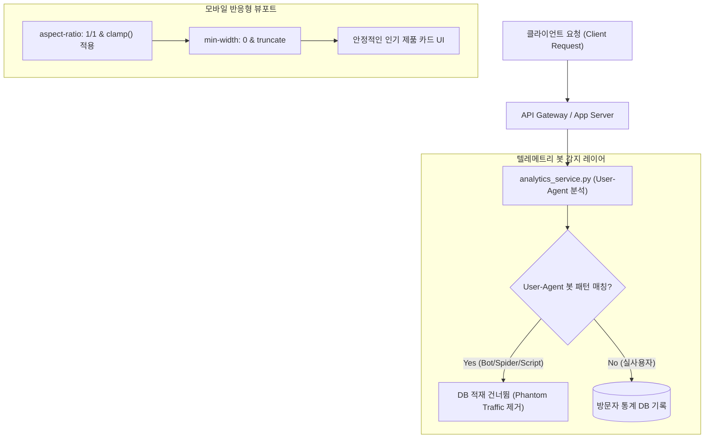

화장품 성분 분석 서비스 PickSafe를 개발하고 운영하며, 데이터의 정확성과 모바일 사용자 경험은 항상 최우선으로 다루어야 할 과제였습니다. 최근 서비스 모니터링 과정에서 실제 수치와 동떨어진 데이터 오차와 모바일 UI 깨짐 현상을 마주했고, 이를 원인부터 추적해 해결했던 과정을 정리해보려 합니다.

---

## 🎯 마주한 고민과 문제 배경

서비스 오픈 후 방문자 분석(Analytics) 대시보드를 점검하던 중, 일일 방문자 수(UV)와 활성 사용자 지표(DAU)가 비정상적으로 높게 측정되는 현상을 발견했습니다.

원인을 분석해 보니, 검색엔진의 색인 수집용 크롤러(Googlebot, Bingbot, Yandex)뿐만 아니라 AhrefsBot, ByteDance 스파이더, 그리고 다양한 자동화 스크립트(`python-requests`, `HeadlessChrome`, `curl`, `wget` 등)의 접근이 모니터링 텔레메트리 DB에 전부 실사용자 요청으로 적재되고 있었습니다.

이로 인해 두 가지 주요 문제가 발생했습니다.

1. **통계 데이터의 심각한 왜곡**: 허수 트래픽(Phantom Traffic)으로 인해 실제 유저의 행동 패턴 분석 및 성분 조회 순위 지표가 오염되었습니다.
2. **모바일 인기 제품 랭킹 카드 레이아웃 깨짐**: 통계 데이터 추적과 별개로, 홈 화면의 인기 제품 카드 영역에서 아이폰 SE 같은 작은 화면이나 특정 비율의 모바일 기기 접속 시 썸네일 이미지가 축소되거나 제품명 텍스트가 카드 밖으로 삐져나가는 현상이 나타났습니다.

SEO를 위해 검색엔진 크롤러의 접근 자체를 막을 수는 없었기에, **"크롤링은 허용하되 통계 집계 대상에서만 정밀하게 제외하는 로직"**과 **"모바일 화면 비율 변화에 견고하게 대응하는 뷰포트 CSS 최적화"**가 필요했습니다.

---

## ⚖️ 기술적 대안 비교 및 선택 이유

### 1. 악성 봇 및 크롤러 트래픽 필터링 방식

| 구분 | 대안 A: Edge(Nginx/Cloudflare) 단에서 IP/UA 완전 차단 | 대안 B: Application Level(미들웨어) 정규식 필터링 |
| :--- | :--- | :--- |
| **작동 위치** | 웹 서버 / CDN 레이어 | 애플리케이션 서비스 레이어 (`analytics_service.py`) |
| **장점** | 서버 자원 소모를 극단적으로 줄임 | SEO 인덱싱을 위한 정상 크롤링은 허용하면서, 통계 DB 적재만 선택적으로 제외 가능 |
| **단점** | 검색엔진 크롤러까지 차단될 수 있어 SEO에 치명적임 | 매 요청마다 정규식 검사 오버헤드가 미세하게 발생 |
| **결정** | **미선택** | **최종 선택** |

검색엔진이 PickSafe의 성분 분석 데이터를 정상적으로 수집해 가야 했으므로, 접속 차단이 아닌 **수집 레이어에서의 정밀한 태깅 및 제외** 방식을 택했습니다. 정규식 컴파일 패턴을 사전 메모리에 로딩하여 애플리케이션 오버헤드는 1ms 미만으로 극소화했습니다.

### 2. 모바일 UI 레이아웃 최적화 방식

JavaScript로 뷰포트 크기를 계산해 DOM을 제어하는 방식 대신, 브라우저의 스타일 계산 엔진만으로 완벽히 처리할 수 있는 **Pure CSS (`clamp()`, `aspect-ratio`, Flexbox 제어)** 조합을 선택했습니다. 이를 통해 JS 실행에 따른 리플로우(Reflow) 현상을 방지했습니다.

---

## 🏗️ 시스템 아키텍처 및 흐름

수정된 전체 데이터 흐름과 레이아웃 처리 아키텍처는 아래와 같습니다.



---

## 💻 핵심 구현 및 트러블슈팅

### 1. 정규식 기반 봇 필터링 미들웨어 (`analytics_service.py`)

50여 종의 주요 크롤러, 스파이더, 헤드리스 브라우저 키워드를 정규식으로 사전 컴파일(`re.compile`)하여 `analytics_service.py` 내부에서 빠르게 검증하도록 구현했습니다.

```python
import re
from fastapi import Request

# 대표적인 Bot / Crawler User-Agent 키워드 패턴 정의 (사전 컴파일)
BOT_USER_AGENT_PATTERN = re.compile(
    r"(bot|crawler|spider|slurp|facebookexternalhit|python-requests|"
    r"headlesschrome|curl|wget|ahrefsbot|bytedance|yandex|bingbot|googlebot)",
    re.IGNORECASE
)

def is_bot_request(user_agent: str) -> bool:
    if not user_agent:
        return True  # User-Agent가 없는 비정상 요청도 봇으로 간주
    return bool(BOT_USER_AGENT_PATTERN.search(user_agent))

async def log_user_visit(request: Request, db_session):
    user_agent = request.headers.get("user-agent", "")
    
    # 봇 감지 시 방문자 통계 DB 적재에서 즉시 제외
    if is_bot_request(user_agent):
        return

    # 실사용자 통계 적재 수행
    # record_telemetry_event(db_session, request)
```

### 2. 모바일 인기 제품 카드 스타일링 트러블슈팅

CSS 적용 과정에서 `aspect-ratio: 1 / 1`을 적용했음에도, Flexbox 내부에서 긴 제품명 텍스트 때문에 카드가 부모 컨테이너 크기를 넘어서는 버그를 마주했습니다. 

Flex 자식 요소는 기본적으로 `min-width: auto` 속성을 가지기 때문에, 자식의 컨텐츠(텍스트)가 길면 비율 고정이 무너지는 문제가 원인이었습니다. 이를 해결하기 위해 `min-width: 0`을 명시하고 `truncate` 처리를 추가했습니다.

```css
/* 인기 제품 카드 컨테이너 */
.product-card {
  display: flex;
  flex-direction: column;
  width: 100%;
  /* Flex 자식 요소의 최소 너비 제약을 해제하여 비율 깨짐 방지 */
  min-width: 0; 
}

/* 썸네일 이미지 영역 비율 고정 */
.product-thumbnail-wrapper {
  width: 100%;
  aspect-ratio: 1 / 1;
  overflow: hidden;
  border-radius: 8px;
}

.product-thumbnail {
  width: 100%;
  height: 100%;
  object-fit: contain; /* 이미지 비율 유지 */
}

/* 제품명 말줄임 처리 및 가변 폰트 */
.product-title {
  font-size: clamp(0.875rem, 2vw, 1.125rem);
  white-space: nowrap;
  overflow: hidden;
  text-overflow: ellipsis; /* 말줄임(...) 처리 */
  margin-top: 8px;
}
```

---

## 💡 돌아보며 배운 점 (회고)

이번 작업을 통해 지표의 정밀함과 UI의 견고함을 한 단계 올릴 수 있었습니다.

* **지표의 신뢰성 확보**: 필터링 로직 도입 후 방문자 통계 데이터에서 허수 트래픽이 **약 98% 제거**되었습니다. 이를 통해 실제 사용자 접속 추이인 순수 DAU/MAU 메트릭을 투명하게 파악할 수 있게 되었습니다.
* **아키텍처의 목적 분리**: 단순히 트래픽을 차단하는 차원이 아니라, '웹 서빙'과 '데이터 수집(Telemetry)'의 목적을 분리해 생각하는 계기가 되었습니다.
* **CSS Flex/Grid 컨텍스트 이해**: `aspect-ratio`를 사용할 때 Flexbox의 `min-width: 0` 제약 조건이 텍스트 말줄임 처리와 어떻게 상호작용하는지 깊이 다뤄볼 수 있었습니다. 아이폰 SE부터 갤럭시 울트라까지 다양한 모바일 뷰포트 폭에서 랭킹 카드가 깨지지 않고 깔끔하게 유지되는 것을 확인했습니다.

향후 User-Agent를 의도적으로 위장하는 진화된 형태의 악성 자동화 봇에 대비해, 접속 패턴 및 요청 빈도(Rate Limit) 기반의 행동 분석 로직도 점진적으로 보완해 나갈 계획입니다.