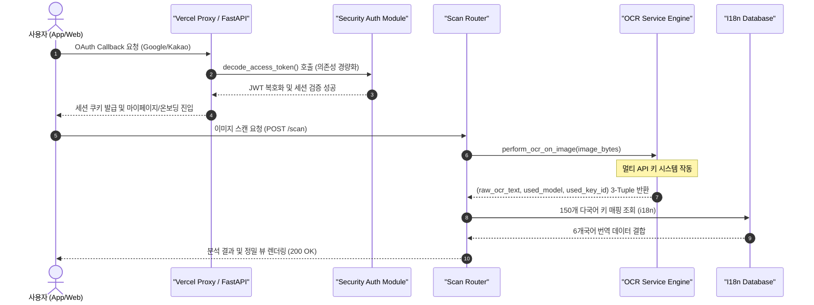

화장품 성분 분석 서비스 PickSafe를 개발하고 운영하면서, 배포 환경의 특수성과 시스템 기능 확장으로 인한 예외 상황들을 마주했습니다. 최근 Vercel Proxy 환경 도입과 멀티 API 키 시스템 전환이 연달아 이루어지면서 OAuth 인증 흐름과 이미지 스캔 파이프라인에서 예외가 발생했고, 프론트엔드 다국어(i18n) 체계에서도 일부 누락된 구간이 발견되었습니다.

이번 글에서는 소셜 로그인 무한 루프 장애 해결, OCR 스캔 라우터의 반환값 불일치 트러블슈팅, 그리고 사용자 UI의 하드코딩 텍스트를 완전히 다국어화한 과정을 기술적으로 기록합니다.

---

## 🎯 마주한 고민과 문제 배경

### 1. Vercel Proxy 환경에서의 소셜 로그인 무한 루프
구글 OAuth 콜백 수신 후 `finalize_login` 라우터로 전환되는 과정에서 무한 루프와 함께 500 Internal Server Error가 발생했습니다. 로그를 분석해보니 `python-jose` 라이브러리를 불러오지 못해 `ModuleNotFoundError`가 발생하고 있었습니다. 로컬 개발 환경과 달리 런타임 패키지 의존성이 완전히 일치하지 않는 서버리스 프록시 레이어의 특성으로 인해 소셜 로그인 완료 세션 쿠키가 정상 발급되지 못했습니다.

### 2. 성분 스캔(Scan) 요청 시 불투명한 500 에러
사용자가 화장품 성분표 이미지를 스캔할 때 서버가 `성분 인식 및 분석 중 오류가 발생했습니다`라는 포괄적인 메시지 단 하나만 프론트엔드로 전달하고 있었습니다. 세부적인 예외 로그가 클라이언트 단으로 전달되지 않아 정확한 병목을 파악하기 어려웠으며, 백엔드 내부에서는 OCR 분석 함수의 반환값 구조 개편에 따른 언패킹(Unpacking) 오류가 숨어 있었습니다.

### 3. 글로벌 뷰 템플릿 내 residual 한글 하드코딩
다국어 지원을 표준화했음에도 불구하고 `result.html`과 `base.html` 등 핵심 사용자 인터페이스 템플릿 일부에 "성분 안내:", "배합한도:" 같은 한국어 텍스트가 하드코딩되어 남아있었습니다. 이는 영어, 일어 등 타 언어 사용자 환경에서 레이아웃 깨짐과 일관성 결여를 유발하는 원인이 되었습니다.

---

## ⚖️ 기술적 대안 비교 및 선택 이유

### 1. OAuth 토큰 검증 라이브러리: `python-jose` 추가 vs 기존 모듈 재활용

* **대안 A: `python-jose` 패키지 명시적 추가**
  * 장점: 기존 코드를 거의 수정하지 않고 패키지 추가만으로 해결 가능.
  * 단점: 서버리스 배포 환경의 런타임 번들 크기가 증가하며, 동일 프로젝트 내에 유사한 JWT 검증 로직이 파편화될 위험.
* **대안 B: 프로젝트 내 검증된 커스텀 `decode_access_token` 유틸리티 활용 (선택)**
  * 장점: 이미 산출물 검증이 완료된 내부 보안 모듈을 활용하므로 불필요한 외부 의존성을 제거하고 런타임 무게 감소. 환경 변화(Vercel Proxy/로컬)에 구애받지 않고 일관된 검증 흐름 유지.
  * 단점: 호출부의 파라미터 규격을 내부 함수 스타일에 맞춰 일괄 리팩토링해야 함.

추가 라이브러리를 설치하여 의존성을 늘리기보다는 내부 보안 유틸리티인 `decode_access_token`으로 검증 로직을 단일화하는 **대안 B**를 선택했습니다.

### 2. OCR 분석 반환값 구조 동기화

최근 OCR 시스템의 안정성을 높이기 위해 멀티 API 키 교체 시스템을 도입하면서 `perform_ocr_on_image` 함수의 반환 구조가 `(text, model)`의 2튜플에서 `(text, model, key_id)`의 3튜플로 확장되었습니다. 

라우터 단에서 이를 기존 2개 변수로 언패킹하려다 발생한 `ValueError: too many values to unpack (expected 2)`를 해결하기 위해, 단순히 라우터 수신부만 고치는 것이 아니라 서비스 레이어와 테스트 Mock 반환부 전체의 Type Hint를 `Tuple[str, str, str]`로 일치시켰습니다.

---

## 🏗️ 시스템 아키텍처 및 흐름

이번 트러블슈팅과 체계 정비를 거쳐 정리된 PickSafe의 소셜 인증 및 성분 스캔 흐름은 다음과 같습니다.



---

## 💻 핵심 구현 및 트러블슈팅

### 1. OAuth 토큰 복호화 및 인증 로직 리팩토링

외부 의존성 패키지에 의존하던 파이프라인을 내부 보안 유틸리티 함수로 교체하여 Vercel 프록시 환경과의 호환성을 확보했습니다.

```python
# app/routers/auth.py (리팩토링 후)
from fastapi import APIRouter, HTTPException, Depends, status
from app.core.security import decode_access_token  # 내부 커스텀 보안 모듈 활용

router = APIRouter()

@router.get("/finalize_login")
async def finalize_login(token: str):
    # 외부 jose 모듈 대신 검증된 내부 decode_access_token 활용
    payload = decode_access_token(token)
    if not payload:
        raise HTTPException(
            status_code=status.HTTP_401_UNAUTHORIZED,
            detail="유효하지 않거나 만료된 토큰입니다."
        )
    
    user_id = payload.get("sub")
    # 세션 처리 및 쿠키 발급 로직 진행...
    return {"status": "success", "user_id": user_id}
```

### 2. 스캔 라우터 언패킹 에러 추적 및 Exception 디버깅 패치

원인을 알 수 없던 500 에러를 명확히 디버깅하기 위해 temporary 상세 예외 노출 패치를 적용한 뒤, 멀티 API 키 리턴 타입에 맞춰 라우터와 텍스트 추출 엔진 구조를 맞추었습니다.

```python
# app/routers/scan.py
import time
from fastapi import APIRouter, HTTPException
from app.services.ocr_service import perform_ocr_on_image

router = APIRouter()

@router.post("/analyze")
async def analyze_ingredient_image(image_data: bytes):
    start_time = time.time()  # UnboundLocalError 방지를 위한 명시적 초기화
    
    try:
        # 3-Tuple 변수 수신 (raw_ocr_text, used_model, used_key_id)
        raw_ocr_text, used_model, used_key_id = await perform_ocr_on_image(image_data)
        
        elapsed_ms = round((time.time() - start_time) * 1000, 1)
        
        return {
            "text": raw_ocr_text,
            "engine_info": {
                "model": used_model,
                "key_id": used_key_id,
                "latency_ms": elapsed_ms
            }
        }
    except Exception as e:
        # 정확한 에러 원인을 추적할 수 있도록 예외 문자열 구조화
        raise HTTPException(
            status_code=500, 
            detail=f"성분 분석 오류 원인: {str(e)}"
        )
```

추가로 `ocr_service.py` 내 테스트용 Mock 응답 구현부에서도 리턴 타입을 3튜플로 맞추어 테스팅 환경과의 일관성을 확보했습니다.

```python
# app/services/ocr_service.py
from typing import Tuple

async def perform_ocr_on_image(image_bytes: bytes, lang: str = "ko") -> Tuple[str, str, str]:
    if lang == "en_mock":
        # Mock 응답 시에도 올바른 Type Hint 규격 준수 (text, model, key_id)
        return "Water, Glycerin, Niacinamide", "mock-ocr-v1", "key-dev-test"
        
    # 실제 OCR 서비스 호출 및 멀티 키 로테이션 수행...
    return extracted_text, active_model_name, current_key_id
```

### 3. 정규식 기반 잔존 한글 색출 및 다국어 DB 확장

UI에 잔존하는 한글 하드코딩 텍스트를 전수 조사하기 위해 정규식 패턴 기반 분석(`grep_search`)을 진행했습니다. 색출된 5개 영역의 텍스트에 대한 전용 키를 시드 데이터 스크립트에 반영했습니다.

```python
# scripts/seed_multilingual_db.py

NEW_TRANSLATION_KEYS = {
    "result.restriction_label": {
        "ko": "배합한도", "en": "Formulation Limit", "ja": "配合制限",
        "zh": "配方限制", "es": "Límite de Formulación", "vi": "Giới hạn phối hợp"
    },
    "result.regulation_label": {
        "ko": "규제정보", "en": "Regulatory Info", "ja": "規制情報",
        "zh": "监管信息", "es": "Información Regulatoria", "vi": "Thông tin quản lý"
    },
    "result.unverified_prefix": {
        "ko": "성분 안내", "en": "Ingredient Notice", "ja": "成分 안내",
        "zh": "成分提示", "es": "Aviso de Ingredientes", "vi": "Thông báo thành phần"
    },
    "result.unverified_reason": {
        "ko": "데이터베이스 등록 안됨", "en": "Not Registered in Database", "ja": "DB未登録",
        "zh": "未在数据库注册", "es": "No registrado en la base de datos", "vi": "Chưa đăng ký trong cơ sở dữ liệu"
    },
    "base.alert_default": {
        "ko": "알림 내용", "en": "Notification Content", "ja": "通知内容",
        "zh": "通知内容", "es": "Contenido de Notificación", "vi": "Nội dung thông báo"
    }
}
```

이 작업을 통해 고유 번역 키는 정확히 **150개**로 확정되었으며, 6개 국어 지원에 맞춰 약 **900개**의 다국어 레코드가 데이터베이스에 통합 배치되었습니다.

---

## 💡 돌아보며 배운 점

### 1. 포괄적 에러 처리의 위험성과 예외 메시지 구체화
서버 내부에서 발생하는 예외를 `500 Internal Server Error`라는 상위 메시지로만 감싸서 리턴할 경우, 인터페이스 불일치(Tuple Unpacking 오류 등)나 변수 미초기화 같은 기초적인 버그를 빠르게 포착하기 어렵다는 점을 다시금 체감했습니다. 원인 추적 단계에서는 상세 예외 트레이스문이 정상적으로 로깅되도록 파이프라인을 구축해 두는 것이 서비스 안정화 속도를 대폭 높여줍니다.

### 2. 하위 모듈 변경 시 인터페이스 계약(Contract)의 중요성
멀티 API 키 로테이션 기능을 추가하면서 서비스 레이어 함수(`perform_ocr_on_image`)의 반환 타입을 확장했으나, 이를 호출하는 상위 라우터 레이어에 동시 반영하지 못해 디버깅 비용이 발생했습니다. Python과 같은 동적 타입 언어일수록 정적 타입 힌팅(`Tuple[...]`)을 엄격히 명시하고 파이프라인 변경 시 영향 범위를 점검하는 체크리스트가 필수적임을 배웠습니다.

### 3. 외부 의존성 최소화의 이점
배포 환경(Vercel Proxy, Cloud Functions 등)의 특성을 고려할 때, 제3자 라이브러리(`python-jose`) 추가로 문제를 우회하기보다는 프로젝트 내 검증된 내부 모듈을 고도화하여 해결하는 편이 유지보수성 및 인프라 안정성 면에서 훨씬 우수함을 확인했습니다.

서비스가 확장됨에 따라 예기치 못한 에러는 언제든 발생할 수 있습니다. 중요한 것은 예외를 명확히 드러내고, 근본적인 원인을 단순하고 단단한 아키텍처로 수용해 나가는 과정임을 배운 트러블슈팅 기록이었습니다.